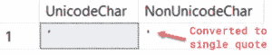
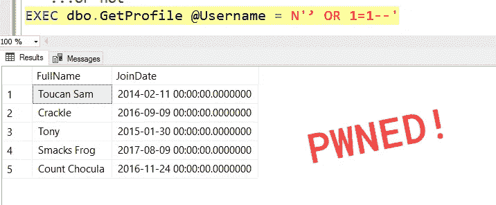
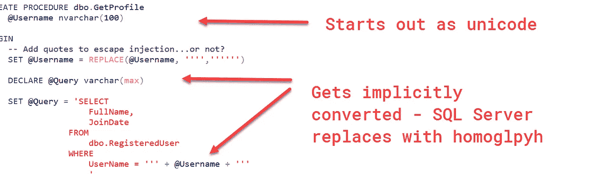
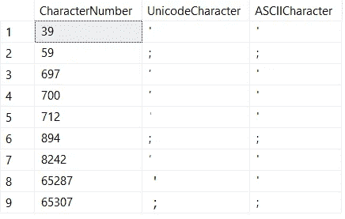

# ʼ;śℇℒℇℂʈ*:unicode 同形异义字符将如何破坏您的自定义 SQL 注入净化函数

> 原文：<https://medium.com/hackernoon/%CA%BC-%C5%9B%E2%84%87%E2%84%92%E2%84%87%E2%84%82%CA%88-how-unicode-homoglyphs-will-break-your-custom-sql-injection-sanitizing-functions-1224377f7b51>


*Photo by* [*Niketh Vellanki*](https://unsplash.com/photos/vJqSAasmCEY?utm_source=unsplash&utm_medium=referral&utm_content=creditCopyText) *on* [*Unsplash*](https://unsplash.com/?utm_source=unsplash&utm_medium=referral&utm_content=creditCopyText)

在过去的几周里，我一直在写关于如何[保护你的数据库](https://blog.bertwagner.com/warning-are-your-queries-vulnerable-to-sql-injection-db914fb39668)免受[SQL 注入攻击](https://blog.bertwagner.com/how-to-safely-parameterize-table-names-63446a1033fb)。今天，我们将通过观察隐式 unicode 转换如何使您的数据易受攻击来保持这一趋势。

*您也可以在我的*[*YouTube*](https://www.youtube.com/watch?v=DVWiMrqqMK0)*频道观看此内容。*

# 什么是同形异义字？

同形异义字符是看起来像另一个字符的字符。L(小写“L”)和 1(数字)被视为同形异义字符。O(字母)和 0(数字)也是如此。

同形异义词可以存在于一个字符集内(如上面的拉丁字符集示例)，也可以存在于字符集之间的*。例如，您可能有 unicode 撇号，它是拉丁语单引号字符`'`的同形异义字符。*

# SQL Server 如何处理 unicode 同形异义字符？

你这么问很有趣。如果将 unicode 字符传递给非 unicode 数据类型(如 char)， **SQL 隐式地将 unicode 字符转换为最接近的非 unicode 同形异义字符。**

要了解这一点，我们可以使用上面示例中的 unicode 撇号:

```
SELECT
  CAST(N'ʼ' AS nchar) AS UnicodeChar,
  CAST(N'ʼ' AS char) AS NonUnicodeChar
```

您可以在第二列中看到 SQL 自动将撇号转换为单引号:



虽然这种隐式字符转换在您希望在非 unicode 字符集中显示 unicode 字符时会很方便，但它会给您的 [SQL Server](https://hackernoon.com/tagged/sql-server) [安全性](https://hackernoon.com/tagged/security)带来灾难。

# Unicode 同形异义字符 SQL 注入

如果您在构建动态 sql 查询时已经使用了 [sp_executesql](https://blog.bertwagner.com/warning-are-your-queries-vulnerable-to-sql-injection-db914fb39668) 或 [QUOTENAME()](https://blog.bertwagner.com/how-to-safely-parameterize-table-names-63446a1033fb) ，那么您就不会遇到这种类型的 SQL 注入。

我知道，当像上面这样可靠、安全且经过测试的功能可用时，你不是那种会编写自己的安全功能的人。然而，就这一次，让我们假设你认为你可以通过编写自己的引号定界代码来战胜黑客。

[使用与上周相同的数据集](https://gist.github.com/bertwagner/c22bd5c068f30bef21bf3738c5a52029)，让我们创建一个新的存储过程，它将从用户的个人资料中返回一些数据:

```
DROP PROCEDURE IF EXISTS dbo.GetProfile
GO
CREATE PROCEDURE dbo.GetProfile
 [@Username](http://twitter.com/Username) nvarchar(100)
AS
BEGIN
 -- Add quotes to escape injection...or not?
 SET [@Username](http://twitter.com/Username) = REPLACE([@Username](http://twitter.com/Username), '''','''''')DECLARE [@Query](http://twitter.com/Query) varchar(max)SET [@Query](http://twitter.com/Query) = 'SELECT 
     FullName, 
     JoinDate
    FROM
     dbo.RegisteredUser
    WHERE
     UserName = ''' + [@Username](http://twitter.com/Username) + '''
     'EXEC([@Query](http://twitter.com/Query))
END
GO
```

不要使用 sp_executesql 或 QUOTENAME()，让我们尝试编写我们自己的聪明的 REPLACE()函数，它将用两组单引号替换单引号。理论上，这应该可以防止 SQL 注入。

如果我们在 SQL 注入测试一个“正常”的尝试，你会注意到这个逻辑非常有效。给自己一个鼓励！


但是，如果我们传入一个 unicode 撇号:



发生这种情况的原因是因为我们将@Query 参数声明为 varchar，而不是 unicode nvarchar。当我们构建动态 SQL 语句时，SQL [隐式地将 nvarchar @Username 参数转换为非 unicode varchar:](https://blog.bertwagner.com/are-your-indexes-being-thwarted-by-mismatched-datatypes-d3985375e528)



# 所以如果我替换撇号，会让我安全吗？

**号**

我知道看起来黑名单/替换 unicode 撇号可以解决我们所有的问题。

它会…只在这种情况下。然而，unicode 同音字不仅仅是一个撇号。

出于好奇，我编写了一个脚本来搜索 unicode 字符空间，看看还存在哪些同形异义字符:

```
DECLARE [@FirstNumber](http://twitter.com/FirstNumber) INT=0;
-- number of possible characters in the unicode space
DECLARE [@LastNumber](http://twitter.com/LastNumber) INT=1114112;

WITH Numbers AS (
    SELECT [@FirstNumber](http://twitter.com/FirstNumber) AS n
    UNION ALL
    SELECT n+1 FROM Numbers WHERE n+1<=[@LastNumber](http://twitter.com/LastNumber)
), UnicodeConversion AS (
SELECT
       n AS CharacterNumber,
       CASE CAST(NCHAR(n) as CHAR(1))
              WHEN '''' THEN NCHAR(n)
              WHEN ';' THEN NCHAR(n)
       END AS UnicodeCharacter,
       CAST(NCHAR(n) as CHAR(1)) AS ASCIICharacter
FROM Numbers
)
SELECT
       *
FROM
       UnicodeConversion
WHERE
       UnicodeCharacter IS NOT NULL
OPTION (MAXRECURSION 0)
```



尽管上面屏幕截图中的字符看起来很相似，但它们实际上是同形异义词。

我决定只搜索单引号和分号，因为它们在 SQL 注入攻击中经常使用，但这绝不是您想要列入黑名单的所有字符的详尽列表。

不仅很难有把握地将每个危险的同形异义字符列入黑名单，而且新字符一直在添加到 unicode 中，因此维护黑名单将是一场维护噩梦。尤其是如果将来维护这段代码的人不熟悉这些类型的注入攻击。

不要厚颜无耻地认为你可以过滤掉危险的 SQL 关键字——即使你替换了(@Username，' SELECT '，" ")，只要记住有人会过来传入一个像'śεℒℇℂʈ'.这样的值

# 结论

不要编写自己的安全函数——它们会失败。

防范 SQL 注入的最佳方法是不要使用动态 SQL。如果您*有*使用动态 SQL，那么使用 sp_executesql 和 QUOTENAME()中的一个。

*你可能也会喜欢* [*在 Twitter 上关注我*](https://twitter.com/bertwagner) *。*