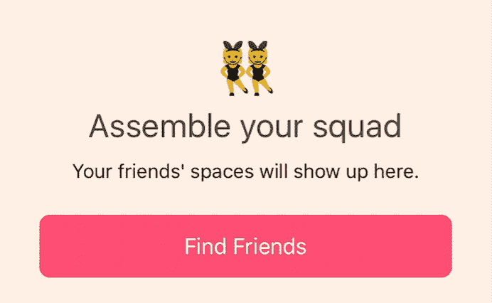
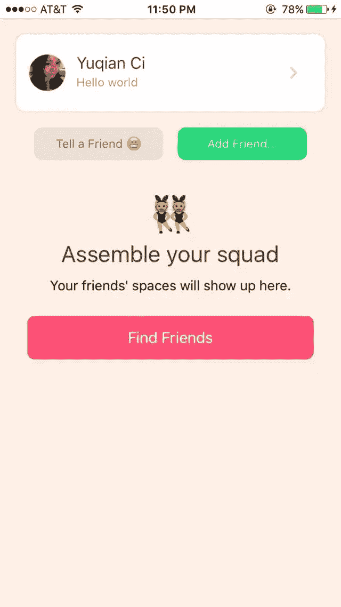
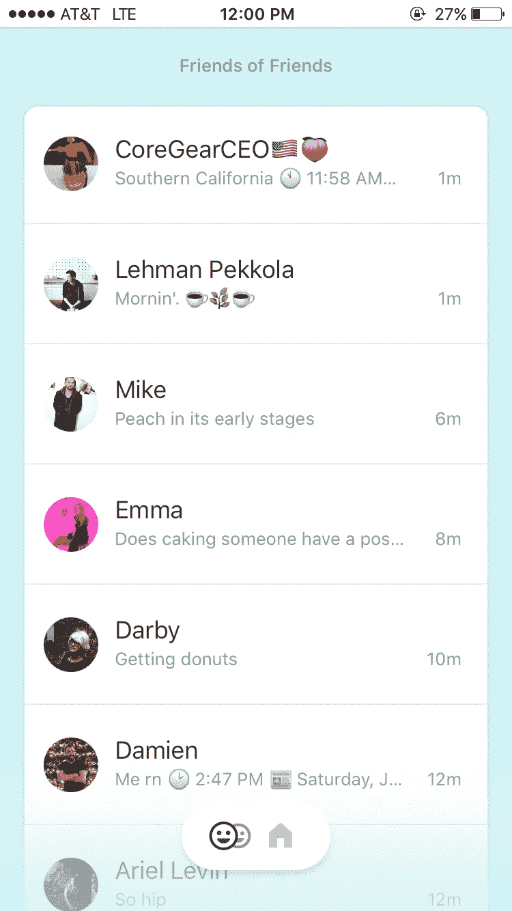
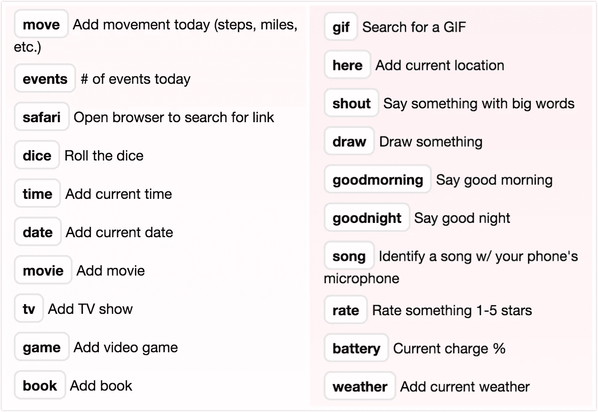
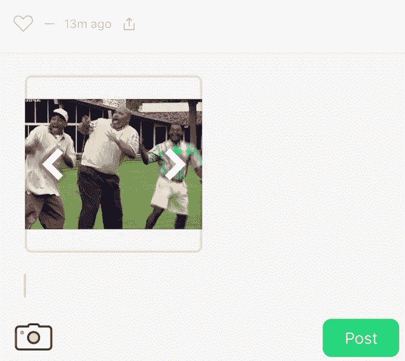
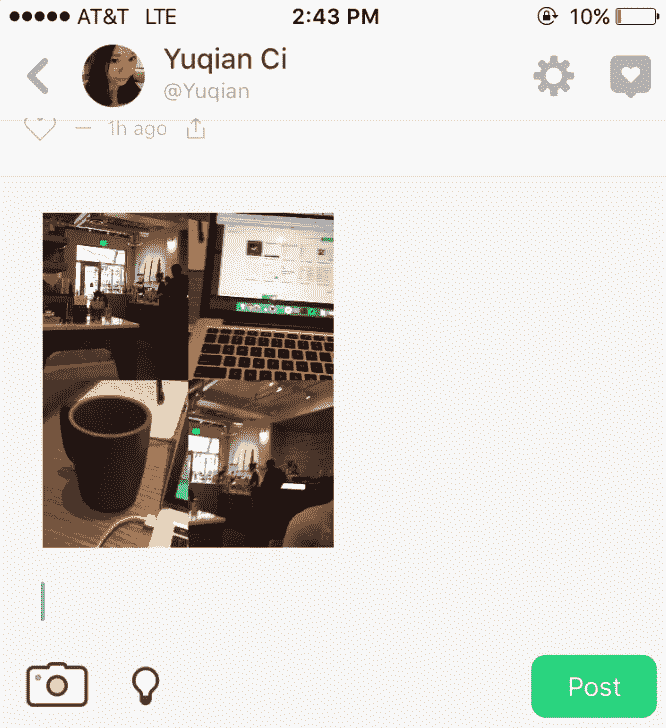
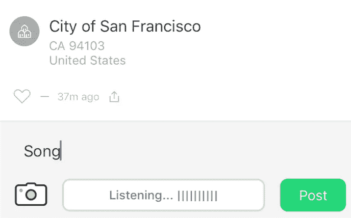
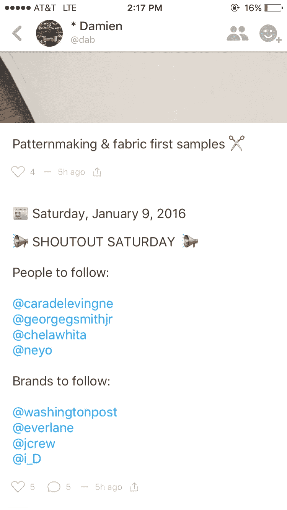
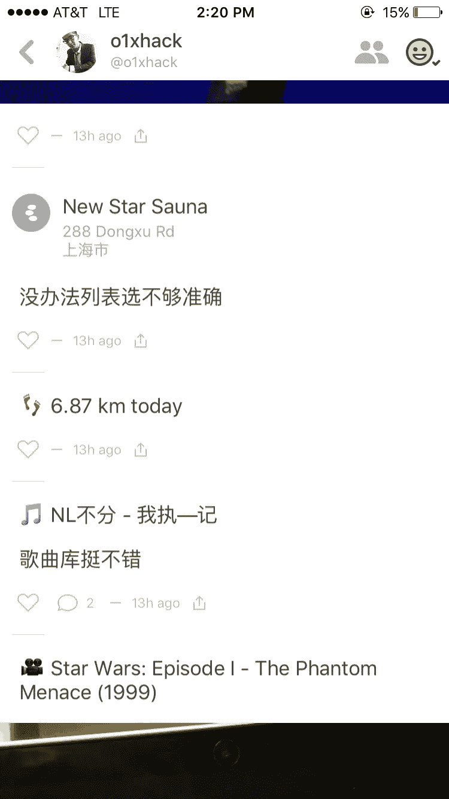
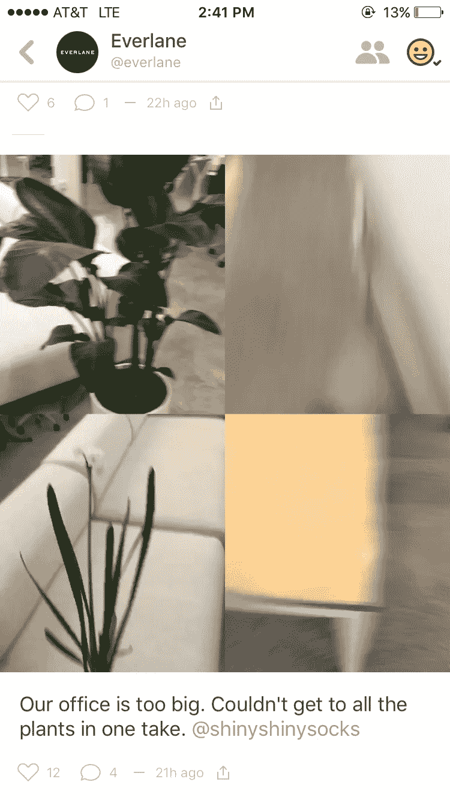

# 硅谷今日最鲜：粉嫩多汁的 Peach 谁都想咬一口

> 原文：<https://medium.com/hackernoon/%E7%A1%85%E8%B0%B7%E4%BB%8A%E6%97%A5%E6%9C%80%E9%B2%9C-%E7%B2%89%E5%AB%A9%E5%A4%9A%E6%B1%81%E7%9A%84peach-%E8%B0%81%E9%83%BD%E6%83%B3%E5%92%AC%E4%B8%80%E5%8F%A3-4dbefc915689>

今天硅谷最火的产品应该是🍑Peach 了，所有 founder 和投资人都在玩儿这个萌萌的粉屁股。昨晚在 Snapchat 上看到有人用 Peach，一直不要脸地自诩 early adopter 的鹿君自然颠颠跑去下载，没想到一觉醒来，Peach 都已经上了 TechCrunch 头条。

# 让我们咬一口🍑

先简单介绍下产品，仍然是大家喜闻乐见的社交 app。一共四屏，第一屏是加好友，第二屏是好友的 timeline，第三屏是你的主页，第四屏是消息提醒。

我的第一印象：这好像曾经红极一时的 Path 啊！不过粉蓝的色调和 emoji 让整个产品感觉活泼轻快，再加上用户交互迥异，完全没有新瓶装旧酒的腻味感。

第二屏：（一个好友还没有的）好友 timeline

现在很多产品有一种非常傲娇的趋势，比如 Snapchat 非要反其道而行之，并不从 Facebook 中导入好友，也没启用类似附近的人找朋友的功能，只可以通过 ID 来添加好友。还有一种方法是拍别人的 barcode 自动识别 ID，把加好友变成产品体验的一部分，让你真的去“玩”产品，毕竟社交类 app 的根本属性就是 for fun 嘛。

Peach 也是这样，注册只能用邮箱，不过步骤简单，user on-boarding 顺畅，同样只能通过 ID 或者通讯录添加好友。一开始一个好友都没有的时候还蛮寂寞的，不过一旦你加了第一个好友，第一屏的加好友推荐就会布满你好友的好友名单。

但这样有个问题是，刚开始好友同质化会比较严重。下图就是在我只有三个好友（都是中国人）的情况下，刚加完 Everlane，好友推荐页面瞬间被老外完全占领的画面：

第一屏：加好友（好友的好友 list）

不过好在 Peach 躲开了 Facebook 的登录机制，有效避免了和 FB 的熟人圈发生重合。加上它和 twitter 一样，平台完全开放，你想把它当做一款倾向熟人社交的 app 也行，用它关注陌生有趣的人也行，在这一点上很像 Snapchat。

# 神奇的时刻

很多产品经理都强调一款产品一定要有至少一个 magic moment，简单形容就是让用户觉得“holy crap 这个真是酷到合不拢腿”的那一瞬间。

Peach 的 magic moment 主要是关键词触发机制，也就是它们官方宣称的“magic words”，输入对应的词会触发对应的功能。以下是 Peach 在官网列出的 magic words 列表：

weather movie 这些其实都不算新鲜，Path Foursquare 很久以前都做过了。目前看来大家好评如潮的是 gif 和 draw。比如输入 draw 就会自动跳出来涂鸦板，以下这位仁兄的绘画天赋让我折服 — —

gif 搜索也不新鲜，有很多程序猿自己做的小插件，可以在 iOS 的键盘或者浏览器里搜索好玩的 gif。Facebook messenger 最近也更新了这个功能，但是搜出来的 gif 都好 dull 啊一点都不好玩。

相比而言 Peach 的 gif 就魔性多了，也很符合产品的整体调性，比如下面是我搜出来的“happy”：

程序猿们比较心水的当然是技术层面的巧妙运用，用某猿的话来说：“Peach 能充分利用系统 API 自动获取事项填充”。

比如当你不知道发什么的时候，Peach 可以获取你剪贴板里的内容，推荐你编辑一下发出去。还有 battery 获取剩余电量信息啊，move 获取今天的走步数啊，都是其他 app 不是很常用的 API，用在这里恰到好处。

对了，除了拍照以外，还有一个好玩儿的四格 gif。Yup，四个格子都是 gif — —

我个人的 magic moment 可能不是很普适，在咖啡馆写这篇文章的时候还在试用一些 magic words，输入了一个“song”它就开始“listening”。

我本以为它在听我手机在播什么，结果识别出来是 Dorado Schmitt — Bleu chitron。这有点出乎我的意料，而且咖啡馆真的很吵。好了，这下歌曲识别也有了 — —

我觉得好的社交产品是有自己明确的核心价值，在这个大框架下，每个人都可以发挥创意，个人定制自己使用这款产品的方式，表达“与众不同”。毕竟社交产品能火，还是利用人们需要表达自我、寻求认同的心理嘛。

目前我看到有人用它来列清单，整个 timeline 都是清单（让我联想到 The List App） — —

也有人用来写日记 — —

还有品牌已经 branding 玩儿起来啦（顺便说一句 Everlane 的营销做得真是让人惊喜不断，Snapchat Instagram 也用得出神入化） — —

# 代表 Peach 消灭寂寞的人类 🙅🏻

想想人类也真是很寂寞，那么多社交 app 都冲着“我要说！”“我重要！”“关注我！”的需求而去，结果屡试不爽。无聊的人们为了摆脱寂寞，也愿意花时间去适应、学习产品（Snapchat 是绝佳的例子）。

甚至有用户会花很多时间精力去赚一些比较虚无的 status（比如 Yelp 的 elite squad），为品牌当免费的 ambassador。品牌当然捂嘴偷笑。不过怎么说呢，大家开心就好，毕竟用户也在其中得到了满足和乐趣。

再讲一个我的个人观点：我觉得产品的黏性如果不是技术取胜，很大程序上都依赖于“拥有内容”，要不是用户自己的内容，比如 Instagram，要不就是获取外界的内容，比如 twitter。

内容越多圈子越完善，用户离开的沉没成本就越高。生态圈里的内容越丰富，后来者想抢你的饭碗就越难，比如 Google 和 Facebook 到现在想做类似 Yelp 的点评功能，都没办法让用户改变用户习惯，哪怕 Yelp 本身的体验很烂。

纯功能性产品的用户黏性需要产品保持技术/功能优势，比如 Dropbox，而且很容易就被技术和财力资源都更强大的巨头给端了，比如 Google Apple Facebook 的 AI 一出现，很多 location base 的产品都可以说再见了。

Peach 这两天在硅谷已经火爆到 down 了好几次，当然热情的用户们并不介意。这款产品的走红看起来是毋庸置疑了，下一个问题就是拭目以待看它能火多久，再接下来就是老生常谈的“怎么变现”。

当然，最后还是提醒各种跃跃欲抄的创业者们不要寄希望于这种“一鸣惊人”，也不要不加思考地把“隔绝 Facebook 登陆(or whatever)”放在产品里。

就好比当初 Mailbox 弄了个排队机制，因为需求大且产品本身过硬，效果万人空巷，结果后来每个产品上线前都要搞个排队。这感觉有点像芙蓉姐姐一脸妩媚：想和我上床的人太多了，你们都别挤，一个一个来。

毕竟要知道做这个产品的是 Vine 的 CEO，钱、团队、媒体资源都不是很缺。别光看到美好的结局，忽略了前因后果。

最后祝大家桃汁四溅 👄。

文 / 鹿君

## *你认为，因为你是善良的，*

## *不再有蛋糕和啤酒了？*

## *——莎士比亚*

> [黑客中午](http://bit.ly/Hackernoon)是黑客如何开始他们的下午。我们是 [@AMI](http://bit.ly/atAMIatAMI) 家庭的一员。我们现在[接受投稿](http://bit.ly/hackernoonsubmission)并乐意[讨论广告&赞助](mailto:partners@amipublications.com)机会。
> 
> 如果你喜欢这个故事，我们推荐你阅读我们的[最新科技故事](http://bit.ly/hackernoonlatestt)和[趋势科技故事](https://hackernoon.com/trending)。直到下一次，不要把世界的现实想当然！

