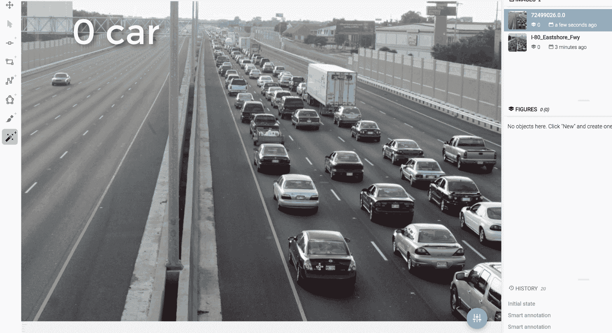
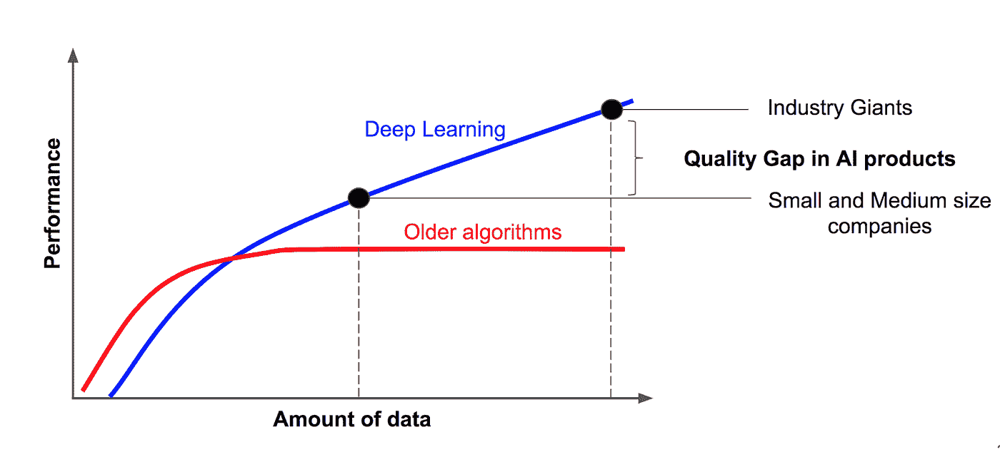
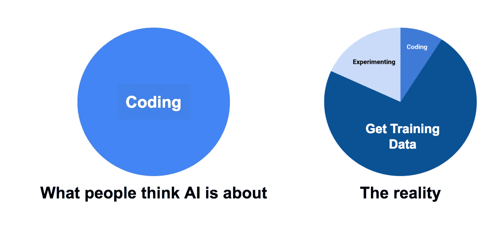
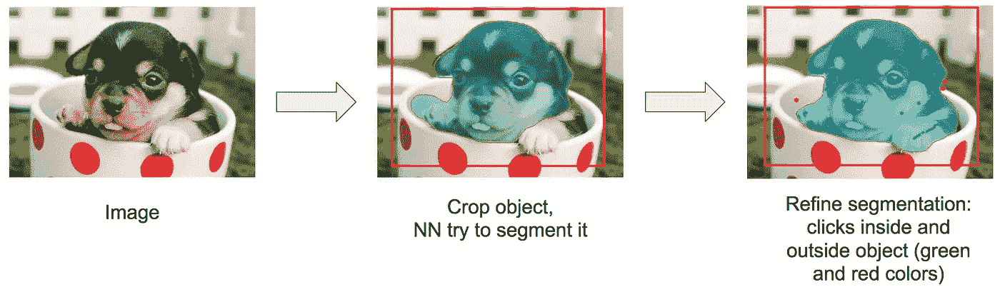

# 深度学习的⚔️大挑战:训练数据

> 原文：<https://medium.com/hackernoon/%EF%B8%8F-big-challenge-in-deep-learning-training-data-31a88b97b282>

你好世界。今天我们将讨论深度学习中最核心的问题之一——训练数据问题。

我们在 DeepSystems 将深度学习应用于各种现实世界的任务。下面是其中的一些:自动驾驶汽车，收据识别，道路缺陷检测，交互式电影推荐等等。

而且我们大部分时间不是花在建立神经网络上，而是花在处理训练数据上。深度学习需要大量数据，有时仅注释一张图片就要花一个小时！我们一直在想:有没有办法加快我们的工作速度？我们找到了。

我们很自豪地宣布[超级](https://supervise.ly/)的新功能:人工智能支持的注释工具，以更快的速度分割图像上的对象。

在这里，我们将关注计算机视觉，但是类似的思想可以应用于大量不同的数据:文本、音频、传感器数据、医疗数据等等。

# **大图:更多数据——更聪明的人工智能**

让我从我们对来自吴恩达的非常著名的幻灯片的小修改开始。

深度学习优于其他机器学习算法不是秘密。让我们从这个图表中获得一些见解(其中一些可能看起来很明显，但是……)。

**结论 0** : AI 产品需要数据。

结论 1 :我们拥有的数据越多，人工智能就越聪明。

**结论二**:行业巨头的数据比别人多得多。

**结论 3**:AI 产品的质量差距是由数据量定义的。

因此，网络架构可以强烈地影响人工智能系统的性能，而训练数据量对性能的影响最大。专注于数据收集的公司提供了更好的人工智能产品，并取得了巨大成功。

# **常见错误:人工智能就是构建神经网络。**

让我给你看一张图表。

当人们想到人工智能时，他们会想到算法，但他们也应该想到数据。算法是免费的:谷歌和其他巨头倾向于与世界分享他们最先进的研究，但他们没有——他们不分享数据。

许多人已经跳上了人工智能宣传列车，并创建了可怕的工具来建立和训练神经网络，但很少有人关注训练数据。当公司试图应用人工智能时，他们拥有训练神经网络的所有工具，但没有开发训练数据的工具。

# **吴恩达说论文够多了，现在就造 AI 吧！**

好主意，我们同意他。有许多论文和最新神经网络体系结构的开源实现，可以覆盖几乎所有现实世界的问题。想象一下，您有了一个新 10 亿美元想法。第一个问题不会是:我会用什么样的神经网络？最有可能的是:我在哪里可以得到数据来构建 MVP？

[Source](http://www.quickmeme.com/meme/352zou)

# **训练数据的来源。让我们找到银弹。**

让我们考虑一些可行的选择。

*   **开源数据集。**深度神经网络的价值在于用来训练它的数据。计算机视觉研究中的大多数可用数据都是针对特定研究组的问题定制的，新研究人员通常需要收集额外的数据来解决他们自己的问题。这就是为什么它在大多数情况下不是一个解决方案。
*   **人工数据**。对于某些任务，如 OCR 或文本检测，这是可以的。但是许多例子(人脸检测、医学图像……)很好地说明了这很难生成，甚至是不可能的。通常的做法是在可能的情况下将人工数据与真实的带注释的图像结合使用。
*   **网**。很难自动收集高质量的训练数据。最有可能是人类应该纠正和过滤它。
*   **向某人订购图像注释**。有一些公司提供这种服务。是的，我们也不例外。但是最大的缺点是你不能快速迭代。通常，即使是数据科学家也不确定如何进行注释。一般流水线是做迭代研究:标注小部分图像- >建立 NN - >检查结果。每个新实验都会影响下一个实验。
*   **用手注释图像**。只有你明白你的任务。领域专业知识至关重要。医学图像注释就是一个很好的例子:只有医生知道肿瘤在哪里。我们明白这个过程很耗时，但如果你想要定制 AI——没有其他办法。

因此，如我们所见，没有灵丹妙药。最常见的情况是创建自己的特定于任务的训练数据，生成人工数据，并在可能的情况下将它们与公共数据集合并。

关键是，对于您的自定义任务，您必须创建自己的唯一数据集，fo sho。

# **让我们利用深度学习来构建深度学习。**

什么？想法是这样的。深度学习方法需要大量数据，它们的性能与可用的训练数据量密切相关。

让我告诉你注释过程有多难。以下是注释过程可能花费的时间的粗略数字。让我们考虑一下 [Cityscapes 数据集](https://www.cityscapes-dataset.com/)(对自动驾驶汽车有用)。对城市景观的单幅图像进行精细的像素级注释平均需要[超过 1.5 小时](https://www.cityscapes-dataset.com/wordpress/wp-content/papercite-data/pdf/cordts2016cityscapes.pdf)。他们注释了 5000 张图片。通过简单的数学我们可以计算出，他们花了大约 5000 * 1.5 = 7500 个小时。考虑一下，1 小时= 10 美元(接近美国最低工资)。因此，仅标注这样的数据集就要花费大约 75000 美元(不包括额外费用)。

同样令人惊讶的是，仅[一家自驾公司](https://www.teslarati.com/mobileye-cto-building-autonomous-driving-systems/)就有 1000 名内部员工做图像标注。这只是冰山一角。

想象一下，公司和个人为图像标注花费了多少时间和金钱。难以置信。这是人工智能进步的巨大障碍。我们不得不为自己的任务做注解，但它可以永远持续下去😰。

神经网络能帮助我们让它更快吗？想想吧。我们不是第一个试图回答这个问题的人。

对象实例的半自动注释领域有很长的历史。加速注释的经典方法有很多，比如[超像素](https://docs.opencv.org/3.0-beta/modules/ximgproc/doc/superpixels.html)、[分水岭](http://opencv-python-tutroals.readthedocs.io/en/latest/py_tutorials/py_imgproc/py_watershed/py_watershed.html)、 [GrabCut](https://docs.opencv.org/3.1.0/d8/d83/tutorial_py_grabcut.html) 。最近几年，研究人员试图利用深度学习来完成这项任务( [link1](http://openaccess.thecvf.com/content_ICCV_2017/papers/Liew_Regional_Interactive_Image_ICCV_2017_paper.pdf) 、 [link2](https://arxiv.org/pdf/1603.04042.pdf) 、 [link3](https://arxiv.org/pdf/1704.05548.pdf) )。经典的方法效果不好，并且有许多超参数来搜索每一幅图像，很难对它们进行归纳和修正。最新的基于深度学习的方法要好得多，但在大多数情况下，它们不是开源的，很难实现、重现结果并集成到任何可用的注释平台。

但我们是第一个让每个人都可以使用人工智能注释工具的人。我们设计了自己的神经网络架构，其概念类似于上面的三个环节。它还有一个很大的优势:我们的神经网络是类不可知的。这意味着它可以分割行人，汽车，路面上的坑洼，医学图像上的肿瘤，室内场景，食物成分，卫星上的物体和其他很酷的东西。

那么，它是如何工作的呢？

How to use AI powered segmentation tool

你只需要裁剪感兴趣的对象，神经网络就会对其进行分割。你能和它互动是非常重要的。您可以单击对象内部和外部来更正错误。

不同于将图像划分为预定义语义类别的多个区域的语义分割，我们的交互式图像分割旨在基于用户输入提取感兴趣的对象。

交互式分割的主要目标是通过以最少的用户努力准确地提取对象来改善整体用户体验。因此，我们大大加快了注释过程。下面有一些例子。你自己看吧。

## 无人驾驶汽车

正如你可以从我们的 45 秒测试中看到的，AI 支持的注释工具可以在几次点击中注释每张图片。而用多边形工具标注一辆车需要 57 次点击。

## 食物成分的分割

这个例子说明了使用多边形工具精确分割不规则形状和不直边的物体是非常困难和缓慢的。我们想强调的是，点击对象内部和外部比点击边缘要“便宜”得多。

这是我们的第一次尝试。当然，也有智能标注效果不好的情况。但我们将不断提高质量，并为领域适应提供简单的方法:在监督下为特定任务定制工具，无需编码。

# **结论**

数据是深度学习的关键。这既费时又费钱。但是我们和深度学习社区积极尝试解决训练数据问题。第一步已经完成，结果是有希望的，让我们继续前进。

我们故意漏掉了关于无监督学习的话题。这是一个非常有前途的研究领域，但今天监督学习在现实世界的应用中占主导地位。

在接下来的帖子中，我们将尝试涵盖所有可能的用例，以帮助您理解它适合您的任务。

听起来很刺激？去 [https://supervise.ly](https://supervise.ly) 查看我们。我们正在公测，而且是免费的:-)如果你有任何技术或一般问题，请随时在我们的 [Slack](https://supervise.ly/slack) 中提问。

如果你觉得这篇文章有用，那么让我们也帮助别人。如果你给它一些，更多的人会看到它👏。