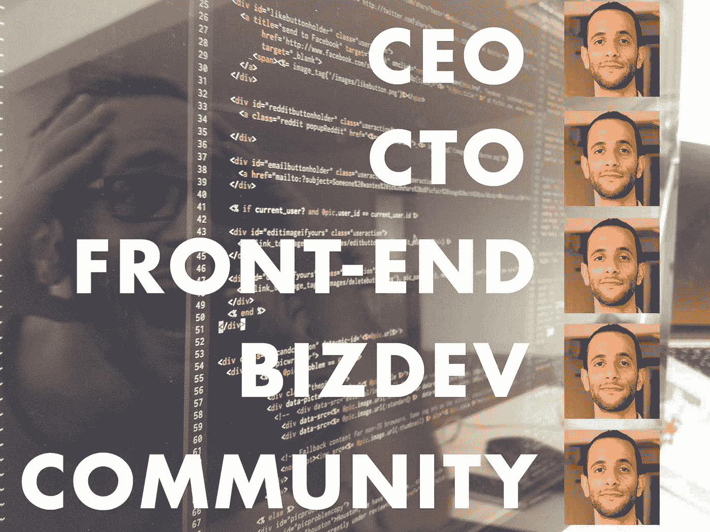
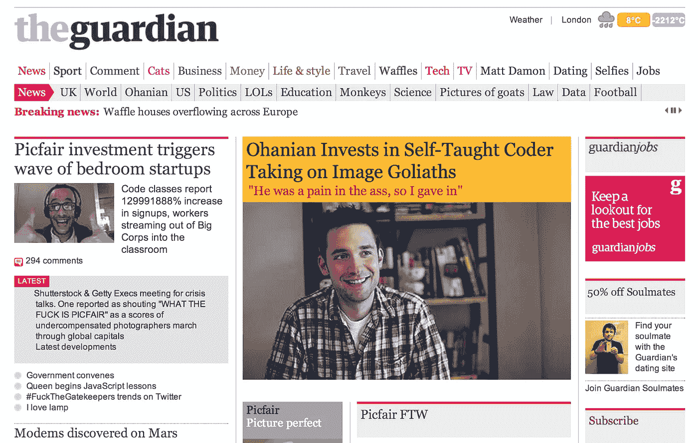
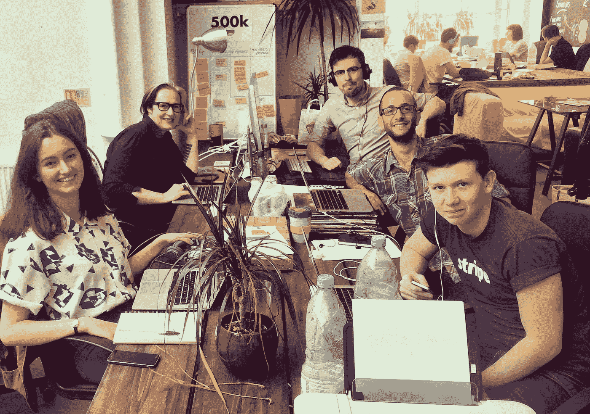

# 新手投资指南

> 原文：<https://medium.com/hackernoon/-242f8b94afa1>

Image: [Ayo Odumade](https://www.picfair.com/Anonymous) / [Picfair](https://www.picfair.com/)

如果你是一个有商业想法的企业家，你开始考虑筹集资金，做好准备。筹集投资对我们所有人来说都很难。对于第一次来说？太残忍了。

我希望我那时就知道我现在所知道的。所以我在分享。希望有帮助。

2013 年 4 月，我写了我的第一篇关于启动的[博客。我](https://benjilanyado.wordpress.com/2013/04/29/starting-up-an-intro/)[辞去了我在《卫报》的工作](https://benjilanyado.wordpress.com/2012/05/02/into-the-unknown-looking-for-squidgy-bits/)，学习如何编码，并决定去做。六个月后，我发布了 Picfair 的第一个测试版。这是我多年来一直想建立的东西:一个对所有人开放的图像市场，由摄影师自己控制，颠覆了几十年的授权模式。没有更多的中介机构拿走了摄影师 80%的版税——是的，这就是 Getty & Shutterstock 从摄影师那里拿走的，如果他们幸运的话。新一代的图像，公平地说，终于。

在 beta 发布的一个月内，超过 30 个国家的摄影师上传了超过 10，000 张图片到 Picfair。哇哦。它甚至卖出了一些。感觉这是个不错的主意。

但我独自一人；白天写邮件，晚上写代码。

# **穿着内衣惊慌失措**

是时候向早期的 Picfair 摄影师坦白了。那时，我用“我们”的名字给他们发了几个月的电子邮件。“*我们正在*开发该功能，请稍等，*我们会*通知您何时上线。”

我们就是我。

在某个阶段，我甚至让一位获奖的摄影师去 Picfair 虚构的“技术部”和“客户支持部”去解决她与一个错误的上传者之间的问题。我建立了两个新的电子邮件地址，并在他们之间交谈，让她进来，这样她就不会认为只有我，在我的公寓里，穿着内衣，惊慌失措。

Picfair’s first team photo. This is an actual slide from my investment pitch deck.

这是不可持续的。我同时做五份工作——需要有人比我更好地做其中的四份。

我需要投资。

在这篇文章的开始，我描述了第一次筹集资金的残酷过程。回想起来，这是非常必要的。这不应该很容易——说服陌生人给你现金是公司和创始人自然选择的一种形式:如果想法不对，或者你没有完全、绝对地承诺…你可能不会加注。

我答应自己，我会写下我学到的一切，但只有在我有钱的时候。最终，[我得到了](https://techcrunch.com/2014/06/08/picfair-raises-520k-to-take-on-getty-with-an-image-marketplace/)，但是让我到达那里的过程是我所遇到的最陡峭的学习曲线。从那以后，这篇文章就一直在我的草稿中。如果你正在读这篇文章，并且你不是过去几年里我与之分享的少数几个新手创业者之一，我想我终于抽出时间来发表它了。

所以现在开始。如果你是第一轮融资，下面这些不会保证你一分钱，但可能会有所帮助。

# 筹集现金:何时和如何

你应该在最有可能拿到钱的时候加注。

我第一次尝试的时候，太早了，浪费了一个月的时间。筹集资金是一件极其痛苦的事情:它涉及到大量的时间和情感支出——这些都不会直接帮助你建立业务。所以尽量少花时间去做。

实际上有一个累积的等级体系——你可以爬上一个粗略的成就阶梯，以便进入一个能让你的第一次融资更容易的职位。你不需要具备以下所有条件……但是你越接近梯子的顶端，就越容易也越快。

以相反的顺序:

**你有主意了。**

每个人都是。这毫无意义。

**你有一个*大*的想法。**

稍微好一点。你的想法不是一个邻居的想法，而是一个全球的想法。你的上限高到足以让投资者想象出巨大的回报，而且你雄心勃勃。尽管如此，看上面:这仍然没有意义，只是稍微少了一点。

**你有一个很大的想法，*在一个很大的破碎的行业，并且非常非常了解这个行业。***

好吧，你开始变得有点可行了。你发现机会的可能性很大。领域专业知识确实非常方便。

**你有一个大的想法，在一个大的破碎的行业里，你很了解这个行业*，而且你以前曾经工作过——或者组建过——一个*** [***初创公司***](https://hackernoon.com/tagged/startup) ***。***

好的，这意味着验证你的想法将花费更少的时间，因为你不会在工作中学习。无论你成功还是失败；会很快的。

**你有一个伟大的想法，在一个破碎的大行业中，你非常了解这个行业，你以前曾在一家初创公司工作过，或者成立过一个初创公司，*你有一个可用的产品。***

用一个可工作的产品来阐明你的愿景比简单地描述你打算建造什么要好得多。这也表明你已经干得很出色了——要么说服某人加入你的公司并创建它；或者投入一些你自己的钱；或者说服朋友或家人给你一些钱。就我而言，我已经学会了编码并自己构建了它。

**你有一个伟大的想法，在一个破碎的大行业中，你非常了解这个行业，你以前也曾在一家初创公司工作过——或者成立过——你也有一个工作产品，*，它有牵引力*。**

现在你说话了。你的想法不仅存在，现实世界里也有不觉得这是废话的真人。如果这种牵引力迅速增长(参见 YC 的 [7%法则](https://onemonth.com/y-combinator-and-the-one-metric-that-matters))……你就有所收获了。

**你有一个伟大的想法，在一个巨大的破碎的行业中，你非常了解这个行业，你以前也曾在一家初创公司工作过——或者成立过——你也有一个工作产品，它有吸引力，*你有一条清晰的创收路线，并且清楚地知道你想要做什么来实现它。*【这是我在的地方，但是没有启动经验】**

有些人可能会说这不是必要的，尤其是在硅谷:如果你建造了它，他们来了，他们以后会带着钱来。英国则不同。我们的投资者更厌恶风险(我还不知道这是好事还是坏事)。不管怎样，如果你能非常简单地解释你的收入将来自哪里，你的情况就很好。

**你有一个伟大的想法，在一个破碎的大行业中，你非常了解这个行业，你以前也曾在一家初创公司工作过——或者成立过——你也有一个工作产品，它有吸引力，*并且你有实际收入*。**

你拥有神圣的“产品-市场契合度”。你已经证明了获得收入的途径是真实的，而不是虚构的。规模潜力显而易见。这看起来不错。

**你有一个伟大的想法，在一个大的破碎的行业中，你很了解这个行业，你以前也在一家初创公司工作过——或者成立过——你也有一个工作产品，它有吸引力，你有实际收入，*你有一个团队，准备扩大它的规模*。**

闭嘴，拿走我的钱。

# 我需要筹集多少钱？

一些创始人会说，你应该只筹集达到下一个增量里程碑所需的资金。加注 10k，证明一些东西，加注 50k，证明一些别的东西，加注 100k，证明更多…诸如此类。你的思维总是敏锐的，因为你总是快要死了。

在我看来，这是一条虐恋者的路线。作为创始人，你的公司需要你。可能需要你们两个人。如果你给它你的一半，因为另一半是永久追逐现金，你的公司会因疏忽而死。现金无法让一家死去的公司去纤颤。

所以如果可以的话，给自己买一条像样的跑道。给自己足够的时间，让你和一个精干的团队真正干出一番事业。几乎可以肯定的是，你将来还需要再加注，所以要在实力雄厚的情况下加注。

当时，在与一些早期创始人交谈后，我逐渐了解到以下几点:在大多数情况下，如果你最初的预算超过每月 2 万英镑，你可能太放纵了。如果少于 5k，你可能没有给自己足够的机会。如果你的跑道是三年，你走得不够快。如果是三个月，你会很难坚持下去。如果你在英国进行第一轮加注，你可能会看到 10 万到 50 万英镑的奖金。

# **以什么估值？**

第一轮估值是愚蠢的。你为第一次加薪设定的估值几乎肯定不是你公司的价值。差远了。

它们几乎完全是环境造成的。欧洲的种子阶段(即第一轮)估值大约是纽约的一半，也是硅谷的一半。这证明了它是多么的荒谬。

你第一次筹集资金时，你的估值很可能是这样的:为了支付我想要的跑道，我需要 X，我愿意放弃 Y%的公司股份。答对了:你刚刚逆向工程了你的估价。如果你想要 20 万英镑，你愿意出 20%:你的估值是 100 万英镑。是的:一派胡言。

你能否得到这样的估值将取决于你所处的位置(见上文)、你的公司所带来的机会以及你的推销能力。你无法证明这家公司值得你用“砖头和砂浆”来评估；但是你能让你的投资者相信有一天它会比你现在给他们的估价更值钱吗？

# 你应该放弃多少？

这里要避免两件事。两者都涉及同样的考虑:这几乎肯定不会是你最后一次加薪。

如果你在第一轮融资中捐出了公司很大一部分股份，那么到了第二轮融资时，你还有什么可玩的呢？一个好的投资者应该知道这一点，并且知道创始人(或创始团队)需要通过多轮持有足够多的公司股份，以保持激励。

相反，如果你马上筹集了很多钱，却很少捐出去，你就为自己赢得了一个巨大的估值，这不一定是一件好事。当你再次融资时，你需要证明更高的估值是合理的——否则，你实际上是在说你的公司没有进步。

所以，再一次，找到一个甜蜜点。你的估值应该大到足以让创始团队在几轮(包括这一轮)中保持相当大的比例，但也不能大到让你无法进行下一轮投资。

—

无聊的警告:

1.  在美国，以[可转换票据](http://techcrunch.com/2012/04/07/convertible-note-seed-financings/)的形式融资相对常见，这是一种在未来流动性事件中转换的贷款形式，因此完全推迟了估值。根据我(有限的)经验，英国投资者不喜欢这些，尤其是寻求 SEIS 救济的天使(我稍后会谈到这一点)。
2.  确保你知道你的投资前估值和投资后估值的区别。点击阅读更多关于这个[的内容。](http://www.investopedia.com/ask/answers/114.asp)

长话短说:在英国，你可能正在筹集直接的股权投资，而不是可转换债券，你头脑中的估值是后货币估值……即在你增加了你想要筹集的现金后公司的价值。

—

# 我应该瞄准哪些投资者？

你已经计算出你想筹集多少，你愿意捐赠多少，因此你的目标估值。现在钱从哪里来呢？在你准备好一份计划书之前，你需要想好你要把它带给谁。

**孵化器&加速器**

英国各地有许多加速器项目，它们提供少量投资、办公场所、一段时间的专家指导，以及一点接触机会。查 [Seedcamp](http://seedcamp.com/) ， [Wayra](http://wayra.co/) ， [TechStars](http://www.techstars.com/) ， [Ignite10](http://ignite.io/) 0。一方面，这些项目在一个想法和大坏世界之间提供了一个教育缓冲区。另一方面，大袋世界很重要，加速器相对来说有着不太好的成功记录。一个例外是 YC，他们的命中率是惊人的。

**天使**

如果你是第一次在英国筹集资金，金额高达 50 万英镑，“天使轮”可能是你正在寻找的。天使是单独的非机构投资者。有些是前创始人，他们卖掉了一家公司，或者在技术领域有经验，可以提供很多价值(介绍、建议、宣传)。但许多人不是。在过去几年中，许多传统投资者(即“城市类型”)对科技投资产生了兴趣，这是可以理解的。他们有现金。你需要现金。和他们谈谈。

不管怎样，在英国他们都有资格享受税收减免。忘记“[科技城](https://www.theguardian.com/commentisfree/2014/jun/30/tech-city-subsidise-code-schools-year-of-code)的虚假形成吧”……这是政府为英国的创业场景所做的最好的事情，遥遥领先。

SEIS:如果你是第一次筹集资金，并且不到 9 个月，你筹集的第一笔 15 万英镑将有资格获得 SEIS。这意味着，任何在此分配范围内投资的个人将获得 50%的投资回报作为税收减免。例如，一个合格的投资者认购了价值 50，000 英镑的股票，在下一次纳税申报单后，他只需支付 25，000 英镑。本质上:半价股！EIS 与 SEIS 相同，但适用于大于 150，000 的轮次，释放率为 30%。

当你是一家羽翼未丰的公司，几乎没有什么可以展示自己的时候，你是一个巨大的风险。这种税收减免刺激了风险——投资永远是一场赌博，但这让它成为一场打折的赌博。

**风险投资家**

带着我三个月大的公司和零创业经验，我直接去了全国最大的风险投资公司，当他们没有立即给我开一张巨额支票时，我非常生气。我很害怕被拒绝，所以浪费了很多精力让一家风投公司参与 Picfair 的第一轮投资。这对第一次创业的人来说是前所未有的，这让我更加想要它。最后，我得到了一个风险基金的邀请，然后决定不接受他们的钱。

如果你是第一次筹集资金，为了你的第一家公司，你可能不应该钻研风险投资领域。可以理解的是，他们想要很多保护([优先股](http://www.investopedia.com/terms/p/preference-shares.asp)、[流动性偏好](http://www.investopedia.com/terms/l/liquiditypreference.asp)、董事会席位)，因为他们有自己的投资者要安抚，他们通常只参加 200 万英镑以上的融资(“首轮融资”)，这些融资几乎都是第二次/第三次/第四次融资。时机成熟时，风投资金可以推动你的业务。

时机成熟时。

# 如何找到你的投资者

一旦你确定了你想要多少，你的目标估值，以及你想要什么样的投资者，现在你需要去接触他们。

首先，列一个清单:

*   阅读 TechCrunch 上所有关于最近种子期和首轮融资交易的文章，寻找参与交易的天使投资人。
*   这很粗糙，但就这么做吧:问问你的朋友，他们认识的最富有的人是谁，他们是否记得他们曾经投资过公司。
*   寻找最近出售的公司——口袋里有新资金的个人技术专家。
*   在 AngelList 中搜索你的生态系统中的活跃投资者。

现在是最难的部分:安排会面。

LinkedIn 是你拥有的最好的资源。在你现有的网络中，找出你是如何连接到你的目标的。如果你们两个之间有人，请他们介绍一下。如果中介可以给你介绍两个或更多的人，带他们出去吃午饭，然后在你付了饭钱后向他们索要介绍。一个介绍比一封冰冷的电子邮件更有力量。

当你最终给你的目标发邮件时，尽量简短。你是谁？你想做什么？你已经走了多远了(最好是用数字和图表)？你筹了多少？如果你已经有了一副牌(见下文),发送它。差不多就是这样。

确保你已经做了功课。在我开始追逐汤姆·休姆(现在是谷歌风投的合伙人)之前，我读了他的整个博客，看了他出现在 YouTube 上的每一个视频。在我第一次给 Reddit 的联合创始人亚历克西斯·奥哈尼安发电子邮件之前，我读了他的书。

A fake Guardian home page I sent Reddit founder Alexis Ohanian before he invested in Picfair

投资者可能不会回复你。他们总是收到这些邮件。所以等几天再发邮件。然后等几天再发邮件。对于我的一个投资者，我终于通过发邮件，然后再发邮件，然后再发邮件，然后在 Twitter 上注册他，然后评论他的 Foursquare 签到，获得了一次会面。

成为一个无情的讨厌鬼是成为一个企业创始人的核心属性之一(问问我的同事就知道了)，所以不要担心成为一个无情的讨厌鬼。从来没有人靠撒娇筹集过几十万英镑。

# 你的推销

你有一个会议。你有半个小时和一个百万富翁在一起。如果进展顺利，它可能会改变你未来几年的生活。

YC 创始人保罗·格拉厄姆写了一篇关于融资的精彩博客，但是，在我看来，他犯了一个错误:他说你应该首先推荐最优秀的人——你最想要的投资者，直接去找他们。虽然这可能适用于经验丰富的第二次或第三次筹款的筹款人，但不适用于像我这样的第一次筹款人。

要知道:你的第一次推销会很糟糕。

我花了四五个臭球才把它做好。当一个问题难倒我时，我会确保下次我能回答出这个问题。当我一次投不出一个数字时，我会为下一次投准备好 10 个。

核心要素:幻灯片(PowerPoint、Keynote 或 Google 演示文稿等)。)用尽可能少的幻灯片。演示时间不应该超过 15 分钟。有成百上千的博客告诉你需要包括哪些内容，但是如果你能勾掉下面的大部分内容，你的情况会很好:

*   为什么*你*牛逼？为什么他们会对*你*这个人印象深刻？
*   你所展示的机会有多大——你要颠覆的行业价值 1 亿美元，还是 1000 亿美元？
*   产品处于什么状态，谁在使用它？你有多少用户？每月有多少次访问？有多少顾客？
*   你打算用筹集到的钱做什么？它将如何让你成倍增长？你的里程碑是什么？
*   你的竞争对手是谁？你为什么比他们强？你的不公平优势是什么？
*   你考虑过下一年的现金流吗？以及接下来四年的大致融资周期？

我逐渐学会的另一件事。与你交谈的人大多非常聪明，能够理解多层次的复杂性和细微差别。但是上帝，他们喜欢子弹点。简化一下。那就再简化一些。把 200 字的段落拿出来做成图表。把 4 页的市场分析变成 10 秒的视频。然后把你已经思考和梦想了一年，可以写三本书的事情浓缩成一句话。比如:“Picfair 就是图像的 AirBnb。”

# 承诺和领导者

现在舞蹈开始了。投资者是群居动物——如果没有其他人和他们一起跳，他们通常不想跳。这是可以理解的:共同跳伞者在精神上减轻了他们的风险。

你想要的是他们“承诺”。从字面上看，你希望他们对你说“我承诺 X。”这意味着“如果你完成了你的回合，我会按照你给我的估价给你 X。”

要开始行动，你需要一个大的承诺，最好是来自愿意“领导”的人。这使他们成为关键人物，他们将整理法律文件并召集其他投资者。如果你筹集了 30 万英镑，出现了一个愿意承诺 10 万英镑的领导者，那么你的情况就很好。即使他们不愿意“领导”——你可以自己做——它仍然会让你走上自己的路。但是请记住:你仍然需要填满你剩下的一轮。如果你不这样做，对投资者来说是一个不同的提议，你可能需要重新评估你的估值。

但是一个大的承诺让事情变得非常简单。你成交了。现在是时候把它带给游戏中的其他人了(他们可能一直在等着别人先跳起来)。

“我们上了。X 人以估值 z 承诺了 Y，你进还是出？”

# 请律师

你还没有结束你的回合。你的银行里没有钱。

找个律师代表你。我第一次用的是奥瑞克，但是还有很多其他优秀的种子交易专家——T2·谢里丹斯、T4·纳巴罗、泰勒·韦辛和 T7。让他们为你控制交易的成本——这意味着你有一个最大的成本，如果交易继续进行，你也不会被无休止地开账单。

首先，你需要一份投资意向书。你可以找一个律师为你起草，或者，如果你有一个“领导”，他们可以为你提供一份条款清单，让其他人都同意。

一份条款清单包含了你的交易的“顶线”——一份要遵循的法律胶浆的浓缩版本。你的条款清单将概述你需要与投资者达成一致的主要因素——如期权池、清算优先权、优先购买权、拖带权、董事会、创始人授权等。

你可能从来没有听说过这些东西。Passion Capital 在这里发布了一份漂亮的无 gumph 版本的条款清单[，涵盖了上述所有内容。如果你收到的条款清单与他们的大相径庭，那就要担心了。期待一些谈判——特别是如果你的一轮包括机构投资者(但如果这是你的第一轮，可能不应该——见上文)。](http://www.businessinsider.com/a-plain-english-term-sheet-venture-capitalist-2013-6)

一旦你有了各方签署的条款清单，你仍然没有完成。现在，我先前提到的法律泥流——公司章程、股东协议、认购协议和任何创始人担保。这可能长达数百页，可能是你读过的最无聊的东西。真的，虽然，这只是条款清单写在可怕的，赔偿的长度。

这并不是说你不应该读它。我想尽可能多的理解，所以当我不明白的时候，就不停的烦我的律师给我解释。我们已经限定了价格，所以我没有隐瞒。

最后，现在是地狱边缘。至少会有几周的延迟，因为你的投资者会和他们的律师反复核对 gumph，他们可能会回来做些小的修改。如果是，这就需要另一轮的交叉检查，以此类推。但是你已经很接近了。

一旦签了合同，剩下唯一要做的就是汇款。

# **起…**

当我看到最后一笔现金进入 Picfair 的银行账户后，我睡了 17 个小时。我什么也没做。

但是我可以开始，适当地。不到三周，我就换掉了五个角色中的四个，Picfair 团队在肖尔迪奇的一个非常老套的共享工作区工作。【我也会[排好](http://techcrunch.com/2014/06/08/picfair-raises-520k-to-take-on-getty-with-an-image-marketplace/) [起](https://s3.amazonaws.com/f.cl.ly/items/3K0F001t3R0R2w2k2s1L/PicfairTimes.jpg) [一些](http://techcitynews.com/2014/06/09/london-based-picfair-raises-520k-to-hand-power-back-to-photographers/) [按下](https://www.journalism.co.uk/news/picfair-receives-310k-from-angel-investors-including-reddit-co-founder-/s2/a557004/)——你的第一次加薪是一个非常好的正当宣传机会，尽你所能地挤压它。]

Picfair’s first *actual* team photo: me (with stupid checked shirt) and four upgrades

过去的两年半时间过得飞快……我投入到融资中的所有精力现在都投入到了创业中，而这需要两倍的资金。

自从我第一次坐下来写这篇文章以来，Picfair 已经筹集了两轮资金，是的，我们现在正在再次筹集资金。很多都变了。我们现在是一个 12 人的公司。我们的图书馆已经发展到 450 万张由 135 个国家的成千上万的新兴摄影师上传的经过算法处理的图片，从奈洛比的贫民窟到卡布尔的 T2 街道到德克萨斯的 T4 牛仔前哨。我们已经造出了鸡，现在我们正在追逐蛋——逐渐将自己推向全球的出版商和企业。

感觉我们才刚刚开始。

— — — — —

这篇文章旨在为新手提供一个模板。如果那是你——我希望它有所帮助，祝你好运。

当然，有很多很多不同的方法来筹集资金。如果你自己做过，或者如果你自己是一个投资者，我相信你会不同意上面的各种事情。你可能是对的。无论哪种方式，请在评论中发布。

*必不可少的技巧:如果你是一名出版商或企业，正在全球寻找新一代的图像，请点击***。**

*   *推特上的我: [@benjilanyado](http://twitter.com/benjilanyado)*

******

> *黑客中午是黑客如何开始他们的下午。我们是这个家庭的一员。我们现在[接受投稿](http://bit.ly/hackernoonsubmission)并乐意[讨论广告&赞助](mailto:partners@amipublications.com)机会。*
> 
> *如果你喜欢这个故事，我们推荐你阅读我们的[最新科技故事](http://bit.ly/hackernoonlatestt)和[趋势科技故事](https://hackernoon.com/trending)。直到下一次，不要把世界的现实想当然！*

**