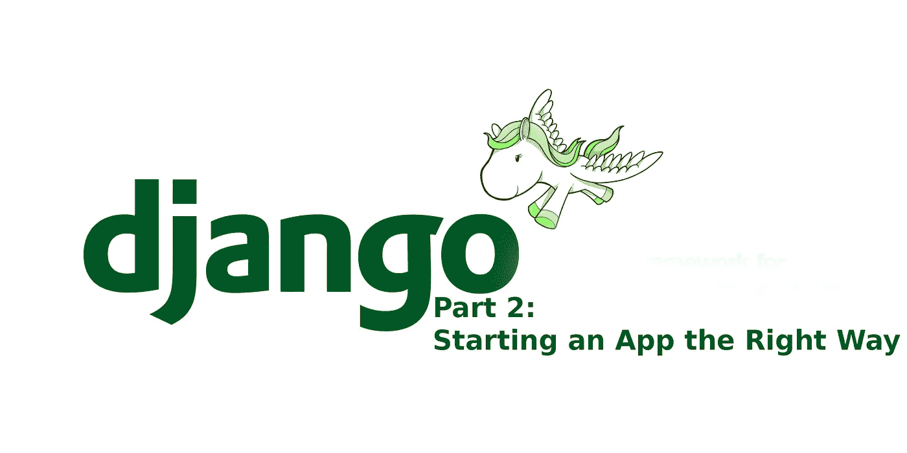

# Django 的 0–100:以正确的方式启动应用程序

> 原文：<https://medium.com/hackernoon/0-100-in-django-starting-an-app-the-right-way-badd141ef439>



[在我们上一个教程](/@jeremytiki/0-100-in-django-the-perfect-environment-a906827028fc)中，我们介绍了如何设置一个基本的 Django 项目。现在，您应该有一个如下所示的目录:

```
0to100
├── CHANGELOG.rst
├── .gitignore
├── .git
│   └── HEAD
│   ...
├── README.rst
├── docs
├── requirements
│   └── base.txt
├── setup.py
└── tutorial
    ├── manage.py
    └── tutorial
        ├── __init__.py
        ├── settings.py
        ├── urls.py
        └── wsgi.py4 directories, 9 files
```

# 启动你的应用

[Django 项目的教程](https://docs.djangoproject.com/en/1.11/intro/tutorial01/)很好地介绍了如何创建你的第一个应用，但是他们忽略了一些重要的概念。为了简洁和快速，本教程没有解释所有的内容，而是跳过了很多内容。在我们开始构建 app 之前，到底什么是 app？

## 了解什么是应用程序。

首先要明白 app 到底是什么。与大多数 MVC(或 MTV)框架不同，Django 强迫你将代码分解成独立的“应用程序”这些应用程序应该是完全独立的，可重用的，可插入的。这非常有用，因为这意味着您可以在多个项目中共享功能。

例如，假设你有一个博客应用程序和一个照片库应用程序。现在，您可能希望在这两者中添加一个共同的功能，那就是为照片和博客文章添加“标签”的能力。现在，您可以将该功能写入两个应用程序中，最终得到一堆做完全相同事情的重复代码。Django 的首选方法是添加一个名为“tags”的新应用程序。这个应用程序将包含与添加、删除和编辑来自其他应用程序的标签相关的所有数据和逻辑。

这种自我包含的能力也意味着你可以与他人共享你的代码，他们也可以使用它。例如，如果你不想写你自己的标签库，你可以运行`pip install taggit`，现在你有了一个别人写的独立的标签库。由于 taggit 的编写方式，它可以用于任何其他应用程序。

## 你怎么决定什么应该是一个 app？

这可能是 Django 新开发者面临的最大问题。你怎么知道什么时候某些功能应该被拆分？由于编程的性质，这方面没有硬性规定。我通常遵循的想法是:“如果你不能用一句话来解释你的应用程序是做什么的，那么它应该不止是一个应用程序”，到目前为止，这个想法对我很有用。

## startapp 的工作原理

那么足够的散文和理论，让我们实际上写一些代码！要在 Django 中启动应用程序，请确保您位于第一个“教程”文件夹中。从现在开始，我将把它称为你的 django 项目文件夹’(带有`manage.py`的那个)。此文件夹将存放您的所有应用程序。现在运行:

```
$ python manage.py startapp polls
$ ls
db.sqlite3  manage.py  polls  tutorial
```

现在你可以看到我们现在有了一个名为`polls`的新文件夹。虽然看起来 startapp 做了一些神奇的事情来创建这个应用程序，但实际上并没有。所发生的只是用提供的名称创建一个文件夹(即 polls)，复制一些文件，并添加一个配置文件(apps.py)。事实上，您可以在终端或文件浏览器中创建自己的应用程序，只需创建 1 个文件夹和 2 个文件。一个应用程序文件夹所需要的就是文件夹、一个`__init__.py`和一个`apps.py`。

## 创造了什么？

那么`startapp`究竟创造了什么？让我们来看一看并分解每个文件:

```
$ tree polls
polls
├── admin.py
├── apps.py
├── __init__.py
├── migrations
│   └── __init__.py
├── models.py
├── tests.py
└── views.py
```

首先是 **admin.py** 文件。这个文件是你放置所有 Djangos 内置管理配置的地方。

接下来是 **apps.py，**这个文件用于 Djangos 内部的 app registery，主要用来存储元数据。在大多数情况下，你不会修改这么多。

然后我们有了 **__init__。py** 文件。这个文件实际上是 Pythons 确定模块的约定。当你尝试运行`import library`或`from library import x`时，Python 会搜索 Python 路径中的所有文件夹。如果文件夹有 __init__。py 文件，Python 也将在该文件夹中搜索，否则它将被忽略。因此，如果我们希望能够从我们的`polls`应用程序导入代码，我们需要 __init__.py。

现在我们有了**迁移**文件夹。迁移是 Django 构建数据库的方式。我们将在后面讨论这个问题，但是当我们开始处理模型时，您会看到“迁移”被添加到这个文件夹中。

然后我们有了 **models.py** 这个文件是你应该存储与这个应用程序相关的所有模型的地方。模型是 Django 理解数据库的方式，也是您希望数据存储的方式。

接下来我们有**测试。有时你会看到这是一个**测试**文件夹。该文件/文件夹用于添加单元和集成测试。这是我们将在后面更详细讨论的内容，但基本上，测试是您编写的代码，以确保您的代码按照您期望的方式运行。**

最后我们有**的观点。这是存储我们所有业务逻辑的文件。我们将在这个文件中定义与这个应用程序相关的所有视图，包括基于类的视图和函数视图。在其他框架中，您可能会将 Djangos 视图称为“控制器”。**

## 等等，还没完，是吗？

如果您以前使用过 Django 或其他 MVC 框架，您可能会注意到缺少了一些东西。没有地方存储静态文件或模板(其他框架中的视图)。默认情况下`startapp`不会创建这些，但是您可以通过运行:

```
$ mkdir static templates
$ ls
admin.py  apps.py  __init__.py  migrations  models.py  static  templates  tests.py  views.py
```

这工作得非常好，现在 Django 会自动开始在`polls/static`中寻找静态文件，在`polls/templates`中寻找模板。

为了便于组织，你也可以添加更多的文件！我将回顾其他几个相对常见的文件:

*   **urls.py** —用于存储应用程序特定的 URL 到视图的映射
*   **forms.py** —通常用于存储 Djangos 表单库子类
*   **signals.py** —常用于存储 Django 中的[信号](https://docs.djangoproject.com/en/1.11/topics/signals/)。
*   **api.py —** 第三方库 line Django Rest Framework 和 TastyPie 常用来存储 api 信息。
*   **managers.py** —用于存储查询集管理器

此外，许多第三方应用程序使用类似于 **api.py** 的独立文件来存储每个应用程序的配置。

## 注册您的应用程序

现在你已经创建了一个应用程序，你知道它的功能，但是 Django 仍然不知道你的应用程序！为了让 Django 知道你的应用程序，你需要编辑`tutorial/settings.py`文件。一旦你打开搜索`INSTALLED_APPS`，你应该会看到一个类似这样的部分:

```
INSTALLED_APPS = [
     'django.contrib.admin',
     'django.contrib.auth',
     'django.contrib.contenttypes',
     'django.contrib.sessions',
     'django.contrib.messages',
     'django.contrib.staticfiles',
]
```

这是你启动时 Django 将使用的所有应用程序的列表。为了让 Django 知道你的新投票应用程序，只需在列表末尾添加`'polls',`:

```
INSTALLED_APPS = [
     'django.contrib.admin',
     'django.contrib.auth',
     'django.contrib.contenttypes',
     'django.contrib.sessions',
     'django.contrib.messages',
     'django.contrib.staticfiles',
     'polls',
]
```

就是这样。您已经正式创建了一个全新的应用程序，并使其与 Django 兼容！它还没有做很多事情，但是我们将在下一个教程中开始解决这个问题。