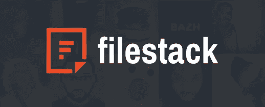
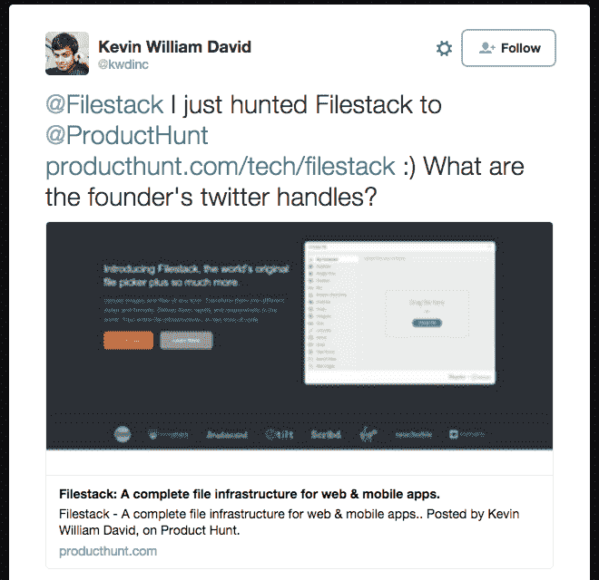
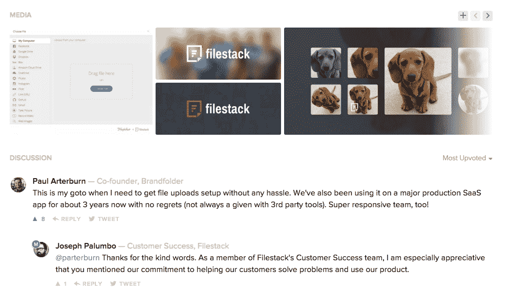
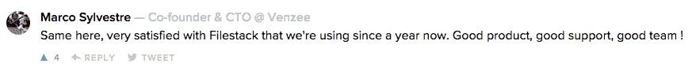
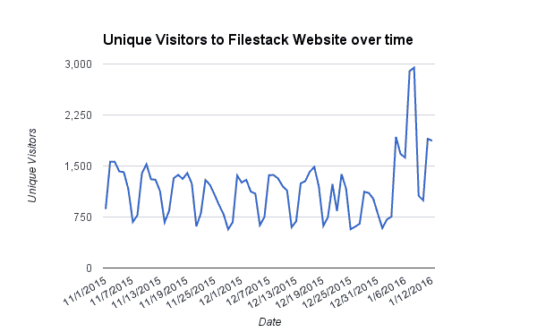

# 0 到 500。被(产品)猎杀的故事。

> 原文：<https://medium.com/hackernoon/0-to-500-the-story-of-being-product-hunted-9186d2028b19>

## 从毫无准备地醒来[我们的名字出现在产品搜索](https://www.producthunt.com/tech/filestack)上，到获得 500 张赞成票，几十个新注册用户，数千个新网站访问者，以及在产品搜索技术文摘上排名第四。

## **文件堆栈:网站的文件基础设施&移动应用**

我们是[文件堆栈](https://www.filestack.com/)。我们已经在一起快一个月了。

我们最近更名为 file picker——世界上最早的文件上传工具，更名为 file stack——网站和移动应用的端到端文件和图像管理服务。我们不仅“挑选文件”，我们还使我们的用户能够通过遍布全球的边缘服务器执行广泛的图像转换，并促进无缝的内容交付。

我们被[电子商务零售商](https://www.filestack.com/grailed)、[电子技术平台](https://blog.filestack.com/testimonial/how-fedora-is-helping-teachers-make-millions/)、[图片密集型应用](http://filestack.com/tilt)和[更多](http://filestack.com/customers)的首席技术官广泛用作上传、操作和托管内容的方式。

## 睡觉总是一个坏主意

一个周四的清晨，我醒来发现:

嗯，那让我很快就起来了。

我心中的营销人员首先会想:“这太棒了——这正是我们几个月后想要达到的目标——我们已经达到了！甜！”

然后现实开始…我们不准备优化这种宣传。我们没有定制产品搜索登录页面。我们还没有准备好目标资产。我们的新网站只存在了几个星期。我们如何在完全没有准备的情况下充分利用产品搜索？

## **保持冷静，打电话给技术朋友**

我是典型的千禧一代，我直接进入社交媒体——发推特、脸书、发电子邮件、给我认识的每一个对科技有点兴趣的人发邮件。

我的 [Venture for America](http://ventureforamerica.org/) 朋友们的第一反应是，不要分享我们的 PH 页面的直接链接，因为[产品搜索的算法明显比](/patent-monk/product-hunt-s-algorithm-tried-to-kill-us-571cd6a0c510#.22nefu9fe)征求的票数少。哎呀。

## **当你无法破解时，就去追求质量。**

好吧，如果发垃圾邮件的朋友不能帮助我们获得第一名，我想是时候去寻找高质量的内容了。我们在 Tweet @ProductHunt 上发布 Maker authority，这样我们就可以在我们的产品搜索页面上发表评论。我们的首席执行官[帕特·马修斯](https://twitter.com/patmatthews)发布了我们的愿景。我们的客户成功负责人 Joseph Palumbo 回应评论。我们的设计师[布兰登·埃斯卡兰特](https://www.linkedin.com/in/brandonescalante)加入了漂亮的创意。

## 等待…

我们坐以待毙，接受其余的事情不在我们的控制之内。这取决于我们的用户发布积极的评论。要靠“猎人”来发现我们产品的价值。

上升票数继续上升。我们的用户评论精彩，对我们的无缝产品和响应支持赞不绝口。提醒我们，他们的应用程序依赖我们提供文件基础架构，他们对此非常高兴。我们不认识的人说他们有兴趣让我们试一试。有几个巨人，但是嘿，那是给你的互联网。

到了午餐时间，我们会把它放在主页上。我正在寻找“竞争对手”,我不禁对他们的产品留下了难以置信的印象。#2 实际上是我们的一个客户生产的产品。我真的很自豪，我们创造了如此“可狩猎”的东西。这很有趣。

当我看着我们的产品 Hunt up——投票数慢慢上升时，我们的分析专家 [Caitlin Vanasse](https://twitter.com/CaitlinVanasse) 正在关注 Google Analytics。我们的浏览量直线上升。网站的独立访客比平时多了 1500 多人。新注册。哇哦。感谢您的产品搜索！

Just a casual DOUBLE in traffic during our Product Hunt feature

## **….it.**

我们以 388 票(现在是 500 票)结束了这一天，赢得了产品搜索技术文摘的一席之地。我们可以直接从产品搜索中追踪到 30 个注册用户和 3000 个访问 filestack.com 的独立访客，而且直到今天，更多的产品搜索者还在不断地进入我们的网站。

比流量激增更重要的是，我们的团队士气大增。我们收到了来自 Twitter 和电子邮件以及 PH 列表的正面评论，我们的用户告诉我们他们有多么欣赏我们的产品，其他开发人员惊呼他们知道像我们这样的产品存在是多么激动。

虽然有其他公司提供上传或图像托管服务，但我们的客户称我们有能力为他们提供“完整的图像基础设施”，以及我们团队丰富的知识和帮助解决他们问题的热情，这是我们的主要优势。

我们正在将这一产品搜寻反馈应用于我们团队和产品的未来。我们了解了用户对 Filestack 最看重的是什么，我们将继续朝着这个方向发展，专注于我们服务的简单性和我们团队的响应能力。

## 我们在狩猎中幸存了下来。我们尽情享受。

查看我们的产品搜索功能:【www.producthunt.com/tech/filestack 

> [黑客中午](http://bit.ly/Hackernoon)是黑客如何开始他们的下午。我们是 [@AMI](http://bit.ly/atAMIatAMI) 家庭的一员。我们现在[接受投稿](http://bit.ly/hackernoonsubmission)并乐意[讨论广告&赞助](mailto:partners@amipublications.com)机会。
> 
> 如果你喜欢这个故事，我们推荐你阅读我们的[最新科技故事](http://bit.ly/hackernoonlatestt)和[趋势科技故事](https://hackernoon.com/trending)。直到下一次，不要把世界的现实想当然！

