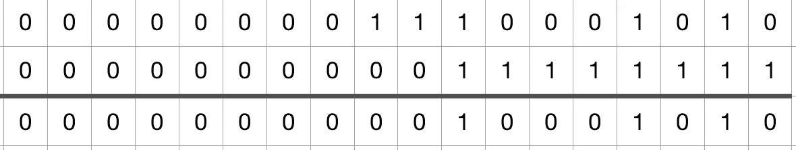

# Java 位:0xFF 和 0xFFL

> 原文：<https://medium.com/hackernoon/0xff-and-0xffl-8d2e480e9f03>



Some Random Binaries

我写了一个从 InputStream 中读取长输入数字的方法。代码如下:

```
public static long readLong(final ByteArrayInputStream inputStream) {
    long n = 0L;
    n |= ((inputStream.read() & 0xFF) << 0);
    n |= ((inputStream.read() & 0xFF) << 8);
    n |= ((inputStream.read() & 0xFF) << 16);
    n |= ((inputStream.read() & 0xFF) << 24);
    n |= ((inputStream.read() & 0xFF) << 32);
    n |= ((inputStream.read() & 0xFF) << 40);
    n |= ((inputStream.read() & 0xFF) << 48);
    n |= ((inputStream.read() & 0xFF) << 56);
    return n;
}
```

它返回错误的结果，我一直在挠头到底哪里出错了。

深入研究后，我发现 java.io.InputStream#read()方法返回一个 int 类型。当非常大的左移位(如<< 32)is performed on an int, the bits will go over bound and the high bits will be discarded.

The solution is to use a long type 0xFFL when we are [对 int 执行](https://hackernoon.com/tagged/performing)&运算，同时希望得到长类型作为这种运算的结果:

```
i & 0xFFL
```

[程序](https://hackernoon.com/tagged/programme)将对 I 执行**符号扩展**并保留所有位。

 [## 标志扩展-维基百科

### 在计算机算术中，符号扩展是指增加二进制数的位数，同时…

en.wikipedia.org](https://en.wikipedia.org/wiki/Sign_extension) 

因此，正确的代码应该如下所示:

```
public static long readLong(final ByteArrayInputStream inputStream) {
    long n = 0L;
    n |= ((inputStream.read() & 0xFFL) << 0);
    n |= ((inputStream.read() & 0xFFL) << 8);
    n |= ((inputStream.read() & 0xFFL) << 16);
    n |= ((inputStream.read() & 0xFFL) << 24);
    n |= ((inputStream.read() & 0xFFL) << 32);
    n |= ((inputStream.read() & 0xFFL) << 40);
    n |= ((inputStream.read() & 0xFFL) << 48);
    n |= ((inputStream.read() & 0xFFL) << 56);
    return n;
}
```