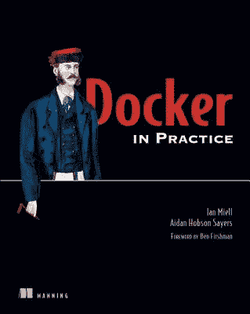

# 1 分钟多节点虚拟机设置

> 原文：<https://medium.com/hackernoon/1-minute-multi-node-vm-setup-413dfc836fc9>

# TL；博士；医生

在本地计算机上使用有用的 DNS 快速启动多个虚拟机，轻松自动化复杂的环境。

**这里有一个视频:**

[](https://asciinema.org/a/95530) [## 多节点虚拟机设置

### 伊恩米尔录制的

asciinema.org](https://asciinema.org/a/95530) 

# 介绍

保持 [Docker](https://hackernoon.com/tagged/docker) 的规模，我更关心虚拟机的集群，而不是容器本身。

讽刺的是，我没有忘记这一点。

我经常需要启动机器集群。这要么非常慢/不可靠(Enterprise OpenStack 实现)，要么非常昂贵(Amazon)。

显而易见的答案是使用流浪者，但[管理](https://hackernoon.com/tagged/managing)这可能具有挑战性。

所以我在这里介绍一个非常简单的方法来建立一个有用的流浪者集群。有了这个框架，你就可以自动化你的“真实”环境，随心所欲地玩耍。

```
$ **pip install shutit**
$ **shutit skeleton**# Input a name for this module.
# Default: /Users/imiell/shutit_resins**[hit return to take default]**# Input a ShutIt pattern.
Default: bash
bash: a shell script
docker: a docker image build
vagrant: a vagrant setup
docker_tutorial: a docker-based tutorial
shutitfile: a shutitfile-based project**[type in vagrant]****vagrant**How many machines do you want (default: 3)? 3**[hit return to take default]**What do you want to call the machines (eg superserver) (default: machine)?**[hit return to take default]**Do you want to have open ssh access between machines? (default: yes) **yes**Initialized empty Git repository in /Users/imiell/shutit_resins/.git/
Cloning into ‘shutit-library’...
remote: Counting objects: 1322, done.
remote: Compressing objects: 100% (33/33), done.
remote: Total 1322 (delta 20), reused 0 (delta 0), pack-reused 1289
Receiving objects: 100% (1322/1322), 1.12 MiB | 807.00 KiB/s, done.
Resolving deltas: 100% (658/658), done.
Checking connectivity… done.# Run:
cd /Users/imiell/shutit_resins && ./run.sh
to run.**[follow the instructions to run up your cluster.**$ **cd /Users/imiell/shutit_resins && ./run.sh**
```

这将自动运行一个 n 节点集群，然后结束。

注意:请确保您的机器上有足够的资源来运行此操作！

顺便说一句，如果您重新运行 run.sh，它会自动清除脚本启动的以前的虚拟机，以防止您的机器因旧机器而停止运行。

[](https://asciinema.org/a/95530) [## 多节点虚拟机设置

### 伊恩米尔录制的

asciinema.org](https://asciinema.org/a/95530) 

# 更深入

您可以根据需要自动设置这些节点。

例如:

```
def build(self, shutit):
[... go to end of this function ...]**# Install apache
    shutit.login(command='vagrant ssh machine1')
    shutit.login(command='sudo su - ')
    shutit.install('apache2')
    shutit.logout()
    shutit.logout()****# Go to machine2 and call machine1's server
    shutit.login(command='vagrant ssh machine2')
    shutit.login(command='sudo su -')
    shutit.install('curl')
    shutit.send('curl machine1.vagrant.test')
    shutit.logout()
    shutit.logout()**
```

将设置一个 apache 服务器，并从第二台机器向第一台机器发送请求。

# **例题**

这显然是一个简单的例子。我在这些更复杂的设置中使用了这种方法，它们很有启发性，也很有用:

## Chef 服务器和客户端

创建一个 chef 服务器和客户端。

[](https://github.com/ianmiell/shutit-chef-env) [## ianmiell/shutit-chef-env

### shutit-chef-env - Chef 服务器内自动设置的流浪者

github.com](https://github.com/ianmiell/shutit-chef-env) 

## 码头工人群

创建一个 3 节点码头群

[](https://github.com/ianmiell/shutit-library/blob/master/swarm/swarm.py) [## Ian miell/shut it-图书馆

### 在 GitHub 上创建一个帐户，为 shutit-library 的开发做出贡献。

github.com](https://github.com/ianmiell/shutit-library/blob/master/swarm/swarm.py) 

## OpenShift 集群

这个例子使用标准的 ansible 脚本建立了一个完整的 OpenShift 集群。

[](https://github.com/ianmiell/shutit-openshift-cluster) [## ianmiell/shut it-open shift-cluster

### 使用 ansible 建立基于 shut it-openshift-cluster-vagger 的 open shift 源集群

github.com](https://github.com/ianmiell/shutit-openshift-cluster) 

## OpenShift 上 etcd 迁移的自动化

上面代码的这个分支使用备选 Chef 脚本设置 OpenShift，并将 etcd 集群从一组节点迁移到另一组节点。

[](https://github.com/ianmiell/shutit-openshift-cluster/tree/chef_etcd_migration) [## ianmiell/shut it-open shift-cluster

### 使用 ansible 建立基于 shut it-openshift-cluster-vagger 的 open shift 源集群

github.com](https://github.com/ianmiell/shutit-openshift-cluster/tree/chef_etcd_migration) 

## 码头公证人

建立一个码头公证沙箱。

[](https://github.com/ianmiell/shutit-notary-trust-sandbox) [## ianmiell/shut it-公证-信任-沙盒

### 通过在 GitHub 上创建一个帐户，为 shut it-公证人-信托-沙盒开发做出贡献。

github.com](https://github.com/ianmiell/shutit-notary-trust-sandbox) 

# 招聘广告

如果您需要一个环境，或者可以改进以上任何设置，请告诉我:@ianmiell

# 了解更多信息

我的书 [Docker in Practice](http://manning.com/miell/?a_aid=zwischenzugs&a_bid=e0d48f62) :



***代码:39 米尔*** 享受 39 折优惠

[](http://bit.ly/HackernoonFB)[](https://goo.gl/k7XYbx)[](https://goo.gl/4ofytp)

> [黑客中午](http://bit.ly/Hackernoon)是黑客如何开始他们的下午。我们是 [@AMI](http://bit.ly/atAMIatAMI) 家庭的一员。我们现在[接受投稿](http://bit.ly/hackernoonsubmission)并乐意[讨论广告&赞助](mailto:partners@amipublications.com)机会。
> 
> 如果你喜欢这个故事，我们推荐你阅读我们的[最新科技故事](http://bit.ly/hackernoonlatestt)和[趋势科技故事](https://hackernoon.com/trending)。直到下一次，不要把世界的现实想当然！

