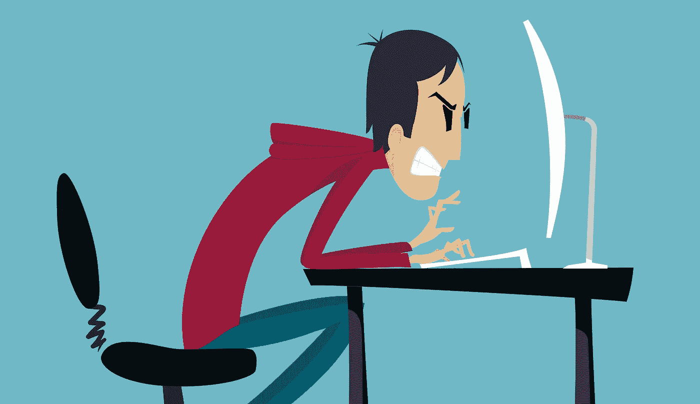
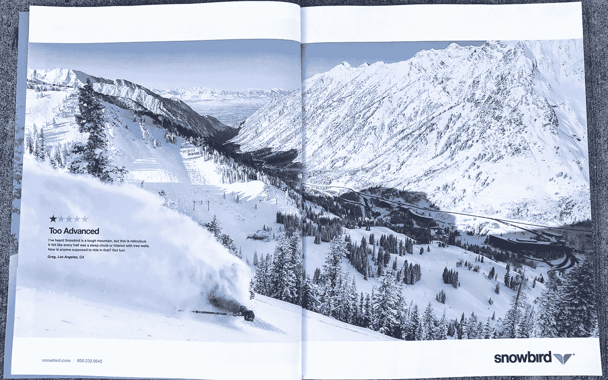
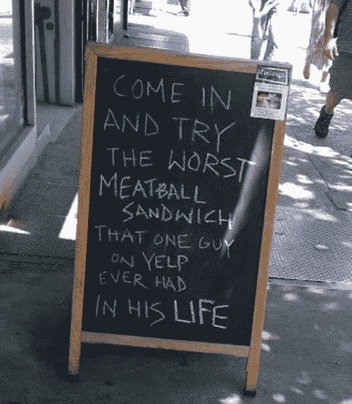
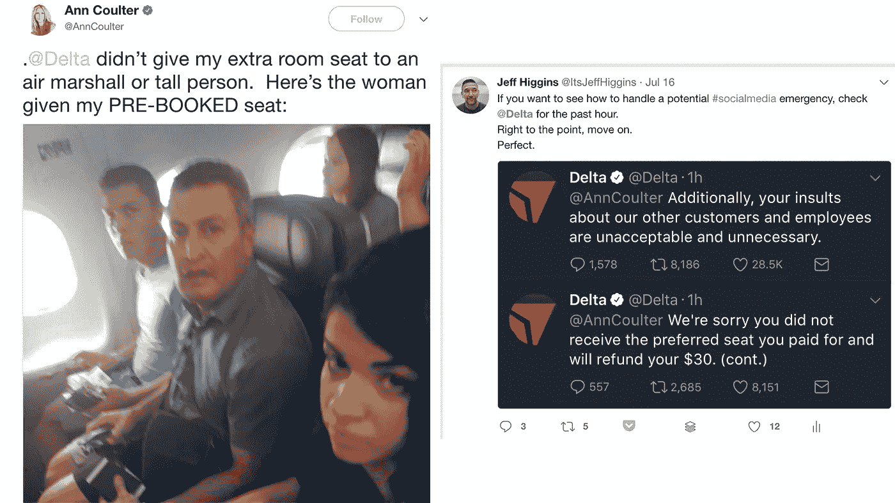
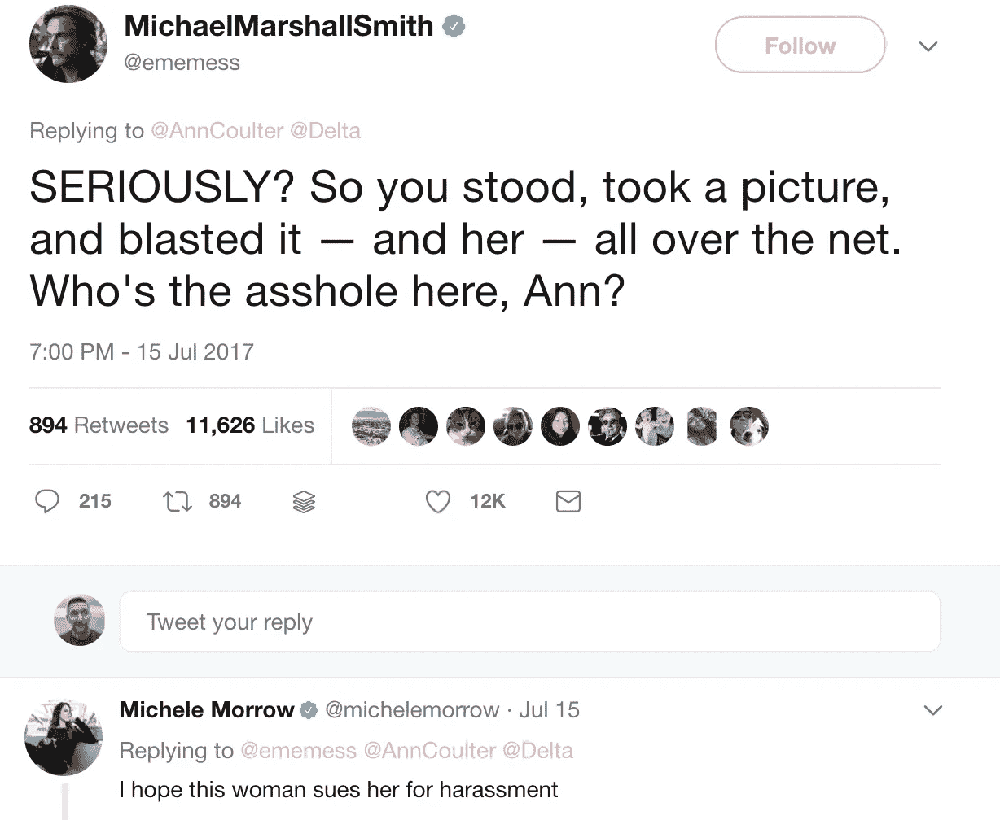

# 1 星评？让它成为你的下一个营销活动。

> 原文：<https://medium.com/hackernoon/1-star-review-make-it-your-next-marketing-campaign-a2938fdd5beb>

## 显然，鸡肉三明治或优步骑行比大屠杀更糟糕。

今天早上，[Reddit](https://www.reddit.com/r/funny/comments/7185wx/utah_ski_resort_gets_a_1_star_review_from_a_guy/)上的一个帖子引起了我的注意，当时犹他州[雪鸟滑雪场](https://www.snowbird.com/)打出了整整两页的杂志广告，主要是一星评论。

> “太高级了。我听说雪鸟是一座艰难的山，但这是荒谬的。感觉每条小径都是陡峭的滑道，或者布满了树井。怎么会有人骑着它？不好玩。”

当他们决定将这篇评论作为他们品牌声音的支柱时，发生了两件事。第一个是告诉来自加州的格雷格滚到洛杉矶的交通堵塞和烟雾中去。

第二是知道谁是他们的消费者，当他们来雪鸟时，他们在想什么。他们想要一次艰难的旅行，从山下穿过可能必死无疑的危险。他们希望他们的孩子也能有同样的被一棵树缠绕七次的经历。他们的完美观众是看这 1 星评论并接受挑战的人。

这不是一夜之间发生的新营销现象，也不是由“我真的不擅长滑雪”格雷格带头发起的影响者运动。还记得五年前 Joe Dough Sandwich 店有一位才华横溢的黑板艺术家吗？

> “进来尝尝 Yelp 上一个人有生以来吃过的最难吃的肉丸三明治。”

2012 年，在每个人都是键盘大厨并为任何事情和所有事情留下评论之前，这就像病毒一样传播开来。你知道 Yelp 上的那个家伙做了什么吗？他卖了一大堆肉丸三明治。

在这个社交媒体算法应该根据你的朋友点击的内容或平台本身认为很棒的内容向你展示最佳推文或帖子的时代，对你有利的 1 星评论可以获得荒谬的牵引力。

它不仅在社交媒体平台上产生这种影响，也适用于亚马逊和 Ebay 等网站，在这些网站上，用户可以根据流行或他们可能感兴趣的内容看到产品。如果你想看这一过程，同时在阅读评论时获得一些乐趣，就去看看[“待售的最差商品”](http://theworstthingsforsale.com/)，看着你的建议开始骚扰你的眼睛。

## 每个品牌都有这样的评论

不管你的产品或服务属于哪个行业，至少有一篇评论说，消费者宁愿喝在用石棉粉刷的房子里发现的 50 年前的发霉尿液，也不愿再次使用你的品牌。

所以问题就来了:你是否想引起人们对那篇评论的注意，如果是，你如何让它对你有利？

首先要考虑的是，这可能会适得其反。众所周知，人们跳上巨魔列车，只会把事情搞得比一开始更糟。

了解你的消费者，以及他们在心理上能接受什么。

也请记住，如果你不断得到 1 星评论，那么也许你应该考虑修复你的劣质产品或服务，不要仅仅因为你认为你很棒就把它们强加于人。

要表达的主要目的是整个情况的荒谬性。如果有人说这是他们一生中遇到的最糟糕的事情，显然他们生活得很受保护，或者从来没有和我的任何一个前女友约会过。

尤其是你的顾客，但一般来说，消费者明白什么时候评论完全过头了。这是一个很好的方式来建立品牌宣传，同时建立一个新的客户群。

达美航空有一个很好的例子，当安·库尔特决定在她的座位分配问题上表现得像一艘巨大的冲洗独木舟时，顾客跳到了他们一边。

她不仅患了莫须有的脑动脉瘤，还在推特上爆了某个随机女孩的脸，就为了结束她正在传递的公鸡圣代。

达美反应很快，一针见血，没让它拖出来。他们忠诚的顾客几乎立即附和，给了达美所有需要的弹药，他们没有再说一句话。

对你的品牌来说，最重要的是关注顾客。全部都是。定期审核你的客户服务，通过社交倾听检查你的品牌健康状况，以便掌握好的或坏的趋势。

当你的客户信任你的时候，如果你很少收到差评，你可以自由地玩。

在很大程度上，你知道你在为你的品牌做最好的决定，但总会有那么一个人，他像狗屎一样滑下一座长满树的山，名叫格雷格。