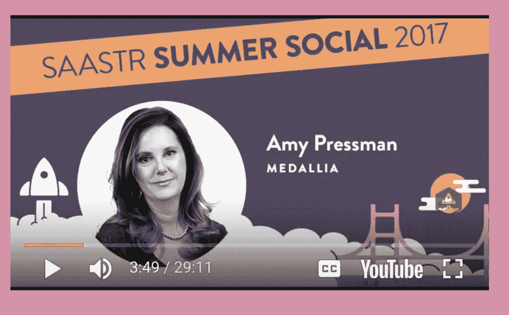
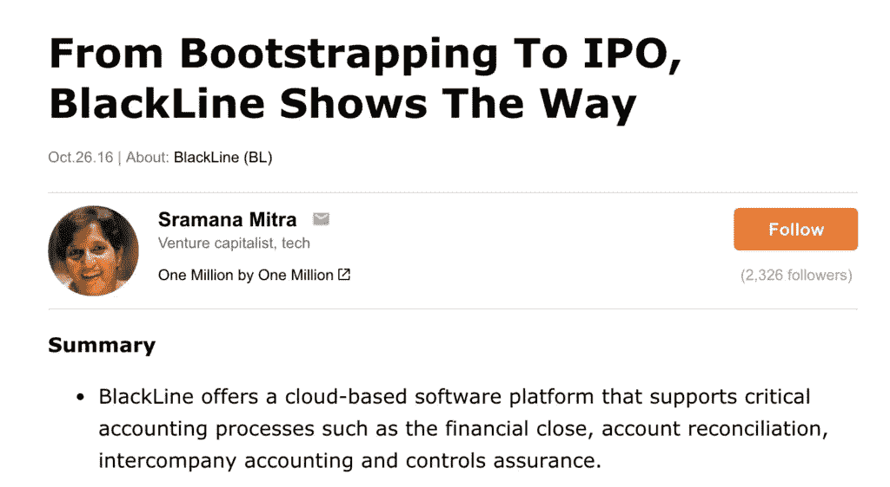
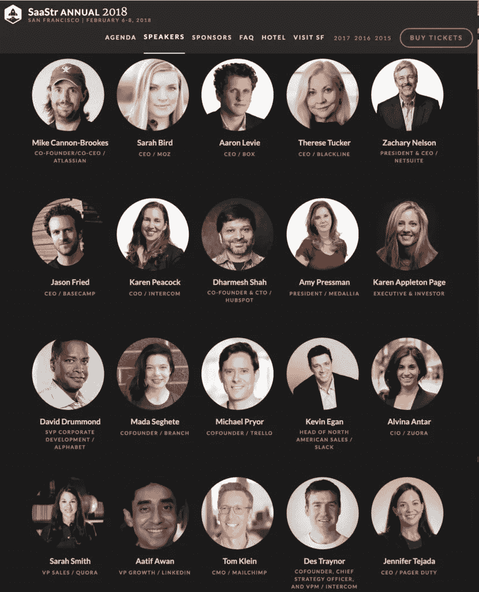

# 2018 年 SaaStr 年会上关于创业公司的 10 场精彩会议

> 原文：<https://medium.com/hackernoon/10-amazing-sessions-on-bootstrapped-startups-at-saastr-annual-2018-54102ce25797>

去年 SaaStr 年度会议的一个要求是为自举(相对于风险投资)创业公司增加更多内容。我们有！我们认为 100%的 SaaStr 内容和演讲者同样适用于其他类型的创业公司——但还是有区别的。有几节课要强调一下:

*   **瑞安·史密斯，Qualtrics** 的首席执行官。瑞安带领 Qualtrics 一路走到了 10 亿美元以上的估值，即使他在 10 亿美元后第一次融资，也没有一笔是主要的传统资本。你会喜欢这个故事，瑞安是一个了不起的自举冠军。
*   **汤姆·克莱恩，梅尔钦普的 CMO**。大家最喜欢的自举独角兽之一。如果没有大量的风险投资，你如何建立一个真正的营销计划？能做到吗？是的，它可以！我们将向汤姆学习。
*   Basecamp 的首席执行官杰森·弗里德。我们都使用的另一个最喜欢的工具。好的，是的，Basecamp 最终筹集了一些钱，但是很少。我们还是称之为自举。
*   **Amy Pressman，Medallia** 的总裁兼联合创始人。在筹集任何风险资本之前，Pre-IPO Medallia 经历了十多年。他们通过高价销售、良好销售和坚定销售做到了这一点。我们将学习如何在不从艾米那里筹集大笔资金的情况下卖出大笔交易！

*   Brad Hoover，Grammarly 的首席执行官。Grammarly 直到最近的 1 . 1 亿多美元融资才筹集到一毛钱的风险资本。他们是怎么做到的？我不知道，但作为客户本身，我们会在观众中！
*   **迈克·坎农-布鲁克斯，Atlassian 的首席执行官**。说够了。同样，当 Atlassian 最终筹集到资金时，也只是二级资本，而且该公司的融资额已经远远超过 6000 万美元。
*   布莱克林公司的首席执行官泰蕾兹·塔克。BlackLine 去年首次公开募股，轰动一时，Therese 一路带领公司从创立到 2013 年，最终筹集了一些私募股权资金，收购了一些股东。这并不容易。她告诉我们她是怎么做的。

*   汤姆·黑尔，勘测猴子公司的首席运营官。十年后，SurveyMonkey 最终筹集到了资金，但它在没有筹集到一分钱的情况下实现了逃逸速度。之后他们是如何利用资本来扩大规模的？我们将从大师之一汤姆·黑尔那里找到答案。
*   **Julios Avalos，Github 的 CBO**。是的，最终， [Github 筹集了数亿资金](https://venturebeat.com/2012/07/09/github-funding-say-what/)。但它在没有获得任何风险资本的情况下就达到了临界规模。让我们学习。
*   麦克·麦克德蒙特，新鲜图书公司的首席执行官。迈克等了十年才筹集到任何风险资本。他分享了利弊以及他在攀登早期 SaaS 2.0 先锋时所学到的东西。

