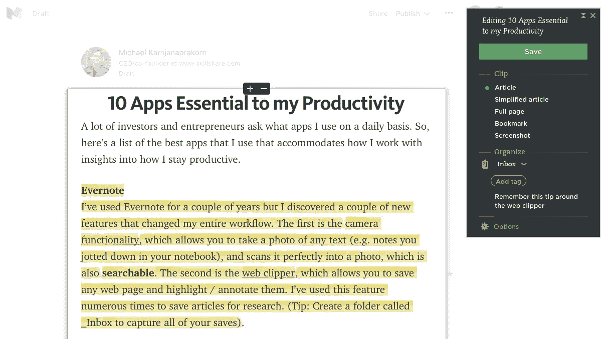
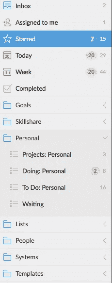
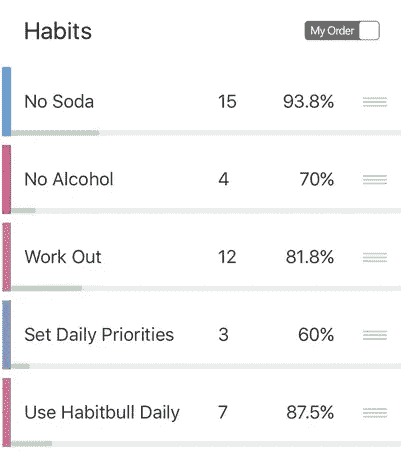
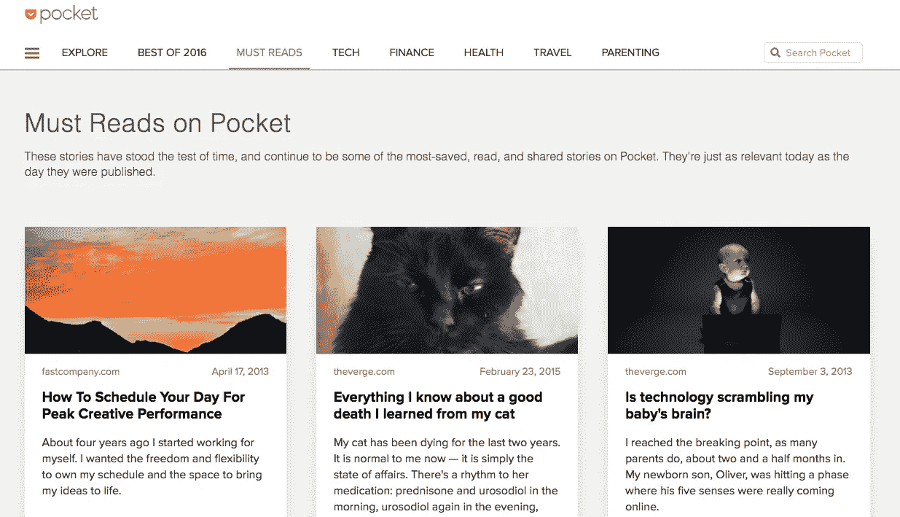
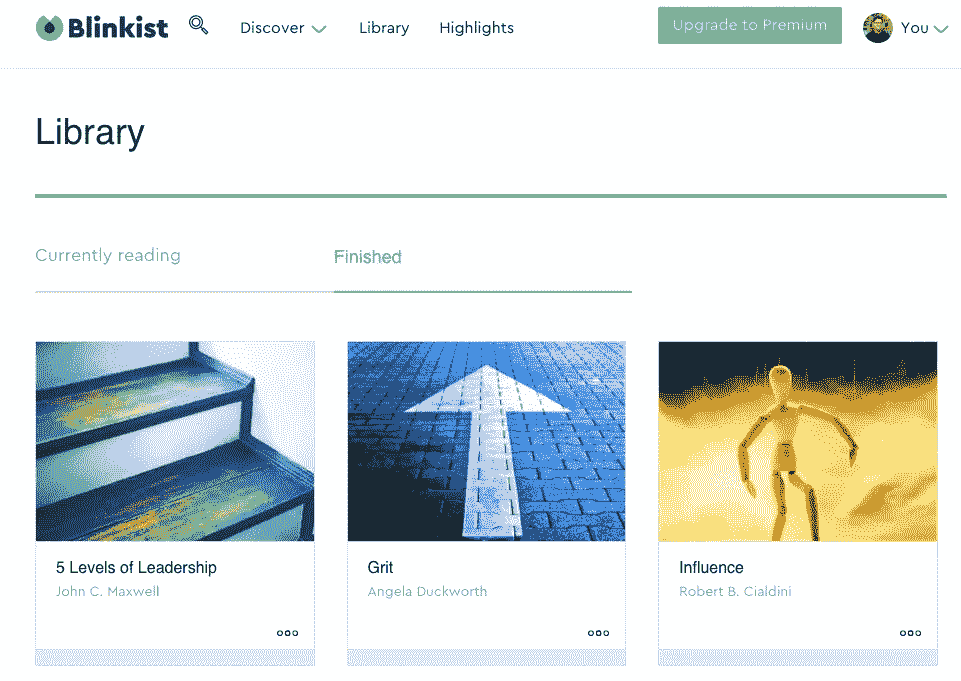
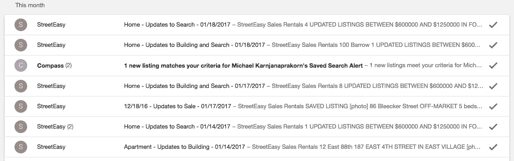
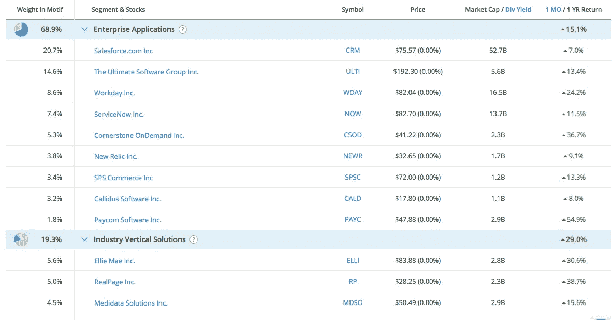
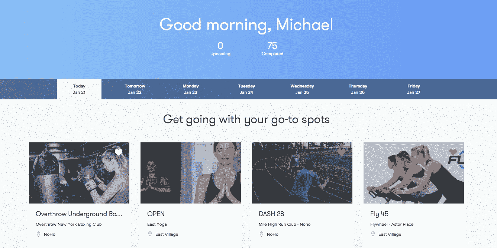
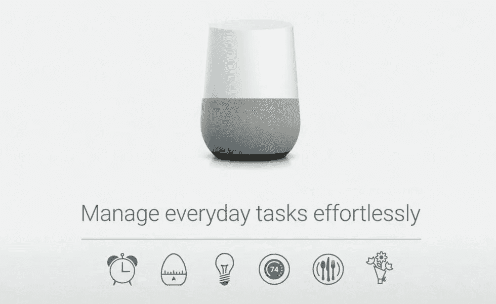

# 对我的工作效率至关重要的 10 个应用

> 原文：<https://medium.com/hackernoon/10-apps-essential-to-my-productivity-2b5c9f457196>

经常有人问我日常使用什么应用。因此，这里列出了我使用的最好的应用程序，这些应用程序适应了我的工作方式，并洞察到我如何保持[高效](https://hackernoon.com/tagged/productive)。

[**Evernote**](http://evernote.com)我使用 Evernote 已经有几年了，但是我发现了几个改变了我整个工作流程的新功能。[相机功能](https://blog.evernote.com/blog/2015/04/02/picture-great-things-with-evernotes-new-ios-camera-functionality/)允许您拍摄任何文本的照片(例如您在笔记本上记下的笔记)。这个特性最好的部分是任何文本都是可以搜索的。

第二个是 [web clipper](https://evernote.com/webclipper/) ，它允许你保存任何网页并高亮/注释它们。我已经多次使用这个功能来保存文章以供研究。(提示:创建一个名为 _Inbox 的文件夹来捕获您的所有保存)。

[**神童**](https://www.wunderlist.com/)我曾经把自己季度、月、周的所有行动步骤都写在 Evernote 里，或者有时候写在一张纸上。不再有了！我已经开始使用 Wunderlist 来跟踪我的行动步骤，并为所有事情创建列表。下面是我如何用简单的看板格式组织行动步骤的截图:

*   **项目**:我存放上级项目的地方
*   **做**:我目前正在做的行动步骤
*   **待办事项**:即将到来的行动步骤

我还会围绕成就、想法、建议和文章想法列出清单。我发现记录我可以和我的大象小组分享的成就很有帮助。

Way too many action steps that are over-due!

[**Habitbull**](http://www.habitbull.com/)假期里，我尝试了几个不同的习惯应用，发现了 Habitbull。它允许你创造新的积极的习惯或打破坏习惯。关键特性包括定制习惯、跟踪习惯和围绕输入的易用性。我现在正在追踪的一些习惯:

[**Pocket**](http://getpocket.com)我用 Pocket 保存和阅读网上的文章。他们有一个漂亮的 chrome 扩展，我在电脑和手机上都用过。他们还有一个名为“探索”的功能，可以让你看到保存最多的文章。他们把它们分成几类，比如科技、金融、健康、旅游和育儿。你也可以按我的推荐[这里](https://getpocket.com/@mikekarnj)。

**你曾经在阅读[书籍](https://hackernoon.com/tagged/books)方面落后过吗？Blinkist 是“商业书籍的悬崖笔记”他们有超过 1500 本畅销书，被改编成一口大小的短裤。你可以在不到 15 分钟的时间里读懂“眨眼”。**

**我会读一本《眨眼》，如果我觉得内容引人入胜，我会在亚马逊上订购这本书。对我来说，Blinkist 不是阅读的替代品，而是发现新的有趣内容的一种方式。**

****

**[**Gmail 收件箱**](https://www.google.com/inbox/)当我使用 Gmail 作为我的工作邮箱地址时，我使用 Gmail 收件箱作为我的个人邮箱。您可以将电子邮件整理成包。这里有一个关于“家”的例子:**

****

**我经常使用的一些其他功能包括提醒和打盹来清空我的收件箱，以便它总是为零。(亲提示:登录多个收件箱[此处](https://support.google.com/accounts/answer/1721977?hl=en)。)**

**[**母题投资**](http://r.mtf.io/jLq/l) 这是我最喜欢的财经 app！我想要一个个人理财应用程序，在那里我可以**多样化**并有更多的**控制权**。**

**这就是主题投资发挥作用的地方。它允许你建立自己的投资组合，或者跟随其他投资组合。一次投资多达 30 只股票的统一费率是 9.95 美元。**

**这里有一个围绕 [SaaS](https://trader.motifinvesting.com/motifs/software-as-a-service#/overview) 的投资组合的例子:**

****

**[**class pass**](http://classpass.com)class pass 是一种订阅会员资格，它将我与纽约地区的健身房和课程联系起来。我会轮流跑步、骑自行车、瑜伽和去健身房。我是一名长期跑步者，也是我在 [Mile Run Club](https://classpass.com/studios/mile-high-run-club-nomad-new-york) 最喜欢的工作室。**

****

**[**Google Home**](https://madeby.google.com/home/)
虽然不是一个应用程序，但它是我早上用来远离手机的。它会给我天气，日历和新闻更新。它还能播放 Spotify 的音乐，我甚至可以点一杯优步，而不用碰我的手机。**

****

**[**加成:顿悟计时器**](https://insighttimer.com/)这是我最喜欢的冥想 app。它是免费的，有近 1000 名最好的冥想老师。**

***我希望这些应用能帮助你提高工作效率，让你有时间专注于自己最想做的事情。***

************

> **[黑客中午](http://bit.ly/Hackernoon)是黑客如何开始他们的下午。我们是这个大家庭的一员。我们现在[接受投稿](http://bit.ly/hackernoonsubmission)并乐意[讨论广告&赞助](mailto:partners@amipublications.com)机会。**
> 
> **如果你喜欢这个故事，我们推荐你阅读我们的[最新科技故事](http://bit.ly/hackernoonlatestt)和[趋势科技故事](https://hackernoon.com/trending)。直到下一次，不要把世界的现实想当然！**

****