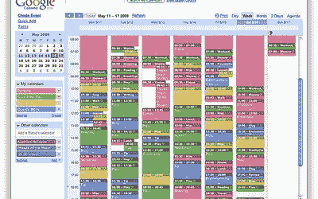
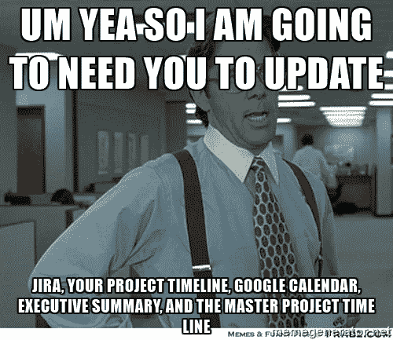

# 10 大软件 PM 时间浪费者

> 原文：<https://medium.com/hackernoon/10-big-software-pm-time-wasters-5dd5f238bc5>

时间管理对于 PMs 来说是极其重要的。您希望将精力集中在对您的客户和团队有最大影响的活动上。在我的职业生涯中(作为一名软件产品经理),我浪费了大量的时间去做那些在当时感觉高杠杆的事情，但是没有产生持久的价值。下面我列出了十大罪魁祸首…

**1。建立完善的系统来收集、跟踪和回复客户的功能请求**。我很少看到这对客户或团队产生价值。我说的不是具体的反馈和研究，也就是你为当前正在做的事情集中精力。我不是在谈论轻量级的反馈渠道，你可以查询背景信息，甚至用来招募客户进行研究。相反，我说的是白日梦，你会以某种方式为特性请求开放论坛，允许投票，这将在某种程度上有助于路线图的优先化。最后，你只是浪费了每个人的时间(包括，最重要的，你的客户)。反馈的数量超过了团队组织和处理信息的能力。

**2。故事点估算**。我坚信[对延期成本的估算](http://blackswanfarming.com/cost-of-delay/)。此外，我还认为，经济决策需要对某项特定工作的必要投资有所了解。故事点估算背后的标准论点是，它“触发正确的对话”或者“帮助我们不过度承诺”或者“帮助我们储备我们的 sprint”我认为那些最终目标(那些对话)是可能的，不需要那种令人麻木的仪式。有“好的”理由需要评估，然后是一大堆不正常的理由。花更多时间在价值/结果方面，少花时间担心一天和三天的故事和 t 恤尺寸之间的差异。

**3。路线图消防演习**。我完全赞成战略思维。我完全赞成收集数据并描述一些潜在的观点。发展你的战略应该是一个持续的活动。不幸的是，事情不是这样的。哦，不……销售人员对当前的产品感到紧张，想要一个“路线图”(翻译过来，就是你要做的事情的清单，当然，他们会在没有承诺的情况下销售)。哦，不…首席执行官/创始人即将与董事会会谈，需要一份“路线图”(翻译，所有会吸引他们注意的性感事物)。哦，不……首席技术官需要配备员工并制定年度计划，所以他们想知道你的想法(例如，需要你有一个水晶球)。这里有一个更好的方法。始终保持 6 个月、12 个月和 2 年的滚动路线图…不是你要构建的功能，而是你要关注的结果。不要打防守。进攻。让人们得到他们真正需要的东西，而不是把产品策略外包给公司的其他部门。

**4。弄清楚如何并行化工作并最大化正在进行的工作**。项目经理花费了大量的时间去找出方法来榨干开发人员编码的每一分钟。“如果我们缩小这个故事的范围，你也能承担这个故事吗？”“在我们等待关于那个故事的反馈时，你能开始其他三个故事吗？”你在浪费时间。你已经走得太远了，如果走得太远将决定你的产品的成功，你还有其他的事情要担心。那么，如果有人花了一个下午的时间来重构或处理一些债务呢？那是世界末日吗？你最终会学到的是，你对他们的工作管理得越细，团队在被微观管理的同时保持理智的优化就越多。不管你喜不喜欢，他们都会制造松弛。停止和你的团队玩俄罗斯方块。

**5。讨价还价和拍卖团队资源**。“我们团队的 50%归你，20%归你，另外两个项目各占 15%。”如果你发现自己在说这些事情(或者在想这些事情)，你将会为你的产品打一场硬仗。它不再是产品了！你是一个项目商店。作为一个项目经理，想象一下你所构建的环境和案例会消除所有这些猜测的世界。你可以做一个案例，让所有的猜测和要求都闭嘴，人们会说“该死，我们很兴奋…继续做你正在做的事情！”你会让你的团队参与到这个过程中。我不认为一个项目商店有什么本质上的错误，如果你只是这样称呼它，称自己为项目经理。

**6。收集不适用于您当前计划的信息**。这和#1 类似，但是应该叫出来。项目经理参加了无数的会议，这些会议产生的信息在短期内是不可行的。我们被告知要“响应”并“连接”我们组织的不同部分，但我们再次浪费了我们的时间和我们内部利益相关者的时间。传道和维持关系很重要。所以关键是要保持它的针对性，并引导对话到此时此地。

**7。通过 proxie** s 与客户沟通。只要有可能，您就需要找到源头。并不是其他人(例如销售、营销、客户支持)错了或者没有提供有用的信息。相反，你永远也不会问出重要的问题，你会浪费别人的时间去获取那些信息。更好的是，您的团队应该在电话中与您在一起。不要犹豫，拿起电话和客户交谈。

**8。在一个小团体中搞清楚**。上帝禁止整个团队参加会议，并制定出一些东西！不，我们安排“小型会议”来解决问题。然后我们决定某件事，把它带给团队，然后才意识到没有人在同一页上。当然，我们可能会遇到一个高级开发人员。这可能“更有效率”并且“破坏性更小”但是当事情变得有些混乱时，你的团队如何才能更好地协作呢？同样，我们努力工作以保持事情高效，而花在团队的弹性和整体表现上的时间太少。虽然我不认为我们有意识地这样做，但我相信我们会努力保持自己的相关性。这些“重要的”小型会议实现了这一点。

**9。状态未改变时的通信状态**。这种行为往往超出我们的控制，但作为经前综合症，我们花了很多时间告诉人们事情如何/为什么会走上正轨，即使没有什么根本改变。更糟糕的是，我们花在沟通状态上的时间远远多于实际沟通结果和成果的时间。如果你所做的只是传达身份，那么这就是人们对你的全部期望。

10。猜测和过早收敛。每个人都担心他们没有所有的答案。你在现场。你是做什么的……编屎(有意无意)。作为项目经理，我们花很多时间说服人们我们已经想通了一些事情，即使我们并没有想通。部分原因是他们厌恶风险。这在一定程度上是因为我们创建了一个功能传送带，并需要保持产品下线。我们不会说“嘿，让我们在客户面前得到一些东西，如果它不起作用，我们可以杀死它”，而是说“好吧，看起来我们都同意这个方向，让我们发货吧。”想想你花了多少时间来保持你无所不知的假象。

> [黑客中午](http://bit.ly/Hackernoon)是黑客如何开始他们的下午。我们是 [@AMI](http://bit.ly/atAMIatAMI) 家庭的一员。我们现在[接受投稿](http://bit.ly/hackernoonsubmission)并乐意[讨论广告&赞助](mailto:partners@amipublications.com)机会。
> 
> 如果你喜欢这个故事，我们推荐你阅读我们的[最新科技故事](http://bit.ly/hackernoonlatestt)和[趋势科技故事](https://hackernoon.com/trending)。直到下一次，不要把世界的现实想当然！

