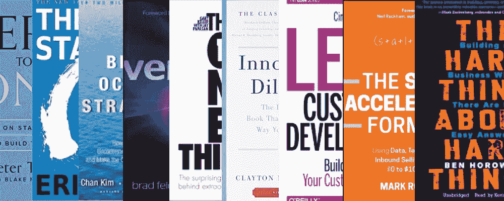

# 我希望在创业前读完的 10 本书

> 原文：<https://medium.com/hackernoon/10-books-i-wish-i-read-before-starting-up-4cccd6b21462>

我发现自己向许多第一次创业的人列出了这个清单。

这实际上是我列出的 10 本[书](https://hackernoon.com/tagged/books)，我会推荐每个第一次创业的人阅读。其中一些我有幸在开始[选秀](http://explore.drafted.us)前读过，一些没有。

在我开始[起草](http://explore.drafted.us)之后，我问每个新投资者和顾问的一个问题是“你认为我应该读哪三本书才能成为一个更好的创始人？”

有点令人惊讶的是，有很多重叠。但是，这个黄金书单已经存在，它不是秘密，你不需要向投资者出售你的公司股权来获得它:)

1.  彼得·泰尔以零比一领先
2.  保罗·格拉厄姆的散文(不是我知道的书，但应该是)
3.  《蓝海战略》,作者:renée maoborgne，W. Chan Kim
4.  Cindy Alvarez 的精益客户开发
5.  克莱顿·M·克里斯坦森的《创新者的困境》
6.  Eric Ries 的精益创业公司
7.  布拉德·菲尔德的风险交易
8.  本·霍洛维茨的《艰难的事情》
9.  马克·罗伯格的销售加速公式
10.  加里·凯勒的《一件事》

这里有一些我也读过的书，它们没有太多的推荐重叠，但我还是会推荐。

1.  乔科·威林克和叶小开·巴宾的《极端所有权》(我非常喜欢这本书，以至于我为它写了一篇摘要)
2.  帕特里克·兰西奥尼团队的五大功能障碍
3.  巴拉克·奥巴马《无畏的希望》
4.  德鲁·韦斯顿的《政治大脑》
5.  罗伯特·恰尔迪尼的影响
6.  尼克·比尔顿策划的推特
7.  跨越鸿沟
8.  菲利普·奈特的《鞋狗》
9.  Aaron Ross，Marylou Tyler 的可预测收入:
10.  Dharmesh Shah 和 Brian Halligan 的集客营销

仔细想想，实际上我在开始征兵后每个月读的书比以往任何时候都多。为了更容易阅读，我把上面所有的书按照它们对初创公司的哪些部分有帮助进行了分类。

**自律**:极端所有权，一件事

**产品**:精益客户开发，影响力

**战略**:蓝海战略，创新者的困境，精益创业

筹集资金:风险交易

**销售**:影响力，销售加速公式，可预测收入

**初创公司**:保罗·格拉厄姆杂文，艰难的事情，孵化 Twitter

**动机:**零比一，无畏的希望，擦鞋狗，一件事

**成长**:跨越鸿沟、集客营销、政治大脑

基本上，如果你想向顶级风险投资人/投资人/顾问/创始人寻求以上任何一类的创业建议，你只需阅读其中一本书就能提升水平。

任何我错过的，**请请请**在评论中留下它们。因为我想看他们:)