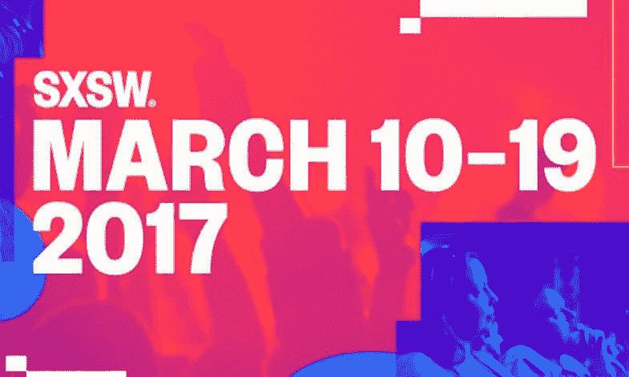

# SXSW 2017 的 10 大变化

> 原文：<https://medium.com/hackernoon/10-cool-changes-for-sxsw-2017-34f09de3e803>

## 《阿甘正传》四部曲:2017 年 2 月 5 日

每年的新年都会给奥斯汀的三月魔术带来许多新的变化——变化是一件好事。我们对 SXSW 2017 最感兴趣的十项调整包括:

1.  **新徽章系统增强您的投资**。我们已经显著提高了 2017 年所有 SXSW badgeholders 的功能和灵活性。通过[这段简短视频](https://www.youtube.com/watch?v=TeOWD2Xpo6A)，了解所有新的学习和交流机会。
2.  **顶尖高手中的顶尖高手**。3 月 13 日星期一下午， [SXSW 加速器推介活动](https://www.sxsw.com/apply-to-participate/sxsw-accelerator/)的 10 个类别获胜者将展开角逐，以确定今年活动中最佳/最令人印象深刻的初创公司。
3.  **媒体 2.0:新的“新闻”轨道**。SXSW 2017 的新曲目之一是[新闻](http://schedule.sxsw.com/2017/events/track/Journalism)(3 月 11 日至 16 日)，探索媒体和技术交叉时所有的积极(和消极)影响。
4.  **叙事接下来:新的“体验式讲故事”曲目**。定于 3 月 12 日至 14 日，[这一新曲目](http://schedule.sxsw.com/2017/events/track/Experiential%20Storytelling)调查沉浸式娱乐和其他实验性策略如何重新定义观众吸收叙事内容的方式。
5.  **3 月 15 日至 16 日，更多以技术为中心的内容。**本周逗留更长时间，参加更多内容的[品牌&营销](/@hugh_w_forrest/brands-marketing-track-march-11-16-8e5b856f903f#.b9jf3lkoa)、[智能未来](https://austinstartups.com/intelligent-future-track-runs-march-11-16-fc29c22112ea#.si7x176tw)、[新闻业](/@hugh_w_forrest/journalism-track-march-11-16-224b5f0cde42#.y6tvu1lc6)、[社会影响力](/@hugh_w_forrest/social-impact-track-march-11-15-32022f1d7dde#.k7u35xzbb)、[创业村](https://austinstartups.com/startup-village-track-march-10-16-b00da86de154#.r3m0fwcn3)和[科技产业](http://schedule.sxsw.com/2017/events/track/Tech%20Industry)赛道。还要记住，在 3 月 15 日(星期三)和 3 月 16 日(星期四)的时间段内，你可能会找到更多的酒店选择。
6.  **接下来的四年:“特朗普治下的科技。”**3 月 15 日星期三和 3 月 16 日星期四，[参加 18 场会议](http://schedule.sxsw.com/2017/search?q=Trump)，讨论新政府的政策和政治将如何加强和削弱美国不断发展的科技行业。
7.  SXSW 健康博览会在 T21 举行。随着 SXSW 健康博览会成为 3 月 12 日至 15 日在奥斯汀会议中心举行的大型 SXSW 贸易展的一部分，曾经是一个较小/独立的活动现在成为更大整体的一部分。
8.  **SXSW 市集亮相**。计划于 3 月 16 日至 18 日在奥斯汀会议中心举行的[首届 SXSW 市场](https://www.sxsw.com/exhibitions/sxsw-marketplace/)展示了数十个本地、全国和全球品牌。
9.  SXSW 社区服务奖的新一天。原名为 Deweys 的 SXSW 社区服务奖将于 3 月 13 日星期一晚上举行。来自美国和世界各地的顶级技术行善者的庆祝活动是免费的——不需要徽章就可以参加。
10.  **SXSW 游戏脱离**。2017 年， [SXSW Gaming](https://gaming.sxsw.com/) 将成为自己的赛事。你的 SXSW 互动、音乐、电影或白金徽章仍然可以让你进入——或者[购买一个 SXSW 游戏腕带](https://gaming.sxsw.com/attend/),如果你只想参加 SXSWeek 的这一部分。

[在 2 月 10 日结束前购买您的徽章](https://www.sxsw.com/attend/),为 2017 年 SXSW 节省 100 美元。然后[通过 SXSW 住房部预订您在奥斯汀的住宿](https://www.sxsw.com/hotels/)。

*休·福里斯特试着每天在介质上写* [*四段*](/@hugh_w_forrest) *。这些帖子通常涵盖与技术相关的趋势。在不尝试文字大师* [*冥想*](https://journal.thriveglobal.com/hugh-forrests-secret-life-hack-meditation-74c94583cd25#.nclguxfeh) *的时候，他在奥斯丁的*[*SXSW*](http://www.sxsw.com)*担任首席编程官。*

> [黑客中午](http://bit.ly/Hackernoon)是黑客如何开始他们的下午。我们是 [@AMI](http://bit.ly/atAMIatAMI) 家庭的一员。我们现在[接受投稿](http://bit.ly/hackernoonsubmission)并乐意[讨论广告&赞助](mailto:partners@amipublications.com)机会。
> 
> 如果你喜欢这个故事，我们推荐你阅读我们的[最新科技故事](http://bit.ly/hackernoonlatestt)和[趋势科技故事](https://hackernoon.com/trending)。直到下一次，不要把世界的现实想当然！

