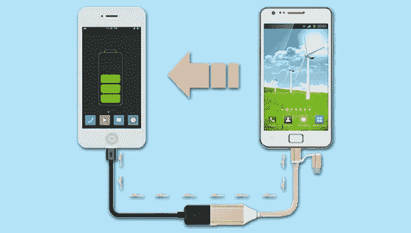
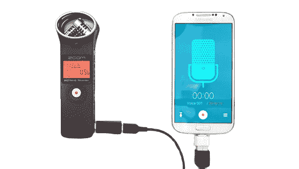
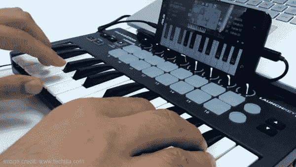
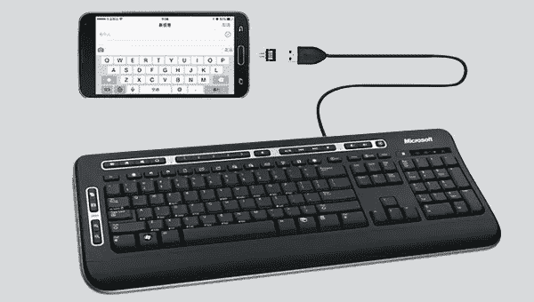
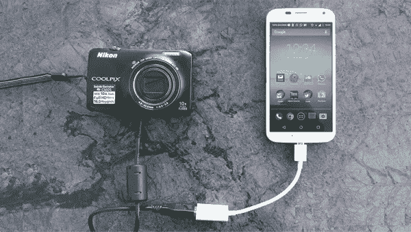

# 智能手机使用 OTG 适配器的 10 种创意方式

> 原文：<https://medium.com/hackernoon/10-creative-ways-to-use-otg-adapter-with-smartphones-27a86082cc6>

USB On-The-Go (OTG)无疑是 Andriod 设备令人兴奋的功能之一。兼容 USB OTG 的设备(几乎每一部 android 智能手机)都可以充当其他 USB 设备的控制器或主机。使用 OTG 适配器在智能手机上使用 SD 卡和其他读卡器非常常见。但是，是否有不同的方法以不寻常的方式使用 OTG 适配器呢？让我们来看看…

如今，几乎所有安卓智能手机都具备 USB OTG 功能；然而，老款手机缺乏这一功能。为了解锁 OTG 功能，你必须在你的 Android 设备上安装一个定制的 ROM 来获得 OTG 兼容性。

让我们来看看使用 OTG 适配器可以执行的 10 个最不为人知的功能。

**OTG 适配器的 10 种最不为人知的用途**

## **1。** **给其他智能手机充电**

信不信由你，你真的可以用 OTG 线把一部智能手机的电池电荷转移到另一部手机上。只需连接两部手机-一部用 OTG 加密狗，另一部用电源线。通过电源线连接的智能手机将进入充电模式，与 OTG 适配器连接的手机将成为电源。

## **2。** **语音录音**

大多数数码相机都带有内置麦克风；仍然得到高质量的声音是一种痛苦。您可以使用智能手机的麦克风在 Windows 或 Mac 上录制音频剪辑。您可以通过 OTG 连接您的手机，并利用手机的麦克风通过 PC 软件录制音频。

另一方面，您也可以使用 OTG 适配器将专业 USB 麦克风连接到智能手机。

## **3。** **使用乐器**

除了录音，你还可以在智能手机上创作自己的音乐。乐器通常可以通过 MIDI 标准与计算机连接。

使用 OTG 电缆，您可以通过 USB 将 MIDI 控制器连接到智能手机。要正确使用 MIDI 控制器，你需要下载一些像 [TouchDAW](https://play.google.com/store/apps/details?id=de.humatic.tdaw&hl=en) 这样的应用程序，这样你就可以成为下一个贝多芬了。

## **4。** **触发你身上的游戏玩家**

智能手机游戏确实是一件有趣的事情，尽管许多人更喜欢游戏机/控制器，因为它们提供了更好的控制和功能。市场上有游戏控制器，你可以将其连接到你的智能手机上，将你手机的游戏功能提升到一个新的水平。

## **5。** **使用鼠标或键盘**

你可以添加到智能手机的另一个很酷的功能是使用 USB 鼠标或 USB 键盘。对许多人来说，在触摸屏上打字可能不是一个可行的选择。只需使用 OTG 适配器将 USB 键盘连接到您的手机，就可以享受工作了。

同样，使用 USB 鼠标导航智能手机，提高日常任务的效率。

## **6。** **USB 配件**

通过 OTG 连接时，LED 灯、便携式风扇等 USB 配件可以很好地与智能手机配合使用。小米等原始设备制造商(OEM)正在提供各种各样的配件，供您与智能手机配合使用。

## **7。** **在智能手机上使用以太网/局域网**

Wi-Fi 显然是在[智能手机](https://www.pricekart.com/mobiles)上接入高速互联网的好选择。尽管如此，当你远离 Wi-Fi 路由器时，速度会下降。如果我们可以在智能手机上直接使用家庭宽带连接会怎么样？

你可以通过使用 OTG 电缆和 USB 以太网连接器来实现这一点。将它们插上电源，享受智能手机的有线连接。

## **8。** **连接 3G/4G USB 互联网加密狗**

曾几何时，USB 互联网加密狗是唯一的便携式高速互联网连接选项。然而，随着新的选择出现，互联网加密狗从市场上消失了。我们大多数人都有高速家庭宽带连接，但使用 3G 加密狗是一个非常方便的选择。

要在智能手机上使用 3G/4G 加密狗，请从 Play Store 下载一款名为 [PPP Widget 3](https://play.google.com/store/apps/details?id=de.draisberghof.pppwidget3) 的 Android 应用。使用 OTG 电缆将您的加密狗连接到手机。选择 PPP Widget 将设备与加密狗配对。输入 ISP 提供的互联网拨号设置，点击连接按钮，瞧。

## **9。** **直接从智能手机打印**

正常的印刷过程需要计算机来印刷。你必须把文件和资料转移到电脑上，然后打印出来。但现在不是了。

使用 USB OTG 电缆将打印机连接到您的手机。在你的手机上安装 [PrintShare](https://play.google.com/store/apps/details?id=com.dynamixsoftware.printershare) 应用程序，它会自动为你的 USB 打印机获取最新的驱动程序。只需点击应用程序上的打印选项，一切就完成了。

## 10。 **连接摄像头**

从数码相机或 DSLR 上复制图像确实是一件乏味的工作。你必须把相机和手机连接到电脑上，然后进行复制粘贴工作。你可以用 OTG 线将相机直接连接到智能手机上。

**结论**

这些是你可以用安卓智能手机执行的 OTG 功能的最佳用途。如果这些对你的日常生活有所帮助，请告诉我们。另外，在评论部分提到 OTG 最不为人知的用法，这是我们在文章中可能会忽略的。