# 关于移动奖励调查的 10 个事实

> 原文：<https://medium.com/hackernoon/10-facts-about-mobile-rewarded-surveys-dfee683f536e>

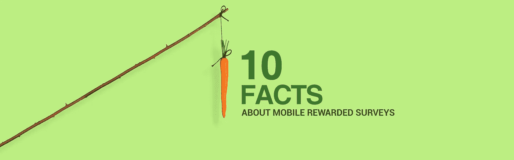

如今，奖励调查在移动应用社区获得了大量宣传，并成为最受欢迎的应用货币化形式之一。特别是对于拥有自己虚拟经济的游戏和应用程序，奖励调查是为现有奖励广告解决方案增加额外收入流的绝佳选择。

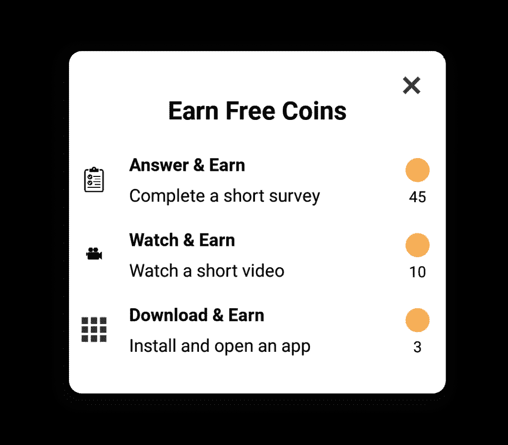

通过市场调查首次了解货币化的出版商通常会误解这种潜力，并发现很难理解这种新形式是如何运作的。一些误解和错误的期望导致失望和沮丧，因为出版商将他们最初的货币化经验与调查、广告行业以及他们这些年来的工作方式进行比较。

为了填补这一空白，我们将在下面列出一些关于奖励调查货币化的基本事实，以帮助出版商更好地理解这种格式如何工作以及从中可以期待什么。

# #1.不要期望一个应用程序中的每个用户都可以使用调查

这是出版商最大的错误期望之一。市场研究的货币化与广告的货币化有很大的不同，因为调查的工作方式不同，广告和术语如填充率、eCPMs 等实际上并不适用。调查是根据调查创建者的需求分发的，因为他们以一种特别的、不可预测的方式进入调查平台，以便使用 DIY 调查工具并创建他们的调查。在这种情况下，当调查开始时，一些用户可能无法在他们的设备上看到调查，而同一应用程序的其他用户可能会看到调查。这是因为调查是根据调查创建者的目标标准提供的。

例如:假设一位住在罗马的女性正试图在她的设备上看到一份有奖调查。与此同时，一名调查创建者访问调查平台，并要求罗马男性提供 1000 份回复。调查在上午 15:00-15:30 之间进行，并在罗马的男性设备上分发。此时，该女性不符合该调查的条件，如果没有其他调查创建者以她为目标，她将无法看到调查。如果她在应用程序中处于活跃状态，其他调查可能会针对她。

出版商应该有耐心。调查将根据研究人员提供的人口统计数据和目标标准，随时开始和停止其应用程序用户群的比例。当活动开始时，让他们的应用程序暴露在调查清单中，这对于出版商评估通过调查赚钱的机会非常重要。

# #2.只有在收到调查时才提示用户

除非有调查可用，否则发布者不应在其应用程序中提示用户参加调查。在没有收到调查的情况下提示用户进行调查，会给用户带来挫折感，并可能导致差评。

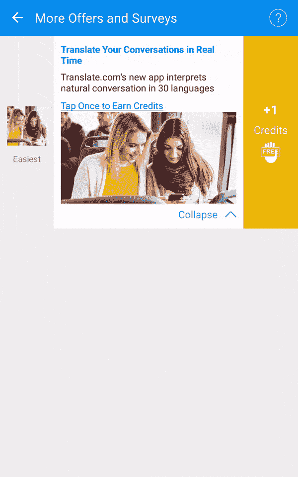

只有在用户的设备上实际接收到调查，并且该用户有机会完成调查并且发布者有机会获得收入时，发布者才应该打扰用户。

# #3.调查可以随时开始和停止

典型的调查活动需要完成 200-600 份调查。对于一般的调查网络，这种活动可能在几分钟或几小时内完成并终止。因此，设备上的调查没有缓存，因为这些调查可能会过期，过一段时间就会过时。

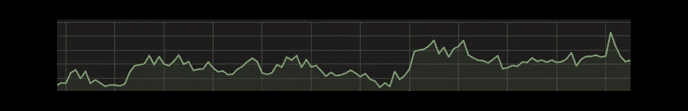

在调查活动启动时，将根据先到先得的原则向符合调查活动目标标准的用户分发调查。出版商相互竞争谁将完成最多的调查。拥有强大的活跃用户群实际上可以让出版商的收入有所不同，当活动通过他们的应用程序进行时。

# #4.收到的调查没有固定价格

调查预计将对每个不同的活动进行动态定价，因为客户根据他们的目标标准、添加的问题类型和其他选项为活动付费。发布者应该听取应用程序代码中提供的相关通知，这些通知告诉他们每次调查可以赚多少钱，并决定是否值得用调查来打扰他们的用户。这种透明度允许出版商实时计算他们应该支付给用户多少虚拟货币来完成他们应用程序中的调查。

您可以在下面的伪代码中看到一个示例:

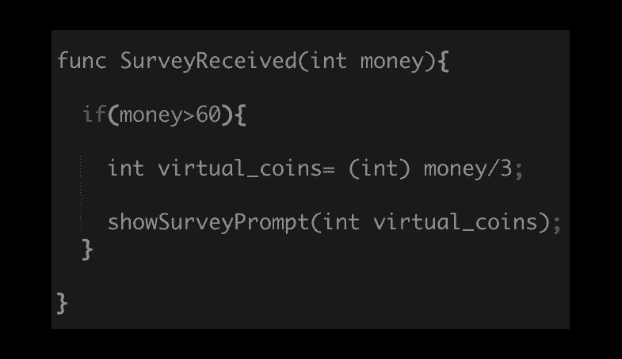

# #5.参与调查需要预先提供人口统计信息

几乎所有的调查平台都需要一些基本的人口统计信息(性别、年龄、职业和其他)，以便不仅能够正确地锁定用户，还可以将这些信息作为目标选项或调查结果页面中的过滤器提供给客户。

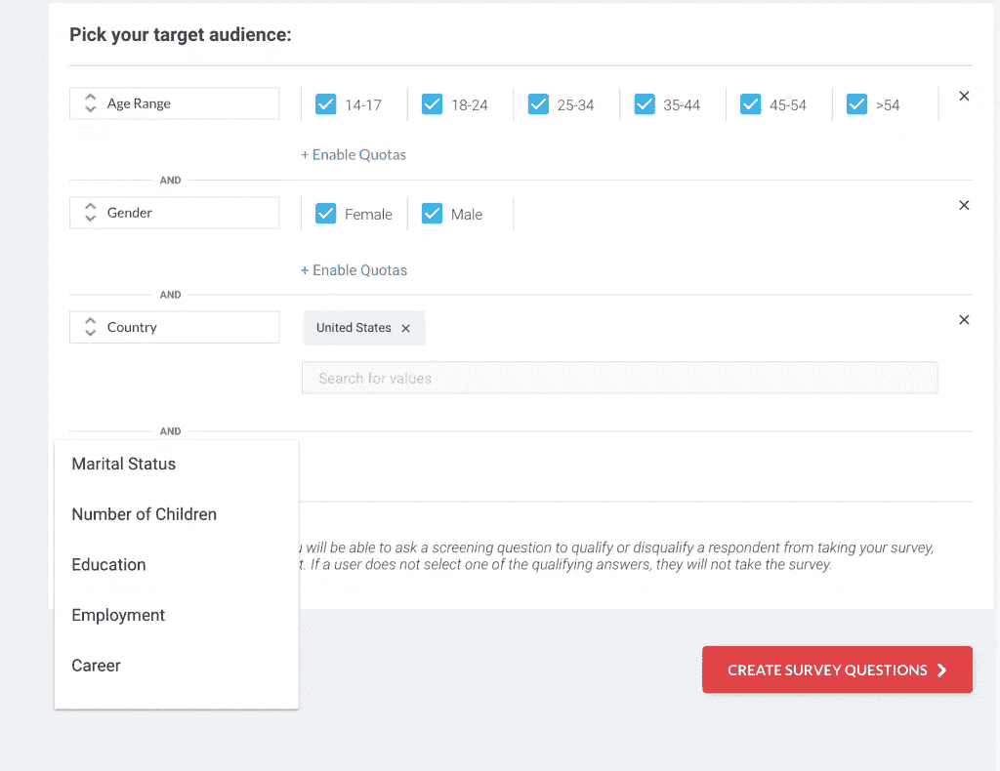

如果出版商可以获得这类信息，他们应该提前向调查平台提供，以避免用人口统计问题打扰他们的用户。

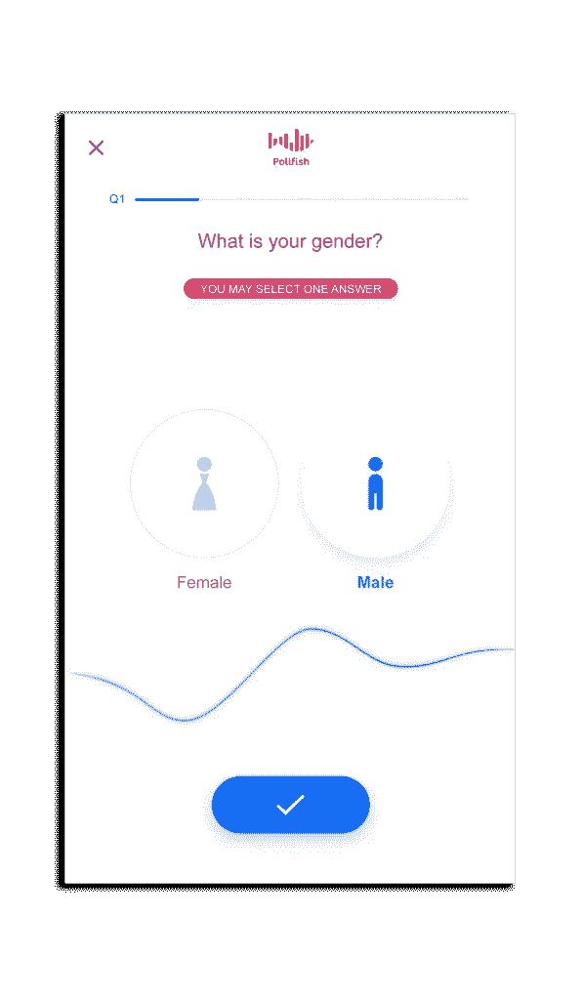

# #6.应告知用户调查的筛选结果

通过市场研究赚钱可能相当棘手，尤其是在奖励方法中。即使在用户的设备上收到调查，由于对特定问题(称为筛选问题)的回答，该用户在完成调查时也可能变得没有资格参加该调查。

例如:假设用户被提示一个问题，问他是否拥有一只狗。用户回答“否”,然后调查结束。在这种情况下，用户没有资格参加该调查活动。调查创建者的目标是寻找养狗的人，而这个用户与该活动无关，最终被筛选掉了。该用户不会获得任何奖励，因为大多数调查平台上的客户只需为完成的调查付费。

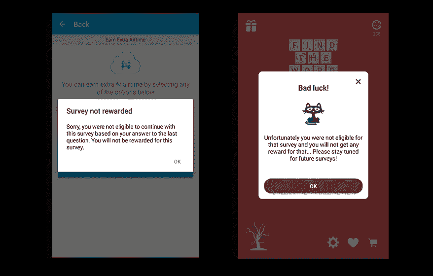

发布者应该向被筛选出来的用户发出通知，告知他们发生了什么，并尽可能透明地让用户参与未来的调查。

# #7.用户奖励应该在 s2s 回调的帮助下完成

服务器到服务器回调是在用户完成调查时发送到发布者的服务器的信息性回调。这种回调在游戏行业中广泛使用(特别是对于奖励视频)，并且已经成为行业标准，以避免用户欺诈，并保证只奖励可信和高质量的操作/完成。

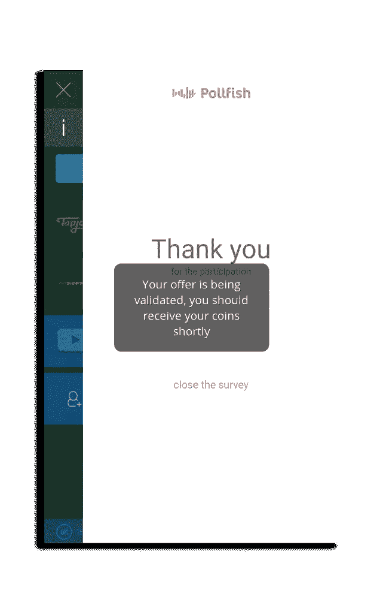

s2s 回调在默认情况下是不启用的，发布者应该启用它们并在他们的应用程序中实现相关逻辑，这样用户只有在完成调查后收到这些回调时才会获得回报。

# #8.用户喜欢调查

另一个主要的误解是，当出版商第一次被引入市场研究货币化时，他们认为没有用户会花时间在移动设备上进行调查。这实际上是完全错误的。用户不仅参与调查，而且实际上更喜欢他们比其他货币化形式。

在[最近的一项调查](https://www.pollfish.com/dashboard/results/9576/1829202153)中，超过 1200 名用户被问及相比有奖视频，他们是否更喜欢有奖调查。结果非常有趣，可以揭示这种货币化形式的潜力。

*   *“调查很有趣！”*
*   “我倾向于忽略广告，但调查更具互动性，所以我喜欢它们。”
*   “我喜欢阅读和回答调查。”
*   *“调查可能与我的生活相关”*
*   “我觉得我的意见受到了重视。”
*   *“广告花费时间太长，而完成调查花费的时间更少。”*
*   *“我讨厌广告！”*
*   “感觉像是一个选择。”

> “一个调查想知道我的想法，但广告认为他们知道我想要什么。”

# #9.调查也可用于应用内反馈

移动奖励调查是市场研究人员和营销人员接触移动消费者的方式，但它们也可以成为应用程序用户对发布者的声音。出版商应该利用应用程序中的调查功能，从用户群中收集即时反馈，以达到自己的目的。

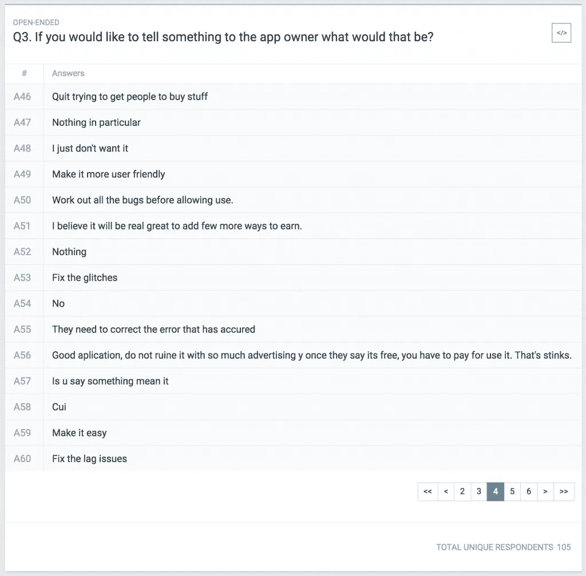

问这样的问题:在进入新的开发周期之前，您不喜欢上一个版本中的哪个特性，或者您希望在下一个版本中看到什么，实际上可以为发布者节省金钱和时间。

# **#10。调查报酬更高——优先化可以提高参与度**

正如我们前面提到的，市场行业和广告业是不同的行业。当一个用户接受调查时，它通常比任何其他广告形式支付更多的费用。奖励调查的费用比传统广告形式高出 20 倍，甚至比奖励视频高出 5 倍。当应用程序中的商店/商店部分或 offerwall 中提供奖励调查时，它们可能会相应地优先成为提供给用户的第一选项，因为他们会支付更多的费用。通过这种方式，出版商的转化率和支出可以大幅增加。

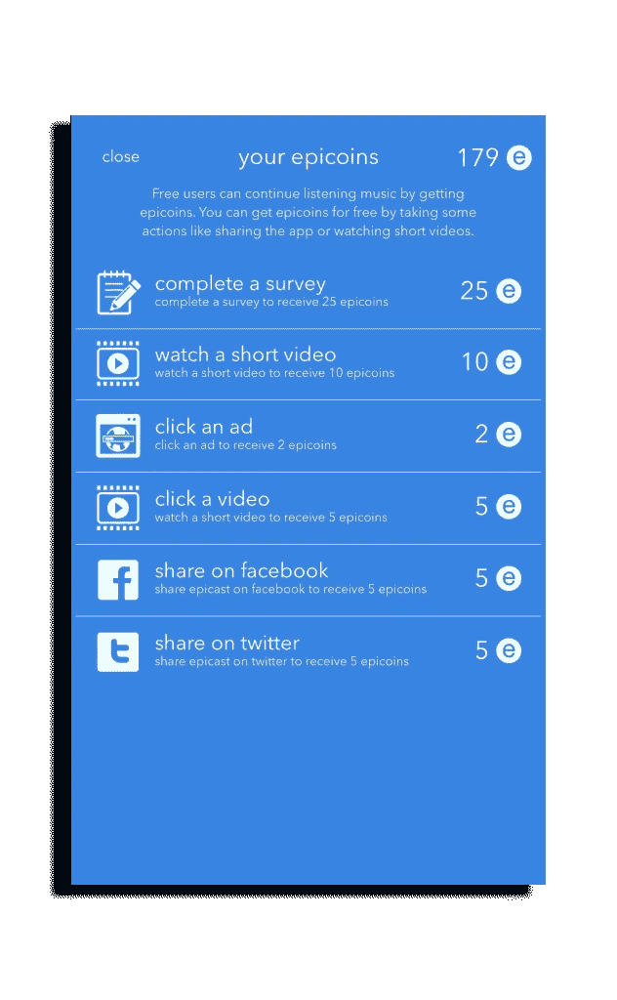

总之，市场研究和有奖调查的货币化与传统的广告货币化截然不同。出版商应该熟悉这种新的盈利模式，遵循最佳实践，并了解预期会发生什么，以便能够充分利用它。如果使用得当，奖励调查可以带来高额收入，吸引用户，为发布者收集应用内反馈，并成为移动应用收入的重要补充来源。