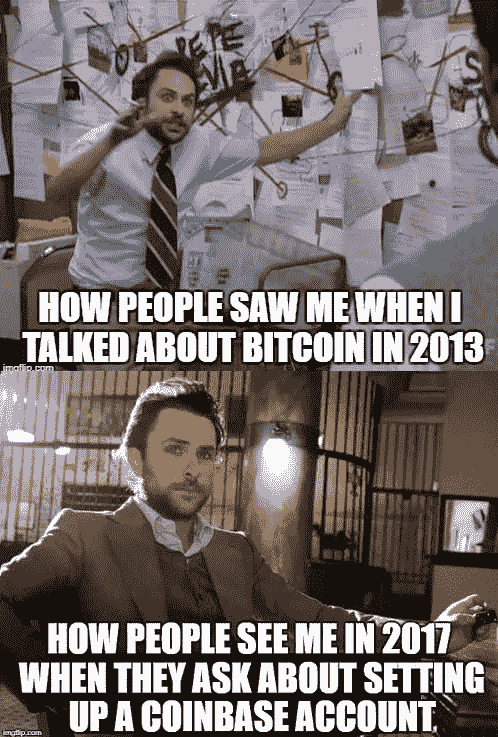
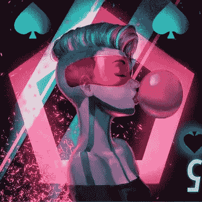
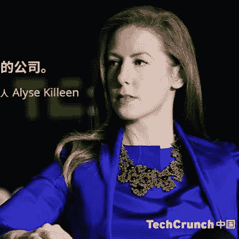
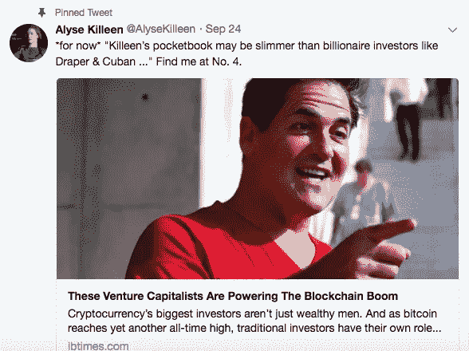
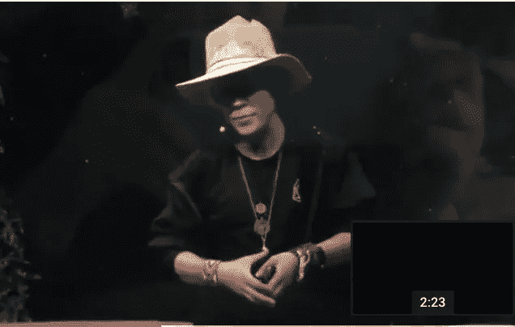
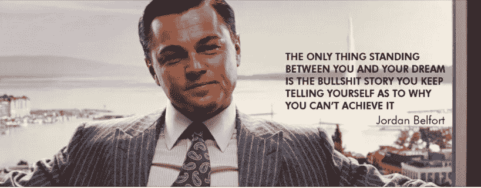

# 你需要关注的#CryptoTwitter 的 10 个有趣的人

> 原文：<https://medium.com/hackernoon/10-fascinating-people-of-cryptotwitter-you-need-to-follow-a786279a591a>

Bitcoin image from TechCrunh

# 既然比特币正在成为主流，根据 Chris Burniske 的说法，“#Cryptotwitter 是新的彭博”，是时候在 twitter 上进行一些关于比特币的严肃和充满文化基因的教育了。

Twitter 是获得比特币突发新闻的最佳地点之一。没有其他平台可以让你同时发现哪个大型加密交易所受到了 DDOS 攻击，比特币的价格，安德烈亚斯·安东诺普洛斯收到了多少捐款，以及哪个主流媒体称 Neha Narula 为“绅士”。

这个列表是不完整的，还有成吨的史诗般的加密人跟随。这个列表反映了来自不同区块链和密码学科的不同人的样本。

# 安德烈亚斯·安东诺普洛斯是比特币的卡尔·萨根。

安德里亚斯·m·安东诺普洛斯@安托普【https://twitter.com/aantonop 号

***推特简介:*** *比特币，开放区块链，安全。企业家、程序员、黑客、作家、人文主义者、和平主义者、飞行员。《掌握比特币&货币互联网*的作者

他有一种不可思议的方式来解释最复杂和最具技术挑战性的话题，这种方式对于大多数普通人来说很容易理解。

2011 年，当许多住在地下室的书呆子在互联网上摆弄比特币时，安德烈亚斯正忙着向全世界宣传比特币，并写了一些关于比特币的书。你应该看到#CryptoTwitter 家族流露出来的爱，因为他们集体向安德烈亚斯捐赠了价值数百万美元的比特币，当时他最近受到了比特币耶稣罗杰·维尔(Roger Ver)的明显抨击。

# 布鲁克是比特币之母。

布鲁克@ bitcoinmom[https://twitter.com/bitcoinmom](https://twitter.com/bitcoinmom)

***推特简介:*** *小孩太多，比特币不够。BCH 不是比特币。* [*博士 http://keybase.io/brookem*](https://t.co/AJit2lkvXx)[*https://onename.com/brooke*](https://t.co/QDLotwAu32)

Bitcoinmom 发现并转发了这样一些搞笑的东西:

tweet by: [https://twitter.com/CarpeNoctom](https://twitter.com/CarpeNoctom)

布鲁克是一个非常早期的比特币采用者，似乎知道谁是谁的加密家庭。在 Twitter 上关注她是一件幸事，因为她已经在比特币世界呆了很长时间，她在加密领域发现并分享了许多宝石。

# YT 是比特币的班克斯。

YT @ coin artist[https://twitter.com/coin_artist](https://twitter.com/coin_artist)

***推特简介:*** *利用艺术、密码学和加密货币开发数字寻宝游戏。不是男人。*[*#比特币*](https://twitter.com/hashtag/bitcoin?src=hash)

我第一次知道她的比特币拼图艺术是在一年半前做关于密码艺术家的研究时。我碰到了她设计的一个谜题，正是这个作品让我不寒而栗。去年春天，她的作品启发我为 Dash 社区创作拼图。傻瓜版的加密谜题。

据我所知，她和一小群艺术家发明了在艺术作品中隐藏密码线索的想法，这导致了比特币钱包地址。Motherboard 最近写了一篇文章，内容是关于她自 2015 年以来仍未解决的一个比特币谜题艺术作品。那个谜题现在价值 64000 美元:[https://motherboard . vice . com/en _ us/article/7 xwx7z/a-popular-bit coin-puzzle-has-expose-an-even-large-mystery？utm_source=mbtwitter](https://motherboard.vice.com/en_us/article/7xwx7z/a-popular-bitcoin-puzzle-has-revealed-an-even-larger-mystery?utm_source=mbtwitter)

# 艾莉丝·基林是金融科技领域财大气粗的玛丽·波平斯。

艾丽丝·基林[https://twitter.com/AlyseKilleen](https://twitter.com/AlyseKilleen)

***推特简历:*** *VC &作者，早期区块链投资人；fin tech Fellow*[*@ SUSS _ SG*](https://twitter.com/SUSS_SG)*；方正*[*@ cityfellow SCO*](https://twitter.com/cityfellowsco)*&*[*@ womeningenture*](https://twitter.com/WomenInVenture)*；干过 PhD-DRP out；为 4 个失败者加油&局外人*

她是那种非常聪明的人，喜欢颠覆、金融科技、基于软件的系统、医疗保健以及未来和区块链的交集。我希望有更多像她一样的人。对我来说，她是金融科技领域财大气粗的玛丽·波平斯。她是 2013 年至 2014 年最早投资基于令牌激励的软件网络的风险资本家之一。她的推特讲述了她在加密世界中如何经常被忽视的故事:

# 布洛克·皮尔斯在一个角色扮演游戏中扮演燃烧的人和比特币。

布洛克·皮尔斯[https://twitter.com/brockpierce](https://twitter.com/brockpierce)

***推特简历:*** *创始人区块链资本、EOS、Tether、比特币基金会主席—“构建自由市场解决方案，保障生命、自由、财产安全”*

布洛克来自未来。他通过混合以下元素很好地代表了未来:去中心化，完全自由，角色扮演游戏服装作为日常装备，权力从以囤积为中心转移到新的加密礼物经济。我绝对是布洛克·皮尔斯公牛队。

有趣的是，他列出了“建立自由市场解决方案以保障生命、自由和财产”的引文，因为这句引文正是来自 Dan Larimer，这位有远见的区块链工程师，曾在 BitShares、Steem 和现在的 EOS 工作。

# @mentalina 是 Crypto 的斯莱特林。

StephC-137 @ mentalina[https://twitter.com/mentalina](https://twitter.com/mentalina)

***推特简历****:*[*#比特币*](https://twitter.com/hashtag/Bitcoin?src=hash) *人类学家，美好/有用事物的制造者，职业行善者，心理学家，斯莱特林，可能性的预见者。她/她。* [*【数理统计】*](https://twitter.com/hashtag/ViresInNumeris?src=hash)

在#CryptoTwitter 兔子洞的时候偶然碰到了@mentalina。我立刻被她侧面照片的强烈感所打动。

根据她的 Twitter 简历，她是一名比特币人类学家，有一件事她似乎比任何人都了解:密码世界中的女性名人录。根据民意调查，最近的许多讨论都围绕着参与加密货币的女性人数似乎很少。我的猜测是，实际上潜伏在暗处的女性比人们意识到的要多。她最近在 Twitter 上列出的#womenincrypto 更进一步证明，在加密/区块链领域，女性确实比任何人意识到的都要多。

我的部分理由是，去年春天，我在 Dash 帮助建立了一个由女性领导的社区，名为 Dash 的女性。我发现，有很多女性生活在秘密的世界里，她们只是不太适应从秘密世界出来进入男性主导的社会空间。一旦由几名女性领导的团体成立，她们就会放松警惕，开始更加积极地参与。建立更多的群，女人就会到来。

# 狼是加密领域的莱昂纳多·迪卡普里奥

狼[https://twitter.com/wolfofpoloniex](https://twitter.com/wolfofpoloniex)

***推特简历:*** *职业*[*#加密货币*](https://twitter.com/hashtag/Cryptocurrency?src=hash) *交易员。***[*#比特币*](https://twitter.com/hashtag/bitcoin?src=hash)*[*#山寨币*](https://twitter.com/hashtag/altcoins?src=hash)*[*#日内交易*](https://twitter.com/hashtag/daytrading?src=hash)[*#投资*](https://twitter.com/hashtag/investing?src=hash)****

**狼有一个密码交易俱乐部，在他的页面上有很多密码剧。如果你想要混合着潮湿的迷因和古怪的东西的加密交易信息，狼就是你要找的人。**

****

# **Neha Narula 是 Crypto 的玛丽居里。**

**尼哈·纳鲁拉[https://twitter.com/neha](https://twitter.com/neha)**

*****Twitter 简历:*** *我从事互联网的缩放系统和平台的工作。数字货币总监*[*@ media lab*](https://twitter.com/medialab)*。PhD from*[*@ MIT _ CSAIL*](https://twitter.com/MIT_CSAIL)*，原名*[*@ Digg*](https://twitter.com/digg)*，*[*@ Google*](https://twitter.com/google)*。***

**你可能最近在电视上看过 Neha。她将作为首批向主流观众解释比特币的人之一而被载入史册。她关于货币未来的 ted 演讲是史诗般的。**

****

# **尼拉杰·k·阿格拉瓦尔是加密领域的大卫·莱特曼**

**[@ NeerajKA](https://twitter.com/NeerajKA)https://twitter.com/NeerajKA**

*****Twitter 简历:****comms*[*@ coincenter*](https://twitter.com/coincenter)*:加密货币政策智库| neeraj@coincenter.org***

**如果你在密码世界里寻找一个说话尖刻刻薄的漫画家，尼拉杰就是你要找的人。我每天都被他充满智慧和荒谬的搞笑推文逗乐。如果威利·旺卡、克里斯·洛克和大卫·莱特曼杂交，你会得到一些类似尼拉杰的东西。**

****

# **克里斯·伯尼斯克是服用了类固醇的知识分子。**

**克里斯·伯尼斯克[@ cburniske](https://twitter.com/cburniske)[https://twitter.com/cburniske](https://twitter.com/cburniske)**

*****推特简历:*** *合伙人*[*@ placeholder VC*](https://twitter.com/placeholdervc)*、medium*[*@ cburniske*](https://twitter.com/cburniske)*、曾领导*[*@ ark invest*](https://twitter.com/ARKInvest)*的 cryptoasset 努力，也写过一本关于 crypto 的书***

**我跟踪克里斯已经有一段时间了，他对未来趋势的直觉相当准确。他的核心超能力是收集和分享关于加密、区块链和其他技术学科未来趋势的信息。**

# **在 crypto 中有许许多多令人着迷的人，我将不得不写一篇第 2 部分。**

****

**on Twitter, I’m Ultimate Slothicorn**