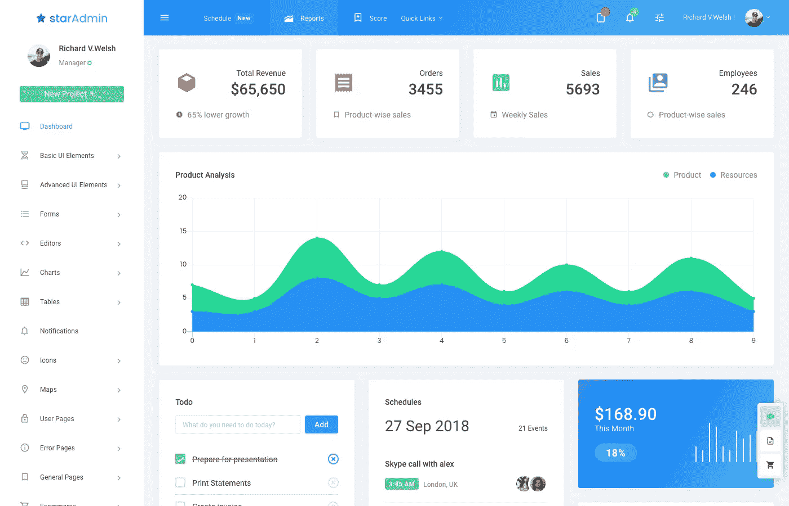
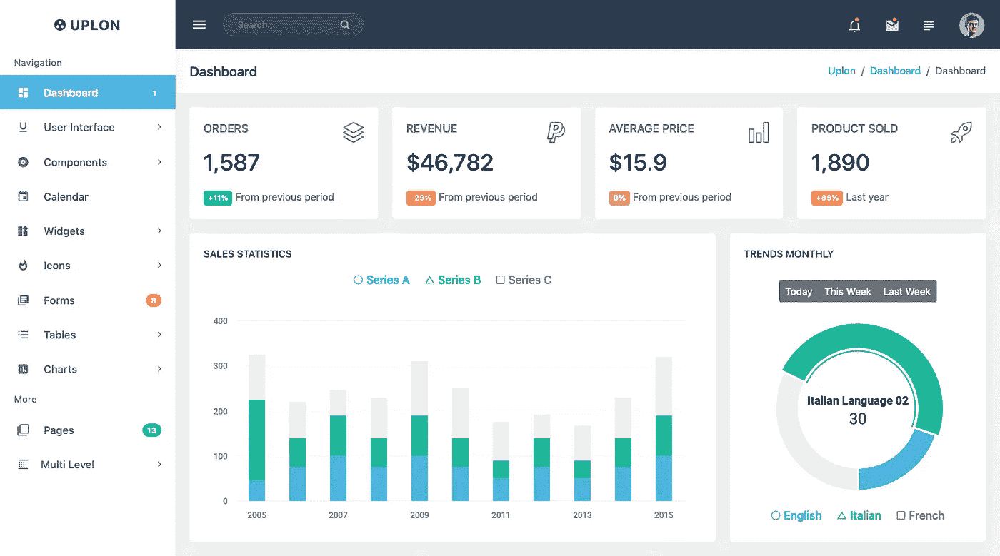
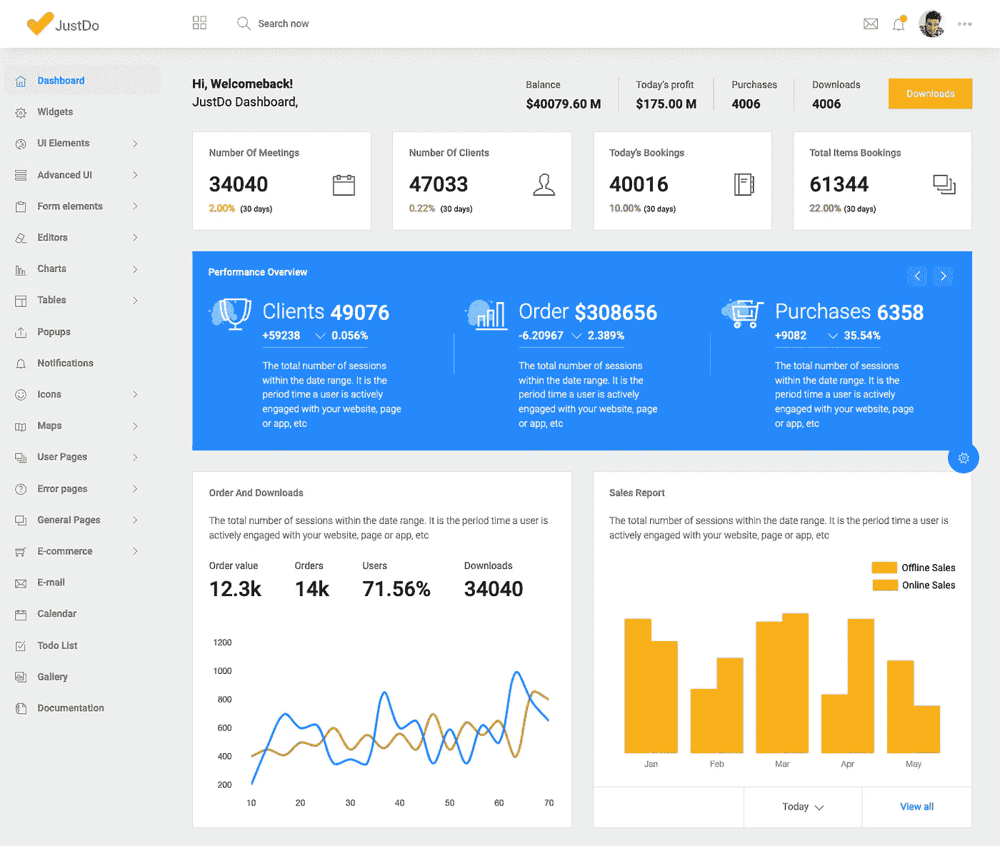
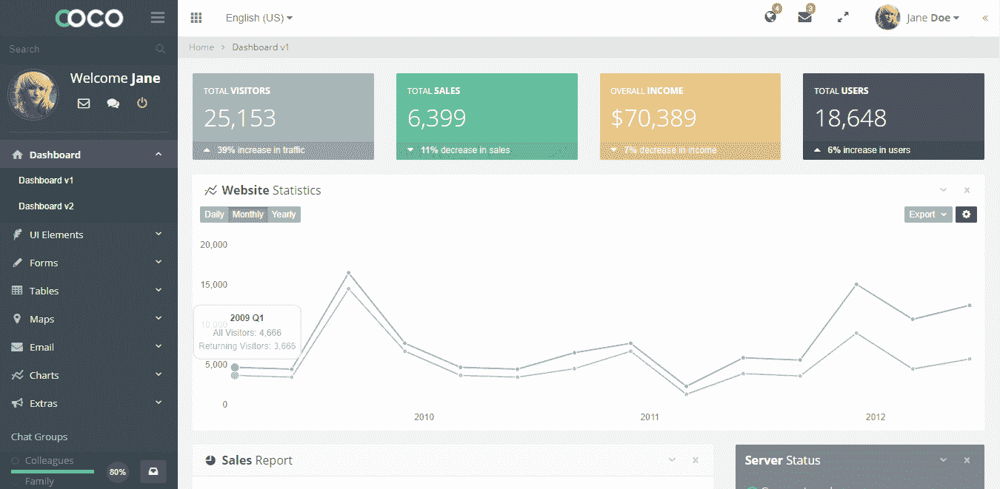
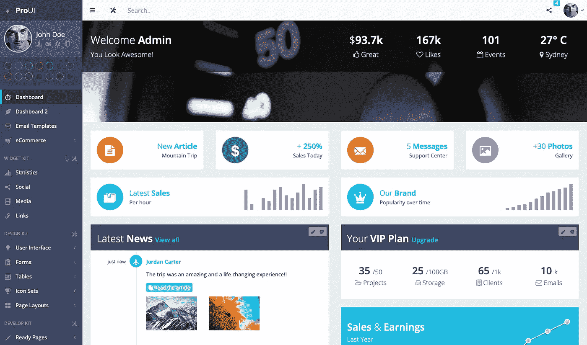
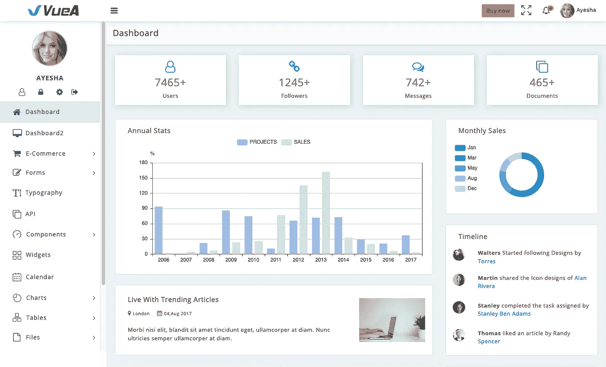
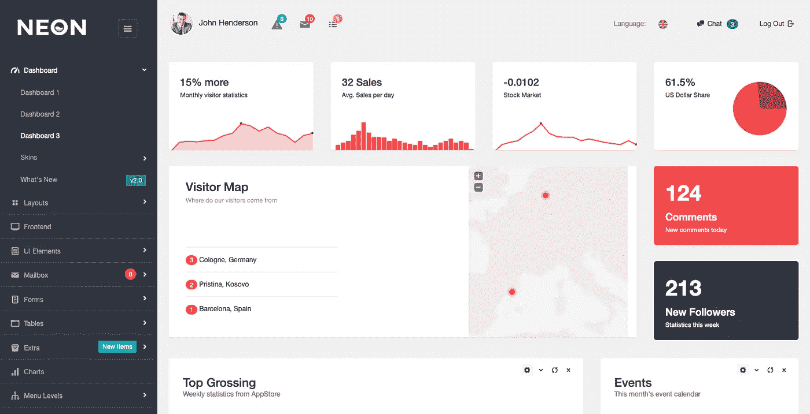
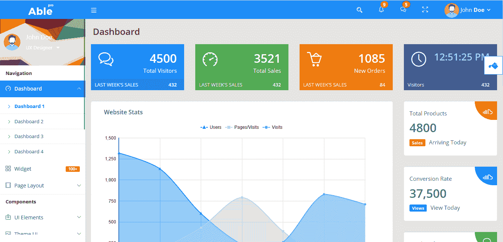

# 10 个迷人的 PHP 和 PHP 友好的管理模板

> 原文：<https://medium.com/hackernoon/10-fascinating-php-admin-templates-4acfb113db7>

完全符合您的审美情趣、功能和技术堆栈要求的管理模板可在线获得。PHP 管理模板(或包含 PHP 文件的模板)帮助您立即开始构建 PHP 项目。

如果您遇到没有 PHP 文件的引导模板，您可以选择将引导管理模板转换成 PHP 兼容版本。看看下面这篇关于如何在 PHP 中使用 bootstrap 的文章。

推荐阅读:[如何用 PHP 使用 Bootstrap](https://www.bootstrapdash.com/use-bootstrap-with-php/)和[如何集成 Bootstrap 和 Laravel](https://www.bootstrapdash.com/integrate-bootstrap-with-laravel-php-framework/)

我们已经策划了一些最好的和最畅销的管理模板，这些模板以 PHP/Laravel 初学者工具包为特色。该列表没有特定的顺序。

# 1-星级管理

明星管理将帮助您节省下一个项目的时间。这个用 Laravel 构建的 Bootstrap 4 模板有大量吸引人的元素可供选择，而且界面非常干净，非常适合您的下一个 PHP 项目。

# 2-精英

有 21 个使用各种 UI 组件和图表的演示，Elite admin template 是 PHP 项目的一个好选择。从 2000+页面模板可供选择，到庞大的配色方案集合；精英管理功能丰富，至少可以这样说。

在 ThemeForest 中评价很高，有几个优秀的评论，Elite admin 是一个很好的选择。

# 3 — OneUI

**OneUI** 是一个超级灵活的 Bootstrap 4 admin dashboard 模板和 UI 框架，支持 Laravel。它配备了智能开发工具，如 WebPack 4、Babel 7、Gulp 4、Autoprefixer 和 Browsersync，这些工具将节省您的时间，并帮助您更快、更有效地构建您的项目。

它包括一个 Laravel 初学者工具包，并打包了 HTML 和 PHP 版本。OneUI 完全模块化，具有几个独特的功能，将帮助您构建您的下一个想法。

# 4— Uplon

Uplon 是一个完全响应的高级 web UI 套件。它配备了超级干净的用户界面，许多高度可定制的即用型组件和小部件。SASS 的强大功能和简单的代码允许任何开发人员将这个主题变成真正的 web 应用程序。

# 5 — Justdo

你会立刻爱上 JustDo 引导管理模板，由于颜色，字体和。这个模板中包含的有用组件和优秀元素的迷人集合将帮助您轻松构建功能强大、响应迅速的 Web 应用程序。

# 6 —可可 7

Coco 是一个基于 PHP 的高级管理模板，用 Bootstrap 构建。模板设计精良，组件制作精良。该模板在用户界面上使用浅色阴影。模板的侧边栏是黑色的，导航栏和主要内容有一个白色的背景，这给了模板的组件和部件所需的颜色对比。

该模板的功能包括两个不同设计的仪表板，一个庞大的 UI 元素、表单元素、图表、表格、地图的集合，一个电子邮件应用程序，许多预构建的页面和两个多级下拉列表，最多三级和四级。

# 7— ProUI

Pro UI 响应引导管理模板是一个非常受欢迎的基于引导 3 的管理模板。这是一个有吸引力的，现代和平面设计的响应模板。该模板有许多组件，这些组件以适当的方式排列和组织，从而提高了它的简单性。许多组件的存在不会使模板的设计复杂化。您可以使用模板的 15 种不同的颜色主题和仪表板的两种变体来更改 web 应用程序的外观。

如前所述，该模板完全加载了一个巨大的组件、元素和小部件列表。将它们全部列出将是一项令人疲惫的任务，但是有一些组件使得这个模板独一无二。它们是可拖动的盒子，电子学习页面，错误跟踪页面，论坛页面，语法高亮组件等。

# 8 —武埃杰斯-拉勒韦尔

VueA 管理模板是用 VueJS，Laravel 和 Bootstrap 4 构建的。该模板有多种配色方案和多种布局。该模板包含过多的 UI 组件。不仅仅是创建一个全功能、全特性的高效管理模板。

该模板包含许多有用的小部件，如电子邮件和电子商务应用程序，以及日历等应用程序。有许多预先建立的网页，包括电子商务的网页。电子商务页面还包括一个电子商务仪表板。除了电子商务仪表板之外，该模板还有另外两个仪表板。

# 9 —氖

Neon Bootstrap 管理主题是一个基于 Bootstrap 3.3.5 的反应灵敏的 retina ready 管理模板。它有 9 种皮肤颜色，包括脸书主题皮肤。该模板有 11 种不同的布局，3 种不同的仪表板选项，并附带 RTL 支持。该界面拥有组织良好的组件，并采用了扁平化设计。

霓虹灯管理模板也有一个前端模板，可以帮助您为您的网站创建用户端页面。该模板为图表、表格、表单等使用各种插件。模板中的应用程序包括日历、邮箱、聊天 API、图库等。模板中的额外元素包括注释页面、portlets、时间线页面、tocify、滚动框、图像裁剪、语言选择器、嵌套列表、文件树、加载进度等。还有更多现成的页面可以帮助您尽快启动并运行您的 web 应用程序。

# 10 — AblePro

Able Pro Responsive Bootstrap 4 管理模板+ Angular 1 版本是一个响应式的 [retina-ready](http://www.fueldesign.co.nz/website-design-blog/is-your-website-retina-ready) 管理模板，具有完全加载的功能和特性。它有两种不同的版本——浅色版本和深色版本，都有水平和垂直布局。模板本身非常丰富多彩，有 5 种配色方案可供选择。它有 4 个仪表盘的变化，11 个菜单布局，你可以选择适合你的管理面板的主题。此外，如果你愿意，你可以很容易地定制外观。

该模板具有丰富的功能。首先，它有 150 多个页面，100 多个小部件，1000 多个 UI 组件，大量的图表、表单、表格等。额外的页面包括任务管理，电子商务页面，社交页面，包括社交档案，时间表，墙，消息和验证页面-用于登录，注册，忘记密码等。

