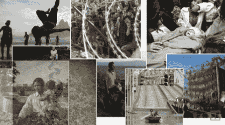

# 针对不良应用的 10 条好规则，第 2 部分- UI \ UX

> 原文：<https://medium.com/hackernoon/10-good-rules-for-bad-app-eb187b148e21>

欢迎来到我的教程的第二部分，如何构建一个糟糕的应用程序。在我们在[的第一部分](/@shemag8/10-good-rules-for-bad-app-part-1-technical-4ca18609b13c#.ymtm52sha)中构建了一个糟糕的应用程序之后，是时候叫我们的设计师来做更多的事情了:

## #1:忽略材料设计指南

谷歌，世界上最伟大的公司之一，在创造材料设计方面投入了很多努力，他们可能会做长时间的用户研究，并从许多专家那里收集反馈，但是嘿-你是工业设计学士，所以你可能知道得更多。

## #2:发明你自己的导航模式

如果脸书能做到，你也能——如果你的应用这么好，谷歌可能会放弃并改编它。

## #3:创建一个神秘的应用图标

App that let you send “Yo”, of course.

当用户需要从 40 个应用图标网格中快速找到你的应用时，这真的很有帮助。

## #4:使用你自己的图标创意

现在我说的是应用图标。我明白——你对 Android 默认的共享图标并不满意，你也没有在数百个[材质设计图标](https://design.google.com/icons/)中找到任何符合你需求的图标，那么为什么不自己创建一个完整的图标包呢？

> 额外收获:甚至不要费心给你的菜单项添加标题，这样用户就能得到文本提示。

## #5:创建介绍、叠加解释和提示

因为用户是愚蠢的(大部分是真的)，他们总是阅读你的解释(永远没有机会)

> **加分:**做一个没有跳过选项的循序渐进教程。

## #6:不支持在你的应用中集成其他应用

[Android 有一个很好的机制](http://developer.android.com/training/basics/intents/index.html)来交互应用程序之间的动作，但这对你的应用程序来说不是太好，因为这意味着用户会离开你的应用程序。当用户离开你的应用时，这意味着广告收入减少。现金减少意味着你可能不得不找一份真正的工作。

## #7:不支持将其他应用集成到你的应用中

除了前面一点——尊重其他应用程序，不要仍然取悦用户。

> **加分:**如果你最终支持你的应用程序过滤来自其他应用程序的意图——忽略上下文，只打开主屏幕而不是相关页面。

## #8:到处放动画

一个[闪屏动画](/@shemag8/pimp-up-your-splash-screen-4bf5a0dce3c7#.yee8sshra)很不错，甚至[谷歌](https://www.google.com/design/spec/animation/meaningful-transitions.html)都推荐在屏幕间移动时添加动画，而且越多越好

Is it too much?

## #9:使用 gif 而不是用代码或动画来画东西

是的，我知道，[动画制作](/@shemag8/animated-vector-drawable-e4d7743d372c#.d40uvr79p)可能会节省你几个 MB，但是你的时间更重要！

## #10:为所有分辨率创建资源

因为你只是节省时间，所以让我们浪费它。

下一次我们将讨论产品人员如何让事情变得更糟，敬请关注！

对于如何让自己看起来和感觉更糟，你有更多的建议吗？很乐意在评论中听到你的想法！

*原载于 2016 年 4 月 17 日*[*shem8.github.com*](http://shem8.github.io/blog/2016/04/17/10-good-rules-for-bad-app-part-2-uxui/)*。*

> [黑客中午](http://bit.ly/Hackernoon)是黑客如何开始他们的下午。我们是阿妹家庭的一员。我们现在[接受投稿](http://bit.ly/hackernoonsubmission)并乐意[讨论广告&赞助](mailto:partners@amipublications.com)的机会。
> 
> 如果你喜欢这个故事，我们推荐你阅读我们的[最新科技故事](http://bit.ly/hackernoonlatestt)和[趋势科技故事](https://hackernoon.com/trending)。直到下一次，不要把世界的现实想当然！

