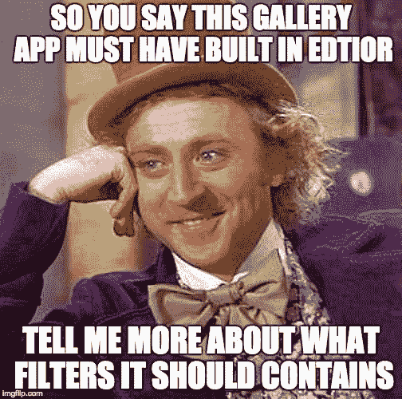

# 针对不良应用的 10 条好规则

> 原文：<https://medium.com/hackernoon/10-good-rules-for-bad-app-f90ad01b3e6c>

## 第 3 部分-产品

欢迎来到如何构建一个糟糕的应用程序教程的第三部分(也是最后一部分)。在我们在[第一部分](https://hackernoon.com/10-good-rules-for-bad-app-part-1-technical-4ca18609b13c)中构建了一个糟糕的应用程序，并在[第二部分](https://hackernoon.com/10-good-rules-for-bad-app-eb187b148e21)中显著破坏了它的外观和感觉之后，我们现在将通过 10 个步骤来轻松杀死你的产品:

## #1:添加尽可能多的功能

第一点，也是我最喜欢的一点——用你能想到的、你的每一个用户在未来任何时候都可能用到的东西来填满你的待办事项清单。让你的应用充满大量的功能(让可怜的设计师想出如何把它们都压缩到一个屏幕上)，因为我们都知道——你的用户有越多的选择，他们就有越多的自由用你的应用做事情([而不是](https://www.ted.com/talks/barry_schwartz_on_the_paradox_of_choice?language=en))。

## #2:倾听每一个反馈，并付诸实施

担心你实现了待办事项列表中的所有 492 个项目，并且想法即将耗尽？查看所有商店评论，在 twitter 上搜索一些反馈，并检查你的测试组中的所有帖子。用户是非常苛刻的动物，可能会不停地抱怨你的应用程序完全没有的那些功能，是的，即使这不是应用程序的核心，或者他们可以很容易地用其他应用程序做到这一点。

## #3:相信你的直觉，没有 A/B 测试或数据分析

因为你是项目经理，你知道你的用户想要什么，这个 CTA 按钮绝对应该是绿色的。或者红色。随便啦。

> **加分:**定期随机改变自己的观点。

## #4:添加所有可能的登录平台

每个人都在使用脸书，所以这是必须的，还要加上 Twitter 和 insta gram——让 thinks 更流行，当然还有 Google，还有 Flicker 和 Yahoo 以防万一，你还必须为那些住在火星或其他地方的人提供普通的电子邮件和密码。

## #5:支持最老的安卓版本

因为为什么不呢？你不是写代码的人。每一个用户都很重要！还有那 0.8%的用户仍在使用 2.2 版本，尽管这些设备太弱了，你的 42MB 应用可能甚至不能在上面运行。

## #6:不要翻译你的应用

因为你只针对我们，你可以接受不增长，没有人会使用它。

如果你决定翻译你的应用程序，使用低价翻译服务，这样你的翻译对非英语用户来说会很有趣。

## #7:平等对待所有用户

除了前一个——我所有的用户都懂英语，更喜欢用贝宝支付，他们喜欢拍很多照片，他们有 Gmail 账户，他们知道绿色代表积极，红色代表消极。基本上你所有的用户都是你。

## #8:不断让你的用户给你的应用打分

评论对你的应用列表至关重要，你必须让你的用户在商店里给你的应用留下好的评价和评论。尝试做任何事情让他们这样做——每当他们做某事时(也包括失败的行动后),在应用程序中提示一个“评价我们”的小部件，每周给他们发一封要求评价的电子邮件，甚至放在介绍之后，甚至在他们使用应用程序之前，一切都开始了。

## #9:利用廉价活动购买用户

用户驱动更多的用户，在应用程序开始流行之前，应该从一些核心用户开始，所以如果这些不是真正的用户，他们实际上什么都不做，人数会增加，最终这种情况会发生。

## #10:投放大量广告

最后但同样重要的是，你的应用程序应该赚钱(我认为)，你可以考虑增加一个用户会觉得有用并愿意为此付费的价值，但这太复杂了。广告是应用程序世界中最容易赚钱的方式(也是最容易激怒用户的方式)。

就这样，现在你应该能够轻松地组装一个应用程序，它将很快被埋葬在应用程序的大墓地中。

一如既往——对如何让你的应用程序变得更糟糕有更多的建议吗？很乐意在评论中听到你的想法！

*原载于 2016 年 5 月 6 日 shem8.github.com**的* [*。*](http://shem8.github.io/blog/2016/05/06/10-good-rules-for-bad-app-part-3-product/)

> [黑客中午](http://bit.ly/Hackernoon)是黑客如何开始他们的下午。我们是阿妹家庭的一员。我们现在[接受投稿](http://bit.ly/hackernoonsubmission)并乐意[讨论广告&赞助](mailto:partners@amipublications.com)机会。
> 
> 如果你喜欢这个故事，我们推荐你阅读我们的[最新科技故事](http://bit.ly/hackernoonlatestt)和[趋势科技故事](https://hackernoon.com/trending)。直到下一次，不要把世界的现实想当然！

