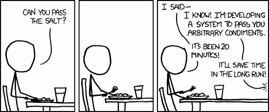

# 针对不良应用的 10 条好规则，第 1 部分-技术

> 原文：<https://medium.com/hackernoon/10-good-rules-for-bad-app-part-1-technical-4ca18609b13c>

我们都去过那里，你有了一个很好的应用程序的想法，你收集了一些反馈，甚至设法建立了一个团队，你全力以赴征服应用程序商店。因此，在开始开发你的天才鸡蛋计时器应用程序之前的一秒钟，值得花一点时间想想你将如何去做。

在切特·哈斯发了一篇关于 [10 条针对糟糕 API 的好规则](/pointer-io/this-article-is-exclusive-to-pointer-a-reading-club-for-developers-9b03f3df060c)的搞笑帖子后，我决定列出一张如何构建糟糕应用的清单。但首先要注意几个问题:

*   现在有这么多糟糕的应用，每一个都有自己的缺点，所以很难只列出 10 个。我试着尽我最大的努力去接受最糟糕的模式，但是我相信你会比我在这里说的更糟糕。
*   应用程序世界的美妙之处在于，你可以在产品的许多方面出错，这为每个团队成员提供了足够的空间来毁掉你的业务，这就是为什么我将这篇博客分为 3 个部分——技术上，UI/UX 和产品。
*   即使是好的应用程序也可以在它们的应用程序中采用一两个不好的东西，所以这不是全部或什么都没有。
*   那些坏习惯是现在的坏习惯，因为谷歌已经证明他们可以在任何时候改变这一点(就像[底部导航](https://www.google.com/design/spec/components/bottom-navigation.html)现在是一个东西？WTF？！)
*   如果应用程序在做坏事，我又能说什么呢？那是因为我已经做了这里的大部分事情，然后意识到它有多糟糕，这就是原因。
*   列表没有按优先级排序，因为很难比较你的应用在商店列表中的位置。
*   我不是切特哈斯所以这篇文章不可能有他的一半好或有趣，所以很抱歉。

说够了，让我们从列表开始:

## #1 尽可能多地征求许可

你知道你的应用程序的价值，不要让像用户隐私这样的小事妨碍你。用户请求在启动时发送这个重要的分析，所以去请求 BOOT_COMPLETED 许可吧！如果你需要分享这个美妙的网址给你用户的朋友--从他的手机里取出他妈的联系人列表，当你这么做的时候，为什么不把它发送到你的服务器上，然后给他们发垃圾邮件呢？记住——数据就是力量，别人的数据就是金钱！

**加分点:**在实现 Android M 权限的时候，不要让用户做任何事情，直到他或她接受了你的权限，即使他接受了一些，也不要让他得逞！

## #2 加载时锁定 UI 线程

嘿，伙计，我们正在加载，如果你让我们做我们的事情，不要用一些愚蠢的 ui 事件打断我们，只是安静地坐着，等待我们处理完所有这些 3.4M 的配置 xml 文件，我们会非常感激，好吗？！

## #3 不断重试

是的，我们仍在等待这个配置文件，这是你的错，生活在这个低劣的连接区域，不要责怪我们吸干你所有的数据计划和电池好吗？！

## #4 不保存活动或片段状态

你打盹就输了，你旋转了屏幕？嘣-你的表格不见了。这是教育你的用户永远不要离开你的应用程序的最好方法，即使他们只是接到一个电话。

## #5 为您的 AlarmManager 使用 setExact + RTC_WAKEUP

警报管理器是 Android 在未来某个时间执行代码的工具。关键是时间就是一切，警报管理器有一些选项，可以根据手机状态、电池、网络或其他任务灵活地启动代码并重新安排。但你可能不需要那些花哨的功能，没有什么比在早上 6 点发出“请更新我们的应用程序”通知更好的了。

**奖励积分:**将 setExact + RTC_WAKEUP 组合到同一时间，供您的所有用户向您的服务器发出网络请求，以将您的负载平衡器带到边缘。

## #6 在任何地方使用应用程序上下文

因为为什么不呢？在 *onStart* 上将你的应用程序上下文作为静态成员保存在你的应用程序类中，并在任何地方使用它——如此容易，如此简单，如此非模块化，以至于当你想调试主题错误并使你的测试成为一场噩梦时，它变得可怕。赢赢！

## #7 尽可能将错误字符串技术化

这使得当用户方面出现问题时变得容易得多，所以他们只会将消息转发给你。这也使你的应用程序对开发者友好，所以像我这样的人可以很容易地理解他们缺少 https 连接的证书，这就是为什么应用程序在共享照片时不断崩溃。

## #8 自行实施

Android 有一个非常严格的 65k 方法限制，在引入 google play 和支持库之后，几乎没有给你留下第三个库的空间。总之，处理 Json 解析有多难？你并不真的需要这个 Gson 库。这也是你的初级开发人员练习他在[工作面试](https://twitter.com/holman/status/681922317958524928)中糟糕的字符串模式匹配实现的好机会。

## #9 过早优化

很好，你刚刚自己实现了排序，可能是用桶排序，因为你知道数据会均匀分布，可能，你是这么想的…你也看到了[Romain Guy 和 Chet Haase](https://www.parleys.com/tutorial/part-1-android-performance-workshop) 的谈话(又是他？)并把所有的枚举换成常量整型，到处使用对象拉，即使这只是一次函数，因为谁知道会发生什么。

你知道他们说什么——过早优化是万恶之源，但一个更伟大的[女人也说过](http://www.goodreads.com/quotes/30725-there-is-no-good-and-evil-there-is-only-power):“没有善恶，只有权力和那些太弱小而无法寻求的人。”我希望在实现这些图形算法时，你能看到 N 的力量。

## #10 将所有内容提取到静态实用程序类

把它全部移走——Android 特有的功能、网络调用、权限检查、输入检查、非面向对象的——永远无法测试的代码——全都放在这里。

**加分:**拥有一个 Util 和 Utils 职业，因为一个是不够的，混淆是加分的！

这就是我们下一次讨论 UI 和 UX 的全部内容，还有什么让你的代码变得更糟糕的建议吗？很乐意在评论中听到你的想法！

*原载于 2016 年 3 月 31 日*[*shem8.github.com*](http://shem8.github.io/blog/2016/03/31/10-good-rules-for-bad-app-part-1-technical/)*。*

> [黑客中午](http://bit.ly/Hackernoon)是黑客如何开始他们的下午。我们是阿妹家庭的一员。我们现在[接受投稿](http://bit.ly/hackernoonsubmission)并乐意[讨论广告&赞助](mailto:partners@amipublications.com)的机会。
> 
> 如果你喜欢这个故事，我们推荐你阅读我们的[最新科技故事](http://bit.ly/hackernoonlatestt)和[趋势科技故事](https://hackernoon.com/trending)。直到下一次，不要把世界的现实想当然！

