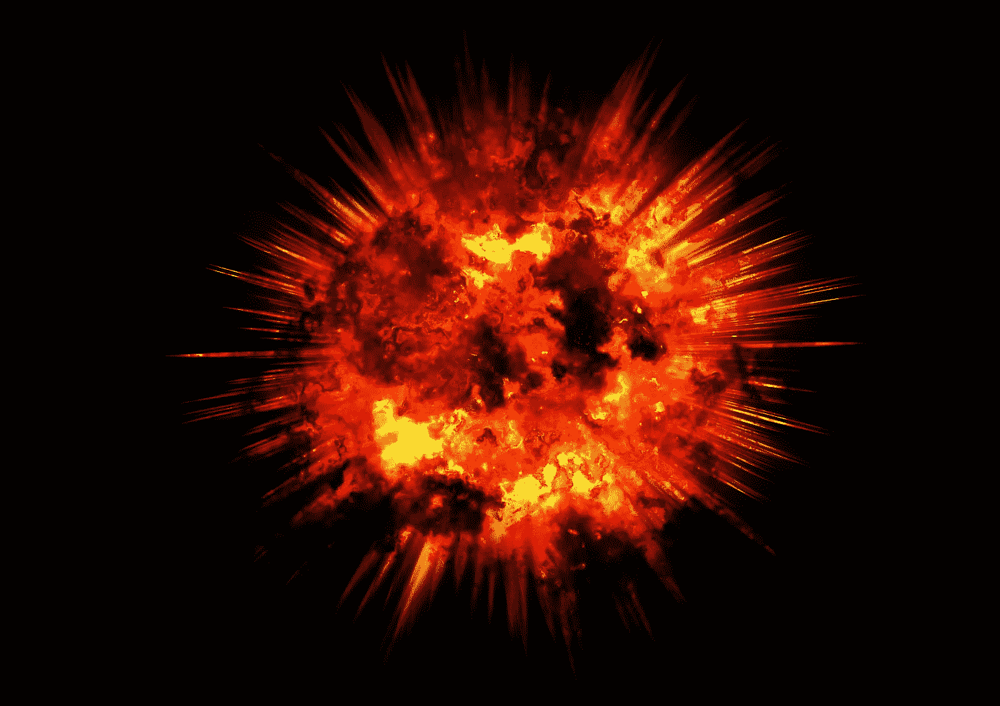
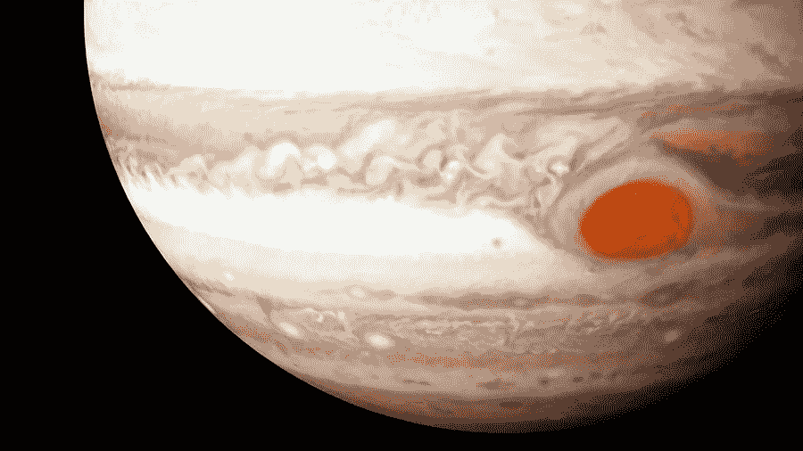
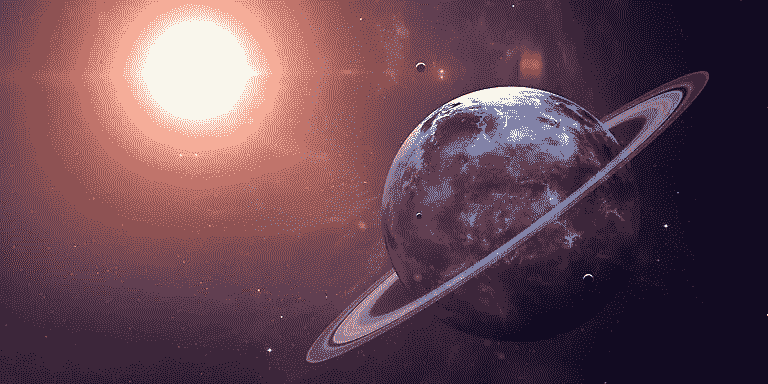

# 尼尔·德格拉斯·泰森的新书将告诉你关于宇宙的 10 件不可思议的事情

> 原文：<https://medium.com/hackernoon/10-incredible-things-neil-degrasse-tysons-new-book-will-teach-you-about-the-universe-ceb93607fff6>

## 给匆匆忙忙的人看的天体物理学会让你大吃一惊。

We love this man

*这是与* [*马克斯·雷科普夫*](https://medium.com/u/3b867339ac50?source=post_page-----ceb93607fff6--------------------------------) *(你应该追随谁！)*

在 [精装](https://www.hardbound.co?utm_source=Neil10&utm_campaign=mediumposts)，我们制作了关于商业、历史和科学[最佳书籍](https://hackernoon.com/tagged/books)的插图故事。我们最近提前拿到了尼尔·德格拉斯·泰森的新书——《为匆忙中的人们准备的天体物理学》*——哦，好家伙，让我们告诉你:太棒了。(你应该[预购](http://amzn.to/2pq9Gbc)它！)*

*当你打开封面时，你会发现尼尔的一点贡献，这与我们在精装书的使命完全吻合:*

> *“对于那些太忙而没有时间阅读厚书的人来说——尽管如此，他们仍在寻找通向宇宙的管道。”*

*为了完成这个使命，我们制作了一个关于这本书的五分钟的 tap 故事，你可以在这里阅读。但是有太多的东西需要阅读和学习，我们忍不住分享了十件只有尼尔·德格拉斯·泰森才能揭示的事情。*

*让我们开始吧👽*

**

*1科学上争论最多的时刻是万亿分之一秒长。这是大爆炸前的一刻——没有人知道这一刻发生了什么。没有任何已知的物理定律能够解释宇宙是如何从无到有地爆炸的。爱因斯坦的相对论和我们最好的量子物理学都有所欠缺。我们的宗教朋友可能会声称有上帝的干预，就科学而言，他们的猜测和我们的一样好…*

*T2 棱镜不仅仅能制造漂亮的颜色。棱镜发出的光谱包含了发光物体的大量信息。每种元素都有自己独特的光谱特征，这些标记让科学家了解了遥远恒星和星系的化学成分。通过观察隐藏在可见光谱中的明暗带，我们对遥远的地方有了更多的了解。*

**

*3 **有无家可归的明星。当星系碰撞时，数百万颗恒星挣脱了两个星系的引力。这些恒星向四面八方散开，漫无目的地在太空中漫游。在我们的宇宙中，无家可归的恒星可能和星系中包含的恒星一样多。由于一颗漫游的恒星几乎不可能被探测到，我们的宇宙可能有两倍于我们目前所能观测到的恒星，***

*4天气就是天气。在地球上产生暴风雪和暴雨的相同物理过程也在其他星球上发生。木星的大红斑是一个已经旋转了 350 多年的反气旋，其物理规律和德克萨斯州的龙卷风一样。*

**

*在太空中，你可以击掌庆祝一个质子。星系间的空间，或者说是星系之间的广阔空间，充满了令人敬畏的东西，包括超高能、快速移动的亚原子粒子。这些粒子中的大多数，质子，以 99.99%的光速行进，携带的能量足以打你的脸。*

*6 **中微子可以穿墙。**日日夜夜的每一秒，数十亿个中微子从太阳发出，穿过地球，仿佛它根本不存在。中微子躲避了科学家 40 多年，因为它们绕过了大多数物质状态，因此很难捕捉和研究。2015 年，科学家在南极捕获了第一批来自太阳系以外的中微子。*

**

*7 **地球相当光滑。如果你曾经把手伸过地球，你可能会感受到我们广阔山脉的崎岖不平的地形。然而，如果你有一只足够大的手来真正地环绕地球，它会像母球一样光滑。地球上最大的山脉，喜马拉雅山，比海底最低点高十几英里。与地球 8000 英里的直径相比，这些山脉只是地平线上的光点。***

*8 **天王星最初被命名为乔治。发现天王星的英国天文学家威廉·赫谢尔爵士最初以英国国王的名字给它命名。幸运的是，对于数百万喜欢开玩笑的中学生来说，更清晰的思维占据了上风，天王星这个名字被采用来保持传统。除了地球之外，我们太阳系的所有其他行星都是以古希腊和古罗马的神和女神命名的。***

**

*几千年来，木星一直在拯救我们。地球能够享受漫长、无灾难的寿命的原因之一是木星巨大的引力。木星就像一个众所周知的老大哥，将巨大的小行星拉离地球，并为它的小兄弟承担打击。*

*我们发现新行星有两种方法。首先，如果一颗行星真的很大，它所围绕的恒星会定期摆动。这是因为从技术上讲，行星并不围绕它们的主恒星运行，两个天体实际上都围绕它们共同的质量中心运行。在它的轨道极限，行星对太阳的引力很大，它们的重心移动很小。对于较小的行星，当一颗行星从太阳前面经过时，科学家们观察主星可以观察到亮度略有下降。从这些观测中，我们可以了解行星的大小和质量的大小，它们的轨道周期，以及与它们的宿主恒星的距离。*

**

*Each of the labeled abnormalities is a planet!*

## *但书中最重要的一点是在最后:*

*尼尔说得好:*

> *“在我们短暂停留在地球上的时候，我们欠我们自己和我们的后代探索的机会——部分是因为这样做很有趣。但是还有一个更高尚的原因。有一天，我们对宇宙的知识停止扩展，我们就有可能退回到幼稚的观点，即宇宙象征性地、真实地围绕着我们旋转。”*

*对这个世界来说，接受宇宙视角是很重要的。越多的人——包括世界领导人和儿童——理解我们在宇宙中的位置，我们就越有机会在这里世世代代生活下去。*

*像这样简短易懂的书是朝着这个方向迈出的第一步。*

*虽然你还不能购买尼尔的书，但请分享我们的精装故事，并为赶时间的人预订天体物理学。*

*宇宙危在旦夕；)*

# *PS——想看看我们关于尼尔的书的插图“tap story”吗？*

*←看看这个。*

******

> *[黑客中午](http://bit.ly/Hackernoon)是黑客如何开始他们的下午。我们是 [@AMI](http://bit.ly/atAMIatAMI) 家庭的一员。我们现在[接受投稿](http://bit.ly/hackernoonsubmission)，并乐意[讨论广告&赞助](mailto:partners@amipublications.com)机会。*
> 
> *如果你喜欢这个故事，我们推荐你阅读我们的[最新科技故事](http://bit.ly/hackernoonlatestt)和[趋势科技故事](https://hackernoon.com/trending)。直到下一次，不要把世界的现实想当然！*

**