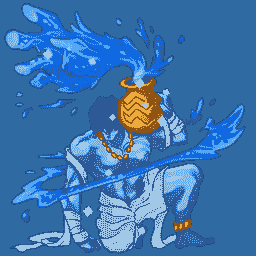
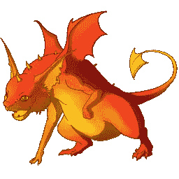
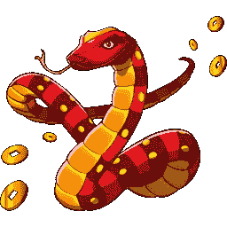
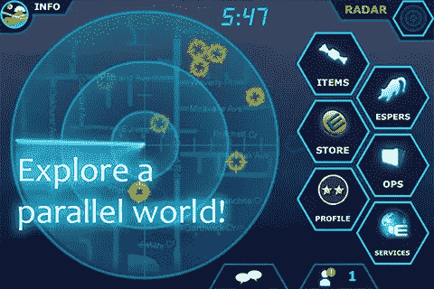

# 洛基工作室的 10 课

> 原文：<https://medium.com/hackernoon/10-lessons-from-loki-studios-e153ce2bd562>

五年前，我和一些朋友共同创立了一家公司——洛基工作室。我们筹集了一些资金，制作了一款游戏——一款基于 iPhone 的口袋妖怪式生物收集游戏，游戏背景是一个动态进化的世界，与你的现实世界环境相匹配。(是的，我把那个>投了 1000 次)。我们赚了一点钱。我们在硅谷租了一套房子(带泳池)。而我们在 2013 年被雅虎收购。

我花了很多时间处理发生的很多很多事情。我终于坐下来，把一切都写了出来，作为我自己的记录。什么是对的，什么是错的，我将来会做什么不同，等等。下面写的很多可能是众所周知的知识——甚至是陈词滥调。但这是我自己的学习和成长的集合，所以我还是写了。这是用对话的方式写的，作为对未来的我的忠告。吐完了，我想还是分享一下吧。

## **关于联合创始人**

我们从四岁开始。我们失去了两个。一个是目标错位，另一个是生活方式期望错位。一年后，我们增加了一个。

你不需要和你的联合创始人成为最好的朋友。但你确实需要相互尊重和信任。试着找一个你不同意的地方——伦理、政治、宗教，等等。*你怎么会不同意？当你周围的一切都在燃烧时，你会对 50 倍的强度感到舒服吗？*

你不需要和你的克隆人一起创建，在所有事情上保持一致。单人创业很难，因为*每个人*都有弱点。所以，当你和别人一起创业时，你会权衡彼此的优势和劣势吗？足够达到你想要达到的里程碑？你现在可能不需要财务总监，但也许你们中的一个应该知道如何使用 Photoshop。你们中的一个应该擅长对外交流。

虽然技能很重要，但是不要只看表面。你谨慎且有策略吗？你的联合创始人能成为鲁莽的声音，推动你前进吗？你声音大而且情绪化吗？你的团队中有人是深思熟虑的和安静的吗？但是请参阅上面关于不同意的注释。

## **论所有权**

不要平分所有权。是的，每个人都告诉我们这个。我们还是做了。我们是斯坦福大学计算机系的毕业生，在经验方面没有什么不同。怎么可能会有别的结果呢？？

无所谓，不做。如果有必要，一起工作几个月。看看你们每个人准备为公司做些什么。

## **关于监听用户**

你最直言不讳的客户代表了你公司的 1%,在一个数量级内。不管怎样，都是少数。

*听听他们的* —他们代表了将会传播消息的早期采用者；宣扬你的胜利；否认和诅咒你的错误。

不要听他们的——他们代表了早期采纳者，代表了你的用户群的极端。我们预计 Geomon 将在 2-3 个月内可以玩。一些用户在一个周末达到最高级别，并渴望更多。[为你的狂热者提供的最终游戏特色不会帮助你的游戏成长](http://andrewchen.co/the-next-feature-fallacy-the-fallacy-that-the-next-new-feature-will-suddenly-make-people-use-your-product/)。

(有趣的事实:我们非常重视吸引用户，并以游戏中角色的身份回复每个用户——相当于橡树教授。每封邮件的开头都是:“嗨，外勤特工！感谢您联系我们……”)

## **关于用户讨厌改变**

这个大家也都知道。但是我在这里重新迭代一下。无论你是添加一个新功能还是改进你的图形，一些非常直言不讳的用户总是会批评你。非常公开。考虑反馈意见。做你认为最好的事。向前看。

## **关于构建游戏(主要是为像我一样的终身游戏玩家)**

制作游戏是我一生的梦想。我们玩的每一个游戏，我和哥哥都会反复思考如何改进游戏，或者什么样的角色会让游戏变得很棒。这表明了一个可怕的游戏基础。当你构建了一个内在逻辑和乐趣的游戏，任何人——每个 8 岁的孩子——都可以想出如何改进的好主意。

我们艰难地认识到，开发一款基本上完美的游戏是极其困难的。应该存在多少元素？12 听起来是个不错的整数。没有。太复杂了，没人记得什么对抗什么。应该收集多少经验来升级，允许一个良好的进展感觉，同时也不要让人们太快到达游戏的终点？这个世界应该在多大程度上是动态的，对你的行为有多大反应？为了确保良好的第一次体验，游戏中有百分之多少应该是“正常的”和脚本化的？你如何确保单人模式对那些喜欢 PvE 的人来说是有趣的，而多人模式从长远来看是令人愉快的？

我们花了数百个小时与游戏中的顶级玩家互动，他们比我们自己更了解新发展的战略和战术。游戏玩家聪明伶俐，在互联网、论坛和指南的时代，新的边缘案例战术像野火一样蔓延，可以迅速破坏你游戏中不稳定的平衡。有上百个方面需要一个专门的游戏架构师。我们一头扎了进去，拼凑了一堆听起来很棒的机制，之后不得不返回以确保游戏的连贯性。

## **月收入**

我“成长”在一个网站和应用似乎可以忽略收入的时代。只要你像野火一样扩大用户群，就会有热切的投资者提供资金支持，让你进入下一个增长阶段。你可以在没有盈利的情况下首次公开募股。我们花了 18 个月的时间，没有在收入方面投入太多精力。我们在舒适地成长。当人们决定消费时，我们在周末和节假日是盈利的。但这不是我向投资者、员工或自己承诺的轨迹。这不是曲棍球棒的乐土！

所以我们花了 6 个月专注于收入。通过大量的研究、实验和努力工作，我们实现了拉面的盈利(赚了足够的钱来养活我们自己的比萨饼和速食拉面)。如果我们早一年开始，谁知道会发生什么？如果没有我们开发游戏的前 18 个月，货币化可能永远不会成功。话说回来，也许我们已经进入了一个健康、有利可图的增长循环，让我们能够创作出我们最初设想的系列游戏。谁知道呢？？

## **在设计上**

所以…设计很重要。很多。我们有一个很棒的想法，我们推荐的每个玩家都被三个词打动——“iOS 版口袋妖怪”。但是说实话，当他们看到我们的比赛时，我清楚地记得那些略微扭曲的脸上隐藏着几乎不加掩饰的失望。我们的游戏很有趣！但是我们拒绝了很多主流游戏玩家，当他们看到我们设计的极客图形时。到了第二年，我明白了重新设计我们的游戏是非常重要的。但这很难。有几十个页面需要重做，我们可能会失去十万个用户(参见“用户讨厌改变”)。太少了，太晚了，而且没有人对视觉设计有经验。所以…下次吧:)

The concept was awesome (in my humble opinion). The design did not appeal to the mainstream.

## **谈创业**

我们创办了这家公司，因为我们对这个游戏的概念非常兴奋。我们希望它存在。我们想玩它。我们为此花了一个夏天，放弃了暑期实习和薪水。这太有趣了，我们辍学继续研究它。我们靠之前实习的积蓄活了下来。当一位联合创始人退出时，我们其余的人凑了钱。当钱用完的时候，我筹集了一些钱。当我们跟不上工作时，我们雇用了更多的人。

这就是说…我们做这些并不是为了*创业*。我们这样做是因为我们想创造一些我们真正感兴趣的东西。如果没有这些，我不认为我们能够克服障碍、失望和紧急情况。我在 2.5 年里活了十年。我长了很多白头发(真实故事)。如果我将来做另一个项目，那将是我找到另一个像这样的激情的时候。

## **组队**

他们说的都是真的。当你经历最艰难的时候，你的团队就是你的全部。一份好工作的价值是一份体面工作的 20 倍。不要退而求其次。借用智者的一句话，当你采访某人时,“如果有任何疑问，那就没有疑问。不招。”

## **寻求帮助**

我多次得到了很多人的帮助。每一个可以想象的主题。我认为我没有采取适当的措施来感谢许多相关人员。我希望采取措施来补救。谢谢你拉维教我如何筹款。谢谢肖恩给我们上游戏设计课。谢谢你，詹姆斯，教会了我一些艺术知识——很遗憾我们没能有更多的机会一起工作。感谢凯蒂、约翰、凯尔、蒂姆、艾米、安妮、理查德和杰里米，感谢你们帮助设计我们的生物和世界。感谢丹、杰西卡和杰森在测试游戏早期版本时给予的帮助。谢谢友凯帮助我们建立竞争环境。谢谢达蒙和亚历克斯，是他们的介绍改变了我们的职业生涯。感谢奥苏克、亚瑟、乔什、马特、奥斯曼、大卫和米格尔相信少数小人物。谢谢爸爸，妈妈，克里斯，还有我所有的亲戚和朋友，我在经历这一切的时候依靠他们。感谢我们的用户支持我们的梦想。感谢这个团队——克里斯、布赖恩、萨姆、吉恩、巴特、杰斯、拉斯、马尔科、胡安和里科，感谢他们在这令人难忘的几年中所做的贡献。

> [黑客中午](http://bit.ly/Hackernoon)是黑客如何开始他们的下午。我们是 [@AMI](http://bit.ly/atAMIatAMI) 家庭的一员。我们现在[接受投稿](http://bit.ly/hackernoonsubmission)并乐意[讨论广告&赞助](mailto:partners@amipublications.com)机会。
> 
> 如果你喜欢这个故事，我们推荐你阅读我们的[最新科技故事](http://bit.ly/hackernoonlatestt)和[趋势科技故事](https://hackernoon.com/trending)。直到下一次，不要把世界的现实想当然！

