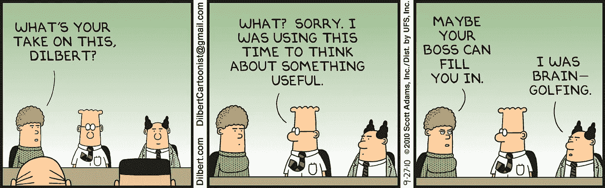

# 每个工程师都必须知道的 10 个企业术语

> 原文：<https://medium.com/hackernoon/10-more-terms-every-engineer-must-know-enterprise-edition-71829422b257>

无论你是刚刚起步还是经验丰富的工程师，这个系列都将揭示高科技行业中使用的各种术语。你可以在这里找到第一个帖子:[每个工程师都必须知道的 10 个术语](https://hackernoon.com/10-terms-every-engineer-must-know-cd71e828f4ad)。

# 资本支出

资本支出。会计术语，用于描述对企业某些资产的一次性投资。它可能是一个新的办公室，IP，或者是一个摇摆的[工程](https://hackernoon.com/tagged/engineering)团队的一打新的 MBPs。

大多数业务费用是免税的，最终为公司节省了一些钱。然而，资本支出扣除需要在你购买的东西的预期寿命内摊销。因此，除非价值明确，否则这种购买可能比收益更令人头疼。

# OPEX

运营费用。会计术语，用于描述产品的持续成本。因此，每月为网飞支付 9.99 美元是运营支出，购买 100 万张 DVD 是资本支出。

不仅每月一次的小额采购更容易理解，而且当年的运营支出也可以免税，这使得这种采购比资本支出更有吸引力。这就是 SaaS 工作的原因。

# SaaS

[软件](https://hackernoon.com/tagged/software)即服务。你不必今天就花 100 万美元在余生观看《网飞》,你只需支付少量的月订费，就可以与其他客户分享同样的软件服务。你笔记本电脑不装，观影软件在线，公司管理。

# 财政年度

表示公司财政年度的时间段。它不一定要与常规的日历年相匹配。有 4 个季度— 3 个月。

# FCPA

反海外腐败法。不要贿赂外国官员。不要送礼物。不收礼物。

# 只读存储器

大概的数量级。做某事的大概成本，例如一个项目，一个特性。

看着这个装满彩球的浴缸，你觉得里面有几个？1000 还是 10000？现在你在 ROM 中思考。

# 月初（beginning of month 的缩写）

材料清单。制造一件产品所需的所有单个零件、原材料及其数量的清单。从字面上看，它不是作为与这些部件相关的成本“清单”，而是一种查看产品中所有内容的方式。

一般适用于五金商品。对于软件，BOM 将描述该软件中所有的共享库和组件。

# 播种

工作说明书—通常提供给特定项目的承包商或供应商。一份详细的文件描述，“这是问题，这是你将要做的，这是我们将如何衡量成功，在这个日期之前完成”。

# 刻苦用功的人

SWOT 分析。描述产品或业务战略的优势、劣势、机会和威胁的四象限网格。

# SMART(目标)

产品或业务战略的具体、可衡量、可实现的相关时限目标。

# 奖金:B2B，B2C

B2B:企业对企业。顾客是其他企业的企业。B2C:企业对消费者。顾客是普通人的企业。

如果你觉得这很有用，推荐给你的追随者。

> [黑客中午](http://bit.ly/Hackernoon)是黑客如何开始他们的下午。我们是 [@AMI](http://bit.ly/atAMIatAMI) 家庭的一员。我们现在[接受投稿](http://bit.ly/hackernoonsubmission)并乐意[讨论广告&赞助](mailto:partners@amipublications.com)机会。
> 
> 如果你喜欢这个故事，我们推荐你阅读我们的[最新科技故事](http://bit.ly/hackernoonlatestt)和[趋势科技故事](https://hackernoon.com/trending)。直到下一次，不要把世界的现实想当然！

