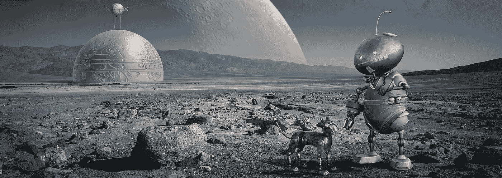

# 对未来的 10 个随机想法

> 原文：<https://medium.com/hackernoon/10-random-thoughts-of-the-future-f5da05ee3a56>

每天我都试图想出 10 个主意。有时有趣，有时发人深省，而且往往相当愚蠢。关键是让大脑思考，锻炼大脑肌肉。通常我会提出商业或产品创意，但今天我会改变一下形式。今天将是关于未来世界的，我认为有一天会成为现实。目前严格来说，这些都是不可能的，但是没有一个被物理定律所排除。任何可能的事，总有一天会成为现实。

1.  狗智力增强植入物，将允许你的狗自己走路。人类智力的增强已经是板上钉钉的事了，最多在 20-30 年内就会实现。但是我们忠实的同伴呢？有一天，我们将在狗的大脑中植入微芯片，让它们能够理解基本语言，自己行走，并在日常行走中安全地导航未来的世界。该植入物甚至可以将主人的增强现实图像投射到狗的眼睛和鼻子中，使它们在走路时感到更安全。
2.  Pteradactil 出租车。目前还不清楚人类技术的下一个重大突破将来自哪里。这可能是机器人和人工智能领域的“金属”革命。但也有可能是生物学和生物技术。因此，有一天，如果你需要搭车去海滩，你很可能只是想一想，你的智能增强(IA)植入物就会召唤一只会飞的翼龙，它会飞下来，用它的爪子轻轻地抱起你，带你舒适地到达目的地。
3.  第三人称视角生活体验。我们习惯于以第一人称视角看待自己的生活，但在电子游戏中，人们更喜欢第三人称视角并不罕见。有一天，有了 IA，一些人将能够通过在他们的房子和外面安装摄像头来体验他们的整个生活。例如，想象一下穿过一个繁忙的机场，但通过安装在天花板上的摄像机镜头或在你身后飞行来体验它。现在这可以在 VR 中完成，但有一天人们可能会选择以这种方式在现实中生活。
4.  演员、配音演员以及所有参与电影行业的人的工作也可能很快会消失。目前，电影制作最终是一项合作努力，即使是一部相对较小的电影，也有数百人参与。然而，在未来，电影制作可能更像写作，一种个人追求。有了人工智能生成的声音表演和 CGI，以及人工智能与计算机的接口，导演只需想一想，就可以编写、导演、提炼、渲染和出版一部电影。如果他们能想象，它就能被记录、渲染和出版。这种技术，当然会马上用于色情。
5.  但是，为什么要停留在用思想制作电影，而事实上，我们真正想做的是利用电影或书面世界这样的障碍来相互传递思想。在未来，电影和书籍可能真的会演变成想法。一个作者会仔细思考一个想法，用他们的 IA 把它转录成一种想法定义协议，仔细检查，然后分发它。给定想法的观众或读者(消费者)会让他们的 IA 将想法转化为感觉和理解。这就像是在没有实际观看的情况下观看了《大勒波斯基》一样。这可能是人类成为单一有机体的第一步，但在以后的文章中会有更多的介绍。
6.  有一件事是清楚的，在不久的将来，也许 100 年后，尽管我个人认为比那更早，人类的劳动将变得毫无价值。我所说的“无价值”是指，执行人类能够完成的几乎所有任务所需的热量，将超过让一个机器人人工智能以同等质量、创造力和效率执行同样任务所需的能量。这是必然的。现在，我没有幻想我们离开发强大的人工智能只有一步之遥，我们没有。但是我们目前做的大多数任务，包括创造性的任务，都可以由专门的 week AIs 来完成。因此，未来人类将不会有太多工作。人们“会找到更好的工作”的神话是由那些不理解人工智能或劳动经济学或两者都不理解的人传播的，或者只是决心把他们众所周知的头埋在沙子里，直到为时已晚。无论如何，就未来世界的理想经济安排而言，我没有太多东西，但有一点我知道:竞争是幸福的关键。人们有竞争的生理需求。当我们为了生存、资源或繁衍而竞争时，这以一种丑陋的方式表现出来。但如果是为了纯粹的竞争，比如在奥运会上，它也可能是美丽的。也许世界经济的未来将会是世界范围内的竞争，在每件事情上都成为精英中的精英。好的，这不是一个很好的想法，因为这很难。但这是一个我喜欢思考的想法，也很想听听大家的意见。
7.  从更光明的一面来看，明天的伦巴很有可能是住在你客厅角落里的蚁群。再说一次，在生物技术和机器人技术的战争中，不需要选出赢家，某种微小的合作生物，晚上出来打扫你的房子，将会是未来。这些蚂蚁将被预先编程，在你外出或睡觉时，在你的房子周围四处活动，收集灰尘、污垢和消毒表面。
8.  但是虫子级别的机器人技术不会局限于你的客厅。机器人虫子很有可能成为未来的园丁和农民。举例来说，如果你能设计一个微小的能自我复制的机器人在晚上出来，爬到离地面 2 英寸高的草茎上，咀嚼草茎，然后把刀片的剩余部分拖成一堆，为什么要机械地割草呢？这当然是假设我们仍将从事浪费大量水来种草的荒谬努力。但是同样的技术将被用于从苹果树上收集苹果，除草和收集农作物。成群运行的微型机器人是未来。
9.  当然，由于人口过多仍然是一个被认为政治上不正确的禁忌话题，我们不太可能解决这个存在性问题，这可能会导致一个不是生活在虚拟现实中而是非常富有的人的特权的世界。想想看，有一天，在现实世界中度过一生，最终变老并死去，这将是只有非常有特权的人才能渴望的事情。只是一个有趣的想法，有时会在我脑海中浮现。
10.  借助增强现实和强大的人工智能(可能只是无缝集成的弱人工智能与你的大脑互动以获得灵感火花的组合)，你可能能够保留或复活你童年想象的朋友。想象一下，有一天为你想象中的宠物龙安排一个玩耍的日子。这是可能的，因此，总有一天，它会成为现实。

大家劳动节快乐！