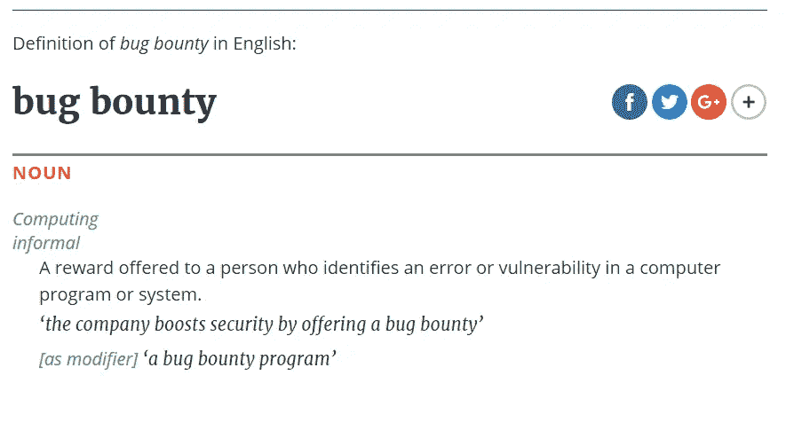
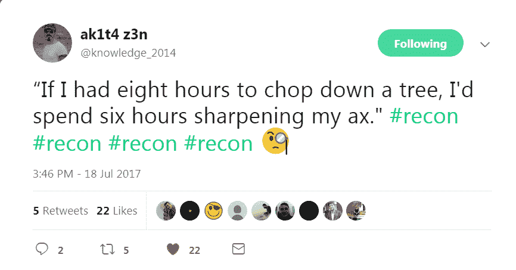

# 虫子赏金的 10 条规则

> 原文：<https://medium.com/hackernoon/10-rules-of-bug-bounty-65082473ab8c>

*   [*秋田禅*](http://hackerone.com/ak1t4) *和* [*Me*](https://hackerone.com/kiraak-boy) *愿意分享我们个人的观点和成功猎捕 Bug 的秘诀。*

[https://en.oxforddictionaries.com/definition/bug_bounty](https://en.oxforddictionaries.com/definition/bug_bounty)

***1。瞄准 Bug 赏金程序***

*你的目标计划是多长时间？*

如果答案只是几个小时或一个晚上，那你就错了。捕虫是技巧和运气的问题。花几个小时在程序上可能是浪费，因为这些错误大部分都被报告了。你可能会因为重复而变得沮丧，建议你至少选择任何一个项目花一周的时间。大虫子需要时间。花点时间了解应用程序的功能。坚持记录和跟踪可疑端点。

因为除非你很早就报道，否则你不会从已知的问题中获得很多。如果你在一个公共项目启动 10/12 小时后才发现它。不要浪费你的时间去寻找已知的问题或唾手可得的成果。只需深入应用程序。

**2。你如何接近目标？**

如果答案只是在 Target 注册，检查像 CSRF、XSS、子域等的漏洞，那么这可能是你最终得到许多重复或没有得到任何 bug 的问题。建议首先检查他们的文档。侦察目标。了解目标中用户的功能&权限。在开始攻击前至少 1-2 天，侦察，检查他们的文件，收集信息。

[Ak1T4](https://medium.com/u/c5b622272cd5)

***3。不要期待什么！***

我们相信这是 bug 猎人在报告 Bug 后最常做的事情，他们期望即将到来的奖励金额。不要期待任何事情，只要关闭报告，开始寻找其他错误，因为这可能会让你难过。

如果你认为你会在几个小时或几个晚上之内找到虫子。这可能每次都有效，也可能每次都无效。取而代之的是，你可以形成一种心态，可能是“我要用整整一周的时间去捕捉虫子，让我们保持 100 美元的目标”。相信我，你会在周末完成目标金额的 10 倍 *，结果会是幸福的。*

一些严重程度高的 bug 可能会得到平均水平低的奖励，不要对他们大喊大叫，只是礼貌地问他们奖励决定的原因是什么。更重要的是，对自己的发现感到高兴和感激。

*试着接受这个* ***“有时我们可能会因为小问题得到意想不到的回报，但对于严重程度高的问题，我们也应该接受较少的金额”***

***4。关于漏洞和测试方法的知识较少:***

这也是很多新赏金猎人在没有基本工作知识的情况下开始寻找 bug 的常见情况。我从自己的个人经历中学到的是，你将会知道应用程序是如何工作的，除非你知道它们是如何构建的。在开始破解应用程序之前，有必要先了解如何用 [*编程*](https://hackernoon.com/tagged/programming) *语言构建应用程序。*

***5。让自己置身于 Bug Bounty 社区，让自己保持更新。***

*1。创建 Twitter 句柄并进入 Hackerone 排行榜:*

****e****

***2。逐一访问他们的 Hackerone 个人资料，并在 twitter 上关注他们，这同样适用于 Bugcrowd 和其他平台。这样你就可以被 Bug 猎人的* [*安全的*](https://hackernoon.com/tagged/security) *研究员的包围了。***

***3。继续做书签。***

***4。* [*摘自《钢琴师》披露的活动****【http://h1.nobbd.de/】***](http://h1.nobbd.de/)**

***5。加入 Slack 上的*[***Bug Bounty World***](http://bugbountyworld.com)*继续阅读他们的博客、工具、通用频道和他们的测试对话，分享你所知道的。***

*****6。自动化:“自动化就是力量。”*** *如果你想把事情自动化，你需要学习“脚本”。* *强烈推荐学习一些编程语言。一些最好的脚本语言有:* ***JS、PYTHON、RUBY、bash、*** *即使知道一些 curl 技巧或基本的 BASH 命令脚本，您也有能力自动化许多任务！***

*****“黑客是一门来自自己创造的艺术”。*****

*****7。获得赏金还是获得经验:*** *作为一个 Bug 猎人的，有时候我们会因为没有获得赏金而感到难过。然而，我们总是获得经验，知识和你的技能得到提高。这样看待 bug bounty，让你的动力一天比一天高涨。我们的很多生活都是由情绪构成的，是关于你每时每刻如何感受你的生活，做所有让你开心的事情:所以！如果你有虫子奖励，开心点！开心点！这就是本质！我每天在难过或者没有动力的时候都会想起自己:嘿@ak1t4！发生了什么？记得享受这个！***

*****如果你没有得到赏金，你得到的是知识和经验，所以你总是赢！*****

***8。* ***找到“BUG”或找到“BUG 的链”:*****

**如果你发现了一个 BUG，问问你自己:对应用程序的安全有什么影响？你可以开始狩猎，并在你的脑海中有 ***【找到一个 bug】****的概念，或者你可以跳出框框，用* ***【寻找最佳影响】的概念开始狩猎。*** *第一个概念是完全孤立的，第二个概念拥抱一个更大的观点。***

*****“留在山谷或者努力认领这座山，看一个大全景。”*****

****9*。跟随大师之路:*** *我每天都问自己如何进一步提高我的技能，然后我去搜索令人敬畏的黑客的博客或我能找到的最好的文章。最好的黑客激励我们成为更好的自己。***

*****“我每天的灵感都是那些突破自己极限并获得成功的人。”*****

*   **[*检测博客*](https://blog.detectify.com/)**

*   **[*fin1te: Bug 赏金参与者*](https://fin1te.net/)**
*   **【maKthePla.net】T5[T6](https://makthepla.net/blog/)**
*   **[*安全&代码博客*](https://bitquark.co.uk/blog/)**
*   **[*VYSEC*](http://vincentyiu.london/wordpress/)**
*   **[*PWNHACK*](https://pwnhack.com/)**
*   **[*菲力浦·海尔伍德*](http://philippeharewood.com/)**
*   **[*阿恩·史文宁的安全博客*](https://www.arneswinnen.net/)**
*   **[*hacks 4 pancakes*](http://tisiphone.net/)**
*   **[*NahamSec.com*](http://archive.nahamsec.com/)**
*   **[*丹尼尔*](http://danlec.com/blog)**
*   **[*我们黑掉人*](http://wehackpeople.tumblr.com/)**
*   **[*IT-Securityguard 博客*](https://blog.it-securityguard.com/)**
*   **[*被误解的 X-XSS-保护*](https://blog.innerht.ml/)**
*   **[*虫餐赏金调查结果*](https://seanmelia.wordpress.com/)**
*   **[*尊重 XSS*](https://respectxss.blogspot.com/)**
*   **[*婀娜安全！*](https://www.gracefulsecurity.com/)**
*   **[*愚弄解释者*](http://brutelogic.com.br/blog/)**
*   **[*Klikki Oy*](https://klikki.fi/)**

*****10。放松享受生活:*** *真正的成功发生在你享受平衡的生活时。你的身体和大脑需要充分的休息来超越自己的极限。如果你花了很多时间打猎，关上你的笔记本电脑，到外面去，和自然生活多接触。当你带着一颗平静的心狩猎时，你可以看到除了 bug 和所有重要细节之外的成功攻击或 PoC。找到所有给你快乐或平静的东西，所有拥抱你并在情感和精神上提升你的东西。花点时间和你的朋友和家人在一起，生活就像一颗流星，享受那光芒吧！***

****

# ****资源:****

*****本书作者:*****

**[***纠结网页安全指南***](https://www.amazon.com/Tangled-Web-Securing-Modern-Applications/dp/1593273886)**

**[***网络黑客 101***](https://leanpub.com/web-hacking-101)**

**[***网络黑客的基础知识:攻击网络的工具和技术***](https://www.amazon.com/Basics-Web-Hacking-Techniques-Attack/dp/0124166008/ref=sr_1_2?s=books&ie=UTF8&qid=1502153536&sr=1-2&keywords=web+hacking)**

**[***学习测试安卓设备***](https://www.amazon.com/Learning-Pentesting-Android-Devices-Aditya/dp/1783288981)**

**[***安卓黑客手册***](https://www.amazon.com/Android-Hackers-Handbook-Joshua-Drake/dp/111860864X/ref=pd_lpo_sbs_14_t_0?_encoding=UTF8&psc=1&refRID=70CVH58HCR9WJ7604V8W)**

**[***学习 IOS***](https://www.amazon.in/Learning-Penetration-Testing-Swaroop-Yermalkar-ebook/dp/B017XSFKHO?_encoding=UTF8&portal-device-attributes=desktop&tag=googinhydr18418-21)**

**[***实用 IOT 安全***](https://www.amazon.in/Practical-Internet-Things-Security-Russell-ebook/dp/B01DPR2EM6?_encoding=UTF8&portal-device-attributes=desktop&tag=googinhydr18418-21)**

*****打嗝套件工具攻击方法*****

**[***必备的打嗝组曲***](https://www.amazon.in/Burp-Suite-Essentials-Akash-Mahajan-ebook/dp/B00QFBNXHA?_encoding=UTF8&portal-device-attributes=desktop&tag=googinhydr18418-21)**

*****浏览器插件:*****

*   *****Chrome***:[http://resources . infosecinstitute . com/19-extensions-to-turn-Google-Chrome-into-penetration-testing-tool/](http://resources.infosecinstitute.com/19-extensions-to-turn-google-chrome-into-penetration-testing-tool/)**
*   *****Firefox***:[http://resources . infosecinstitute . com/use-Firefox-browser-as-a-penetration-testing-tool-with-these-add-ons/](http://resources.infosecinstitute.com/use-firefox-browser-as-a-penetration-testing-tool-with-these-add-ons/)**

*****工具的:*****

*   **[https://bugbountyforum.com/tools/](https://bugbountyforum.com/tools/)**
*   **[https://forum.bugcrowd.com/t/researcher-resources-tools/167](https://forum.bugcrowd.com/t/researcher-resources-tools/167)**

*****Bug 赏金参考文献:*****

*   **[https://github.com/ngalongc/bug-bounty-reference](http://resources.infosecinstitute.com/use-firefox-browser-as-a-penetration-testing-tool-with-these-add-ons/)**
*   **[https://github.com/Hack-with-Github/Awesome-Hacking](https://github.com/Hack-with-Github/Awesome-Hacking)**

*****有效载荷:*****

*   ***【https://github.com/fuzzdb-project/fuzzdb】*——**
*   *****秘书***——[https://github.com/danielmiessler/SecLists](https://github.com/danielmiessler/SecLists)**
*   *****尼克桑佐塔***——[https://github.com/NickSanzotta/BurpIntruder](https://github.com/NickSanzotta/BurpIntruder)**
*   *****沙西德***——[https://github.com/shadsidd](https://github.com/shadsidd)**
*   *****shikari 1337***——[https://www . shikari 1337 . com/list-of-XSS-payloads-for-cross-site-scripting/](https://www.shikari1337.com/list-of-xss-payloads-for-cross-site-scripting/)**
*   *****7 io 安全***——[https://github.com/7ioSecurity/XSS-Payloads](https://github.com/7ioSecurity/XSS-Payloads)**
*   *****xmendez***——[https://github.com/xmendez/wfuzz](https://github.com/xmendez/wfuzz)**
*   *****极小主义者*【https://github.com/minimaxir/big-list-of-naughty-strings】——****
*   *****xsscx***——[https://github.com/xsscx/Commodity-Injection-Signatures](https://github.com/xsscx/Commodity-Injection-Signatures)**
*   *****洛克***——[https://github.com/TheRook/subbrute](https://github.com/TheRook/subbrute)**