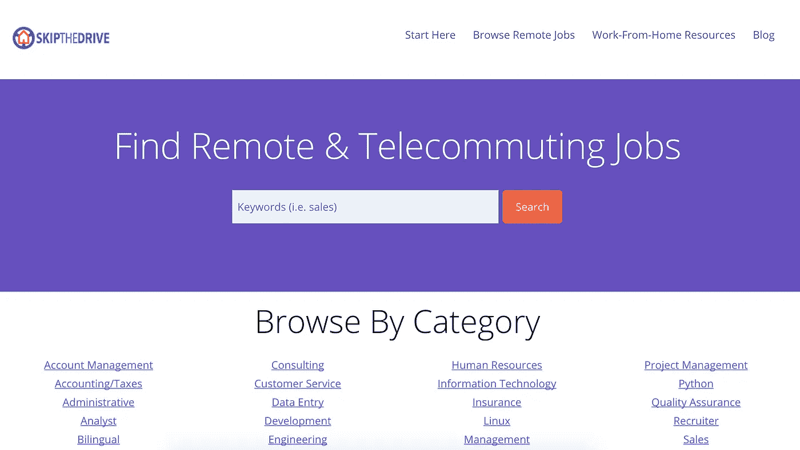
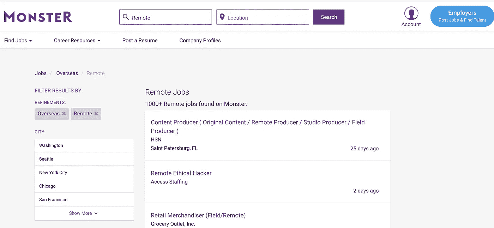

# 寻找远程工作的 10 个站点

> 原文：<https://medium.com/hackernoon/10-sites-to-find-remote-work-53191139159e>

## 未来是全球化的

*嗨，我是* [*乔丹*](http://www.jordangonen.com/) *，我喜欢帮助人们思考&发展他们的产品。希望这有所帮助！你可以在* [*推特*](https://twitter.com/jrdngonen) *:)* 上找到我

我们正越来越接近一个真正的数字世界，在这个世界中，任何人都可以在任何地方贡献自己的才华。我们不再受身体位置的限制。随着越来越多的公司想方设法支持来自全球各地的强大的远程工作人员队伍，远程工作正在起飞，而这只是刚刚开始。

那么如果你想找远程工作，你去哪里找工作呢？别再看了。

# 我列出了 10 个寻找远程工作的最佳网站，它们是:

## [RemoteOk。Io](https://remoteok.io/)

## [工作进展](https://jobspresso.co/)

## [Remote.Co](https://remote.co/remote-jobs/)

## [跳过驾驶](https://www.skipthedrive.com/)

## [天使名单—远程](https://angel.co/job-collections/remote)

## [月光工作](https://www.moonlightwork.com/apply)

## [劳动游牧民族](https://www.workingnomads.co/jobs)

## [怪物](https://www.monster.com/jobs/q-remote-jobs.aspx)

## [远程作业](https://remotejobs.com/)

## [骰子](https://www.dice.com/jobs?q=Remote&l=&searchid=2296187793085&stst=)

> 非常感谢你的阅读！我的名字是[乔丹·戈宁](http://www.jordangonen.com/)，我每天都写博客。如果你能做到，那对我来说太重要了:
> 
> **>** [**在推特上关注我**](https://twitter.com/jrdngonen) **<**
> 
> 如果您有任何问题，请发送电子邮件至 gmail dot com！非常感谢！