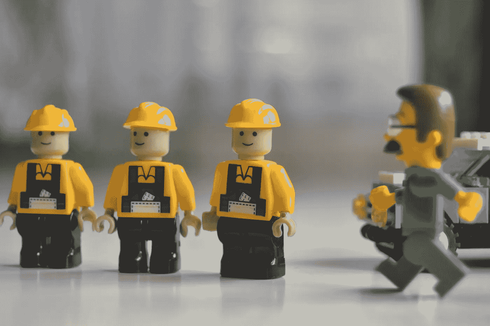

# 每个工程师都必须知道的 10 个术语

> 原文：<https://medium.com/hackernoon/10-terms-every-engineer-must-know-cd71e828f4ad>

无论你是刚刚起步还是经验丰富的工程师，这个系列都将揭示高科技行业中使用的各种术语。

# SDLC

[软件开发](https://hackernoon.com/tagged/software-development)生命周期

# 产品所有者(PO)

Scrum 软件开发方法论中的核心角色，每个团队都有一个。是客户的声音，评估产品需求的商业价值。可能是有远见的领导者和团队的人事经理。根据组织的不同，这个角色可能有其他的名字，比如 Amazon 的单线程领导，或者 Square 的产品工程领导。

通常与产品经理一起维护产品待办事项和产品路线图。

# 产品经理(PM)

通常是开发团队中的业务人员，在功能上与产品负责人关系密切。代表客户和市场需求，确保在软件开发过程中满足这些需求。这是团队中的一个*角色*，而不是团队的“人事经理”。

与其他职能部门合作，如市场营销、销售、客户成功，以确保产品从创建、推出到维护的成功。

# 校长

[主要]工程师、设计师、建筑师:放在具有高级技能和经验的人的头衔之前，其主要职能不是人员管理。他们可能有直接下属，但通常没有管理职能，如维护预算和损益表。

# 项目经理(TPM)

有时被称为[技术](https://hackernoon.com/tagged/technical)项目经理。

担任这一角色的人参与组织中的许多项目，促进团队之间的协调和合作，以完成这些项目。一个好的项目经理知道跨几个项目的产品所有者，并且将有助于在解决常见问题时减少重复工作。

# 路标

想象一下，产品是一辆汽车，行驶在一条长长的高速公路上，沿途都有里程碑。路线图是将一个长期运行的项目按照时间线分解成几个阶段，包括依赖项和可交付成果。

产品路线图是由产品所有者维护的，尽管它的某些部分是给团队领导的，作为他们在项目中的份额。

# 最有价值球员

最低可行产品。你可以投入市场验证需求、展示核心价值并开始获得客户反馈的最小产品。例子从简单的电子邮件注册表格到功能最少的网站。

# 积压

以用户故事或要做的工作为形式的以客户为中心的需求的优先列表。这是一个全面的待办事项列表的正式名称。

# 软件架构师

设计高级系统以满足产品需求的经验丰富的工程师。可能是单独的角色，也可能是团队领导。

# 软件工程师

一个有创造力的艺术家，他的散文就是代码。

> [黑客中午](http://bit.ly/Hackernoon)是黑客如何开始他们的下午。我们是 [@AMI](http://bit.ly/atAMIatAMI) 家庭的一员。我们现在[接受投稿](http://bit.ly/hackernoonsubmission)，并乐意[讨论广告&赞助](mailto:partners@amipublications.com)机会。
> 
> 如果你喜欢这个故事，我们推荐你阅读我们的[最新科技故事](http://bit.ly/hackernoonlatestt)和[趋势科技故事](https://hackernoon.com/trending)。直到下一次，不要把世界的现实想当然！

