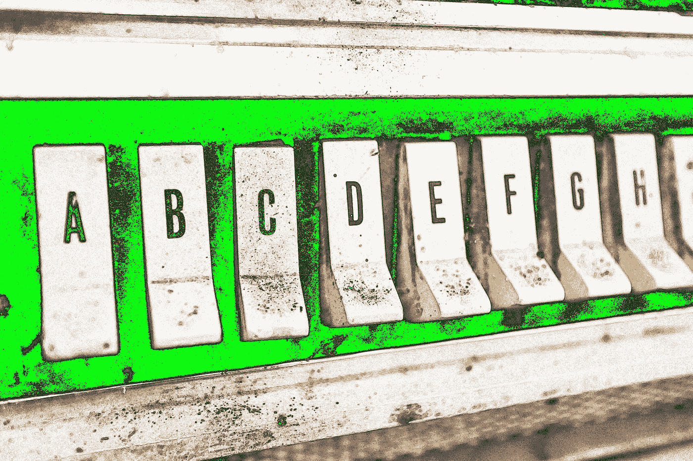

# 关于机器学习，每个人都应该知道的 10 件事

> 原文：<https://medium.com/hackernoon/10-things-everyone-should-know-about-machine-learning-d2c79ec43201>

> 丹尼尔·唐克朗(Daniel Tunkelang)在恩德卡、谷歌、LinkedIn 领导机器学习项目。[原载](https://www.quora.com/What-should-everyone-know-about-machine-learning/answer/Daniel-Tunkelang)于 [Quora](http://quora.com?ref=hackernoon) 。

作为一个经常向非专家解释机器学习的人，我提供以下列表作为公共服务公告。

*   **机器学习是指** [**从数据中学习**](https://work.caltech.edu/telecourse)**；人工智能是个时髦词。**机器学习不负众望:通过向正确的学习算法提供正确的训练数据，你可以解决数量惊人的问题。如果这有助于你推销它，就叫它人工智能吧，但要知道，人工智能，至少在学术界之外使用时，通常是一个时髦词，可以表示人们希望它表示的任何意思。
*   **机器学习是关于数据和算法的，但主要是数据。**机器学习算法的进步令人兴奋不已，尤其是关于[深度学习](https://en.wikipedia.org/wiki/Deep_learning)。但数据是让机器学习成为可能的关键因素。没有复杂的算法可以有机器学习[，但没有好的数据不行。](https://static.googleusercontent.com/media/research.google.com/en//pubs/archive/35179.pdf)
*   除非你有大量的数据，否则你应该坚持使用简单的模型。机器学习从你的数据中的模式训练一个模型，探索由参数定义的可能模型的空间。如果你的参数空间太大，你将[过度适应](https://en.wikipedia.org/wiki/Overfitting)你的训练数据，并训练一个不[泛化](https://en.wikipedia.org/wiki/Generalization_error)超过它的模型。详细的解释需要更多的数学知识，但是作为一条规则，你应该尽可能保持你的模型简单。
*   机器学习只能和你用来训练它的数据一样好。短语“[垃圾输入，垃圾输出](https://en.wikipedia.org/wiki/Garbage_in,_garbage_out)”出现在机器学习之前，但它恰当地描述了机器学习的一个关键限制。机器学习只能发现存在于你的训练数据中的模式。对于像[分类](https://en.wikipedia.org/wiki/Statistical_classification)这样的[监督机器学习](https://en.wikipedia.org/wiki/Supervised_learning)任务，你将需要一个正确标记、功能丰富的训练数据的强大集合。
*   **机器学习只有在你的训练数据具有代表性的情况下才有效。正如一份基金说明书警告“过去的表现并不能保证未来的结果”，机器学习应该警告说，它只能保证为生成其训练数据的同一分布所生成的数据工作。警惕训练数据和生产数据之间的偏差，经常重新训练你的模型，这样它们才不会过时。**
*   **机器学习的大部分辛苦都是数据转换。从阅读关于新机器学习技术的宣传中，你可能会认为机器学习主要是关于选择和调整算法。现实更加平淡无奇:你的大部分时间和精力都花在了[数据清理](https://en.wikipedia.org/wiki/Data_cleansing)和[特征工程](https://en.wikipedia.org/wiki/Feature_engineering)上——也就是说，将原始的[特征](https://en.wikipedia.org/wiki/Feature_%28machine_learning%29)转化为更好地代表数据中信号的特征。**
*   **深度学习是一项革命性的进步，但它不是灵丹妙药。**深度学习通过在广泛的机器学习应用领域取得进展而赢得了大肆宣传。此外，深度学习自动化了一些传统上通过特征工程执行的工作，特别是对图像和视频数据。但是深度学习并不是灵丹妙药。您不能开箱即用，您仍然需要在数据清理和转换方面投入大量精力。
*   机器学习系统极易受到操作员错误的影响。带着对 NRA 的歉意，“机器学习算法不杀人；人杀人。”当机器学习系统失败时，很少是因为机器学习算法的问题。更有可能的是，你在训练数据中引入了人为错误，造成了偏差或其他一些系统错误。永远保持怀疑的态度，用你应用于软件工程的原则来对待机器学习。
*   **机器学习可以在不经意间创造一个自我实现的预言。**在机器学习的很多应用中，你今天做的决定会影响你明天收集的训练数据。一旦你的机器学习系统将偏见嵌入到它的模型中，它就可以继续生成新的训练数据来加强这些偏见。[有些偏见会毁掉人们的生活。](/@dtunkelang/getting-uncomfortable-with-data-7339e27adf6f)负责任:不要创造自我实现的预言。
*   人工智能不会变得有自我意识，不会崛起，也不会毁灭人类。数量惊人的人似乎从科幻电影中获得了关于人工智能的想法。我们应该受到科幻小说的启发，但不要轻信，误以为是现实。从有意识的邪恶人类到无意识的有偏见的机器学习模型，有足够多真实存在的危险需要担心。所以你可以不用担心[天网](https://en.wikipedia.org/wiki/Skynet_%28Terminator%29)和[超智能](https://en.wikipedia.org/wiki/Superintelligence)。

机器学习远比我在十大清单中所能解释的要多。但是希望这对于非专家来说是一个有用的介绍。

> 丹尼尔·唐克朗(Daniel Tunkelang)在恩德卡、谷歌、LinkedIn 领导机器学习项目。[原载](https://www.quora.com/What-should-everyone-know-about-machine-learning/answer/Daniel-Tunkelang)于 [Quora](http://quora.com?ref=hackernoon) 。
> 
> 欲了解更多来自 [Quora](https://medium.com/u/3853f85f7d5e?source=post_page-----d2c79ec43201--------------------------------) 的趋势科技答案，请访问[HackerNoon.com/quora](https://hackernoon.com/quora/home)。