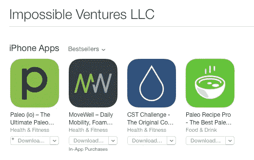

# 我学会的 10 件事启动我的前 4 个应用程序六位数

> 原文：<https://medium.com/hackernoon/10-things-i-learned-bootstrapping-my-first-4-apps-six-figures-7efcebd2b8b3>

Impossible Ventures Apps

*这个帖子原本出现在* [*不可能。*](http://impossiblehq.com/app-lessons/)

在过去的几年里，[不可能的冒险](https://impossible.ventures/)已经发布了 4 款应用。

*   [冷水浴疗法](https://itunes.apple.com/us/app/cst-challenge-original-cold/id693240707?mt=8)
*   [古(io):古食物参考 App](https://itunes.apple.com/us/app/paleo-io-ultimate-paleo-diet/id868403565?mt=8)
*   [MoveWell](https://itunes.apple.com/us/app/movewell-daily-mobility-foam/id957563124?mt=8)
*   [古配方 Pro](http://paleorecipepro.com/) (新)

总之，在过去几年中，我们的销售额已经超过了 100，000 英镑。

不，我们没有风险投资。

不，我不是开发商。

不，我们不会建造下一个脸书。

但我们是盈利的，我们的应用程序非常适合我们。

以下是我作为一名非技术型创始人在过去 3 年里开发 4 款应用时学到的一些主要经验。

# 1)从小处着手

不管你的想法是什么，从小处着手。

**从来没有人说过，“我的应用是下一个十亿美元的想法”，也从来没有人做出过下一个十亿美元的想法。**

不要说这个。

如果你这样做了，这是一个危险信号，你可能已经想出了太多复杂的功能，如果没有数百万美元的资金，这些功能很难实现。

请记住，脸书是从校园电话簿起家的。优步开始是一个富人叫豪华轿车的简单方法。Twitter 最初是一条被美化的短信。

# 2)专注于一个特性

我知道你认为你的应用程序将会是最好的应用程序，为移动设备增光添彩。它将有 20 种不同的可定制选项，并赢得大量的设计和功能奖。

别说了。

构建 1 个功能。就是这样。

我知道，脸书的应用程序在开始的时候有很多功能。关键字— DID。

你知道他们现在在做什么吗？为 1 个功能制作 1 个应用程序。

**脸书**

*   脸书信使
*   组
*   页面管理器
*   照片墙
*   过度衰退
*   回旋镖

推特也这么做。

*   Twitter 应用程序
*   维恩
*   潜望镜

谷歌也是如此。

*   谷歌搜索
*   谷歌邮箱
*   照片
*   谷歌文档
*   Google Talk
*   谷歌日历

你明白了。每一家大型科技公司都致力于简化应用程序，这是有原因的。

在一个品牌生态系统中，你可以有多个应用程序，并且每个应用程序都建立在另一个应用程序的基础上，但是你不应该将大量相互冲突的功能塞进一个应用程序中。当你这样做时，你所做的只是保证你的 1 应用程序会被过度填充，速度缓慢，远不如它本来可以达到的水平。

相信我——你会忍不住想在你的应用中加入一些功能。

人们在[旧石器时代](http://paleo.io/)想要食谱。人们为此对我们大喊大叫，所以我们一开始就加了他们。但主要的问题是，好的食谱应用程序功能与构建一个好的旧石器时代食物搜索应用程序(这正是 Paleo (io)的设计目标)完全对立。

所以，为了做一个更好的 app，我们把它去掉了。然后，我们构建了正确的功能，并将其作为自己的可怕的古食谱应用程序发布。

现在，我们有了 **2** 令人敬畏的旧石器时代应用程序，它们能很好地做 **2** 非常不同的事情，而不是一个只能以平庸的方式做两件事情的旧石器时代应用程序。我们正在建立一个应用生态系统，而不是一个无所不能的超级应用。

# 3)首先建立受众

大多数人在开发应用程序时都会这样做:

1.  开发应用程序
2.  想知道为什么卖不出去
3.  感到悲伤

相反，这个过程应该是这样的:

1.  建立受众
2.  销售相关应用程序
3.  赚钱
4.  快乐

首先培养你的观众。无论如何，你都要让观众来看看你的应用，所以你最好自己开发。

在表情符号中，它看起来像这样:

**大多数人做什么**

1

2

3

**你应该做什么**

1

2

3

4

首先培养你的观众。无论如何，你都要让观众来看看你的应用，所以你最好自己开发。

顺便说一句，这并不像在没有任何专业技术知识的情况下开发一个应用程序那样费力。

如果你不是技术人员，也不愿意建立用户群，我认为你还没准备好开发一个应用程序。

在决定开发一个应用程序之前，我花了几年时间来开发不可能的和终极古向导。当我们这样做时，我们确切地知道他们将如何回答人们的痛点(因为他们已经告诉了我们)。

如果你已经有了一个受众，并且想要建立一个关于完全不同的东西的应用，那么考虑首先建立一个为你的受众服务的应用。

# 4)尽早快速发布

不要试图一开始就构建 10.5 版本的应用程序。

> “如果你对你的产品的第一个版本不感到尴尬，那么你已经推出太晚了。”—雷德·霍夫曼

尽快发布第一个版本。获得反馈，改变事情，然后更新。

这在另一方面是好的——它迫使你保持事情简单(再次参见第 2 条)。

你不想让一个不完整的应用程序上线，但是你*可以*让一个简单的应用程序上线，然后添加新功能。

最精彩的部分？你添加的每一个功能都让你有机会谈论它，发布新闻稿和公告，并让你的现有客户对他们已经支付的东西更加兴奋(更新的应用程序是最好的)。这也给了你免费的营销机会来谈论你所有应用的更新( [LeadPages](http://blog.leadpages.net/) 做得很好)。

# 5)美国开发者是最好的开发者

我过去外包过，将来也会外包。我发现——不完全是——美国开发者是最好的。

这并不是说海外开发者不好——许多是好的——但是如果你去海外是因为你认为你会省钱，你可能不会。

根据我筛选大量合同的经验，海外开发成本往往是美国开发成本的 1/4 或 1/3。也就是说，他们的时间表往往是美国开发时间表的 3-4 倍。

情况并非总是如此。如果你认识一个住在美国以外的可靠的开发者，就使用他们。也就是说，如果你不得不筛去糟粕，那就不值得了。

该应用程序最终需要更长的时间来构建，并且最终花费大约相同的金额(不理想)。

那里有不错的海外开发商店，但是你最好在一家[初创公司](https://hackernoon.com/tagged/startup)找到一名出色的开发人员，他的移动工作让你钦佩，并说服他们做自由职业者的工作。

= >一个可靠的国际开发商店是 [Mobile Jazz](http://mobilejazz.com/)

# 6)不要半途而废

我们刚刚发布的 CST 应用程序在一段时间内有点工作，但不是真的。

我讨厌半途而废。一些功能不起作用。有时它不承认帐户。有时登录会出错。这有点尴尬，但今年早些时候，我们厌倦了它，并决定修复一些东西，使它符合标准。

如果你要做某事，确保它值得做好。如果你打算让它半途而废，那就把它处理掉，否则就别费心去做了。

我们最近重新发布了 CST 应用程序，唯一的目的是清理它，并使它按照我们最初设计的所有方式运行。同样有趣的是，我们可以看到谁在这方面真正变得更有竞争力。

# 7)不要相信 App Store 会为你做任何营销

当人们说，“我们花了几个月的时间来开发我们的应用程序，然后把它放在应用程序商店里，却什么也没卖出去，”我真想给他们一巴掌。

最糟糕的是，他们妄下结论:“应用已死”(因为它们对我不起作用)。

真的吗？

你认为只要向这个世界提交一些东西，它就会自动成功？

当 App Store 第一次开放时，有这样一个真空，你可以暂时逃脱，但我们至少已经过了 7 年。

现在，App Store 就像任何其他竞争市场一样。

你会向世界推出任何其他项目，只期望赚钱吗？

这在其他情况下会有多荒谬？

这种抱怨是我对这个领域的开发人员最大的不满，而且非常普遍。

如果你认为苹果会帮你做市场营销，你需要穿上你的大男孩(或女孩)裤子，忍着点，别再活在 2008 年了。

**如果你在其他任何场合这么说，你会被笑出房间的。**

我开了一家咖啡店…

我开了一个博客…

我创办了一个电子商务网站…

…但我没有做任何营销，因为我认为他们会找到它。

这是我听过的最愚蠢的借口。计划你自己的营销——或者更好的是，在你担心构建一些性感的应用程序之前，做一些建立你自己的受众的脏活(见第三条)。

**如果你建造它，他们就不会来了。**

如果你走出去，找到他们，告诉他们一个令人信服的理由，为什么你要让他们的生活变得更容易，他们就会来。

# 8)告诉安卓的人安静下来，要有耐心

> *注意:如果你是 Android 用户，这仅仅是从商业分析的角度来看——我仍然爱你们:)*

如果你正在开发一个应用程序(不需要资金)，先为 iOS 开发。安卓就不要费心了。

为什么？

*因为他们赚的钱少了很多，变数(和屏幕尺寸)也多了很多，需要更多的测试。*

最重要的是(我仍然不知道为什么)，尽管市场份额平分秋色(Android 用户很乐意告诉你)，Android 用户在应用上的花费更少，比 iOS 用户点击的广告更少。

我会第一个告诉你，我不知道为什么，但从收入的角度来看，他们带来的少得多。[这就是我们先开发 iOS 的原因。](https://impossible.ventures/ios-first)

因此，如果你是一个自举者，尽你所能帮助你的 Android 用户保持耐心，但要坚持商业意义上的东西，只有在你的 iOS 版本已经自我验证之后，才构建一个 Android 版本。

# 9)也就是说，安卓用户是更好的顾客

尽管你买的少，花的钱也少，但 Android 用户往往会比 iOS 用户留下更高数量和质量的应用评论。

这是一个奇怪的现象，我没有看到其他人指出，但在我的经验中，这是 100%真实的。

而 iOS 用户往往是黑人和白人(5 颗星——令人惊叹或 1 颗星——这糟透了！)，你将从 Android 用户那里获得更多可操作的反馈(这个应用在这方面做得很好，但这一部分没有发挥应有的作用——3.5 星)。

就这一点而言，一旦应用程序验证了自己，就应该马上上这个平台，这样你就可以重复用户的建议，并实现一些好的反馈。

# 10)全面考虑——保持简单快速

最后一点是记住第四点，如果有疑问，保持你的应用程序开发简单快速。原因如下:

*   如果你保持它的简单，你需要修复的东西就更少，并且可以使它更精简。
*   如果你走得快，你可以很快解决任何问题(人们喜欢快速的响应时间)。

给你。

这就是我们如何建立一个六位数的应用生态系统，零启动和零资金。

我们还会有更多的。

如果您想查看我们的各种应用，可以从下面下载:

*   冷水浴疗法— [iOS](http://cst.is/)
*   [Move Well 移动应用](http://movewellapp.com/)——[iOS](http://movewellapp.com/download)
*   [古(io)](http://paleo.io/)—[iOS](http://paleo.io/ios)/[Android](http://paleo.io/android)
*   [古配方 Pro](http://paleorecipepro.com/) — [iOS](http://paleorecipepro.com/)

如果你喜欢这篇文章，如果你能把它分享给可能会觉得有用的人，我会很感激。

现在出去做些事情吧。

> [黑客中午](http://bit.ly/Hackernoon)是黑客如何开始他们的下午。我们是 T21 家庭的一员。我们现在[接受投稿](http://bit.ly/hackernoonsubmission)并乐意[讨论广告&赞助](mailto:partners@amipublications.com)机会。
> 
> 如果你喜欢这个故事，我们推荐你阅读我们的[最新科技故事](http://bit.ly/hackernoonlatestt)和[趋势科技故事](https://hackernoon.com/trending)。直到下一次，不要把世界的现实想当然！

