# 信息安全专业人士需要了解的 10 件网络知识

> 原文：<https://medium.com/hackernoon/10-things-infosec-professionals-need-to-know-about-networking-d159946efc93>

因此，这个故事源于这样一个事实，即我已经从应用程序开发进入了信息安全世界，从我的 Sec 工作中，我真正看到并理解了开发人员之间以及整个地球都需要更好的安全理解。

然而，虽然我喜欢研究漏洞和设计安全系统，但我的网络渗透技能并不尽如人意，这一直是我脑海中的一个小问题。因此，当我打开我的 Twitter feed，看到一条来自我的 InfoSec 偶像之一的推文时，我的心脏漏跳了一拍:

哦，糟糕…我的弱点…

Magikarp is an expert at Layer 2\. It’s in his name.

下面的帖子是安全专家的列表，列出了 InfoSec 人员在该行业中似乎缺乏的基本网络技能。

They’re not wrong. Many industries don’t care about lower level networking protocols

现在，我已经努力尝试跟上这些概念中的许多概念，但是如果有人有我这样的开发背景，一切都被抽象掉了，你被教导不要在意，因为这无关紧要。

How I used to feel about things in this article…

但是在信息安全的世界里，这很重要。很多。

What?!

带着幽默、迷因和谦逊，下面是我们今天要讨论的 10 件事。OSI 模型
2。集线器/交换机/路由器
3。帧/包
4。伪造 MAC/IP 地址
5。TCP 握手
6。IPv6
7。信息安全社区。不要假设基数为 10。

# **1。在食人魔的信息安全对话中，我指的是洋葱，我指的是层次**

…and it’s an instant red flag if you get it wrong…

我有计算机科学学位。我知道我的 OSI 模型。我在教学时引用过它，并巧妙地使用了“*请不要教学生无意义的缩写词*”作为记住“物理/数据链路/网络/传输/会话/演示/应用”的最佳方式

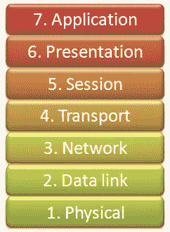

Taste the rainbow

但是作为一名开发人员，我从未参考过 OSI 模型。我从来不需要。我确信这也适用于许多其他的技术角色。

我在信息安全领域生活得越久，OSI 模型就越频繁地被用来描述不同的工具、攻击媒介和防御机制。

I assume EE is Electrical Engineer and not Easter Expert

这里有一个不太抽象的 OSI 视图，包含了您需要了解的基础知识

Don’t feel bad if you don’t know all of this, when I started I assumed SMTP was lower down just because it was older. Yes, I am an idiot

教科书或讲义上的任何 OSI 的图，一般都只是没有上下文的塔。我喜欢这个，并希望看到它的互动版本(或更好)。

为什么这在 InfoSec 中很重要？除了是一种很好的概念分类方法，OSI 还有助于规定你可以使用什么信息，什么工具是合适的，什么信息可以被黑客操纵。

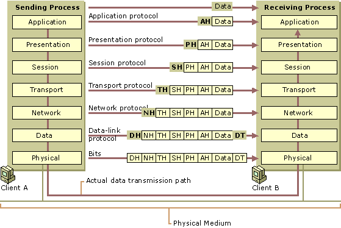

Look at all those tasty tasty headers leaking useful information or waiting to be edited

如果你想进入信息安全网。了解你的 OSI。稍后，我们将讨论这些层中的一些常见误解。

# 2.集线器、交换机和路由器非常不同。

如果你不是来自网络世界，或者你对网络的看法是在家里安装两个无线路由器，你可能把集线器/交换机/路由器当成了同一个词。很有可能你有一个能做这三件事的盒子，而且你不在乎差别。信息安全关心。

Imagine this song confused switch, hub and router. Actually, it might have made more sense depending on your pronunciation of router and whether you use Australian Slang.

## 中心

集线器位于第 1 层(物理层)。它们实际上是带电的。电从一个端口进去，作为电遍历到 ***所有*** 其他端口。如果你在一个集线器网络上，你想向另一台计算机发送信息:你以电的形式发送信息，它进入一个集线器，并以电的形式发送给连接在那个集线器上的**每个人**。

> 这取决于 1 台计算机是否识别出该消息是给它们的。

枢纽是愚蠢的。它们很简单。它们是基本的。几乎不值得一提的是，从他们身上嗅出信息是多么容易，因为这实际上是将每个人的信息发送给每个人。

## 转换

像集线器一样，交换机也将电力从一个端口传输到另一个端口。但是有一个非常关键的区别。交换机记录所有连接到它的设备的 MAC 地址。因为我们使用 MAC 地址，所以我们在第 2 层。

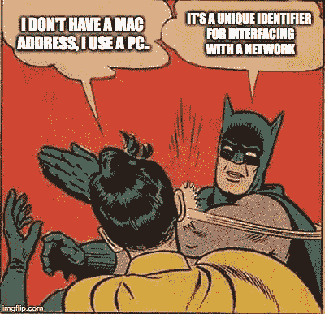

Apple call it an iMac Address. (FYI: They don’t)

每台电脑都有一个 MAC 地址。如果你有以太网、蓝牙和 WiFi，你至少会有 3 个 MAC 地址。每个网络接口一个。如果你使用迅雷，USB 网络等，你可能会有更多。数量并不重要，如果你在一个网络上，你有一个 MAC 地址，交换机知道它。

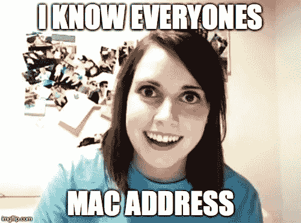

由于交换机知道*你的* MAC 地址和*目的地*的 MAC 地址——而不是像集线器一样向每个端口发送电力——它只会将电力发送到包含目的地 MAC 地址的端口。

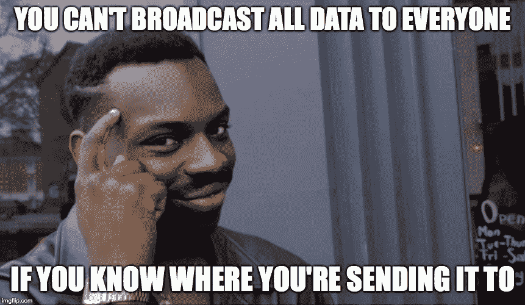

如果到目前为止你已经阅读了所有内容，而不仅仅是看了图片，你可能会问

> 为什么要使用集线器？

答案是:你真的不应该。但是…

> 您可以让交换机像集线器一样工作

这是很重要的一点。你可以填满一个交换机的内存(Google: CAM Table ),迫使它像一个集线器一样工作，你可以泛洪，你可以欺骗，你可以利用/创建一个镜像端口来接收所有流量，你可以利用广播帧(FF:FF:FF:FF:FF:FF:FF)来到达局域网段上的每一台计算机。欺骗交换机做错误的事情并向你发送数据的方法有很多，包括把它变成一个集线器。

网络在很多方面都可能被错误配置、过时、过于信任和脆弱。如果您仅依靠工具，您将无法渗透与熟练的信息安全人员同等数量的网络。

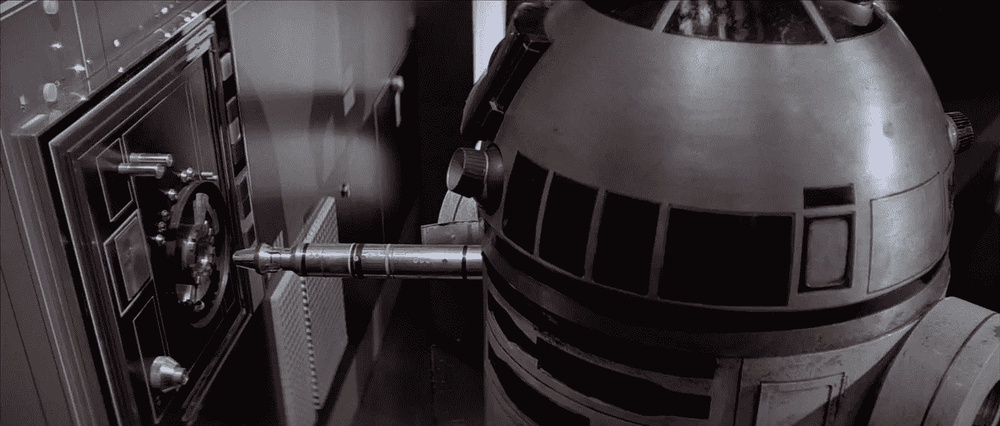

One day maybe… but not today.

**那么……路由器是什么？是什么让路由器成为路由器？** 真的过于简单化了吗？一个路由器向其它路由器发送数据*。*

就是这样。不开玩笑。一台路由器到另一台路由器。1 个 IP 地址对 1 个 IP 地址。我们到了第三层。

你把一个路由器放在一个*网关*上，也就是两个或多个网络连接的地方。在家庭情况下，您的 ISP 网络和您的网络。您有一个由 ISP 提供的公共 IP 地址和一个由 NAT 创建的内部 IP 地址。

**NAT？NAT 是做什么用的？**

NAT(网络地址转换)允许单个设备(在家里，通常是您的路由器)充当互联网(您的 1 个公共 IP 地址)和您的本地网络(通常有 254 个 IP 地址，但可能非常非常大)之间的代理。

This is NAT what I asked for

你的家可能在 10 号公路上。X.Y.Z 或 192.168.X.Y 网络，但你的公共 IP 地址将是你的 ISP 给你的([http://whatismyipaddress.com](http://whatismyipaddress.com))。

如果有 6 个人住在你家，那么这 6 个人来自同一个公共 IP 地址。NAT 的职责是区分和处理数据包，以便将它们发送给正确的人。这可能会很快变得复杂，但足以说它迄今为止在世界上运行得非常好。

The original NAT. Actually.. whoever takes it out of the letterbox and distributes it would be the NAT.

因此，当您的家用路由器说它实际上是集线器/交换机/路由器时，它实际上是集线器/交换机/路由器。

您的路由器连接 LAN(局域网)、WAN(广域网)和/或 ISP 网络。它有一个开关，用于同一个网络上的设备之间的通信，如果你非常不幸，它不像一个开关，而是像一个集线器，所有数据都通过每个端口传输，每当网络上有更多的人时，你的网络就会超级慢。

# 3.万物是如何相互对话的？

到目前为止，我们只是触及了不同的硬件类型以及它们在 OSI 堆栈中的位置。他们如何在堆叠之间移动？信息是如何传递的？

## 神圣的蝙蝠侠！！我们被陷害了！

如果你在同一网络上从一台计算机向另一台计算机发送信息，你是通过*“以太网帧”来完成的。*不要太乏味，以太网帧有一个源 MAC 地址、一个目的 MAC 地址和一个有效载荷。

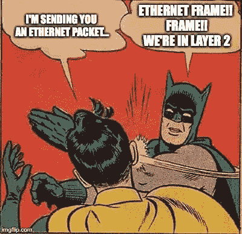

如果您正在与同一网络上的另一台电脑通信，目的 MAC 地址将是另一台电脑。因为它是在同一个网络上发送的帧，所以路由器没有必要向另一台路由器发送信息。

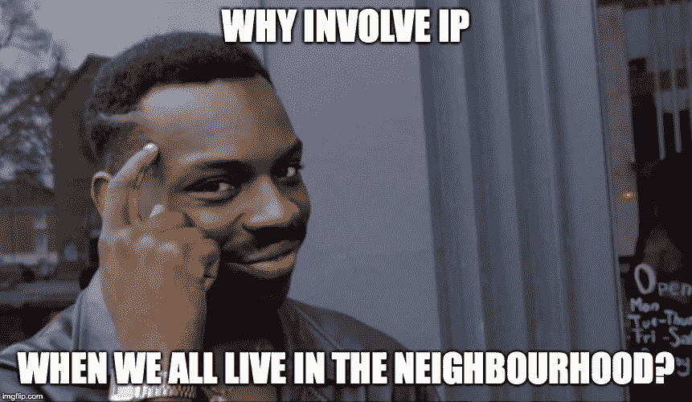

Same reason you don’t put country on an envelope if you live in the same country

我会把我的有效载荷发送到你的 MAC 地址。IP 地址可以用来计算它们是否在同一个网络上，这取决于情况，并且仍然有一个 IP 目的地，因为一个 MAC 地址可能有多个 IP 地址，但是它不需要到达路由器。

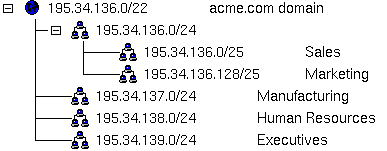

That involves talking about Subnet Masks and this post is long enough as it is…

您的电脑如何知道目的 MAC 地址？
这就是我们需要 ARP 的时候。

ARP is MAGIK. Oh wait.. I already made that joke…

ARP。地址解析协议。匹配 IP 地址和相应的 MAC 地址。

转到终端。类型 *arp -a* 。窗户。马科斯。Linux。不在乎。走吧。

sleep(20);

你会得到类似这样的东西:

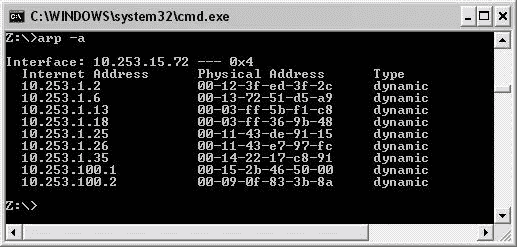

IP Address. Mac Address. Done. Mapped. Your computer knows.

你的计算机保存着所有它在网络上交流过的系统的记录，因为我们在现代系统上——它们非常健谈，所以这很可能是所有的系统。

*有可能。不保证。

不像你的计算机，交换机知道所有的这些，因为这是它的主要工作。

那么，以太网帧是什么样子的呢？

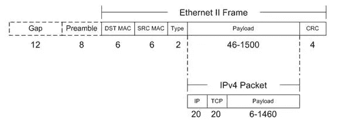

Well sure.. if you want to be boring about it…

来源。目的地。数据进入有效载荷。在这种情况下，数据是 IPv4 数据包。多好的休息时间啊。

We love you Woz

## 神圣的蝙蝠侠！！我们被打包了..艾德（男子名）

如果您需要在另一个网络上发送数据，那么我们可以使用 IP 地址。现在我们正在处理 IP 地址—我们在第 3 级。在这一层发送的信息称为“数据包”。

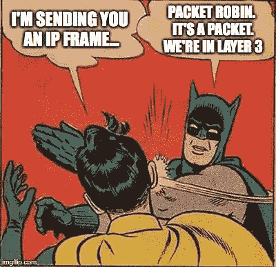

Batman cares deeply for the proper usage of frames and packets

一个包由两件东西组成。一个*报头*和一个*有效载荷*。
该层中最常见的数据包形式有:

*   IPv4 数据包(大多数数据包)
*   IPv6 数据包(未来的数据包。一些当前分组)
*   ICMP 数据包(ping)

最常见的误解是，TCP 和 UDP 数据包是网络级别的，与 ICMP 处于同一级别。他们不是。误解了。

Get to the Transport Layer

报头由一个源 IP 和一个目的 IP 以及一大堆其他无聊的东西组成。这种无聊的东西是信息安全专业人士的玩物。

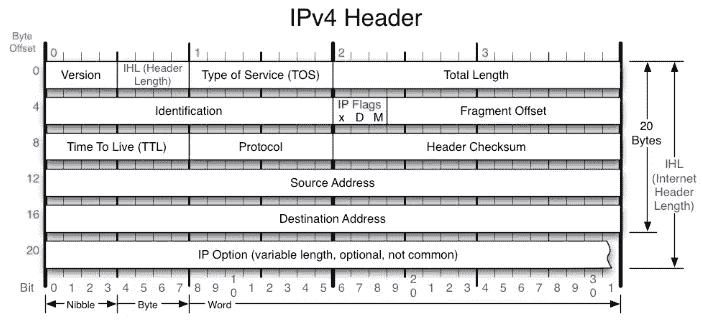

This is just the header.

有了 IP 头我们能有什么乐趣？我们可以设置源和目的 IP 地址。我们可以用特定的 TTL (Firewalking)来制作数据包。我们能..做各种各样的事情。数据包制作是突破防火墙和入侵检测系统的基础。当然，您可以获得一个工具来帮助您，但是最好知道这个工具在做什么。

这种“报头和有效载荷”的设计在 OSI 模型中不断上升。在传输层，有一个 TCP 或 UDP 报头，您可以为其制作数据包。您正在处理的会话有一个标题。表示层将有一个标题。该应用程序将有一个标题。

任何一层都有可能被利用的弱点，攻击/防御这个弱点就是你的工作。

# 4.MAC 地址和 IP 地址是分开的、重要的和可伪造的。非常容易伪造。

我想我们已经详细讨论了“独立”和“重要”这两个词，所以让我们回到为什么这篇文章会出现的问题上来。我的信息安全偶像:

## MAC 地址不是任意的

让我们直接讨论这个问题。MAC(媒体访问控制)地址是网络接口的唯一*地址。

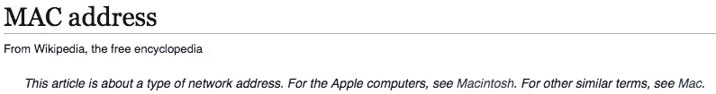

Ha! Wikipedia made the same Apple joke I did.

现在，它“应该”是独一无二的，但是 twitter 的经验告诉我，在它可能不存在的地方有一些错误。

但是我跑题了。它们“应该”是独特的。那么 MAC 地址是由什么组成的呢？它是硬件上的一个物理地址:

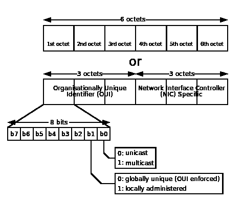

Found in the form XX:XX:XX:YY:YY:YY. In Hexadecimal

或者用词来说…

使用我们的 MAC 地址示例:XX:XX:XX:YY:YY:YY。XX:XX:XX 是 OUI(组织唯一标识符)，所以惠普有 **3C:D9:2B** (还有一些其他的)，所以如果你看到一个 MAC 地址 **3C:D9:2B** :12:34:56，很有可能是来自惠普。

这些能造假吗？天哪，他们可以。

如果我想进入你的网络，我会试着成为你。我会试着伪造你的 MAC 地址，让交换机为我迷惑你。如果 DHCP 服务器使用 MAC 地址来帮助分配 IP，我将使用 be your MAC address 来获取 IP 地址。

如果我运行在第 2 层，我运行的是 MAC 地址。

如果我在第 3 层操作，我就用 IP 地址操作。

IP 地址可以造假吗？天哪，他们可以！我们可以编制数据包，因此我们可以编制 IP 地址。我们可以欺骗交换机、路由器和服务器，我们可以将自己映射到 IP。这有很多方式和原因。

这里还有更多的话要说，但我会把这篇推文留给你，然后继续前进

# 5.三次握手？对不起，我结婚了。

等等，你还在这里？恭喜你！我们在 TCP/IP。这是传输层(第 4 层)的一部分。

这里最重要的是。跟着我重复。 **SYN。合成确认。ACK。**

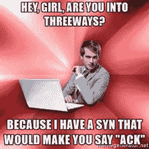

No no. She responds with SYN-ACK. You respond with ACK. And then you have a conversation involving SYNs and ACKs. Or Acts of Sin depending where this conversation is being held. Maybe you should just FIN because she wants to RST.

你通过*三次握手*或 *TCP 握手*发起与服务器的 TCP 连接。这种握手允许交换序列号和确认号。这样，如果数据包被丢弃或出现乱序，可以安全地重新发送。

以下是图片形式交流

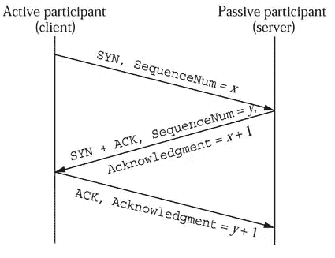

x and y start off random, tools will show they start at 0, but this is a lie.

随着数据的发送，序列号和确认号增加，直到 FIN 被发送。如果发送顺利，窗口大小可以增加。如果出现问题，就会发送(或在尝试关闭连接时接收)一个 RST 来取消连接，并且需要建立一个全新的连接。

这就是 TCP 保持准确性的方法。

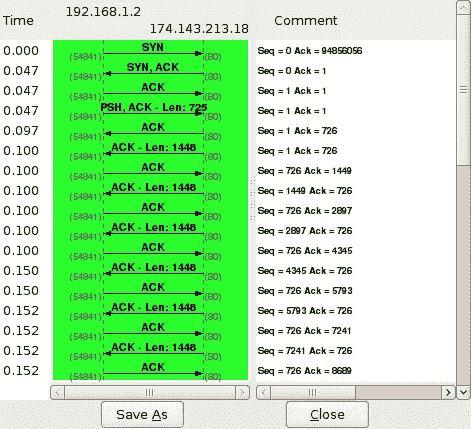

From a good tutorial found here: [http://packetlife.net/blog/2010/jun/7/understanding-tcp-sequence-acknowledgment-numbers/](http://packetlife.net/blog/2010/jun/7/understanding-tcp-sequence-acknowledgment-numbers/)

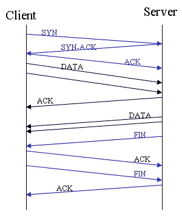

Notice that both sides FIN and ACK the FIN

为什么这很重要？因为我们可以手工制作这些数据包，并对它们怀有恶意。(我觉得我可以写这篇文章“所有的层都可以是精心制作的和恶意的”，然后，整篇文章就完成了)。我们可以进行 SYN 泛洪，我们可以使用 FIN 进行检测，使用 XMAS 扫描进行扫描——有很多事情都源于此。然而，了解 TCP 如何连接和操作在 InfoSec 中非常重要。

Maybe they cover it in the last week of term as they finally allow students to use the internet?

编辑:这个话题是否让你想知道更多？我强烈推荐 Gary Bernhardt(Twitter garybernhardt)
的帖子“任何懂编程语言的人的网络协议”

 [## 网络协议.程序员概要

### 网络堆栈做了几件看似不可能的事情。它在我们不可靠的网络上进行可靠的传输…

www.destroyallsoftware.com](https://www.destroyallsoftware.com/compendium/network-protocols?share_key=97d3ba4c24d21147) 

# 6.IPv6？没人用，我为什么要知道？

因为有些东西可能对它很脆弱。设置网络的人可能会忽略/错误配置 IPv6，并且可能不会观看 IPv6，因为他们太忙于观看 IPv4。

History may repeat itself with IPv6\. Knowing fundamentals is a great way to help avoid this

有一些工具可以帮助人们利用 IPv6 和 ICMP6 进行渗透、指纹识别和制作数据包。路由器、防火墙和 IPS/IDS 中都有防御机制。

所以，是的，你必须学习 IPv6 网络。即使你认为只有 1%的服务器支持它，或者你认为没有人使用它。确实如此。你需要准备好你的进攻/防守来使用它。

# 7.与信息安全社区保持联系

这一点再正确不过了。虽然基础已经存在很长时间了，但每天都有新的漏洞、弱点和东西要学习(或者至少看起来是这样)，Twitter 和 RSS 帮助我做到了这一点。

Twitter 是一个非常好的信息安全社区平台，我强烈建议你关注你所关注领域的顶尖人物。

我相信丹说得更好:

人们经常问我是如何做到这一点的，所以在下面的链接中列出了所有的 RSS 源(通过 feedly 共享，所以你可以很容易地订阅这些资源)和我的顶级 twitter 信息安全人员(你可以很容易地订阅):

 [## 你“做”信息安全，对吗？你读什么？你听谁的？

### 作为一个超级热心的安全人士，我得到这个问题…很多。😅

medium.com](/@louiscremen/you-do-infosec-right-what-do-you-read-who-do-you-listen-to-e8d00b7d8ace) 

# 10.你听懂我的笑话了吗？我说了 10 件事，但那是以 8 为基数的 10！偷懒的好方法:)

仅此而已。我关于没有另外两点的笑话结束了我们的旅程。

But seriously, you should be comfortable with Base 2, Base 8, Base 10 and Base 16

如果您已经坚持到最后，我希望您已经享受了重要网络概念的简短知识传授。如果你是我发推特的人之一——感谢你成为我喜欢阅读的推特社区的一员。

在人们应该知道的事情方面，还有一些其他的推文引起了我的注意。除此之外——和平结束

Actually, it’s probably because we’re doomed to repeat the mistakes of history. Just on new platforms. Hello IoT!!

鳍。ACK。