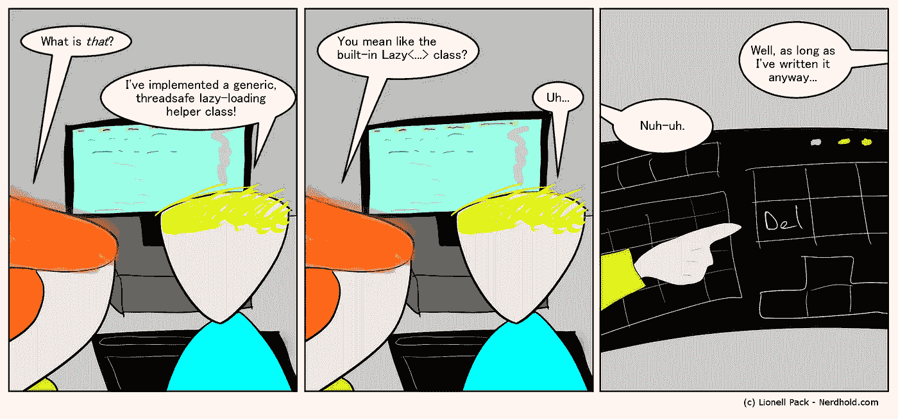
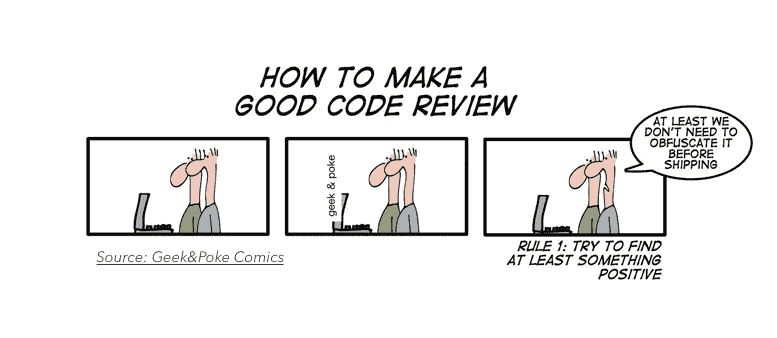

# 关于 Android 代码审查的 10 件事

> 原文：<https://medium.com/hackernoon/10-things-to-check-on-android-code-reviews-498f7583f338>

Image by Lionell Pack — [www.nerdhold.com](http://www.nerdhold.com)

审查代码是开发过程的重要部分。这有助于避免在开发分支和发布候选上出现问题，并照顾应用程序的架构。

*我想和你分享一些当我不得不审查我或我的同事的代码时我会检查的要点。*

## 逻辑错误

这听起来像一个大学的声明，但不管你有多有经验，你总是会有逻辑错误。这就是为什么理解并检查你正在阅读的代码的所有条件是有好处的。

## 空指针异常

在开发过程中，最常见的崩溃类型之一是由于试图在未实例化的对象上运行方法而导致的(也称为 NullPointerException)。

尽管其中一些在代码中显而易见，但也有一些隐藏在后端响应或您的架构设计之下，这些是我们必须记住的。

## 代码重用

我们是开发人员，因此我们喜欢创造新的代码。人们还普遍认为，编写新代码会更容易理解、实现和其他许多事情。

事实是，通过重用代码，我们有助于保持应用程序的代码更简单，并避免在生产中出现新的崩溃。

Source: [www.commadot.com](http://www.commadot.com)

## 代码标准

即使你独自工作或者和一大群人一起工作，代码标准也很重要。因此，审查拉请求是一个很好的时机，有助于维护代码标准，并指导团队中的新开发人员去适应它。

## 跟踪

现在所有的初创公司和大公司(甚至你自己)都想跟踪事情，以了解用户的行为，改进应用程序以及为什么不赚钱。

有时，在匆忙编写新功能或重构代码的过程中，我们不会注意追踪器，而*“拉请求时刻”*是一个很好的机会来检测我们是否遗漏添加了一些追踪器或意外删除了一些追踪器。

## 保存应用程序的状态

我们容易忘记的一件事是保存应用程序的状态，当发生这种情况时(在应用程序之间切换、关闭应用程序或旋转手机后)，我们会丢失用户正在做的事情的状态。所以，这是在审查代码时要考虑的事情。

## 简化布局

Android [开发](https://hackernoon.com/tagged/development)最棘手的部分之一是保持简化的布局并坚持设计团队的设计。重要的是要注意视图和嵌套视图的数量，以保持布局简单，而不损害设计。

Source: [www.geek-and-poke.com](http://www.geek-and-poke.com)

## **尺寸、字符串和常量**

一旦你在每个文件上统一了所有的尺寸、字符串和常量，你会发现修改应用程序的值和行为是多么容易。

重要的是避免在应用程序的每个文件上硬编码值，以保持代码的简单性和其他开发人员的快乐。

## 登机和细节上的选择器

在匆忙编写奇妙的代码解决方案时，我们容易忘记细节。

重要的是，应用程序要以一种让用户对自己的行为和接下来将要发生的事情感到安全的方式给出反馈、教导和回应。

记得检查代表这些细节的代码片段。

## 本地化

尽管显而易见，在全球范围内，并不是每个人都说同一种语言。

下次你检查一些拉取请求时，考虑你的应用程序支持的语言，并确保你为每一种语言提供准确的翻译。

## 最后一个音符

即使有些事情是显而易见的，把它们列在清单上(打印出来或记在脑子里)也很重要，这有助于提高应用程序的质量。

还有一些其他的东西需要考虑，但是我没有把它们加进去，以免有一个很长的列表。请不要犹豫，让我知道你在代码审查中检查的其他东西或任何其他想法。

## 关于 Android 拉取请求检查内容的简历

*   💻逻辑错误
*   🚫空指针异常
*   ♻码重用
*   🌐代码标准
*   🔎跟踪
*   💾保存应用程序的状态
*   🔵简化布局
*   🆎维数、字符串和常数
*   💎登机和细节上的选择器
*   🇦🇷本地化

你喜欢你读过的东西吗？ *推荐这个故事(通过点击❤按钮)以便其他人可以阅读它！
你也可以在推特上反应:*[*@ santihollmann*](http://www.twitter.com/santihollmann)

> [黑客中午](http://bit.ly/Hackernoon)是黑客如何开始他们的下午。我们是 AMI 家庭的一员。我们现在[接受投稿](http://bit.ly/hackernoonsubmission)并乐意[讨论广告&赞助](mailto:partners@amipublications.com)机会。
> 
> 如果你喜欢这个故事，我们推荐你阅读我们的[最新科技故事](http://bit.ly/hackernoonlatestt)和[趋势科技故事](https://hackernoon.com/trending)。直到下一次，不要把世界的现实想当然！

