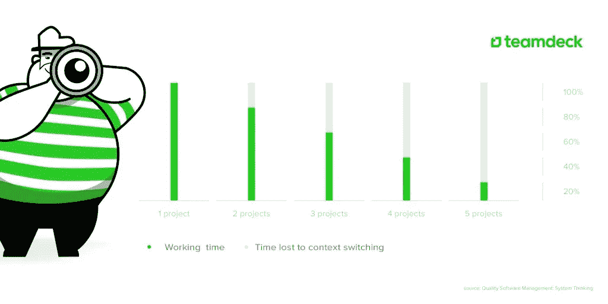

# 与程序员一起工作时，你可以做得更好的 10 件事

> 原文：<https://medium.com/hackernoon/10-things-you-can-do-better-while-working-with-programmers-68f92f671378>

如果让你猜程序员最讨厌的是什么，你会说什么？

一个 Quora 帖子问了这个问题，引发了超过 90 个回复和近 45 万次浏览。显然，在这个问题上有一些强烈的情绪。给我印象最深的是，这些开发人员抱怨的一些问题是完全可以避免的。

在这篇文章中，我想向您展示我们公司实施的项目管理最佳实践，这有助于我们维持适当的工作流程并保持员工的积极性。

我认为询问在 [Apptension](http://apptension.com/) 与我一起工作的开发者是否有他们不喜欢的东西会很有趣，这样我就可以将他们的观点与 Quora 的答案进行比较。

# 在与程序员一起工作时避免这些错误

在 Apptension，我们尽最大努力保持一个快乐和高效的工作环境，这一点我们已经纳入了[我们的雇主品牌战略](http://blog.apptension.com/2017/04/11/how-do-we-use-employer-branding-for-hiring-it-professionals/)。

所以我问了我的同事一个问题:程序员讨厌什么？

这是他们告诉我的。

# 1.糟糕的要求

有时是需求差距、未指定的项目或客户、项目经理和开发人员之间不清楚的沟通导致了有缺陷的软件。

如果客户或经理对他们的产品不够具体，他们就不应该指望其他人能读懂他们的想法，并做他们没有恰当解决的工作。

收集尽可能完整的项目规范是经理的工作，所以开发人员不需要猜测或询问规范。

# 2.可重复任务

一遍又一遍地做事情不仅会令人厌烦，还会让人筋疲力尽。

这里的问题可能是，例如，长时间从事一个项目。也可能是客户在某个功能上又改变了主意。

无论哪种方式，如果一个开发人员对他们正在做的可重复的任务感到筋疲力尽，也许是时候你和他们谈谈了。

如果可以，把你的员工调到另一个项目。有时候，一个简单的工作任务的改变会让员工精神振奋，保持动力。在 Apptension，我们使用 Officevibe 进行匿名员工调查，以衡量他们的满意度。

# 3.技术债务

[技术债务](https://en.wikipedia.org/wiki/Technical_debt)是使用简单解决方案而没有考虑项目未来可扩展性的结果。

换句话说:这是选择一种快速简单的方法来做某事的结果，这不一定是最好的解决方案。

开发者讨厌技术债的原因很简单:

就像金融债务的情况一样，将有一个“偿还”的时刻，这在发展中意味着再次解决同样的问题。

为了修复它，开发人员通常需要重写代码来完成“未完成的工作”。它还导致错过最后期限，因为很难估计需要做多少工作来偿还债务。

解决方法:不要因为计划好了事情就好像变得更容易而陷入其中。思考可能的最佳解决方案，然后一劳永逸地执行。

# 4.任务不够或太多

员工利用不足会导致动力下降，而过多的任务会导致精疲力竭。

一个好的公司可以通过实施适当的资源管理来防止这两种情况。像 [teamdeck](https://teamdeck.io/) 这样的工具可以帮助维护项目之间正确的资源流动，并监控团队的利用率。

# 5.中断

程序员需要 45 分钟才能进入所谓的“区域”，这是一种最专注的状态，确保最高的生产率。另一方面，摆脱它要快得多。有时候，只需要当面问一个问题，或者通过 Slack 这样的信使问一个问题。

另一种形式的中断是上下文切换。例如，当一个开发人员在一天中从事几个不同的项目时，就会发生这种情况。

这实际上可能会导致公司损失时间或项目延迟，因为员工需要一些时间从一个项目切换到另一个项目。

在管理项目时，尽量计划好项目的每个细节，避免在开发人员工作期间打扰他们。

对于小的干扰，通常执行“耳机规则”，这意味着如果开发人员戴着耳机，不要接近他们。关于项目的重要问题试图在 scrum 会议上解决——这就是他们的目的。

这会让他们的工作压力更小，效率更高。

# 6.不必要的会议

并不是每次会议都应该举行。当然，你不需要让开发人员参与其中的大部分。

然而，有些会议需要开发人员出席，比如 sprint 规划、项目评审或回顾。在这里，他们可以回答技术问题或对流程进行评论。

安排会议，决定开发人员是否真的应该参加。如果没有，他们可以把时间更有效地花在给定的项目上。

# 7.错误的 QAs

确保代码的高质量是很重要的，而且大多数开发人员都理解 QAs 的作用。

程序员讨厌的是不合格的测试人员，他们打断他们的工作，而不是用有意义的报告来改进代码。

当糟糕的 QA 优先考虑错误的问题，关注于旁观者而不是主要问题，或者当他们在 bug 报告中遗漏关键信息时，它们尤其令人讨厌和具有破坏性。

另一方面，好的测试人员可以保持软件的质量，帮助开发人员工作，而不是打断他们的工作。

在雇佣质量保证团队成员的同时，尽你所能做出最好的选择，因为这不仅会导致软件的巨大质量，还会让他们和开发者之间的伙伴关系不那么痛苦。

# 8.不明确的时间表

对于软件开发中的每一项任务，都应该有一个明确的预定时间。

里程碑有助于定义某个特性应该何时完成，以及开发人员应该何时部署产品。

不明确的时间表或缺少时间表会使团队更难承担项目的优先级，并按时交付项目。

创建更好的时间表的另一个原因是开发人员工作的团队性质，通常需要几个人同步来交付一个给定的特性。

运行一个项目，分析它的每一个阶段，包括 scrum 会议、交付特性的截止日期和交付日期。然后在开发人员的日历上做上标记。

# 9.不包括冲刺计划中的事件

一致的项目管理有助于开发人员在正确的时间专注于正确的任务。

在开发人员的日程表中包括像冲刺评审、回顾、计划和每日站立会议这样的事件，保证了项目的正确流程。

如果不这样做，每一次电话会议对程序员来说都是一种干扰，你已经知道这对他们来说既烦人又有破坏性。

# 10.以小时估算任务

以小时来估算任务通常被认为是一种简单的解读。

由于[编程](https://hackernoon.com/tagged/programming)任务对于不同的员工来说需要不同的时间，很难设定一个明确的完成时间表。

然而，仍然有许多经理要求估计时间，并把它们当作最后期限。

虽然对一个公司来说，估计一个给定的项目需要多长时间是很重要的，但应该根据最近的类似项目来做，并且总是假设这并不意味着一个新项目需要这么多时间。

为了提高你的估计，你可以考虑故事点。这是一个 Scrum 概念，用来评估一个故事的工作量。故事点包括工作量及其复杂性。

如果一个公司跟踪故事点，他们可以更好地根据过去的类似故事来评估项目。

# 结论

知道了这些开发人员的痛点，你就可以让你的员工保持积极性，专注于正确的事情。

在你的公司里避免这些可能有助于为你的团队创造一个[更快乐的工作场所](http://blog.apptension.com/2016/10/14/6-office-redesign-ideas-for-a-happier-workplace-tried-and-tested/)。

研究显示，快乐的员工比不快乐的员工多 12%的生产力。

*你还有什么想补充的吗？欢迎在评论中与我们分享。*

*原载于 2017 年 4 月 20 日*[*blog.apptension.com*](http://blog.apptension.com/2017/04/20/10-things-you-can-do-better-while-working-with-programmers/)*。*

> [黑客中午](http://bit.ly/Hackernoon)是黑客如何开始他们的下午。我们是 AMI 家庭的一员。我们现在[接受投稿](http://bit.ly/hackernoonsubmission)并乐意[讨论广告&赞助](mailto:partners@amipublications.com)机会。
> 
> 如果你喜欢这个故事，我们推荐你阅读我们的[最新科技故事](http://bit.ly/hackernoonlatestt)和[趋势科技故事](https://hackernoon.com/trending)。直到下一次，不要把世界的现实想当然！

