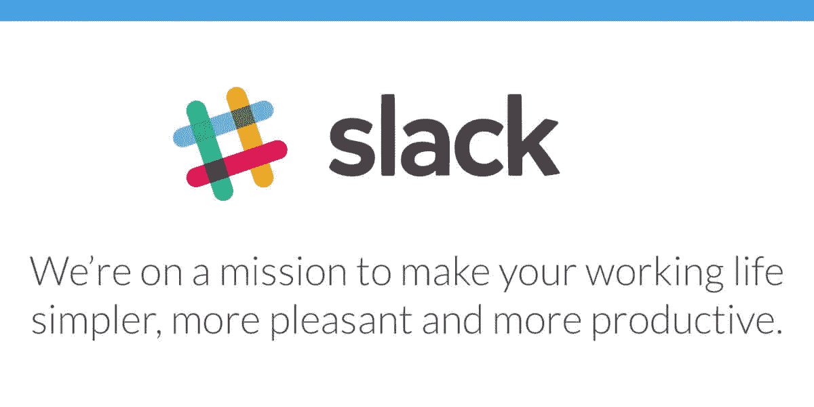

# 驯服松弛超载的 10 个技巧

> 原文：<https://medium.com/hackernoon/10-tips-for-taming-slack-overload-416431539c6>

## 分享一些快速驯服[懈怠](https://medium.com/u/26d90a99f605?source=post_page-----416431539c6--------------------------------)超负荷的小技巧…

Slack 是一个很棒的工具。但这还不是魔术。我非常欣赏他们的使命:

但有时我可以发誓，这让我的生活变得更加复杂，增加了认知负荷，让我变得不那么有创造力。不是懈怠本身…而是我们对工具的使用。

Slack 代表了组织中所有极其复杂的沟通渠道。你需要经常整理频道和它们的用途，否则整个事情会爆炸。这也是我喜欢 Slack 的一点……它迫使你直面你对团队成员的期望，让你的工作协议变得清晰(但具有可塑性)。

每当我听到有人说“我讨厌懈怠”，我实际听到的是“我讨厌我们模糊的沟通渠道和工作协议在懈怠中的体现”。就此，我分享一些对抗[松弛](https://medium.com/u/26d90a99f605?source=post_page-----416431539c6--------------------------------)熵的技巧。

1-保持消息的主题(和风格/类型)与渠道的目的相关。

2-创建频道时，考虑将填充频道的消息。理想情况下，渠道中的消息应该在以下六个方面具有相似的特征:

*   这些信息的可操作性如何？它们是问题/请求，还是更一般的性质(供参考，公告)？
*   邮件需要多快得到处理？
*   这些信息有多重要？
*   这些信息的受众有多窄或多宽？
*   你认为这些信息产生的交流会持续多久
*   从主题角度来看，这些信息有多相似？

*注意:这并不意味着每个频道都应该是超级特定的。这只是意味着超级一般的渠道不是超级具体的对话的最佳场所。*

注意:紧急并不总是意味着重要。“嘿，我们要在大厅吃午饭”需要快速阅读和行动。它没有生产中的一个主要问题重要。

3 —定期检查您的渠道。他们漂移/进化了吗？

4 —区分应由所有成员“阅读”的渠道(例如公告，每个人都应该阅读所有消息)和 2)用于获得答案、快速协作等的渠道。(在这里你可以浏览提及的内容，大多数情况下忽略其他内容)。

*   发布到公告渠道稀疏。限制在这些频道上讨论
*   为特定的渠道制定工作协议，如“我们在 __ 分钟内解决问题”或“每个人都在关注问题”或“每个人都阅读这些帖子”。把这个放在频道的目的中。

5-对于常规(更具体的)话题，创建新的永久频道。示例可能包括协调部署、审查 PRs 等。

6——拥有“大量渠道”并不是一件坏事，只要没有大的目的重叠。

*   Slack 有大量的特性可以让频道管理变得更加容易
*   查看边栏选项(隐藏最新频道)和通知关键词
*   使用键盘快捷键(我最喜欢的是通过名字快速访问频道的命令 K)
*   **简而言之，驯服大量通道比驯服钝线和通道更容易**

7-在每个请求/问题中，记得阐明你想要的下一步。你需要从人们那里得到什么？谁能帮忙？

*   考虑符号的创造性使用:(例如，待办事项的复选框，或:眼睛:必读项目)。它使扫描更容易
*   请记住，复杂的问题可能需要面对面(或视频会议)的互动
*   想象有人在游戏中迟到。他们会知道所有的背景吗？
*   考虑写一篇总结文章来理清思路

8 —你的信息中应该有一个“@”。

*   如果你需要特定人的关注，记得“@”他们。如果你回复一个特定的人“@”他们
*   “@here”用来引起有空的人的立即注意，也许能帮到你。“@here”基本上就是问大家这个问题。
*   @here **不是**表示某事重要的好方法
*   如果你的信息中没有提到“@”，那么要么这个频道是基于公告的，要么可能是专门针对一般问题的。记住……通灵者是否期望必须阅读每一条信息？

9-为即席讨论创建新渠道。线程是一个好主意，但是它们往往会导致更多的混乱，而不是解决问题(按照目前的设计)。频道>线程。他们有超能力(而且不讨人厌)。遵循以下准则:

*   添加前缀…d =讨论，i=要解决的问题
*   添加特定的后缀(例如 d_jira1394)
*   参考通用渠道中的讨论(“我们将在 ____ _ _ _ _ 中讨论 _ _ _ _)
*   有一个“目的”。指明将触发渠道关闭的结果
*   一旦达到结果，就关闭频道
*   使用星号功能在您的边栏上保留活跃的即席频道(请参阅边栏上包含星号频道的设置)

10-如果一个特定的对话涉及许多来回(并且偏离了通道的目的)…它应该在一个特别的通道(见上文)或一个线程中。不要让它污染当前的渠道

什么对你有效？你如何让时差为你和你的团队工作？