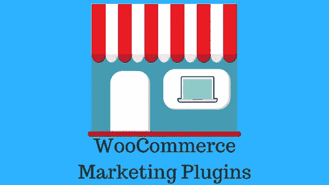
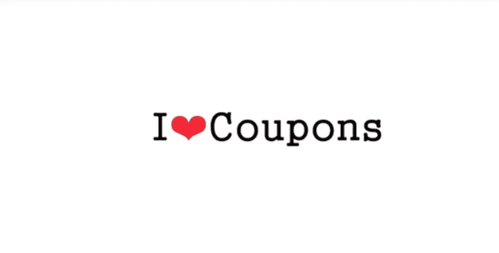
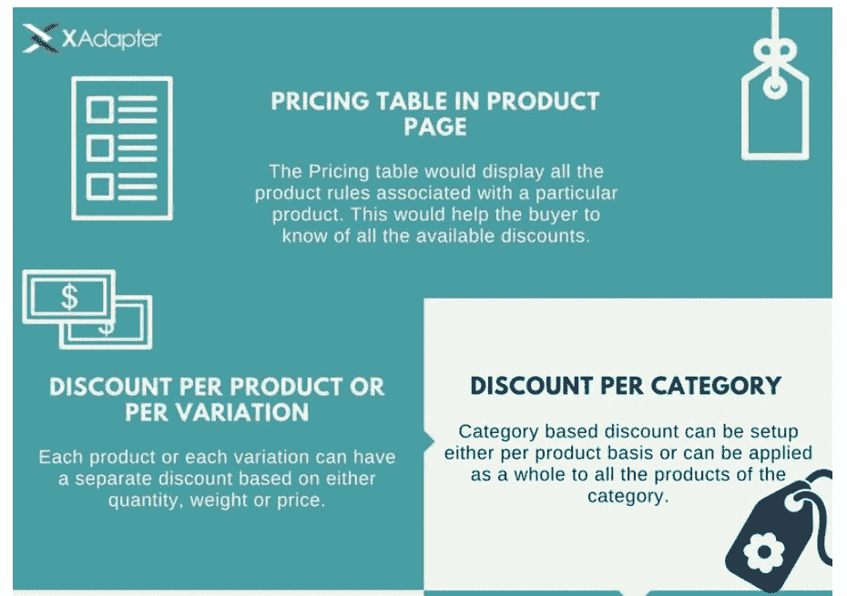
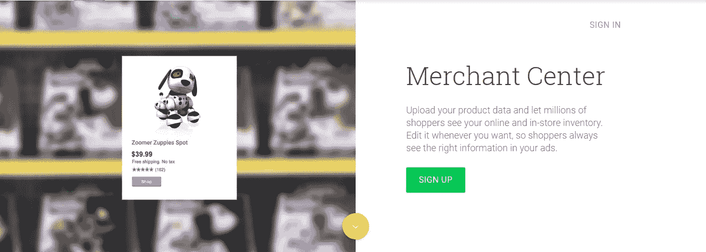

# 10 大 WooCommerce 营销插件

> 原文：<https://medium.com/hackernoon/10-top-woocommerce-marketing-plugins-ddd659d86095>

持续的营销努力有助于确保你的 WooCommerce 商店在你的潜在客户中产生持久的反响。你已经知道了你可以尝试提高销售额的各种策略。然而，为了始终保持你的营销目标，你可能需要使用各种工具。这些工具将确保你的营销工作是精简的。而且，即使你的重点转移到商店管理的其他方面，他们也能确保你的营销工作按计划进行。这篇文章旨在为你提供一个顶级 WooCommerce 营销插件列表，它将极大地帮助你完成工作。

# 顶级 WooCommerce 营销插件

营销插件分散在不同的功能中，第一眼看上去甚至没有任何明显的相似之处。让我们来看看一些受欢迎的，可能对你的商店真的有用。

# [智能优惠券](https://woocommerce.com/products/smart-coupons/)

优惠券是在你的 WooCommerce 商店提供折扣的好方法。WooCommerce 为[创建和管理优惠券](http://learnwoo.com/woocommerce-manage-coupons-store/)提供了广泛的选择。然而，智能优惠券 WooCommerce 扩展可以帮助你做得更多。该扩展帮助您批量生成优惠券，并提供一个单击即可应用这些优惠券的选项。当客户购买某些特定产品时，您将能够自动向他们发放优惠券。此外，您可以允许客户购买积分或礼券，或者提供嵌入在链接中的优惠券。此外，您可以使用自己独特的品牌来个性化您商店上的所有优惠券。

## 使用智能优惠券的一些优势

智能优惠券扩展可以帮助你管理大量的优惠券。其中一些是:

易于处理的礼券

礼券现在非常受欢迎，因为它给接受者提供了一个选择礼物的机会。然而，有些人可能会说，它带走了精心设计的礼物的个人魅力，但对于其他人来说，这是一个无风险的选择。智能优惠券扩展允许您的客户使用自定义消息向多人发送礼券。

出售商店信用可以帮助你留住顾客

从您的商店购买积分意味着客户发现了价值，会回来并在以后从您的商店购买一些东西。这对提高客户参与度和重复购买有很大帮助。使用此扩展，您可以轻松地向客户提供商店积分。

将优惠券链接到产品

为下一次购买提供折扣券是确保重复购买的一种有效方法。智能优惠券扩展帮助您自动设置这一点。因此，你可以忘记它一旦建立，并有效地提高转化率。

出色的设计选项

智能优惠券扩展还提供了很好的选择来个性化您的优惠券设计。您可以使用插入工具将优惠券插入到内容编辑器中，并通过 CSS 保持对设计的完全控制。

该扩展提供了与 WooCommerce 的无缝集成，你真的可以用它增强你的折扣策略。无论是在季节性促销活动中，还是在有针对性的营销活动中，这个工具都非常方便。你可以花 99 美元购买一个网站订阅。5 个站点和 25 个站点订阅费分别为 129 美元和 199 美元。

# [动态定价](https://www.xadapter.com/product/dynamic-pricing-discounts-woocommerce//affiliates=22)

动态定价插件有助于根据购买的商品数量或特定的客户角色设置变化的价格。它们对于促进相关产品的大量购买甚至交叉销售非常有用。您可以通过创建折扣表来为单个产品创建批量优惠。有固定价格或百分比调整的选项，甚至角色特定的比率。您还可以根据类别或购物车规则设置价格调整。XAdapter 动态定价插件提供了在产品、组合、购物车和类别级别设置动态定价的强大选项。

## 你能用这个插件做什么？

它以多种方式帮助你在你的 WooCommerce 商店上建立一个动态定价策略。以下是一些例子:

*   根据产品、变化、组合、购物车商品、类别、数量、重量、价格或用户角色提供折扣。
*   设置百分比或固定折扣，或固定价格。
*   设置一个最大值，以确保折扣不会超出您的估计。
*   按购买日期或日期范围限制折扣。
*   根据之前的订单数量或订单总额为回头客提供特殊折扣。
*   对某些电子邮件 id 给予特别折扣。
*   当多个规则一起应用时，选择应用哪个规则的选项。
*   拖放功能来更改执行顺序。
*   每当顾客购买一定数量的产品时，重复规则。
*   定制可变产品的定价格式。
*   在产品页面的定价表中显示与特定产品关联的所有规则。

你可以花 69 美元获得这个插件的单站点许可。5 站点许可证的价格为 99 美元，25 站点许可证的价格为 199 美元。

# [谷歌产品提要](https://woocommerce.com/products/google-product-feed/)

Google Merchant Center 帮助您让您的产品信息对 Google shopping 和其他服务可见。您需要有一个商业中心帐户，以便在谷歌上投放您的产品广告。woo commerce Google Product Feed Extension 帮助您创建一个实时 Feed，向 Google Merchant Center 提供产品信息。

谷歌有一定的指导方针，关于什么所有领域包括在您的产品饲料。该扩展帮助您以指定的格式排列产品和变体上的数据。实际上，它自动化了向 Google 提供产品提要的整个过程。它甚至通过利用其额外的数据输入字段来捕获任何额外的数据需求。您可以将信息细节应用于您商店中的所有产品，或仅应用于某些类别。Google Product Feed 扩展与[产品导入套件](https://woocommerce.com/products/product-csv-import-suite/)兼容，因此批量导入信息非常容易。你可以以 79 美元购买单个站点的扩展，99 美元购买 5 个站点的扩展，199 美元购买 25 个站点的扩展。请记住，该扩展不支持 WooCommerce 订阅或预订。

# 【WooCommerce 的 Mailchimp】

Mailchimp 是一个营销自动化平台，可以自动化您与客户的联系。它对品牌建设和销售改善有很大帮助。它拥有超过 1600 万客户，是同类产品中最大的。WooCommerce 提供与 Mailchimp 的免费集成，这有助于将您的客户数据与您的 Mailchimp 帐户同步。同步数据后，您可以轻松地向客户发送有针对性的活动、产品推荐和跟进电子邮件。此外，它还可以很好地帮助您回收废弃的购物车，并评估您的业务发展计划的投资回报(ROI)。

## WooCommerce Mailchimp 集成的一些突出特点是:

*   同步客户和购买数据
*   就已查看的商品或购物车上的商品向客户发送提醒。
*   购买后向客户发送跟进邮件。
*   根据客户的购买历史和频率跟踪客户。
*   查看您的营销绩效指标。
*   在 Mailchimp 发起社交媒体活动。
*   嵌入表单以将客户更改为订户。

你可以从 WooCommerce 免费下载这个有价值的营销自动化工具。

# [简讯订阅](https://woocommerce.com/products/newsletter-subscription/)

WooCommerce 的时事通讯订阅扩展允许与 Mailchimp 和 CampaignMonitor 集成。借助这个扩展，您的客户可以注册您选择的不同列表。此外，这个扩展还附带了一些小部件，用于在侧边栏上显示注册表单，并显示您站点上最近的订户活动。您还可以轻松收集电子邮件营销活动的分析见解。

# [跟进](https://woocommerce.com/products/follow-up-emails/)

跟进电子邮件是保持顾客参与你的商店的一个好方法。购买后，发送电子邮件检查客户是否满意你的产品会有很大帮助。你的客户会觉得你在乎，这也会增加获得反馈的机会。据营销专家称，电子邮件营销仍然是企业最有效的增长动力之一。WooCommerce 跟进扩展帮助您自动化与客户的沟通渠道。此外，发送 Twitter 跟进消息也很有帮助。

总的来说，它增强了你的电子邮件系统，以确保你总是在跟踪你的营销工作。

## 跟进扩展的附加功能

*   使用 WordPress 编辑器轻松创建电子邮件。
*   自定义模板和个性化电子邮件。
*   向客户发送个性化的跟进推文。
*   将您的跟进电子邮件和推文分组，以建立一个活动。
*   全面了解您过去、现在和未来的所有活动。
*   获取详细的分析报告，了解您的营销活动的绩效。

你可以从 WooCommerce 网站上花 99 美元购买这个插件。5 个站点是 149 美元，25 个站点是 249 美元。通过购买，您可以获得一年的更新和专门支持。

# [产品评论](https://woocommerce.com/products/woocommerce-product-reviews-pro/)

众所周知，在电子商务领域，产品评论会增加你网站的销售转化率。根据研究，超过 60%的顾客认为他们更有可能从有评论的商店购买。超过 85%的电子商务客户表示，他们会在购买产品前阅读产品评论。你的核心 WooCommerce 安装有一套很好的选项来设置产品评论。你可以[在这里](http://learnwoo.com/woocommerce-how-to-configure-products-settings/)阅读更多关于商品评论设置的内容。然而，WooCommerce 产品评论专业版有助于为您的评论添加更多功能和更好的过滤选项。此外，你可以鼓励用户上传他们购买的产品的图片和视频。

在这个扩展的帮助下，您可以添加特定的评论问题，帮助潜在客户更好地了解您的产品。您还可以决定您的客户可以发布什么类型的评论。例如，您可以选择不在您的网站上启用视频评论。

# [销售倒计时](https://codecanyon.net/item/woocommerce-sales-countdown/7906953?ref=LearnWoo)

您可以创建不同的营销活动来推广特定产品或整个商店。为你的促销活动提供一点帮助怎么样？借助 WooCommerce 销售倒计时插件，你可以在商品页面显示一个计数器。计数器会告知客户在交易到期前还有多长时间可以购买产品。这是鼓励顾客从你的商店购买产品的好方法。此外，它还会显示一个倒计时器，通知您的顾客您的商店即将进行的任何销售活动。

# [WooCommerce 愿望清单](https://woocommerce.com/products/woocommerce-wishlists/)

为客户提供在你的网站上创建他们的愿望清单的选项，将会为客户参与和销售转化带来巨大的可能性。大多数情况下，当客户不想立即购买时，他们可以将该产品添加到愿望清单中，稍后再购买。对于顾客来说，这是管理他们生日、纪念日等购物的好方法。也是。与朋友和家人分享愿望清单也很容易。WooCommerce 愿望清单扩展帮助您允许您的注册客户保存他们的愿望清单 30 天。此外，客户可以创建无限的愿望清单，这很好。总的来说，这种扩展提供了一种持续吸引顾客的好方法。

# [缺货通知](https://woocommerce.com/products/woocommerce-waitlist/)

不用说，让你的顾客看到想要的产品缺货是很烦人的。然而，在这个扩展的帮助下，您可以将这种烦恼转化为一次成功的购买。该插件可帮助您跟踪商店中脱销产品的需求。而且，当产品有货时，它会自动通知您的客户。基本上，该插件创建了一个对特定产品感兴趣的客户的等待列表。因此，消费者更有可能会等待产品重新上市，而不是选择替代产品。

# 结论

在整洁有序的布局中设置一系列高质量的产品不足以确保你的 WooCommerce 商店的成功。你可能需要结合一套创新的营销举措，以确保客户参与和品牌意识。这可能包括从电子邮件营销到创造令人敬畏的定价策略。本文中提到的选项列表将有助于您在营销活动中找到有效的帮助。这些是目前最受店主欢迎的 WooCommerce 营销插件。请在下面的部分留下评论，让我们知道你对这个列表的看法。

*原载于 2017 年 10 月 17 日*[*【learnwoo.com】*](https://learnwoo.com/)*。*