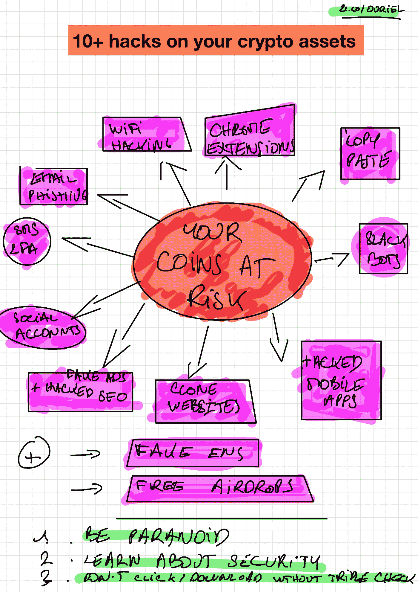
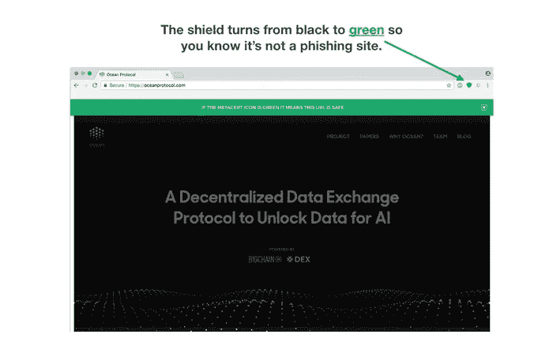
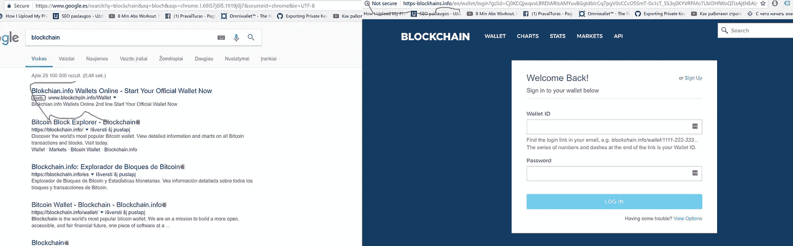
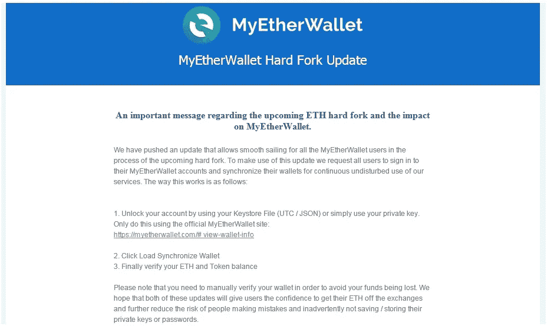

# 黑客用来窃取你的密码的 10 个聪明绝招(以及如何防范)

> 原文：<https://medium.com/hackernoon/10-tricks-hackers-use-to-hack-your-cryptos-82fc8a0a1bfe>

就安全性而言，对于消费者和密码购买者来说，密码丛林是一片混乱。

如果你曾经尝试过任何加密服务，你将不得不通过一个乏味的安全程序，其中包括复杂而长的短语和代码，以便记住或安全地存储在某个地方(无论这意味着什么)。是的，你控制着自己的资产，但要付出的代价是你要对自己的安全负责。由于大多数人都不是安全专家，他们经常在不知情的情况下暴露在外。我总是惊讶地看到我周围有多少人，甚至是精通技术的人，不采取基本的安全措施。

你处于危险之中，即使有一个超级安全的硬件钱包，这被认为是今天安全的黄金标准。事实上，大多数问题发生在你钱包的“连接点”，而不是钱包本身。 ***有风险的不一定是你的设定，而是你的注意力。***

这里有一些黑客喜欢使用的技巧来窃取你的私钥(窃取密码所需的信息)，甚至欺骗你将硬币/代币转到错误的目的地。

it’s dangerous out there. Attacks from all over.

**1。复制粘贴**:你看到一个你想要发送一些比特币的地址。你把这个地址复制/粘贴到你的钱包里。除了有类似[***CryptoShuffler***](https://www.kaspersky.com/blog/cryptoshuffler-bitcoin-stealer/19976/)***这样的东西，一个小程序，*** 会把你刚才复制的地址替换成另一个和原来无关的地址。它可以与任何类型的密码，包括复制你的密码管理器的主通行证(如最后一关)

**提示**:痛苦但贴好之后验证地址。如果你知道如何使用二维码。

**提示#2:** 不要安装时髦的软件，或者你不确定的应用程序。定期在你的电脑上运行反恶意软件(Bitdefender，MalwareByte)来清理你的电脑

**提示 2:** 使用一个[官方*ENS*ENS](http://ens.domains/)(下面会有更多的介绍)而不是一个容易出错且无法验证的地址。有的买的便宜，有的不便宜。但这是内心的平静。

**2。被黑客攻击的移动应用程序:**黑客可以发布[真实的虚假交易应用程序](https://www.hackread.com/fake-poloniex-cryptocurrency-apps-on-play-store-stealing-user-data/)来购买加密交易所(如 Poloniex)的资产，但你不会在任何地方交易……你只是在向一个虚假的黑客账户汇款。

更一般的安卓真的容易被黑(比 iOS 多)。你需要小心安装，并确保定期清理设备上的垃圾。

**温馨提示:**这里不要太花里胡哨。很明显(但不是全部)，你需要用 PIN 码、触控 ID 和/或 FaceID 来保护你的设备，给你的任何提供这种功能的应用添加双因素认证，并避免下载垃圾邮件。

**3。懈怠黑客机器人:**懈怠[上的机器人是瘟疫](https://bitcointalk.org/index.php?topic=2120020.0)。他们会在你的钱包上发出安全警告(当然这是不存在的)，他们会把你链接到一个网址，在那里他们会问你你的私人密钥。不要碰

**提示**:忽略闲置的机器人。当他们联系你的时候报告他们。也使用 [*元认证*](https://metacert.com/) 来保护你的松弛通道

**4。浏览器扩展**一些[扩展](https://www.bleepingcomputer.com/news/security/chrome-extension-embeds-in-browser-monero-miner-that-drains-your-cpu/)声称它们将改善你在交易网站上的用户体验。除了他们可能会在同一时间阅读你所有的打字。坚持丑陋的用户体验，你会更安全。

**提示:**不要下载任何加密扩展。浏览器在“私人模式”，通常扩展被禁用。或者只为此使用新的浏览器。可以看一下 Brave 这款内置钱包的区块链原生浏览器

**5。克隆网站:**你开始输入一个网站的网址，然后你的地址栏已经被另一个相近的网址黑掉了，指向一个非常相似的网站，有着一模一样的观感和 logo。小心点。

Cryptonite Chrome extension

**提示** >寻找 https 证书+使用 Cryptonite[Chrome](https://chrome.google.com/webstore/detail/cryptonite-by-metacert/keghdcpemohlojlglbiegihkljkgnige)/[Firefox](https://addons.mozilla.org/en-US/firefox/addon/cryptonite-by-metacert/)扩展，可以突出虚假网址

6。假谷歌广告/搜索引擎优化:这是一种众所周知的技术。你在谷歌上搜索你最喜欢的(或不喜欢的)加密网站，但黑客会用相似的网址(包括一个小的变化)占据付费最高的结果(或有机的),然后欺骗你去他们的网站。

fake URL in Google ads

提示>点击后仔细阅读网址

7 .**。虚假社交账户**:小心，只关注经过验证的账户，或者点击你想关注的服务的官方网站上的社交链接。[不要相信任何其他来源](/the-adex-blog/scam-alert-adex-site-clone-fake-twitter-account-99d0fb3d9d11)甚至推特/脸书推荐算法，它们可能会推送新的虚假账户。

**8。手机短信 2FA**

这是一个众所周知的问题。服务会要求你的手机号码注册或激活 2FA(双因素安全),但是，特别是在美国，一些黑客[非常擅长欺骗移动运营商](https://techcrunch.com/2017/09/18/ss7-coinbase-bitcoin-hack-2fa-vulnerable/)支持团队，获得你的证书，并从那里获得与你的手机关联的任何账户。

提示:询问您的运营商如何保护您的手机

**提示#2:** 永远不要使用任何需要您的电话号码的服务，也不要用短信设置 2FA(使用软件解决方案)

**9。电子邮件钓鱼**

你收到一封来自你认识的服务商的邮件，[但这不是他们发来的](https://cointelegraph.com/news/225-million-lost-as-cryptocurrency-investors-get-hooked-by-phishing-scams)。他们将使用完全相同的格式，模板，设计。很多时候服务甚至没有你的电子邮件，但没关系，你不会记得。切记，不要盲目点击

fake

***提示:*** 注意你点击的链接，在浏览器链接部分观看它们。如果看起来很奇怪，就出去。

10。Wifi 黑客

你可能已经看到新闻了，但是 WPA，大多数 wifi 路由器使用的安全协议已经被破坏了。有了这个[“黑客攻击”](https://arstechnica.com/information-technology/2017/10/severe-flaw-in-wpa2-protocol-leaves-wi-fi-traffic-open-to-eavesdropping/)任何人都可以看到通过你的 wifi 网络的所有数据。类似的问题也发生在公共 wifi(如机场 Wifi)上。

提示:修好你的路由器，检查更新，永远不要在公共 wifi 区域交易(至少在没有安全 VPN 的情况下)

**奖金 1:假 ENS**

ENS 相当于钱包地址的 email/DNS(关于这个话题的长文很快就会出来)。许多优秀的 ico 都使用它来代替容易出错的地址。它是类似于*的东西。但是一些黑客[会在论坛上发布假的 ENS](https://blog.ambrosus.com/be-very-paranoid-with-security-ico-warning-from-ambrosus-team-728d1ceb5055)会让它看起来像是他们拥有一个相近名字的原始 ENS(this ico . eth 而不是 thatICO.eth)。*

***提示**:确保只参考公司提供的 ENS，并在之前仔细检查*

***Pro 提示:**如果你设置了一个 ICO，给自己弄个 ENS(包括错别字)，即使你不打算用*

***奖励 2:免费空投***

*空投是免费令牌的随机分发，以奖励现有令牌持有者或吸引更多用户参与自举加密服务。这听起来很棒。你打开钱包。惊喜！免费代币。有些人会声称有空投，但实际上没有。有些会提供实际的令牌，让你注册到他们的 scammy 网站，并获得你的私人信息。非常小心*

# *总结这一切只有一个技巧:格外小心*

**ps:我错过了什么吗？如果您知道任何其他技巧，请评论/完成/纠正？**