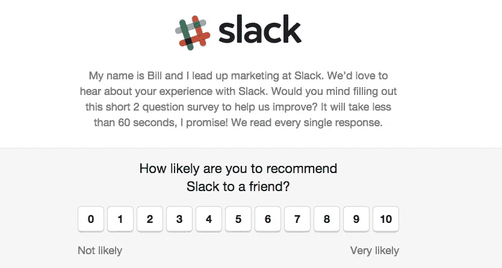
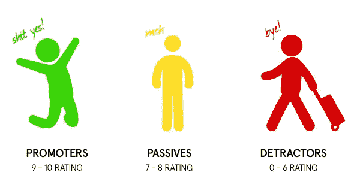
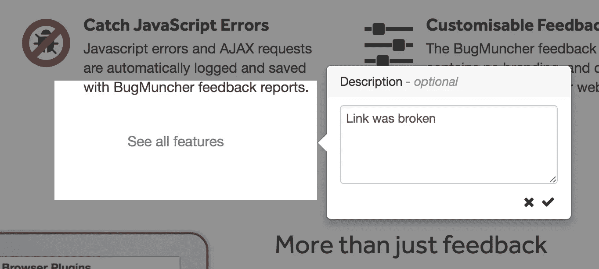
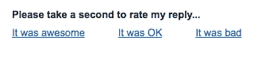
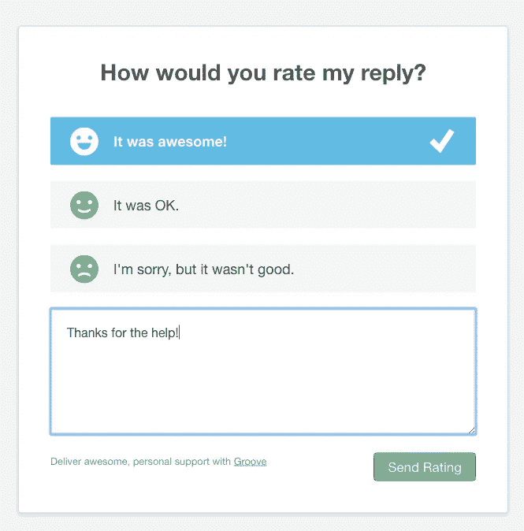
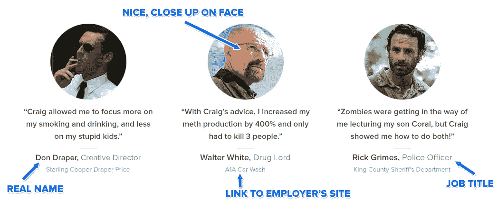
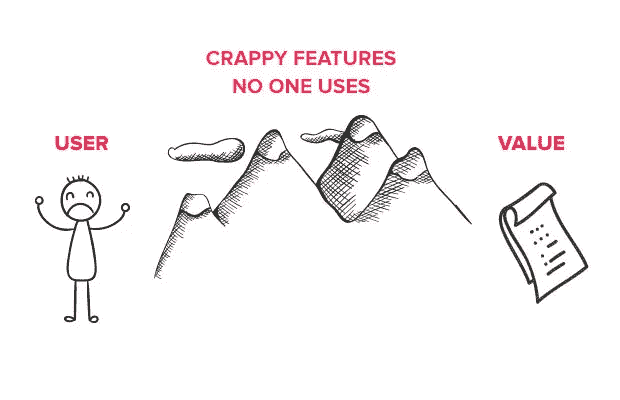
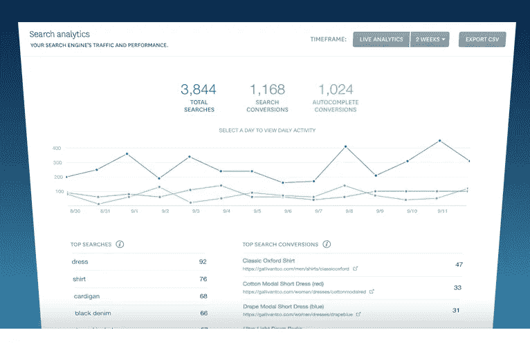

# 打造更好产品所需的 10 种用户反馈

> 原文：<https://medium.com/hackernoon/10-types-of-user-feedback-you-need-to-build-a-better-product-be1b9b979d4b>

## 你曾经问过你的产品的用户他们喜欢它吗，让他们告诉你它棒极了，超级容易使用，他们喜欢它吗？

我打赌这让你感觉很棒，不是吗？

嗯…坏消息…那种反馈很糟糕，听到它除了让你内心感到温暖和模糊之外，对你没有任何好处。

为了获得反馈，你实际上可以**用来构建更好的产品，**你需要知道要问的**正确问题，以及要寻找**的**正确答案。**

简单地询问你的用户喜欢你的产品是浪费时间，因为它总是会得到相同的回应。

几年前，我在我加入的第一批创业公司中担任首席 UX 设计师。我们是一个 6 人的小团队，我是唯一的全职设计师/ UX。

我们与大多数用户有着非常密切的个人关系，因此很容易获得用户反馈。

问题？几乎每个人都说了同样的话。

***我们爱它！太棒了！太神奇了！难以置信！***

但是他们的行为显示了一个不同的故事。该产品的许多部分仍未被触及，很少被使用。很明显，人们对某些功能的用途感到困惑，经常把它们用在错误的地方。

但是当被问到这件事的时候？

***我们爱它！太神奇了！***

那么，为什么会发生这种情况呢？

同样的原因，当被问到“你觉得它怎么样”时，几乎每个人都会这样回答。

这是因为他们觉得必须说是，因为这显然是你想听到的答案。

例如，假设你的孩子，或朋友的孩子，或任何孩子，兴奋地跑过来给你看他们在课堂上画的糟糕的手指画。

他们用小狗一样的眼睛看着你，说…

“我为你做的！你喜欢吗？”

*“我讨厌它！！多么可怕的一堆狗屎！”*显然**不是这种情况下的预期答案**。

孩子在哭，而你在周围人的眼里已经变成了“没有感情的怪物”。

正确的反应是表扬孩子，然后一天后把它扔掉(是画，不是孩子)。

关键是，这被称为问一个**引导性问题，**因为这个问题的措辞方式**将这个人引向**期望的答案。

如果你问的都是这些类型的引导性问题，你就没有从人们那里得到关于你产品的准确反馈。

但是不用担心，希望就在这里！在本文结束时，你将知道你应该收集的反馈的确切类型，以及如何在不使用引导性问题或成为一个没有感情的怪物的情况下获得反馈。

# 现在我将介绍你应该收集的 10 个最重要的用户反馈，如何收集，以及为什么它对你的产品的成功如此重要。

> ***嘶…*** *想要一个设计更好的产品？通过* [*下载我的免费电子书《5 分钟 UX 快速修复》,在 5 分钟内提高你的 UX。在这里下载本书*](https://usabilityhour.com/5minute-ux/) *。*

# 1 —他们向朋友推荐你的产品的可能性有多大？

如果这听起来很熟悉，那是因为它应该如此。这可能是数码产品使用的最广泛的“反馈收集”策略。

它被称为**净推广者分数**，这是一个准确衡量用户对你的产品满意程度的好方法。

# 为什么 NPS 评分这么重要？

NPS 评分是一个重要的指标，因为研究表明，人们只有在对产品本身感到满意时，才会愿意分享或推荐产品。

为什么？因为推荐某样东西意味着你在拿自己的名誉冒险。如果你告诉一个朋友使用某样东西，而他们最终讨厌它，他们可能再也不会信任你了(尤其是在整个手指绘画事件之后)。

我认为 NPS 是你的用户“幸福水平”的一个强有力的指标，也是你的 UX 和产品设计有多有效的一个很好的指示。

除此之外，用户还会被问及为什么他们会给出这样的答案。这开启了你和这些用户之间的对话，以进一步调查他们不开心的原因。

# 你如何收集你的 NPS 分数？

收集这些反馈的方法并不太复杂。您可以简单地向您的用户发送一份调查，询问以下问题:

*“您向朋友推荐该产品的可能性有多大？”*

答案以 1-10 的数字形式给出。

在用户给出一个评级后，他们会被要求提供一个开放的文本答案，说明他们给出这个答案的原因。这个问题是可选的，因为你真正需要的是数字。

之后，用户被分为三组:

1.  促销员(9-10 分)
2.  无源器件(7-8 级)
3.  贬低者(0-6 分)

你通过从推销者的百分比中减去贬低者的百分比来计算你的分数。

为了得到一个准确的，一步一步的免费快速设置这个系统的指南，[在这里下载我的免费 NPS 评分指南+视频教程](https://app.convertkit.com/landing_pages/188553?v=6)。

# 2 —他们遇到了什么错误或问题？

根据我的经验，我发现一些创始人和产品经理非常害怕发布不完美的产品。

在他们发布新功能之前，他们想一次又一次地测试它，直到他们解决了每一个 bug。

这就好像一个用户遇到了一个 bug，由于极度尴尬，整个公司马上就要垮掉了。

事实是，在发布产品之前，几乎不可能追踪到每一个 bug，这是对宝贵时间的巨大浪费。

# 为什么了解软件缺陷如此重要？

持续的产品测试的问题是它花费了大量的时间和金钱。

对于大多数创业公司来说，时间是他们拥有的最宝贵的资源。你花在追踪 bug 上的时间越多，你收集有价值的用户反馈的时间就越少，这些反馈会影响用户的满意度。

信不信由你，对于用户来说，遇到一个 bug 不是一件成败型的事情。然而，无法弄清楚如何使用你的产品并从中获取价值是一件事关成败的大事。

# 如何更快地发现产品中的 bug？

让你的用户成为你的产品测试者。听起来很疯狂，对吧？但是仔细想想。每天都有一大群人在使用你的产品。

成百上千，甚至可能成千上万的人可以在 3 天内发现 300 个 bug，而你的团队要花 6 个月的时间才能找到它们。

让您的用户能够快速准确地报告错误意味着您可以在最短的时间内跟踪并修复错误。

前几天我在 Reddit 上偶然发现了这个名为 BugMuncher 的[伟大产品，它让用户能够快速截屏一个 bug，并记录重要的统计数据，如操作系统、浏览器类型、版本等。](https://www.bugmuncher.com/)

考虑实现这个产品，或者你自己的一个类似的解决方案，允许用户**快速而容易地**报告错误。

我指的不是一个让他们描述发生了什么的大文本框，我指的是一种在 15 秒内报告的简单方式，这种方式不会让他们离开他们当前所在的页面。

# 3 —他们对你的客户支持有多满意？

你的客户支持团队就像是不满意用户和超级满意用户之间的桥梁。超级满意的用户更有可能成为你产品的推广者，这意味着他们会向其他人推荐你的产品。

促销员好。你想要推销商。

这就是为什么持续监控人们是否对他们得到的支持感到满意是极其重要的。

几乎同样重要的是**你如何着手**收集这些数据。它需要快速和简单的人来评价客户支持互动。

我经常会收到类似*的跟进邮件，“请帮助我们，并对您获得的支持进行评级……”*

我从不回复这些邮件，只是因为一封新邮件出现在我的收件箱里意味着我需要处理另一件事，因为我知道我可以跳过它，所以我会这样做。

# 您如何让用户轻松评价他们的支持体验？

在我看来，Groove 使用了最好的解决方案之一，那就是让用户能够在每封电子邮件的底部对他们的支持互动进行评级。

你知道你在电子邮件签名中看到的类似“请评价我们的体验”的小东西吗？

这是一个很好的方式，让人们能够评价他们的体验，同时保持所需的努力非常低。

点击这些链接中的任何一个，这个人就会进入一个预先填充的只有一个问题的调查，并可以选择解释更多内容。这是一个完美的设置。

然后，Groove 通过从“良好评级”中减去“不好”评级来计算用户的“满意度”。

# 4-自签约以来，他们是否寻找过替代方案？

如果你的产品甚至是半成功的，这意味着你选择了一个利基市场，这个市场对你提供的产品有很高的需求。

这很好。这意味着人们实际上想要你的产品，而不是你凭空想出来的。

但是，这也意味着你几乎肯定会有许多竞争对手，他们的产品与你的产品相似，如果不是完全相同的话。

这也不错。**别忘了，竞争意味着需求。**

就像任何其他传统企业一样，如果用户的满意度开始下降，他们总是可以选择转向竞争对手。

有时，用户会“调情”切换的想法，而没有真正采取行动。如果你能及时抓住这些人，你就有可能说服他们留下来。

# 为什么这如此重要？

收集这种反馈很重要，因为它提供了一个绝佳的机会**来发现你的产品的主要问题**，这些问题是如此严重，以至于导致你失去一个用户。

一直在寻找替代品的用户不太可能会告诉你…“一切都很好！我爱死了！”

这个阶段的用户是收集反馈的完美人选。

如果你能解决每一个问题，这意味着你可以大大降低你的流失率(离开和不再回来的用户数量)，并让更多的用户每月回来。

# 如何发现用户是否一直在寻找替代品？

简单地问他们。有很多方法可以做到这一点，比如通过电子邮件发送调查，或者使用像 [Intercom](https://www.intercom.com/) 这样的产品在产品界面上提出问题。

**重要的是你问他们两个问题:**

1.  你加入后有没有寻找过替代方案？
2.  如果是，您在竞争对手的产品中寻找我们没有的东西？

为什么不直接问他们关注竞争对手的原因？因为这个问题不够直接。用间接的答案来问大问题会吓跑那些对必须如此详细地回答感到厌烦的人。

这些开放式的答案可能是你从未考虑过的信息金矿。也许你们的价格太高了？也许你的产品太慢，太旧，或者没有他们正在寻找的特定功能？

考虑与这些人进行实时 Skype 通话，深入了解他们的问题和可能的解决方案，让他们留下来。

请记住,**听用户的话**和**做用户说的话**是完全不同的事情。不要做用户说他们想要的，而是倾听，然后给他们他们需要的。

# 5 —他们使用你的产品有什么结果？

人们注册你的产品仅仅是因为一个原因……你向他们保证它会以这样或那样的方式改善他们的生活。

要么通过**节省他们的时间、金钱、压力、努力**或者增加他们的快乐。

他们注册正是因为你在你最近实现的[高度转化创业登录页面](https://usabilityhour.com/resources/betterlandingpage/)的标题中向他们承诺的。

如果你的产品已经很好地完成了它的工作，在一段时间后，他们的生活应该会更好。

通过收集这种类型的反馈，你想知道的就是到底有多好。

# 为什么案例研究如此重要？

用户的成功案例将在两个方面帮助你:

1.  发现你可能没有意识到的产品优势。
2.  通过提供以结果为导向的推荐，为你的登陆页面转换提供巨大的推动力。

在登陆页面设计中，将访问者转化为用户的一大部分工作是首先让他们明白使用该产品的好处，然后说服他们你确实可以实现你的承诺。

这就是用户成功案例的来源。

发现用户体验的新好处会给你一个机会 [**在你的登陆页面**](https://usabilityhour.com/landingpage-feedback/) 上写更有效的文案，或者更好的是，吸引一批全新的用户来使用你的产品。

至于说服他们你真的能做到吗？这就是推荐的来源。

以一个用户的故事为特色，详细描述他们得到的确切结果，将有助于增加那些对注册持观望态度的人的信任度。

如果你想了解更多关于登录页面设计的知识，[在这里注册我的免费电子邮件课程](https://usabilityhour.com/resources/betterlandingpage/)，它将教你设计一个有效的创业登录页面的 10 个步骤。

# 如何收集成功的用户案例研究？

从确定产品的超级用户开始这个过程。使用它的人比其他人多得多，而且他们在这上面投入了大量的金钱和时间。

这将是一个很好的指标，表明他们正在获得大量的价值和巨大的成果。

接下来，**通过电子邮件**分别联系这些人，询问他们是否愿意分享他们的故事。

如果他们同意，就继续跟进。准备一份你需要回答的问题的清单，但是不要像面试一样组织它。

不要忘记获得他们的许可，在你的营销中突出他们。

# 6 —他们的满意度如何？

还记得在这篇文章的开头，你了解了 NPS 评分，并询问用户向朋友推荐你的产品的可能性有多大吗？

虽然我认为这是用户满意度的一个很好的指标，但是有一个备份并没有坏处。为什么？因为不是每个人都能准确回答“*您推荐该产品的可能性有多大……”*这个问题。

对一些人来说，可能是因为他们根本不知道谁会感兴趣。其他人可能只是反对推荐任何东西。

这就是为什么直接问用户“你有多满意？”也可以是你的产品运行情况的一个很好的指标。

# 为什么用户满意度如此重要？

简单来说，用户不会一直使用自己不喜欢的东西。

很有可能，如果大量用户告诉你，他们一直在寻找你的产品的替代品，这也意味着你的“用户满意度”得分会很低。

让用户满意是产品设计中最重要的部分。这是你添加(或不添加)的每一个特性，以及你实现的每一个重新设计的最终目标。

# 如何发现你的用户是否满意？

雅各布·尼尔森建议[简单地让他们](https://www.nngroup.com/articles/satisfaction-vs-performance-metrics/)在 1-7 的范围内选择一个数字来回答这个问题。

*“对所有用户的分数进行平均，可以得出平均满意度。”*

UX 教父雅各布说。

这可以通过使用[调查猴子](https://www.surveymonkey.com/)发送电子邮件调查来完成，或者使用类似[对讲机](https://www.intercom.com/)的产品在产品界面中直接询问他们。

不要忘记等到他们有机会探索你的产品后再问这个问题。一个全新的用户不会有足够的经验给你准确的回复。

# 7 —他们对新发布的功能有什么看法？

以下是我注意到的许多数字创业公司遵循的流程:

1.  花费数小时构建初始产品。
2.  发布
3.  立即开始考虑在产品中加入新的想法。
4.  花费数小时构建和发布新特性。
5.  对人们没有蜂拥购买该产品感到失望。
6.  断定一定是因为功能不够。
7.  发布 4000 项新功能。
8.  尝试处理每个新功能带来的 bug、可用性问题、更新和客户支持问题。
9.  钱用完了。

我有多讨厌添加功能，这很明显吗？

我讨厌他们。

除了我有多讨厌发布特性而不是关注用户反馈的默认设置之外，就是一旦一个特性发布了会发生什么……**什么都没有。**

在发布一个新特性之后，您必须跟进一个过程来验证该特性的存在。

如果没人用，也没人要，就不应该存在于产品中。这就是为什么我们想尽可能了解用户是如何与 it 互动的。

# 为什么特性反馈如此重要？

臃肿的、未使用的功能会稀释你产品的价值，并且增加可用性。

你在产品中添加越多**没有为用户增加价值的东西**只会成为他们为了获得仍然存在的价值而需要绕开的大麻烦。

收集用户对新功能的理解程度或反应的反馈是功能验证过程的重要部分。

# 如何发现某个功能是否/如何被使用？

最快最简单的方法就是查看你的分析。人们是否会浏览你的产品页面？

这将让你知道有多少人在浏览这个功能，但它不会告诉你他们是否知道如何使用它，或者它是干什么用的。

实现这一点的方法是执行用户测试。

[建立一个用户测试](https://usabilityhour.com/start-user-testing/)，给你的用户一组要完成的任务。将新功能作为其中一项任务的一部分，看看他们是否能够自己找到并使用它。

分析他们的行为，鼓励他们在航行时大声思考。

不要忘记[测试任何超过 5 个人的东西](https://www.nngroup.com/articles/how-many-test-users/)在大多数情况下都是浪费时间。

查看我的用户测试指南,了解如何快速简单地完成你的第一次用户测试。

# 8 —他们在执行具体行动时付出了多少努力？

这与问“你满意吗？”这样的高级问题正好相反

相反，这个问题关注的是**做一件事情有多难的小细节。**

例如，假设用户刚刚完成了将支付系统(如 Stripe)与其帐户集成的过程。

当该过程完成时，产品内部会直接发出一个小通知，要求他们对完成任务所付出的努力进行评分，评分范围为 1-10。

# 为什么用户的努力如此重要？

构建可用产品的目标是使用户达到目标所需的工作量最小化。

这就是为什么继续测试、迭代和改进您已经构建的各种功能非常重要。

通过让用户评定一项任务的难度，这给了你机会**关注用户目前评定为“非常困难”的功能**，而不是专注于构建新功能，或者试图修复实际上并不是问题的东西。

这有点像用户给支持邮件评分的方式，只不过它是直接在你的产品中。

# 你如何发现任务花费了你的用户多少努力？

准确跟踪用户在你的产品上执行所有不同的任务花费了多少精力是非常耗时的。

你需要运行持续的用户调查、用户测试，观察每项任务的行为，然后结合大量的测试数据来确定哪些功能最需要努力。

这被称为任务水平满意度测量。

正确执行这些步骤的结果是一组分析，它会准确地向您显示您的产品设计中哪些区域需要首先关注**、**，以及哪些区域对您的用户体验有最大的影响。

如果你想了解更多关于任务水平满意度测量的类型，请查看 ConversionXL 上的[这篇文章](https://conversionxl.com/8-ways-to-measure-ux-satisfaction/)。

# 9-他们多久使用一次你的产品？

有人使用你的产品的平均数量是多少，平均数量的原因是什么？

每天？每周吗？一年一次？

有什么原因使它看起来异常的低或高吗？

# 为什么一个用户的登录量如此重要？

增加你的产品被用户使用的频率可能是非常重要的，或者对你来说根本不重要。

这真的取决于你产品的目标。

对于像脸书这样的产品，人们访问他们的网站越频繁，他们在网站上停留的时间越长，就越好。为什么？因为他们接触了更多的广告。

但是对于经营企业对企业目标产品的人来说，比如虚拟主机，这可能没那么重要。

无论如何，有一个基准是很重要的，如果平均使用率开始下降或上升，它会提醒你。

# 你怎么知道有多少人在使用你的产品？

首先，更简单的方法是简单地检查你的分析。这不会给你提供更多的每日数据，但这是一个开始。

为了更深入，检查一个产品，如[对讲机](http://intercom.com/)(我已经参考了 100 次)。它会根据用户的行为自动将他们划分到不同的列表中。

这允许你与用户群交流，以便找出为什么他们会落入“溜走”的类别。

对讲机会自动列出可能溜走的用户。

与开始“滑倒”的用户交谈将使你了解用户对你的产品有哪些你以前可能从未考虑过的具体问题。

# 10-他们在寻找什么，为什么？

你有支持常见问题吗？网站范围的搜索功能？甚至可能支持向导分析？

你有没有看过人们在搜索什么？

搜索框是发现可用性问题的金矿，你可能没有意识到这些问题正在破坏用户体验。

# 为什么搜索分析很重要？

在用户体验设计中，为了使产品更加用户友好，我们对一个真实的用户进行测试，并观察他们的行为。

但是…我们如何决定测试什么呢？

这个比较难。仅仅为了发现问题而测试你的整个产品可能是昂贵的、耗时的，并且不总是像你想要的那样有洞察力。

但是了解需要迭代和测试的“问题区域”是一个巨大的优势。这就是搜索分析的用武之地。

当用户在尝试执行一项任务时感到困惑或迷失时，他们往往会将搜索功能作为“替罪羊”。

这意味着任何被反复搜索的短语都是可用性问题普遍存在的直接标志。

一旦你知道了问题所在，出去招募 5 个用户来测试并观察他们的表现。这个反馈应该让你对**为什么**人们都在搜索同样的东西有一个更清晰的了解。

# 你如何收集搜索分析？

不幸的是，这并不像向用户发送一份调查并向他们提出一个问题那么简单。

您将需要设置自己的产品来跟踪搜索短语。

如果这超出了你目前的范围，考虑使用第三方软件，你可以安装它来使搜索跟踪变得更容易。

我推荐检查一下 [SwiftType](https://swiftype.com/search-analytics) ，我个人使用它非常成功。

SwiftTypes 的搜索分析

除此之外，你还应该确保有一个[适当设计的搜索功能](https://usabilityhour.com/how-to-create-a-usable-search-box-that-makes-your-users-happy/)(和搜索引擎结果页面)。

# 收集和实施用户反馈是成功改进产品的唯一途径

而是简单地问一个用户*“嘿，你有多喜欢这个？”*是一个让你自我感觉良好的好方法**而不用真正学到任何重要的东西。**

这篇文章应该让你对你应该收集的反馈类型有了一些了解，并且这些反馈将告知你如何构建更好的产品。

现在就开始**，**下载我的免费指南，使用下面的表格**轻松测量您产品的 NPS 分数。**

**这将让你对你的用户对你所构建的东西有多满意，以及不满意的确切原因有哪些有很好的了解。**

**如果你下载并遵循我的指南，不到一周你就能得到结果，而且是免费的。**

> **这篇文章最初发表在我在 UsabilityHour.com 的博客上**

************

> **[黑客中午](http://bit.ly/Hackernoon)是黑客如何开始他们的下午。我们是 AMI 家庭的一员。我们现在[接受投稿](http://bit.ly/hackernoonsubmission)并乐意[讨论广告&赞助](mailto:partners@amipublications.com)机会。**
> 
> **如果你喜欢这个故事，我们推荐你阅读我们的[最新科技故事](http://bit.ly/hackernoonlatestt)和[趋势科技故事](https://hackernoon.com/trending)。直到下一次，不要把世界的现实想当然！**

****