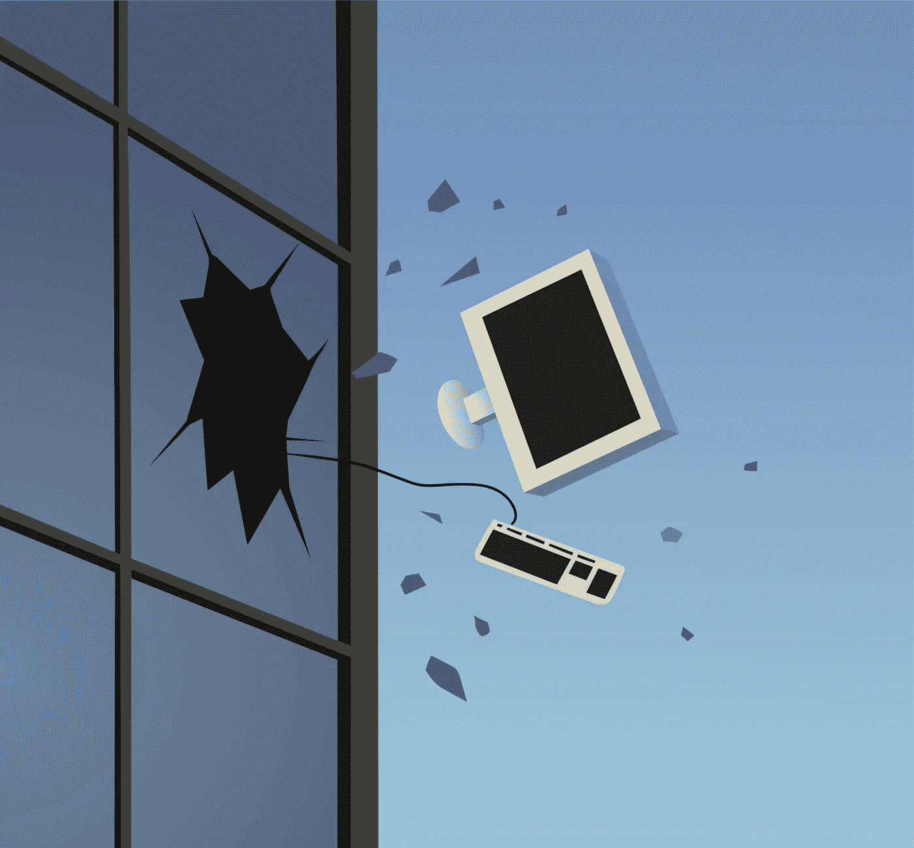

# 让你的创新、改变游戏规则、协同增效的网站在 2018 年脱颖而出的 10 种方法

> 原文：<https://medium.com/hackernoon/10-ways-to-make-your-innovative-game-changing-synergistic-website-stand-out-in-2018-c2f491199549>

But people LOOOOOOOVE parallax sites… right?

## 每个人都知道干净和简单不会让你赢得 Clio 奖。

**讽刺**

新的一年是推出新网站的大好时机。但随之而来的是许多问题。有哪些趋势？我能建立什么样的网站，它如此创新、改变游戏规则、具有协同效应，以至于人们不禁想知道，如果没有我这种杰森·布拉克式的网站大杂烩，他们是如何生存的？

如果你真的想让你的网站在 2018 年脱颖而出，下面是你要做的。

## **到处都是弹出窗口**

向人们介绍你的网站的一个很好的方法是请他们注册你的电子邮件列表，即使他们还没有弄清楚他们是否喜欢你卖的东西。尽可能多的弹出窗口。事实上，你可以把一个扔在另一个上面！谁在乎是不是用户体验不好？前几天晚上你在纽约科技会议上遇到的一些“成长黑客”向你保证这些婴儿会转化！

此外，如果人们不想每六到八个月就收到一封格式糟糕的电子邮件，确保你留下一个居高临下的退出选项，比如“不，我是一个不想改善生活的失败者”，而不是简单的“不，谢谢”

## **动画丰富**

还有什么比你网站上的大量动画更有趣的呢？当然，它会在非标准屏幕尺寸上搞砸 UX，导致视觉干扰，让你的网站浏览者远离他们真正需要知道的内容。但是你真的真的必须在你的网站上有动画，这样人们才能把你和那些保存动画用于愚蠢和不切实际用途的公司区分开来，比如网络电视卡通。

为了增加突出的效果，添加你所见过的最笨拙的公司 PowerPoint 演示的声音效果。或者，直接加音乐！我推荐你 2005 年在 MySpace 页面上的那首歌。

此外，如果你真的想讲述一个引人入胜的故事，请确保所有内容都是视差滑入效果，并且需要大约 5000 个滚动手势，才能让任何人找到他们需要的内容。

## **26，000 个导航条项目**

当你可以有一个接一个的下拉列表时，为什么要有一个简单的导航结构呢？确保你把你的公司制作的所有内容都添加到你的下拉选项中。确保下拉菜单都依赖于悬停状态，这在手机上是不可能导航的…这肯定会引起别人的注意！

## **一切事物上的悬停状态**

说到悬停状态，别忘了把它们放在你网站上的任何东西上。谁在乎它们是否会带来糟糕的平板电脑体验？把它们放在每一张图片上，每一行文字上…图片是否可点击并不重要！

见鬼，让页面变成一个巨大的悬浮状态就行了。这可能不会给你的网站设计增加多少价值，但你不可避免地会吹嘘你的开发团队编写这些疯狂的代码有多难，就像那次你让他们通过 BlizzCon Livestream 修复你堂兄的 chemtrail 阴谋 WordPress 网站被黑一样。

## **为桌面优化**

你已经知道你放在首页的惊人的滚动条在手机上会看起来像狗屎。但是谁在乎呢？无论如何都要为桌面优化。谁会在乎黑色星期五 60%的电子商务网络流量来自移动设备？桌面是未来之路！

确保创建一个疯狂的、精心制作的网站，完全忽略移动体验。反正也不像有人关注手机设计。即使你的移动网站没有响应，你仍然会赢得设计奖，因为设计奖的评委只想看到疯狂的界面和 DGAF，看看网站是否真的有用。

## **包含大量广告**

你有什么样的网站并不重要——它可能是 SaaS 的产品，据我所知——只要确保它包含 Outbrain 和 Taboola 等公司的 clickbait，这些公司喜欢使用像你这样的网站来宣传减肥药和男性秃顶治疗方法，以及边缘复仇色情片。事实上，如果任何公司曾经考虑过付钱让你在你的网站上运行他们的广告，确保你让他们都发生，而不是试图寻找一个更可行的收入来源。

对于额外的 umph，你可以确保包括自动播放网络广告，当用户浏览你的网站并在网页背景中挖掘比特币时，广告会以最大音量播放。

## **确保网站需要非常非常长的时间来加载**

生命中最美好的东西都值得等待，对吧？就像它是值得的，等待你的全新的动画燃料，色彩鲜艳，悬停国家捐赠的网站！

在设计你的网站时，假设每个人都有和你一样的顶级宽带，并且他们都可以和你一样快地下载所有的东西。如果他们不能呢？嗯，这么想吧…他们会在你的网站上多花 20 秒钟，这样你就可以向你的营销经理吹嘘你在让人们留在你网站的主页上做得有多好。如果你注意到一个很高的跳出率，你可以假设这个用户是一个白痴，他对浏览你的网站不感兴趣。

## **埋没用户想要的内容**

这将确保用户在你的网站上花费过多的时间。有如此多的选项和折叠菜单，以至于他们进入了一个无尽的兔子洞，点击内部链接和扩展嵌套部分，因为他们试图找到实际上甚至不存在的东西。

访问者可能会永远停留在你的网站上！谁会在乎他们是否不会改变，或者他们只是在把电脑扔向墙壁后才知道如何离开你的网站，因为他们对你的网站黑洞感到非常沮丧？他们应该在第一时间点击正确的链接！

## **不要让它成为 ADA 可访问的**

那要花几个小时！确保你的网站脱颖而出，利用时间使网站无障碍，并把它放入一个时髦的新的交互设计功能，当你点击它时，你的行动呼吁按钮会变成“面具”中吉姆·凯里的图片。那就太棒了。“但说真的，在美国使用互联网的人中有多少人是残疾人？只喜欢 18.7%的美国人。去他们的。

## **不花时间在复制上**

伟大的文案是浪费时间！你的用户可以知道你的产品是做什么的。每个人都知道“一个数据科学支持的神经网络分析算法为一个成功的区块链平台”是什么意思，并完全理解它如何应用于他们的需求。

与其花时间在复制上，不如花更多时间设计一层又一层时髦的界面。事实上，如果你花时间在区块链上为你的基于数据的神经网络分析算法制作一个全面的说明，那么每个人都会明白*到底是如何工作的。*

现在你知道了！这就是你如何建立一个在 2018 年脱颖而出的网站。谁需要干净、时尚、简单、切中要害的东西？每个人都知道干净和简单不会让你赢得 Clio 奖！

# 你喜欢这首曲子吗？点击下面的拍手表示我的爱。你对我作品的回应鼓励我继续写作！😀😀