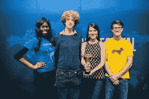
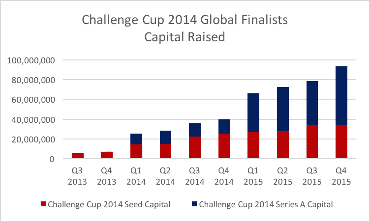
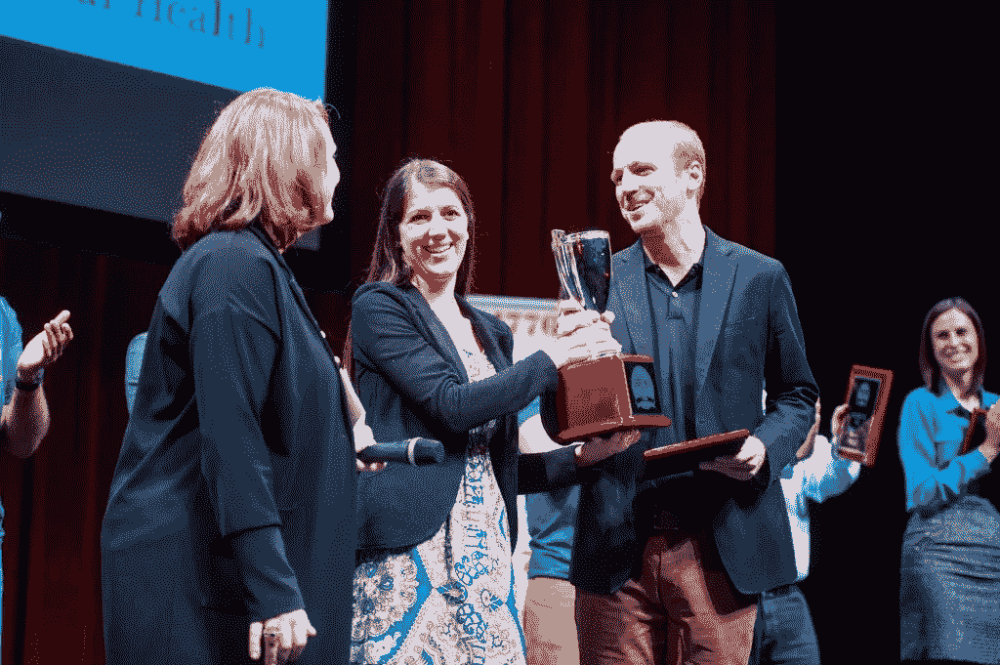
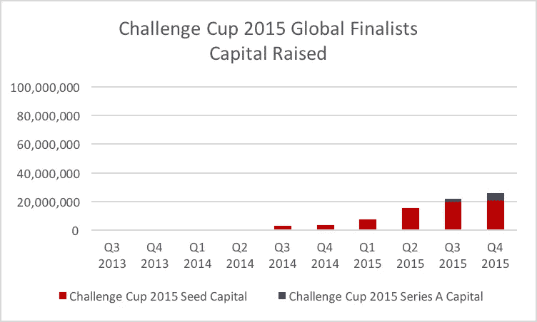
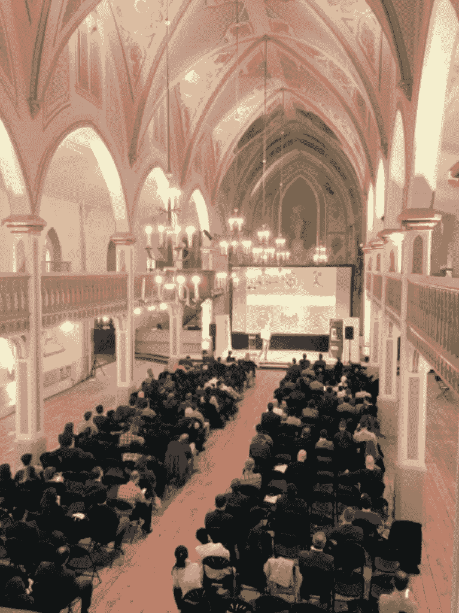
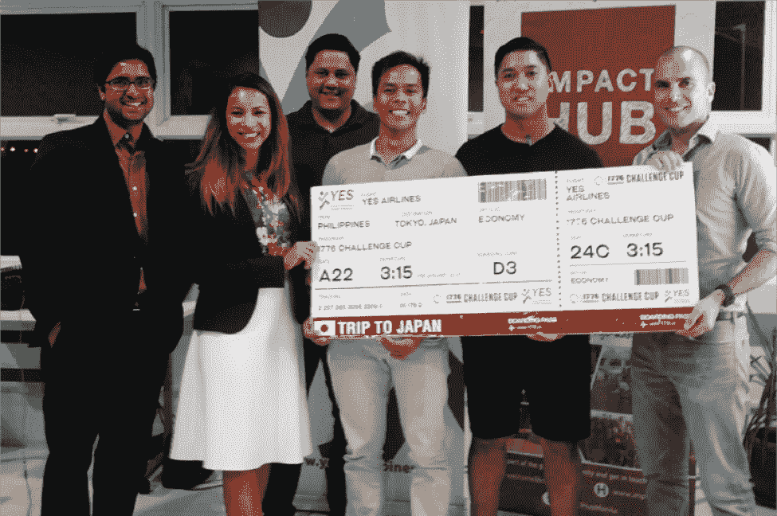
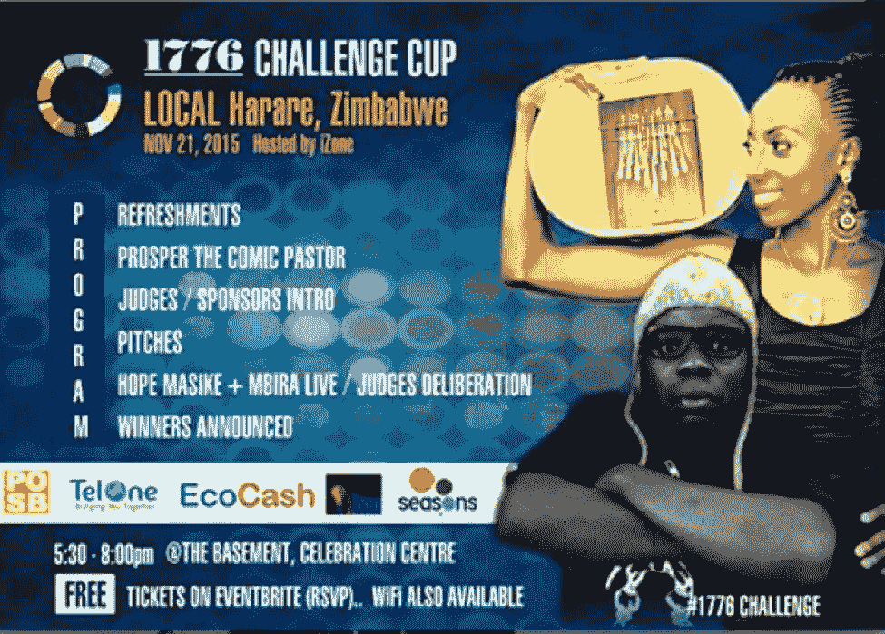

# 100，000 英里寻找、资助和发展最佳创业公司

> 原文：<https://medium.com/hackernoon/100-000-miles-to-find-fund-grow-the-best-startups-7f587e9565e8>

*不到三年前的一个大胆想法现在已经遍布全球 50 多个城市，寻找、资助、&发展最好的创业公司。*

两年前，大多数大型推介比赛似乎都是为了寻找下一个伟大的硅谷创意，无论是为你洗衣服，还是分享某人的小秘密。那时的竞标既不是全球性的，也没有发现特别鼓舞人心的想法。

我们想撼动创业世界。因此，我们发起了挑战杯，在全球范围内寻找最具影响力的创业公司，并为他们创造宝贵的经验。

从那以后，[挑战杯](http://www.1776.vc/challenge-cup/)已经去了全球 100 多个城市。难怪人们会认为我们疯了，在启动第一个 1776 校园仅仅四个月后，我们宣布了球场锦标赛和我们的国际孵化网络，[创业联盟](http://www.1776.vc/startup_federation/)。

虽然人们认为我们完全疯了，但从 1776 年的角度来看，创业联盟和挑战杯是我们推出后最明显的下一步。虽然我们的总部在华盛顿特区，但我们想要寻找、资助和发展的创业公司不仅仅在国内，而是在世界各地。

1776 的使命是通过支持重要行业的创新创业来改善世界:教育、能源、可持续发展、健康、交通和城市等。愿景一直是一场全球革命。因此，我们决定勇往直前，让挑战杯成为现实。

现在，挑战杯已经是第三年了，让我们先回顾过去，再展望未来。我们从旅程中学到了什么？我们是在寻找伟大的创业想法还是仅仅是鼓舞人心的故事？我们如何发展挑战杯，以便越来越接近找到解决我们世界上最大挑战的最佳创业公司，无论这些创业公司来自哪里？

# 2014 年挑战杯

## 励志故事还是聪明投资？

第一年是一个试验，在你创造它之前先假装它。我们去了全球 16 个城市——8 个在美国，8 个在国外。在每个城市，我们都聘请了一家创业联盟合作伙伴，为受邀请的教育、能源、健康和智能城市领域的本地创业公司举办为期两天的训练营。最后一天晚上，我们举办了一场比赛，评选出了该城市各行业的最佳初创企业。

一旦我们完成了所有 16 个城市的比赛，我们将 64 名获胜者带回华盛顿特区参加全球比赛，这将成为挑战节的核心活动，这是一个为期一周的计划，充满了活动、招待会和其他乐趣。最重要的是，全球获奖者的奖品将是我们正在筹集的风险基金的投资。

第一次挑战节太棒了。将来自世界各地的 64 家创业公司聚集在一起，让他们成为音乐节上的摇滚明星，让他们相互竞争，这太棒了。

华盛顿特区以无拘无束的兴奋回应挑战节。每一场比赛都比上一场吸引了更多的观众，最终在美国和平研究所的决赛中，观众爆满，俯瞰林肯纪念堂。总之，在 2014 年 6 月第一届挑战赛期间，我们至少有 6000 多人参加了一场活动。

2014 年挑战杯的[总冠军是来自三藩市的](http://www.1776.vc/insights/announcing-our-challenge-festival-grand-champion-handup/) [HandUp](https://handup.org/) ，以及其他七家鼓舞人心的初创公司，它们在每个类别中都获得了第一名或第二名: [EduCanon](https://www.educanon.com/) 、 [Lingau.ly](https://lingua.ly/) 、 [CancerIQ](http://www.canceriq.com/) 、 [MediSafe](http://www.medisafe.com/) 、 [Water Lens](http://www.waterlensusa.com/) 、 [Mellowcabs](http://www.mellowcabs.com/) 和 [PlugSurfing](https://www.plugsurfing.com/en/) 。

一些 2014 年挑战杯的获胜者一起在舞台上庆祝。

第一届挑战杯的一个有趣的问题是，竞争者是否仅仅是鼓舞人心的故事，还是事实上将被证明是强大的潜在投资。对 1776 年来说，这个问题不是纯粹的学术问题；我们实际上是把有限合伙人的钱投入到 1776 的信念背后，即你可以在世界任何地方找到惊人的、成功的创业公司来解决大问题。

自那以后两年多过去了，我们有了更多的数据来评估这类赢家的表现。

在首届挑战杯中，1776 有超过 600 家初创公司申请参加。我们选择了 368 来竞争。在这 368 名参赛者中，有 64 人参加了挑战赛。到目前为止，64 个全球决赛选手中有 33 个筹集了种子资金，迄今为止筹集的种子资金总额达到惊人的 33，567，030 美元。

许多全球决赛入围者在 2014 年 6 月挑战赛之前或之后不久筹集了大量种子资金，而其他人则继续从事他们的业务，直到 12 或 18 个月后才最终筹集到大量种子资金。

2014 年挑战杯决赛入围者筹集的首轮风险投资也证明了他们的势头。在筹集了大量种子资金的 33 家初创公司中，有 14 家已经筹集了总计超过 6000 万美元的首轮资本。虽然这些初创公司中有 12 家位于美国，但一家在特拉维夫，一家在北京。

最后，我们获得了 2014 挑战杯全球决赛的两个席位。戴姆勒在挑战赛后不到六个月就收购了 RideScout，而文艺复兴学习在一年内收购了 UClass。

# 2015 年挑战杯

## 另一次环球旅行，获得更大回报

在第一届挑战杯成功后，我们将所学用于改进第二届年度挑战杯。同样，1776 年前往 16 个城市，但去的美国城市比前一年少，以突出比赛的国际焦点。

我们还拓宽了我们的一些行业类别:能源发展为能源和可持续发展，智能城市发展为交通和城市。否则，2015 年挑战杯的公式看起来和 2014 年一样，1776 年开始了另一场世界巡回赛。

2015 年挑战杯的成绩甚至比前一年更好。2015 年挑战杯有超过 1000 家初创公司申请参赛，比上一年增长了 65%以上。我们选择了 451 来参赛。在 451 名参赛者中，有 1776 名在挑战赛上举办了 80 场全球总决赛，我们为来自 16 个城市的 64 名获胜者增加了 16 个外卡名额。

2015 年挑战杯的[获胜者是](http://www.1776.vc/insights/challenge-cup-twiga-foods-distribution-chain-disruption/) [Twiga Foods](http://twigafruits.com/) ，这是一家来自内罗毕的移动商务初创公司，致力于从根本上提高非洲食品供应链的效率。其他获奖的创业公司有 [LearnLux](http://learnlux.com/) 、[cog concept](http://www.cognotion.com/)、[免提学习](http://www.handsfreelearning.com/)、 [Radiator Labs](https://www.radiatorlabs.com/) 、 [BaseTrace](http://www.basetrace.com/) 、 [Unima](http://www.unima.com.mx/english/main.php) 、 [ReliefWatch](http://www.reliefwatch.com/) 和 [EverCharge](http://evercharge.net/) 。

2014 年挑战杯冠军为 2015 年挑战杯冠军颁发奖杯。

自 2015 年挑战杯以来，80 个全球决赛选手中的 35 个已经筹集了种子资金，迄今为止总计 20，796，000 美元。与前一年类似，许多全球入围的初创公司仍在筹集种子资本。

随着 2015 年挑战杯的临近，全球决赛选手才刚刚开始筹集 A 轮资金。在已经筹集到大量种子资本的 35 家公司中，有两家已经筹集了首轮融资，总额为 520 万美元。其中一家创业公司位于美国纽约市，另一家位于爱尔兰都柏林。

2014 年挑战杯和 2015 年挑战杯基本上遵循相同的脚本，但有些东西一直在啃噬着我们。虽然 16 个城市对我们这些乘坐红眼航班漫游世界的人来说是一个可怕的旅行，但 1776 年仍然只是全球最有影响力、最有前途的创业公司的一小部分。

那么，2016 年挑战杯的问题是:1776 年如何真正从整个世界中发掘出最好的东西，或者说我们有理由希望用有限的资源覆盖尽可能多的东西？

# 2016 年挑战杯

## 扩大全球影响力、行业类别和获奖潜力

1776 团队安排全球 50 多个城市的孵化器和创业伙伴制作自己的挑战杯本地比赛。对于 50 多个城市中的每一个，1776 都提供了剧本和宣传支持，现在正空运当地的获胜者参加九个挑战杯区域项目的比赛。与我们之前的城市比赛相比，每个地区计划看起来更像迷你挑战赛，并为竞争对手提供额外的节目和有价值的会议，而不是原来的弹出式训练营。

除了 2016 年开源挑战杯，我们还再次扩大了行业类别。除了教育、健康、能源、交通和城市，我们还增加了安全、金钱和食物。有了更多的类别，我们简化了评判过程。挑战杯当地评委挑选最佳创业公司参赛——不考虑行业——而不是在每个类别中确定一个获胜者。说到底，我们希望找到最有前景的创业公司，而不考虑行业。

当地一轮的结果令人着迷和鼓舞。我们完成了 1776 年的目标，显著扩大了挑战杯在世界各地的影响力。根据目前的趋势，1776 预计将有超过 3000 家初创公司申请参加 2016 年的挑战杯比赛(高于 2015 年的 1000 多家)，并将有超过 1500 家公司参加(高于 2015 年的 451 家)。

令人着迷的不是我们让更多的城市参与进来。令人着迷的是，我们在世界各地的创业联盟合作伙伴已经真正掌握了当地项目的所有权。我们为当地组织者创造了宽松的渠道，让他们互相提问、分享想法、征求反馈。

出乎我们意料的是，当地的组织者相互挑战，每个城市都积极地试图超越以前的城市，来自世界不同时区的玩笑源源不断。我们有幸目睹了一个真正的全球创业组织者社区的有机形成。

我们看到的全球社区的第一个暗示来自蒙特利尔挑战杯，这是 2016 年挑战杯的第一个城市。not man House——1776 年在蒙特利尔的合伙人——制作了一个很棒的程序，他们发布的图片是不真实的…

蒙特利尔当地挑战杯在翻新的大教堂举行！

[是的，菲律宾](http://yesphilippines.org/)，1776 年的合作伙伴主办了马尼拉当地的挑战杯，将制作推向了一个新的高度。组织者为获胜者印制了巨大的登机牌，代表他们参加东京挑战杯的比赛。是的，菲律宾与 Slack 上的每个人分享了这些照片，从那以后，许多当地的活动都模仿并推进了这个想法。

是的，菲律宾登机牌奖励已经成为一种现象。

1776 年挑战杯的主持人也获得了我们提供给他们的内容的创作许可。许多组织者已经对模板网站图像、脸书页面、视频和标牌进行了本地化，所有这些都是为了向他们自己的受众介绍挑战杯、封面推介辅导等。

到目前为止，我们最喜欢的一个混搭来自我们在哈拉雷 iZone Hub 的朋友，这给了 1776 年的图像一种独特的津巴布韦风格。

iZone Hub 本地化 1776 材料，以适应哈拉雷。

随着挑战杯本地赛让位于挑战杯地区赛，新城市的其他创业中心继续举办自己的挑战杯本地项目。想想 2017 年世界挑战杯将会涵盖多少内容就令人惊叹。

在经历了两次有价值的挑战赛后，1776 年进一步改善了奖金结构。此前，奖金是 1776 基金的 65 万美元投资，由八名获奖者分享。然而，我们发现最初的奖金结构存在一些挑战。

首先，在最初两年的每一年，都有不可思议的初创公司应该获胜，但不一定适合或至少不适合 1776 年的基金。我们希望避免奖励优秀创业公司和履行有限合伙人受托责任之间的矛盾。

此外，在广泛的全球竞争结构中完成对投资的详细尽职调查是不切实际的。该奖项一直取决于充分的尽职调查，这可能会让缺乏尽职调查经验的获奖者感到失望。

因此，2016 挑战杯将向全球获胜者提供 175，000 美元的无条件现金奖励。此外，1776 从其基金中拨款 100 万美元投资全球决赛选手。新的奖励结构将使我们能够灵活地奖励解决我们世界上最重要挑战的最佳创业公司，同时也为最有前途的投资机会的创业公司提供资金。在某些情况下，初创公司可能会同时获得这两个奖项。

不到三年前，一个真正疯狂的想法发展成了一个项目，现在覆盖了 50 多个城市，支持创业公司，迄今为止已经筹集了超过 1.2 亿美元的资本。通过挑战杯，我们可以看到从博伊西到班加罗尔的创业公司在[进行重要的](http://www.1776.vc/reports/innovation-that-matters/)创新。

1776 的联合创始人兼联合首席执行官唐娜·哈里斯(Donna Harris)正准备在 1 月 14 日的墨西哥城挑战杯地区赛(T1)上开始地区赛，然后我将前往西海岸参加旧金山挑战杯地区赛。希望我们能在旧金山、纽约、迪拜、东京、内罗毕、新加坡、伦敦或特拉维夫见到你！

> [黑客中午](http://bit.ly/Hackernoon)是黑客如何开始他们的下午。我们是 [@AMI](http://bit.ly/atAMIatAMI) 家庭的一员。我们现在[接受投稿](http://bit.ly/hackernoonsubmission)并乐意[讨论广告&赞助](mailto:partners@amipublications.com)机会。
> 
> 要了解更多信息，[请阅读我们的“关于”页面](https://goo.gl/4ofytp)，[在脸书上点赞/给我们发消息](http://bit.ly/HackernoonFB)，或者简单地说， [tweet/DM @HackerNoon。](https://goo.gl/k7XYbx)
> 
> 如果你喜欢这个故事，我们推荐你阅读我们的[最新科技故事](http://bit.ly/hackernoonlatestt)和[趋势科技故事](https://hackernoon.com/trending)。直到下一次，不要把世界的现实想当然！