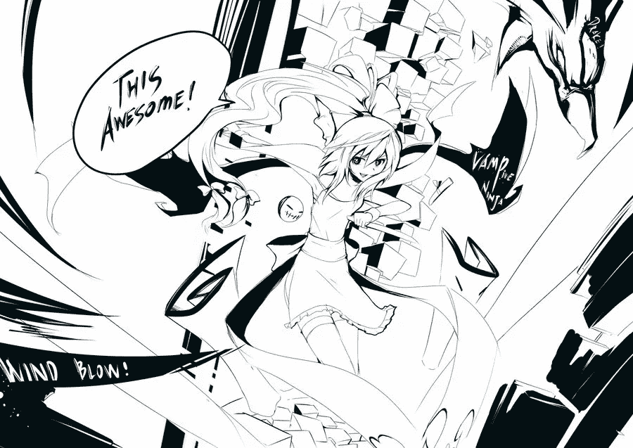
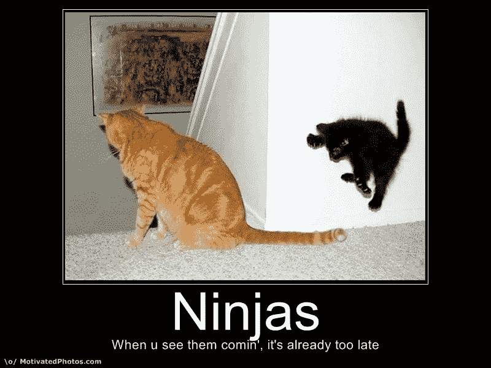
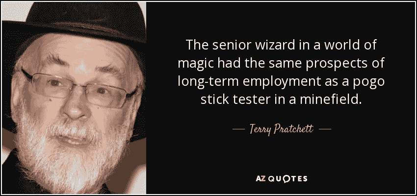
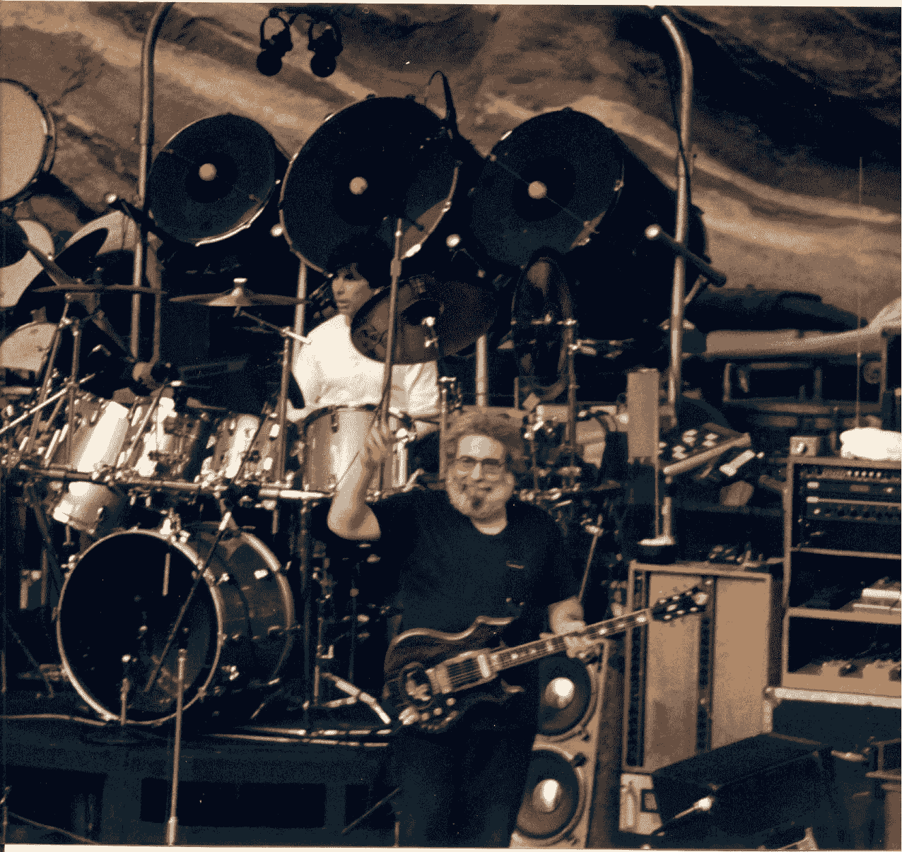

# 10x 摇滚明星忍者巫师吸血鬼

> 原文：<https://medium.com/hackernoon/10x-rockstar-ninja-wizard-vampires-f551c1f1411e>

vampire ninja, by ClearEchoes at DeviantArt

对“10x”、“rockstar”、“ninja”、“wizard”程序员的没完没了的称呼激怒了我们这个职业中的许多人，大多数是我们这些永远不会称自己为这种东西的人。我们被嘲笑为吃不到葡萄说葡萄酸的二流演员，他们没有资格加入如此尊贵的公司。但是不，我们不喜欢 10x 摇滚明星忍者程序员，因为我们和他们一起工作过，知道他们做什么。

他们不是忍者。他们是吸血鬼。

也就是说，他们通过消耗他人的生产力来提升自己的生产力。他们让球队流血。

他们可能会通过耗尽个人的活力来伤害团队。他们会通过傲慢或干涉来打击队友的士气和挫败他们。他们不尊重界限。如果他们停下来确保没有先把别人搞砸，他们怎么能达到 10 倍的生产率呢？

或者更糟的是，他们会耗尽团队的未来——构建不可维护的、粗糙的代码，不记录他们的决策，让耦合在层之间扩散，很快变成[熔岩流反模式](http://antipatterns.com/lavaflow.htm)。该项目可能会在未来为现在的 10 倍付出高昂的代价。

## 忍者

忍者是无名无姓的雇佣兵。忍者的工作是为出价最高者制造混乱。忍者在黑夜中出现，使用神秘的力量和无情的暴力制造灾难，然后消失在一股烟雾中。

忍者是无名的，不知名的，无情的，无情的敌人。

你*确定*要雇佣他们来编写你的代码吗？

## 奇才

> 如果有疑问，就开枪打那个巫师。
> 
> -塔莫拉·皮尔斯

我们从小说中学到了很多关于巫师的知识。有些人只是躲在窗帘后面的骗子。他们中的一些人看不起像我们这样的麻瓜。有些让我们爱他们，然后在我们最需要他们的时候消失了。

更重要的是，思想…巫师之所以成为巫师，是因为他们使用魔法。除非你与生俱来(哈利·波特)，或者研究古老而神秘的书籍，否则你不会成为巫师。只有巫师才能理解其他巫师做的事。除非你的整个团队都是巫师，否则你可能要重新考虑在代码中使用魔法而不是成熟技术的想法。

但是 J.R.R .托尔金教会了我们巫师最好的一面。他告诉我们，巫师最终并不是拯救世界的人。是普通人。几个意志坚定的霍比特人可以做到巫师做不到的事。

## 节奏和领导力

Jerry Garcia, 1987\. Courtesy of Wikimedia.

> 有种错觉，以为我在领导乐队，但实际上我只是声音大而已。
> 
> 杰瑞·加西亚

杰瑞·加西亚，感恩而死乐队的著名首席吉他手，非常明白这个事实——不是“首席吉他手”引领音乐。是节奏部分——贝斯、鼓、节奏吉他。rockstar 程序员依赖于一个高质量的团队。要成为一名伟大的*球员，你必须是一名团队成员。*

也许成为一个摇滚明星并没有那么糟糕。

> [黑客中午](http://bit.ly/Hackernoon)是黑客如何开始他们的下午。我们是 [@AMI](http://bit.ly/atAMIatAMI) 家庭的一员。我们现在[接受投稿](http://bit.ly/hackernoonsubmission)，并乐意[讨论广告&赞助](mailto:partners@amipublications.com)机会。
> 
> 如果你喜欢这个故事，我们推荐你阅读我们的[最新科技故事](http://bit.ly/hackernoonlatestt)和[趋势科技故事](https://hackernoon.com/trending)。直到下一次，不要把世界的现实想当然！

