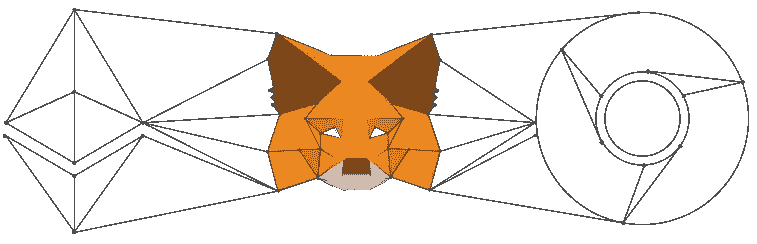
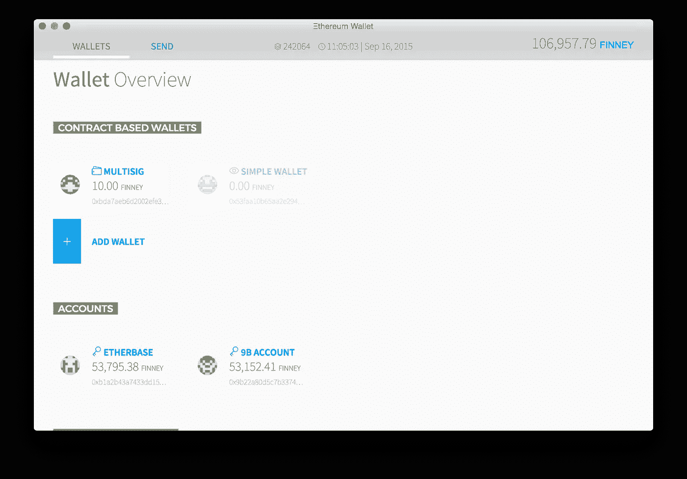
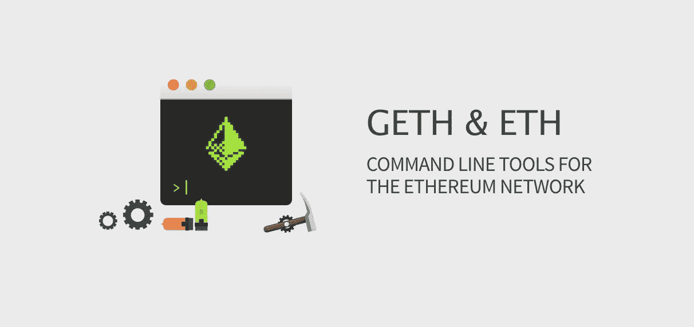
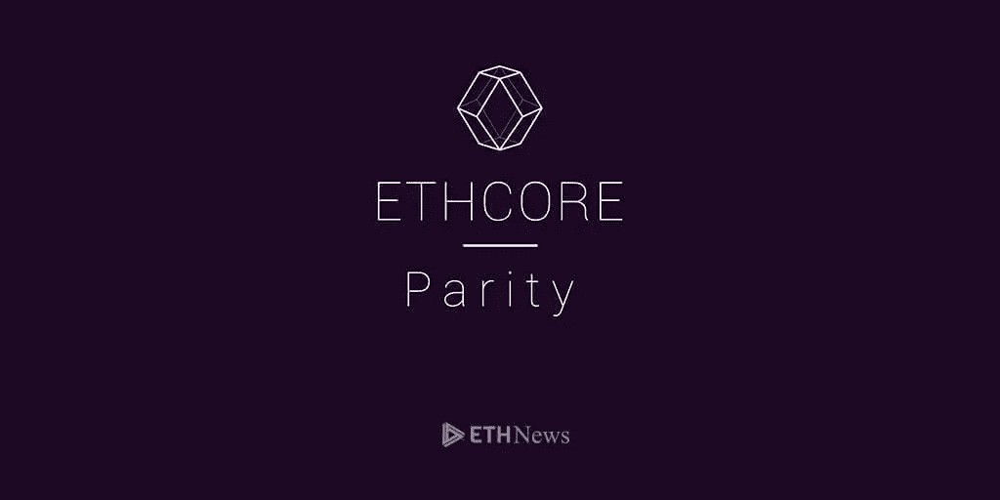
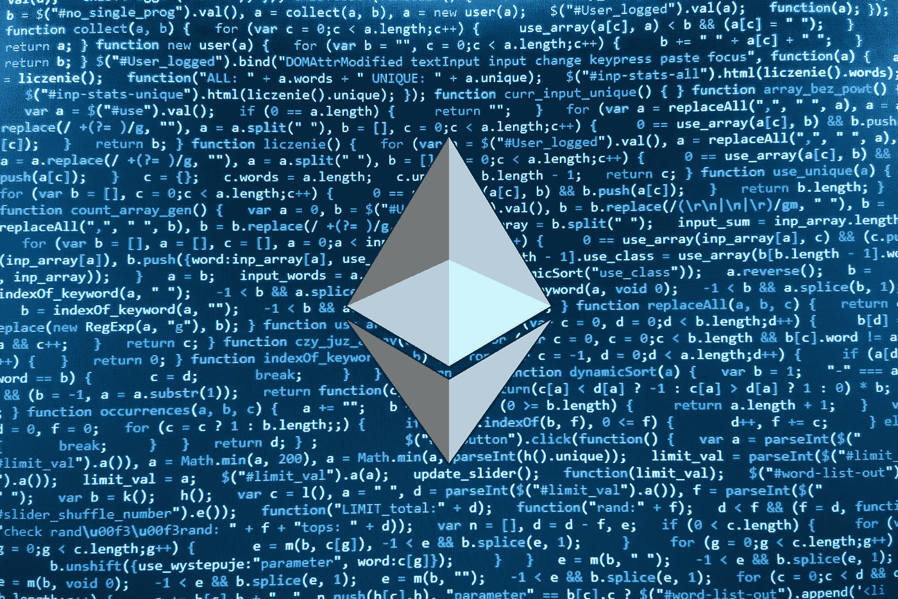
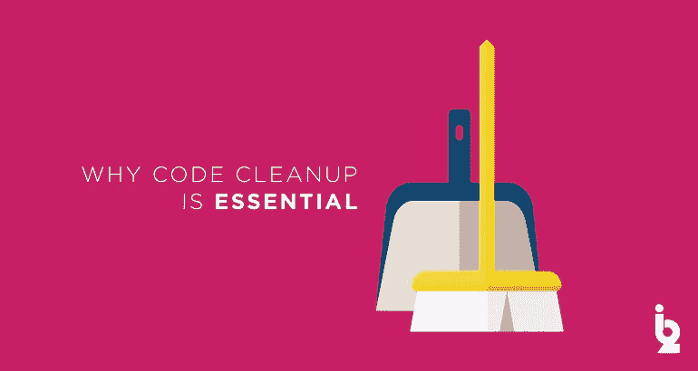
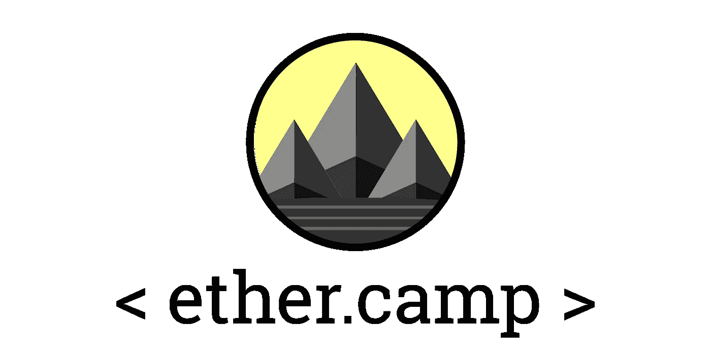
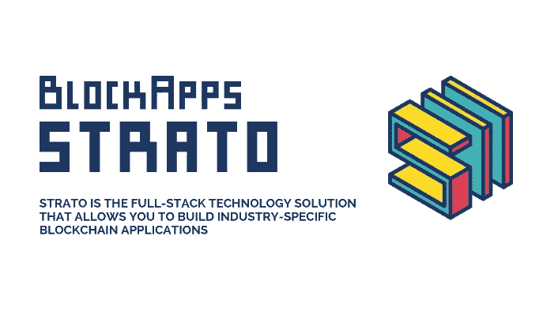
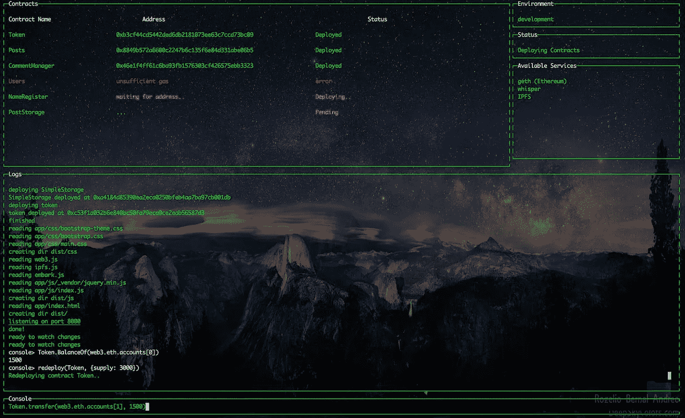

# 11 个最好的以太坊开发工具来增加你的堆栈

> 原文：<https://medium.com/hackernoon/11-best-ethereum-development-tools-to-grow-your-stack-e782fd7156ab>

区块链技术让首席执行官们变得炙手可热。当轮到你向他们展示你的筹码时，你会苦恼还是会留下深刻印象？

这里有 11 个在以太坊区块链建造的工具

The foxy doggo chrome extension is good boy

# 1.没有什么比掏出你的钱包更让他们兴奋的了

Use Mist to create wallets you won’t lose right when your Uber is pulling up

使用 Mist 存储以太网、发送事务、部署合同等。你可以使用本机应用程序在区块链或 testnet 上玩一玩，同时掌握整个区块链的窍门。对快速交易非常有用。

# 2.[Geth](https://www.ethereum.org/cli)——是时候打破一个节点了

Drop that GUI down low

当你准备放弃训练时，切换到命令行会让你看起来像真正的黑客。Geth 可以做 Mist 能做的任何事情，还能提供一些重要的功能，比如作为 RPC 端点通过 http 连接到区块链。

# 3.[对等](https://ethcore.io/parity.html) —将您的客户端提升为 bae

It’s my parity I can cry if I want to

奇偶校验是用新的低级语言 Rust 编写的以太坊客户端。该客户端由以太坊的前首席技术官 Gavin Wood 博士创建，是一种快速、轻量级的以太坊节点运行方式。运行奇偶校验并跳转到 localhost:8080 在他们的 web 用户界面上玩。老实说，安装起来很麻烦，但是一旦安装并运行起来，奇偶校验就是 Geth 的一次大升级。

# 4.[meta mask](https://metamask.io/)——毛茸茸的乐趣让 chrome 保持有趣

The foxy doggo chrome extension is good boy

元掩码是🐐如果你正在开发一个你真正想让人们使用的应用程序。元掩码支持是必备的。这个小小的 chrome 扩展极大地提高了人们与你的应用程序(分布式应用程序)交互的便利性。如果您还没有，请[下载 MetaMask](https://chrome.google.com/webstore/detail/metamask/nkbihfbeogaeaoehlefnkodbefgpgknn?hl=en) 并亲自试用。我会等的。

# 5. [Web3.js](https://github.com/ethereum/web3.js/) —向您所在地区的本地节点介绍您的应用

send nodes

如果你想建立一个应用程序，你将通过 web3 库获得[非常个性化的](https://media.tenor.co/images/507155475b09131489bfc3f347a272f5/raw)。如果你想做一些人们不会讨厌的东西，Web3.js 将成为你与区块链互动的界面。

# 6.块菌——直接跳到好东西

Eventually you learn to love the taste

如果你有一个装满开发工具的工具箱，Truffle 就是你的[声波螺丝刀](https://media.giphy.com/media/pV7MPQf5OpoWs/giphy.gif)。Truffle 提供了快速创建、编译、部署和测试区块链应用程序的构建模块。

# 7.[Javascript test RPC](https://github.com/ethereumjs/testrpc)——不要过早地大发雷霆

An Ether saved is an Ether earned

在你开始像在俱乐部里那样扔乙醚之前💸尝试在测试区块链中测试您的代码。由于写区块链成本以太，这是一个好主意，以测试你的智能合同测试区块链支出以太。

# 8.[Solc](https://github.com/ethereum/solc-js)——因为不同的语言只会让它更令人兴奋

I’ve got a thing for byte-rs

Solidity 代码可能被设计成看起来像 javascript，[但是你仍然必须编译它](https://i.imgflip.com/1k3ffi.jpg)。Solc 是你从智能契约语言 solidity 到以太坊字节码的翻译器。

# 9. [Solium](https://github.com/duaraghav8/Solium) —不含化学物质的固体清洁溶液

Your mom doesn’t live in the blockchain. Don’t expect her to cleanup your mess.

你妈妈不住在区块链。别指望她会收拾你的烂摊子。因为你是按大小为你写给区块链的所有东西付费的，包括合同，所以确保你没有浪费钱上传劣质代码是符合你的利益的。

# 10. [Ether.camp](https://live.ether.camp/) —现在可以在网上做？

this one time, at ether.camp

微软一直在加强他们的区块链游戏。他们最近开始在其 Azure cloud suite 中提供 [BaaS(区块链即服务)](https://azure.microsoft.com/en-us/solutions/blockchain/)，并且他们通过一个完全成熟的以太坊 IDE[ether . camp](https://live.ether.camp/)带来了更多的热度。

# 11.如果他们给了你他们的地址，这不算跟踪，对吧？

Every Ðapp has a fantasy of bringing in a 3rd party

每个人都可以看到区块链的一切，所以你不想看一眼吗？BlockApps 有一些 API 端点，非常适合检查钱包余额、编写交易和读取合同状态等事情。只需一些地址，你就可以在人们的钱包上印上夏洛克·福尔摩斯。

> 下面是一些不在原始列表中的工具，但仍然值得肯定

# 12.登上[——跳上车来一次你不会忘记的旅程](https://github.com/iurimatias/embark-framework)

Logo coming soon

您的应用程序需要一些结构吗？Embark 是另一个用于构建、测试和部署应用程序的流行框架。

> "[[Embark]是一个开发分散式应用程序的框架，是开发以太坊 DApps 最流行的工具之一](http://@iurimatias)"

# 13.[齐柏林飞艇](https://github.com/OpenZeppelin/zeppelin-solidity)——实践安全智能合同

Don’t be a DAO-ner, secure your smart contract

为你的个人银行账户使用“密码 123”是一回事(请不要这样做)，但是当你写一份保存着*其他人的钱*的智能合同时，你要确保它是安全的。Zeppelin 是编写安全合同的库。当你已经在和松露一起工作的时候，特别容易。

特别感谢吉姆·黄帮我整理这份名单。也感谢蒂姆、布兰登、林登、凯西、阿琼，是他们推动[*happy cha . in*](https://www.happycha.in)*前进，激励我每天更加努力。❤️*

> 如果你觉得这篇文章有用或有趣，请留下❤️或分享。请对您希望添加到列表中的任何反馈或工具发表评论。

> [黑客中午](http://bit.ly/Hackernoon)是黑客如何开始他们的下午。我们是 AMI 家庭的一员。我们现在[接受投稿](http://bit.ly/hackernoonsubmission)并乐意[讨论广告&赞助](mailto:partners@amipublications.com)机会。
> 
> 如果你喜欢这个故事，我们推荐你阅读我们的[最新科技故事](http://bit.ly/hackernoonlatestt)和[趋势科技故事](https://hackernoon.com/trending)。直到下一次，不要把世界的现实想当然！

