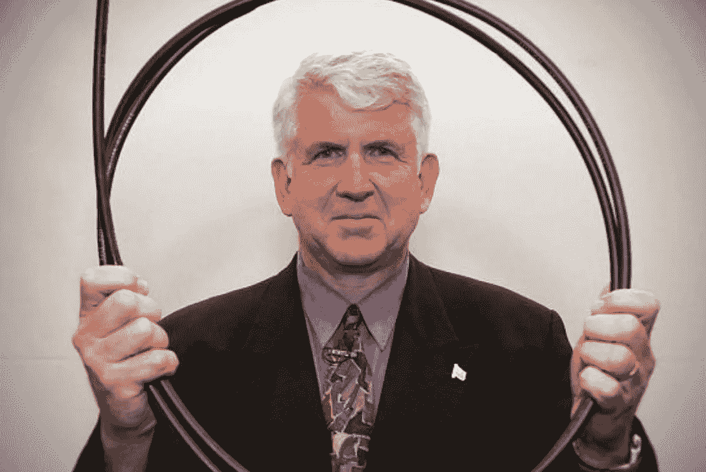

# 11 大精选:10 月 11 日奥斯汀创业周

> 原文：<https://medium.com/hackernoon/11-top-picks-austin-startup-week-on-oct-11-5cba94c859b7>

## 《阿甘正传》四部曲:2017 年 10 月 11 日

周三是 2017 年奥斯汀创业周的第三天，该周庆祝德克萨斯州中部创业活动的许多不同方面。我们今天最感兴趣的一些会议包括:

[**保护美国梦的算法**](http://sched.co/CIrN) **资本工厂下午 4:00**
FWD . us 主持了一个奥斯汀技术社区领导人的聚会，讨论关于 DACA 计划取消的最近事态以及这对奥斯汀技术和创业社区以及整个国家的影响。

[**下午 4:00 与 multi coin Capital**](http://sched.co/CcYk) **Capital Factory 联合创始人的加密小组**
Multicoin Capital 是奥斯汀的一家风险投资基金，专门投资于比特币、以太坊等加密货币以及许多更小、更新的加密货币。在这个小组中，Kyle Samani 和 Tushar Jain 将讨论他们在评估新密码时寻求什么，他们如何管理基金，并提供他们对即将到来的加密泡沫的想法。

[**未来食品技术:送货疯狂**](https://austinstartupweek2017.sched.com/event/CNWW?iframe=no) **下午 2:00 的新运动**
这个小组由来自奥斯汀的四家食品配送公司(Door Dash、Dinner Elf、Full 冰箱和农舍外卖)的代表组成，他们将讨论他们的技术如何改变行业，以及他们对食品配送未来的看法。

[**在所有合适的地方寻找资金**](https://austinstartupweek2017.sched.com/event/CIZA?iframe=no) **资本工厂中午**
想从奥斯汀的投资者那里拿到钱？加入 David Altounian 和 Stephen Straus 的实时问答，看看他们最近发表的文章:[在所有合适的地方寻找资金:奥斯汀资本的权威指南](https://austinstartups.com/looking-for-funds-in-all-the-right-places-ca15dc684bbc)。

[**在 VR/AR 中赚钱讲座**](http://sched.co/CH8L) **上午 10:00 上午 10:00 在首都工厂**
Viewer Ready 首席执行官 JJ·卡斯蒂略将讲述如何“更聪明地工作，而不是更努力地工作”，同时分享他在虚拟现实公司学到的成功方法(和不太成功的方法)。

[**推后:奥斯汀多元化创业社区展示**](https://austinstartupweek2017.sched.com/event/CGWt?iframe=no) **资本工厂下午 6:00**
多元化和企业家精神并不总是同义的，但请参加本次会议，了解奥斯汀在该领域取得的诸多进展。这个小组考察了这个城市独特而丰富多样的创业社区，它带来了新的创新和机遇。

[**【SXSW】创业黑客:三月魔法成功的 10 个技巧**](https://austinstartupweek2017.sched.com/event/CHFC?iframe=no) **下午 4:00 激励**
如果你的创业公司有兴趣申请参加 [SXSW 加速器推介活动](https://www.sxsw.com/apply-to-participate/sxsw-accelerator/)，或者如果你只是想了解学习、社交和发现的最佳策略，那么一定要参加这个信息丰富的对话。一名幸运的参与者将赢得 SXSW 2018 的免费徽章！

[**智慧城市+创业公司**](http://sched.co/CItU) **资本工厂上午 10:00**
我们正处于一个激动人心的时刻，公民领袖、创新者和企业家齐聚一堂，探索大大小小城市的挑战。迪吉。City 创始人切尔西·科利尔(Chelsea Collier)将解释为什么创业公司在这场对话中是一个重要的声音——但与政府整合远非易事。

[**创业磨砺奥斯汀:与鲍勃·麦卡夫炉边聊天**](https://austinstartupweek2017.sched.com/event/CIE5?iframe=no) **6:30 资本工厂**
互联网名人堂成员鲍勃·麦卡夫(上图)是奥斯汀德克萨斯大学 Cockrell 工程学院的创新教授和 Murchison 自由企业研究员。在对 Spredfast 的 Damon Clinkscales 的采访中，这位以太网的发明者将谈论他的使命，即帮助奥斯汀成为更好的硅谷。

[**Un。表达方式:与女性创始人**](http://sched.co/CUY2) **正午的索玛·维达**
奥斯汀的创业现场充满了你可能从未见过的鼓舞人心的女性。来加入我们，与几位具有前瞻性思维的女性创始人进行一次亲密对话。你将与志同道合的人建立新的联系，以及追求激情所需的灵感。

[你是女的吗(或者你的创始团队里有女的吗)？然后来德克萨斯州的 Tarmac ' s Women in Tech 推销你的创业公司，争取更好的竞争！](https://www.eventbrite.com/e/women-in-tech-for-good-competition-tickets-38163400759?aff=es2&mc_cid=d46a6bce4b&mc_eid=80913a8474)

请记住，所有奥斯汀创业周活动都是免费参加的。但是你必须在这里注册成为乐趣的一部分。

休·福里斯特在世界上最独特的创意专业人士聚会[*SXSW*](http://www.sxsw.com)*担任首席编程官。他还试图在媒介上每天至少写四段***。这些帖子通常涵盖与技术相关的趋势；其他时候，他们关注书籍、流行文化、体育和其他时事。**

**帮助 SXSW*[*帮助红十字会赈灾*](http://www.redcross.org/sxsw) *。**