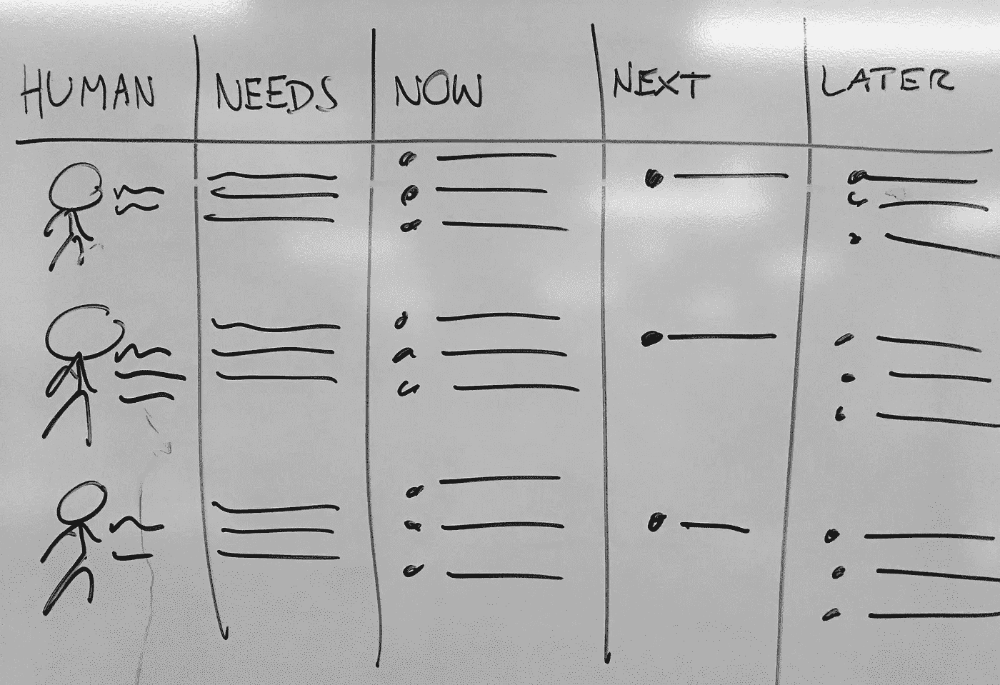
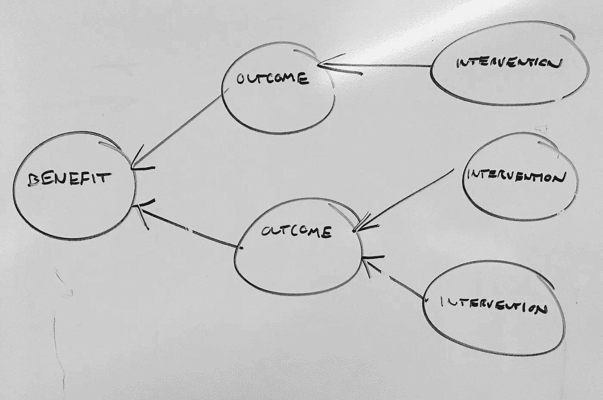
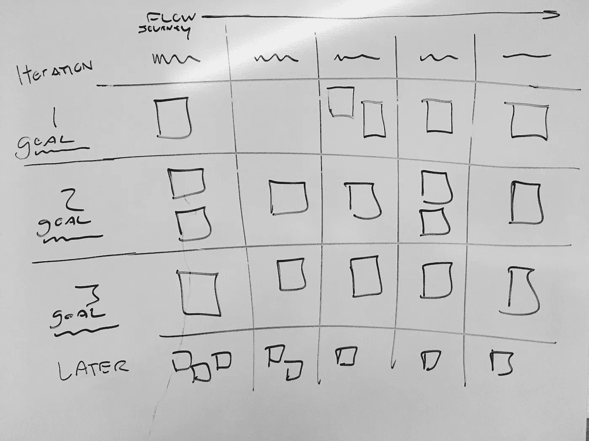
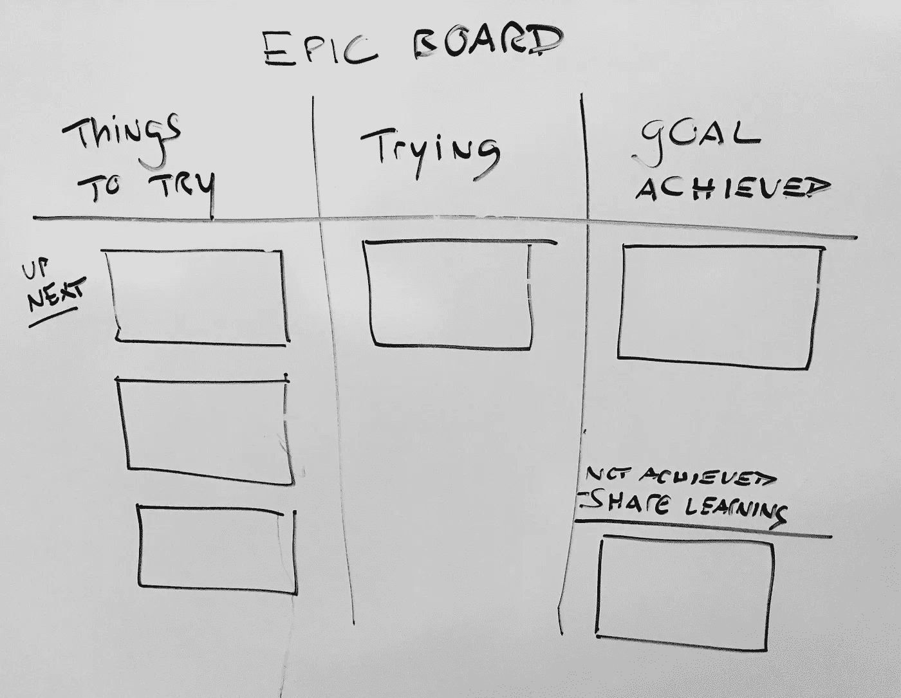
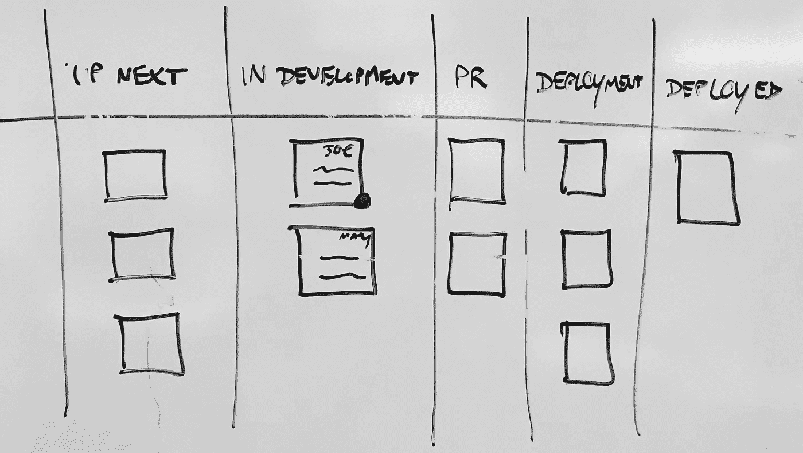
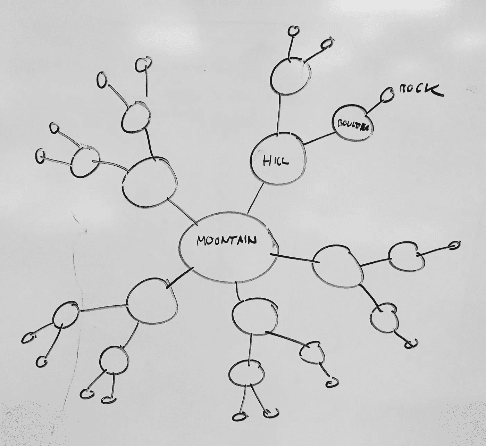
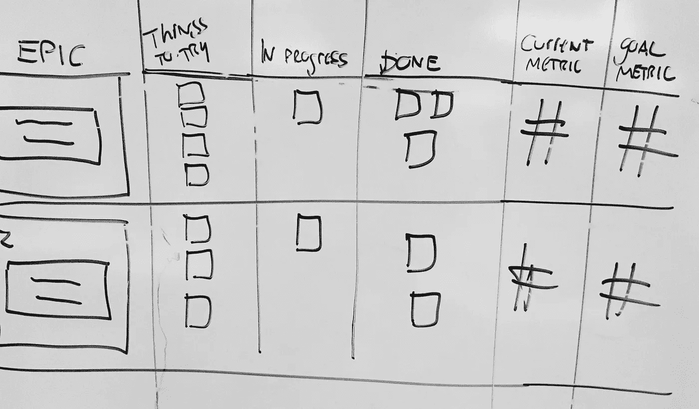
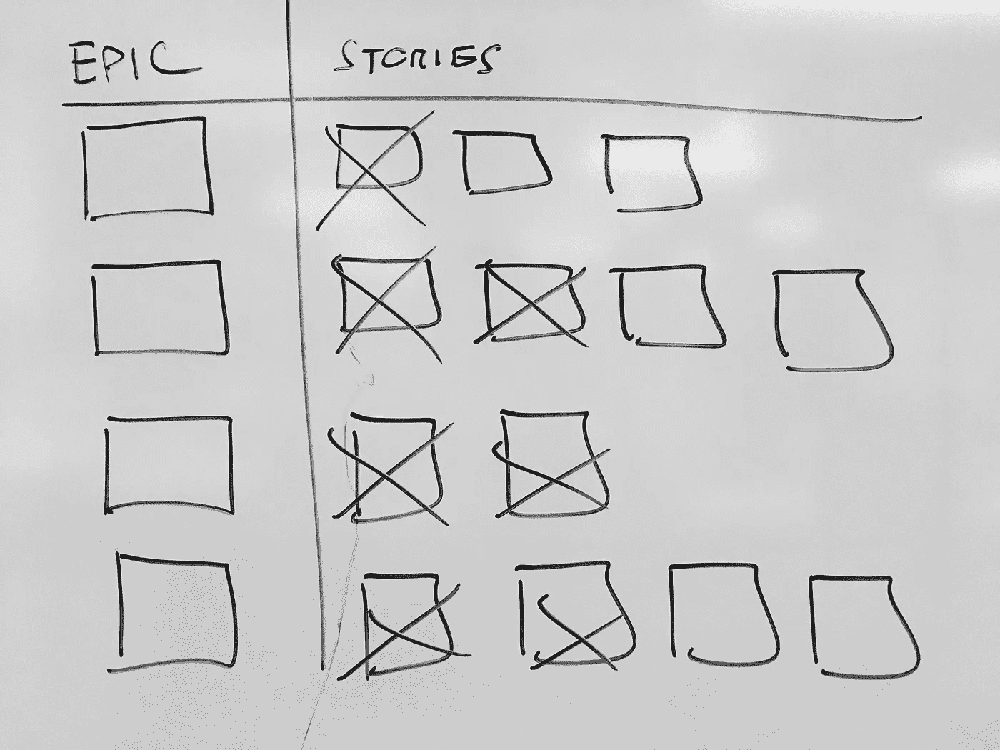
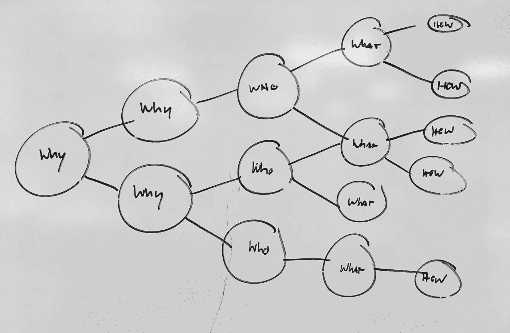
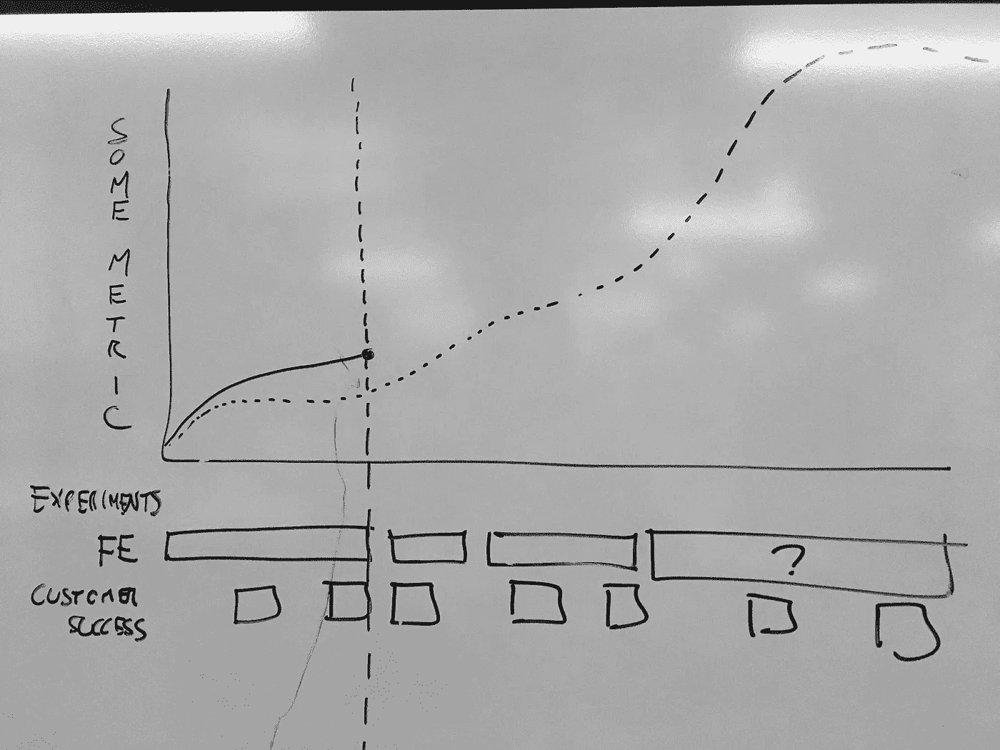

# 我想象产品开发工作的 11 种方式

> 原文：<https://medium.com/hackernoon/11-ways-i-visualize-product-development-work-f32aee3fcbf7>

…分享今天白板培训中的一些绘图和笔记。

原谅拼写…在战壕里度过了漫长的一天！

主题是**有用的工件和可视化(对于项目经理、产品开发团队等)。)**

作为一个项目经理，你总是在改变环境。

*   **时间范围**。从今天到两年后
*   **观众**。从开发者到 CEO
*   **范围**。从大局战略到战术细节
*   **确定程度**。从模糊的猜测到确凿的事实
*   **活动。**决策、了解状态、提供必要的背景、研究、促成会议、【以及大约 100 件其他事情】

每当你想得很高的时候，就会有人把你带到现实中来，让你进入杂草中。每当你在杂草中，有人会抱怨你不够高。这是我们承受的负担。就在你以为已经想通了的时候，你会遇到一个人，他需要看到你的路线图，或者 backlog，或者“sprint backlog”，或者“project”，或者全新的“plan”。

所以……根据环境改变交付方式很重要。你可能会说这是经前综合症面临的最大挑战。是设计问题！

我想分享几个为我工作的例子。还有更多的，但这些是我的一些去。

***注意:非常重要。这些画非常非常粗糙。不要对我用的词有过多的理解。例如，我不喜欢史诗这个词。***

## **1。一页路线图**

对…有好处

*   将工作与人类及其需求联系起来
*   现在正在发生的事情的详细想法
*   对下一步将发生什么的感觉(但更高级)
*   明确地说有些事情会在“以后”发生
*   谈论现在和未来几个季度的绝佳背景

## **2。利益图**

对…有好处

*   将您的工作与预期成果和收益对应起来
*   促进关于因果关系和相关性的讨论
*   理解你当前工作背后的原因
*   度量集思广益(“我们将如何衡量结果”)

## [**3。用户故事图**](http://jpattonassociates.com/user-story-mapping/)

对…有好处

*   提醒您在问题空间中传递水平切片
*   为了促进发布计划、优先级划分和范围界定
*   保持用户旅程/工作流程/目标处于前台
*   来看看这种体验是如何随着时间的推移而演变的
*   PS:在我的梦想世界中，有人会制作一个用户故事地图，它也可以被重新可视化为看板。我认为它们可能是引发对话的最好的全方位工具

## **4。Epic 板**

对…有好处

*   超越用户故事
*   优先顺序讨论
*   粗级别积压整理

## **5。时间表**

对…有好处

*   看到计划工作的线性进展
*   与从时间/日历角度思考的人交流
*   了解特定的价值流如何随着时间的推移而演变
*   **警告:**我不喜欢在时间表中看到实际日期。一个技巧是用一个大的“本月”和更小的后续月份来模糊时间线…甚至可能将 6-12 个月作为一个单独的时间段

## **6。“站立”板**

对…有好处

*   日常单口相声的核心
*   现在正在做什么？
*   解决阻塞和依赖
*   了解公共关系审查、筹备、生产等方面的内容。

## **7。视野思维导图**

对…有好处

*   了解规划范围。山脉很少移动，岩石可以被扔过悬崖
*   将工作项目与组织的核心信念/假设联系起来
*   强调战术/实验可能会改变，但原因仍然存在

## **8。组合史诗/故事板**

对…有好处

*   试图重申目标。我们为什么要写这些故事？
*   你在“移动一个标准”的情况下，团队将继续下去，直到你达到那个标准
*   试图将“大局”与日常活动结合起来

## **9。大型视觉清单**

对…有好处

*   成就感(“核对清单上的事情”)
*   规划和头脑风暴
*   有时候，成功真的是通过故事来实现的(在我的书中，这并不常见)

## [10。影响图](https://uxpressia.com/blog/build-impact-map-4-easy-steps)。

对…有好处

*   类似于收益图
*   重要的是，包括世卫组织
*   当像“结果”和“干预”这样的词吓跑人们时，可能是一个更好的选择

## **11。实验时间表**

对…有好处

*   展示工作是如何映射到我们推动指标的努力的
*   显示预测(和基线)
*   规划我们的进程
*   重要的是，这不是工作速度或烧毁