# 2018 年值得你阅读的 12 本免费 UX 和 UI 书籍

> 原文：<https://medium.com/hackernoon/12-free-ux-ui-books-that-worth-your-reading-for-2018-d04896e8cc0>

虽然 [**UX/UI 设计没有一个广为接受的定义**](https://goo.gl/YVnEYM) ，但我们仍然可以肯定地说，它是关于用户和创造使用项目时的乐趣。这样一个大的主题乍一看可能令人生畏，而且 UX/UI 书籍的绝对数量也让我们大多数人感到不知所措。对于那些寻找专业技术以便在 UX 设计中获得优势的人，我们收集了 12 本免费 UX 和 UI 书籍的完整列表，任何人都可以享受并从中受益。看看吧，愿你找到最喜欢的那一款，磨砺你的技能！

# 1.[人机交互百科](https://www.interaction-design.org/literature/book/the-encyclopedia-of-human-computer-interaction-2nd-ed)

唐·诺曼(Don Norman)推荐的免费高质量教材，“我强烈推荐人机交互百科全书，邀请投稿的广度和深度都相当可观，都有高素质的权威人士作为作者。”它们是由 100 多名设计专家、畅销书作家以及常春藤联盟的教授撰写的。这些教科书拥有 4000 多页的百科全书，涵盖了广泛的人机交互相关主题，包括社交计算、上下文设计、需求工程、可用性评估、触觉交互、视觉美学和 3D 用户界面等。

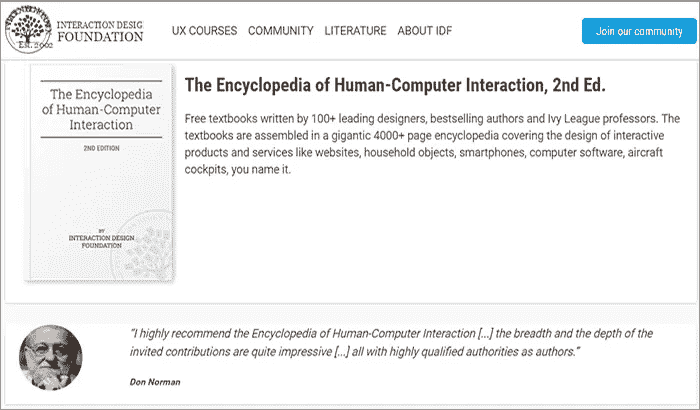

# 2. [50 项用户体验最佳实践](http://userexperiencedesigns.com/)

作为 UX 设计的经典之作,《50 个用户体验最佳实践》比最初撰写它的设计机构还要长久。该指南涵盖了用户体验设计的所有方面，从用户研究到前端开发，采用合理的支持和说明性的视觉效果，为 UX 专业人士展示了 50 个最佳实践。为了更好地理解和快速浏览，这些列出的技术被分成不同的类别。

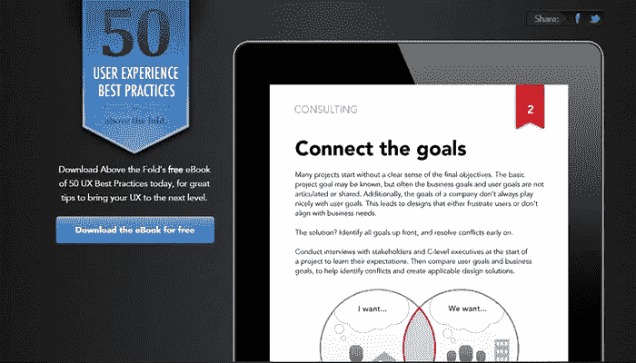

# 3.【2015 年 UX 设计趋势& 2016

这本书是由 UXPin 的专家撰写的，UXPin 是一个 UX 的设计平台，为网络和移动界面提供丰富的线框应用程序。聚焦于成为省时技术的趋势，这本电子书概述了目前 6 种最常见的实践，包括:

*适应性网页设计。

*微交互。

*个性化 UX。

*赋能 UX 设计。

*有意义的游戏化。

*设计网络服务。

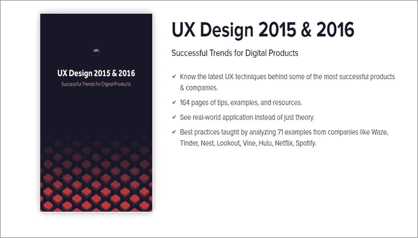

# 4.[网络用户界面设计最佳实践](https://studio.uxpin.com/ebooks/web-ui-design-best-practices/)

作为 UXPin 的一个包罗万象的指南，Web UI 设计最佳实践赋予了用读者通常期望的简单语言编写的系列技术分析。它分为不同的部分，包括颜色、视觉层次、用户界面模式、排版和导航等。

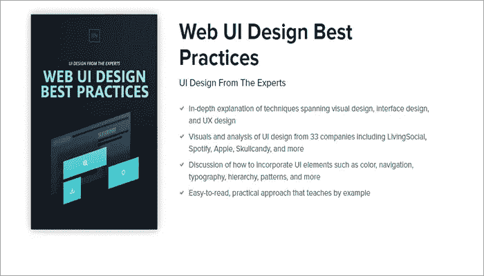

# 5.[CSS 的魔力](http://adamschwartz.co/magic-of-css/)

信不信由你，CSS 在我们的现代设计中扮演着越来越重要的角色。《CSS 的魔力》的作者 Adam Schwartz 用简单易懂的语言介绍了 CSS 的一些微妙之处。它由几个章节组成，包括盒子，布局，表格，颜色，排版，过渡和更多的互动例子。

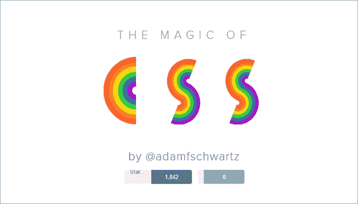

# 6.[用户体验设计师的好主意](http://userfocus.co.uk/ebooks/uxdesign.html)

这是可用性咨询公司 Userfocus 出版的另一部经典作品。这本书的一大亮点是采用了悠闲随意的笔调，让读者记忆深刻。披头士类比的首字母缩写词和“通往可用性的垃圾之路”也使这本书成为一本有趣的读物。

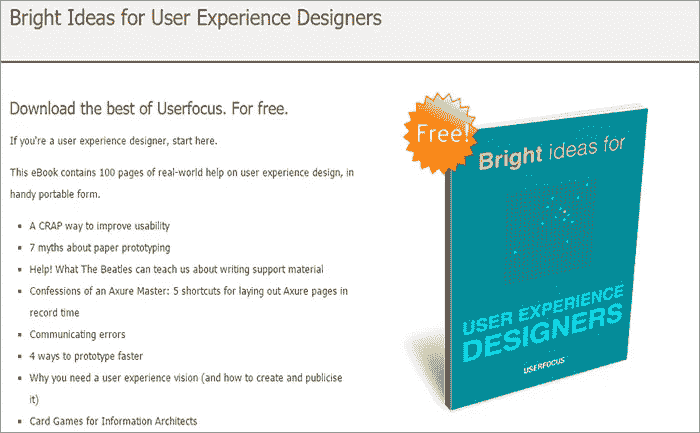

# 7.[UX 读者](http://theuxreader.com/products/the-ux-reader-ebook)

MailChimp 的 UX 阅读器包括 UX 设计过程中涉及的所有重要组件。这本一体化的电子书对初学者来说是非常好的，但对老手来说是一个方便的指南。它提供了宝贵的见解，并将 UX 设计分为 5 个类别:合作、研究、设计、开发和完善。它可以免费下载。

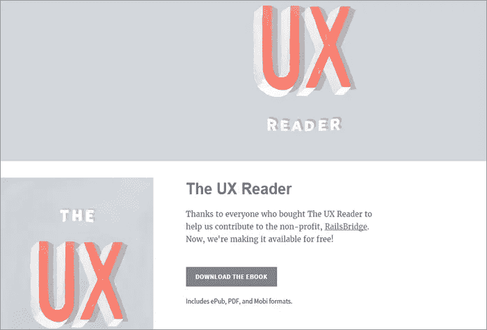

# 8.[UX 的书](http://www.amazon.co.uk/The-UX-Book-Rex-Hartson/dp/0123852412/)

由雷克斯·哈斯顿撰写，这本电子书旨在确保高质量的用户体验，并帮助读者在创建和完善设计方面表现出色。这有点像教科书，但它为所有经验水平的人提供了大量有用的知识和可靠的信息。根据 TechWhirl.com 的说法，“这本书充满了在我们的移动数字时代完善书面交流的先进知识，如果你写任何东西的话”

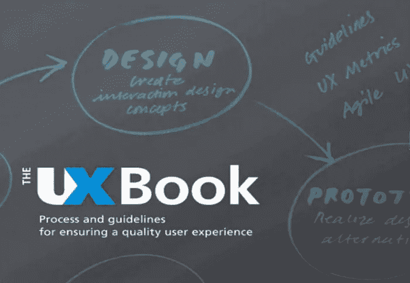

# 9.[不要让我思考](http://www.amazon.co.uk/Dont-Make-Me-Think-Usability/dp/0321965515/)

自 2000 年第一版以来，这本书的早期版本已经卖出了 40 多万册。每一版都成为成千上万的开发者和网页设计者的最爱。第三版在 16 年后仍然非常需要，并带着新的见解重新审视移动可用性的原则。

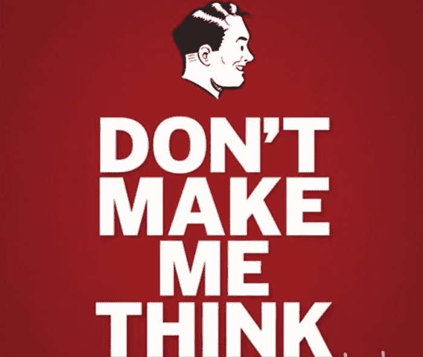

# 10. [UX 说书人:将点点滴滴串联起来](http://uxstorytellers.blogspot.kr/2009/01/ux-storytellers-connecting-dots.html)

被认为是 UX 书籍中的经典，《UX 说书人》偏离了“教科书”的格式。顾名思义，这本书很好地收集了来自 42 位 UX 专业人士和这一领域专家的现实生活建议和故事。它于 2009 年首次出版，仍然是一个非常有见地的阅读，以了解 UX 设计师注定要面对的解决方案和斗争。

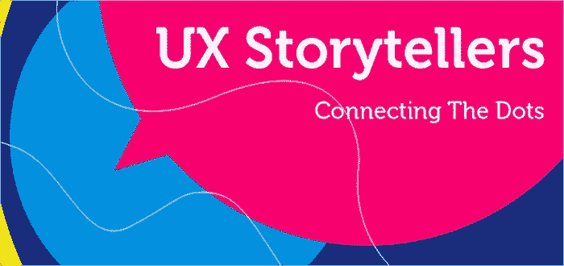

# 11. [UX 创业设计](https://studio.uxpin.com/ebooks/ux-design-for-startups/)

这是 Mardn Treder 的电子书，涵盖了 127 页给初创公司和成熟公司的生活建议。几乎每个公司都倾向于使用刷新的用户界面/体验设计，那些精心挑选的 [**原型和线框设计工具**](https://goo.gl/pFHCEn) 将是移动和 web 应用设计的好伴侣。有了它，任何人都可以快速学会如何验证产品假设，从而优化设计。

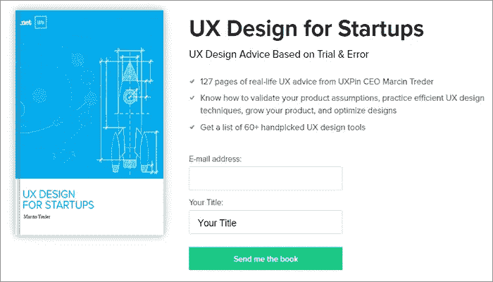

# 12.[网页设计趋势之书](https://studio.uxpin.com/ebooks/web-ui-design-trends-2015-2016/?q=/ebooks/web-design-book-of-trends-2013-2014/)

免费的网页设计师书籍，有 166 个网页设计的例子和 2016 年的最新趋势。此外，还有 100 个首选设计资源列表，以及大量展示最佳技术的案例研究。这些引用的实践来自知名公司，如 Intercom、锐步、宝马、阿迪达斯、谷歌、Jawbone 等等。

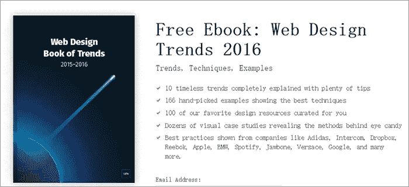

# 13.[线框图指南](https://studio.uxpin.com/ebooks/guide-to-wireframing/)

这本书有 100 多页，是工程师、项目经理、设计师和任何接触产品的人的完美伴侣。它不仅包括原型工具 的 [**比较，还解释了趋势 UI 设计模式。这本免费的电子书将指导你在开发过程的每个阶段通过最佳实践和设计理论。**](https://goo.gl/K5o2T0)

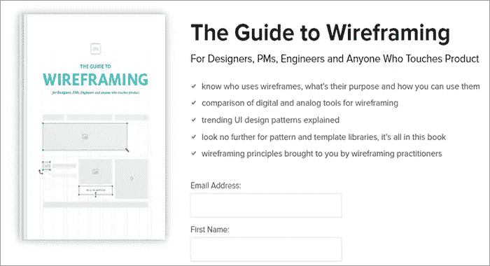