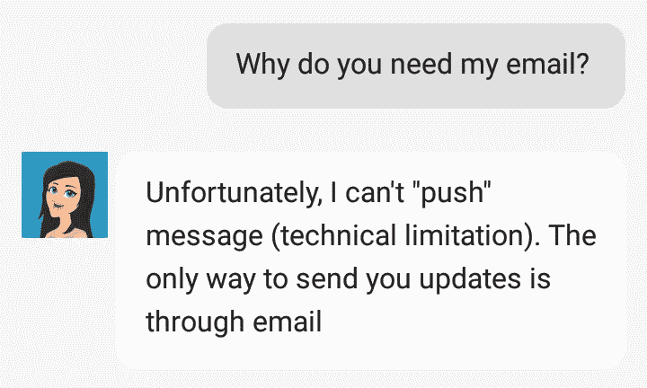
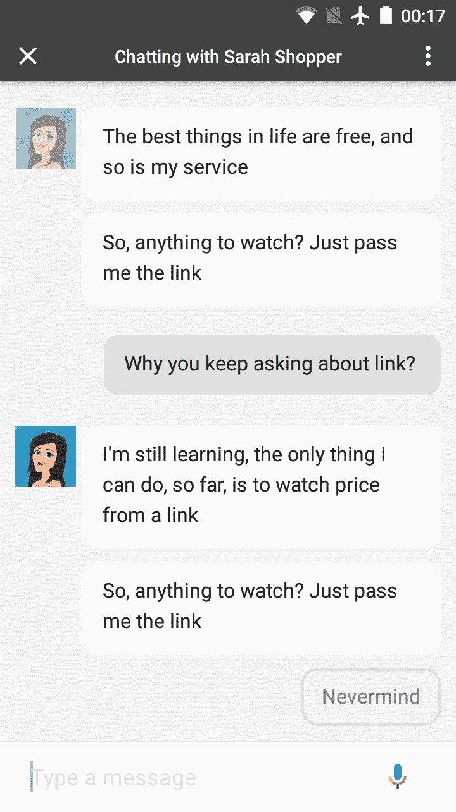
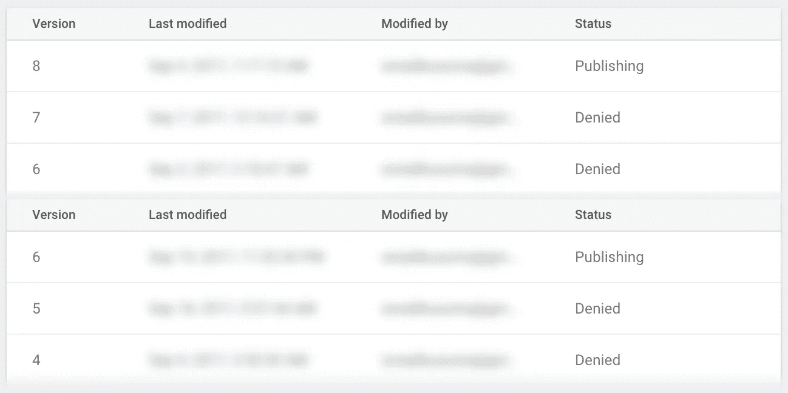

# 从 12 次拒绝在 Google 上提交行动中吸取的 12 个教训

> 原文：<https://medium.com/hackernoon/12-lessons-learned-from-12-rejections-submitting-actions-on-google-66979e8b20b5>

在谷歌 2017 年 I/O 会议的一次会议上，谷歌宣布了一项机器人建造竞赛，即谷歌开发者挑战赛的 T2 行动。[谷歌上的动作](https://developers.google.com/actions/)是谷歌助手的应用，类似于 [Alexa](https://hackernoon.com/tagged/alexa) 技能对于亚马逊 Alexa 的作用。

当时，我正在开发 Sarah Shopper，这是一个为亚马逊、宜家和其他一些电子商务公司开发的价格跟踪机器人。对于 Messenger 来说是这样，但由于与机器人的典型交互是“开火并忘记”,因此将它作为 Google Assistant 的一个操作似乎是一个好主意。我可以一箭双雕，为什么不呢？

我有过为 Messenger 和 LINE 构建机器人的经验，所以我认为这应该是一个简单的“构建-提交-盈利”过程，平台特定的差异很小。男孩，我错了。在我的投稿在几周内总共被拒绝了 12 次之后，以下是我的经验教训:

# 1.尽早发布，但要等到它准备好了

原因是，审查过程可能需要一周的时间。相比之下，Messenger 需要 2-3 天，而 LINE 不需要 0 天。

如果你已经设定了某个发布日期(或者加入了一个 bot 竞赛)，你最好早点发布。确保你的机器人符合[所有](https://developers.google.com/actions/distribute/) [动作](https://developers.google.com/actions/discovery/checklist) [策略](https://developers.google.com/actions/policies/general-policies)，因为如果它被拒绝(它会被拒绝)，你将需要再次等待。

“我不介意等一个星期，”你说。嗯…

# 2.拒绝并不能告诉你全貌

如果你的应用被拒绝，拒绝邮件不会列出你的应用的所有问题。它会提到一些问题，你会解决，然后你会重新提交，你会得到另一个拒绝。冲洗并重复。

审查者可能“一有错误就停下来”，所以避免这种情况的最好方法是严格遵守政策。你不想再等一个星期，是吗？

所以你已经确保一切都遵循，你开始移植你的信使机器人，但后来你意识到…

# 3.机器人只能回复

线上的机器人可以推，Messenger 也可以(有限制)。在 Assistant 上，没有办法“回电话”——只能回复用户的对话。必须在几秒钟内，你最多只能发送两个聊天气泡。

让 Sarah Shopper 观看某些网站是毫无意义的，但是用户仍然需要不时地给她打电话。唯一的通知方式是通过电子邮件，但是…

# 4.机器人不允许询问用户的电子邮件

如果您这样做，您的提交将被拒绝。要获取用户的电子邮件，请通过[帐户链接](https://developers.google.com/actions/identity/account-linking)使用谷歌登录。理想情况下，您希望仅在需要时才推迟登录(在这种情况下，当您需要电子邮件时)，但是…

# 5.目前，您不能在对话中登录

要么你要求用户预先登录(甚至在对你的机器人说一个字之前)，要么[等到功能实现后](https://developers.google.com/actions/identity/account-linking)。我没有耐心等待，所以我只是要求我的用户预先登录。

要是有那么简单就好了…

# 6.您需要有自己的 OAuth2 提供商

Google 上的 Actions 用的是 OAuth2，Google Login 也是。让我们把两者联系起来！登录流程将是:

1.  用户召唤你的机器人(“与莎拉购物者交谈”)
2.  谷歌助手呈现登录按钮
3.  用户登录，这意味着点击按钮并选择使用哪个谷歌账户
4.  你的机器人会收到你的邮件

不完全是。[你需要有*自己的* OAuth2 提供商](https://stackoverflow.com/a/44336364/193550)，在那里你可以告诉你的用户登录谷歌。

所以他们点击登录，然后点击另一个登录，然后…完成？嗯…

# 7.登录后，您需要再次调用机器人

你没听错。我可能做错了，但是文档不是很清楚。

还有另一种登录机制叫做[无缝/简化/快速](https://developers.google.com/actions/identity/oauth2-assertion-flow)(它有不同的名字，取决于你阅读的文档的哪一部分)帐户链接，但是我还没有设法让它工作。

好吧。帐户链接，电子邮件检索。完成了吗？不，我的应用程序还是被拒绝了几次。显然…

# 8.机器人绝不能“让麦克风开着”

你的机器人的所有最终答复必须要么结束会话(你的机器人停止，用户返回到助手)或询问用户下一步想要什么。你还应该提供建议芯片(预先录制的回复，用户可以点击回复)。就像和一个粘人的朋友聊天。

所以你仔细检查了所有的对话分支，没有打开的麦克风了。完成了吗？嗯，对于莎拉购物者，你需要给她你想让她看的产品的链接。

# 9.谷歌助手可以接受的字符数是有限制的

亚马逊链接可能很长(大约 300 个字符)。一位评论者给了 Sarah Shopper 这样的链接，聊天会话突然终止，并显示一条模糊的消息，“Sarah Shopper 现在没有响应。请尽快重试。”显然我在这里无能为力，所以我上诉并重新提交。

# 10.不要在名字上太有创意

在提交的过程中，我创建了另一个使用 SSML 的机器人。为了省钱，我使用我的一个停放的域名，syurprise.com[。是的，惊喜这个词是带 y 的。别问为什么，那是 17 年前(！).](https://syurprise.com/)

显然，[不允许一个词的名字](https://developers.google.com/actions/policies/general-policies#name_requirements)。我本可以上诉，但我已经失去了耐心，我只是希望它尽快出版。我把惊喜琐事放进去了。

我把 Syurprise 设置成读作“surprise”，就像 Flickr 读作“flicker”(而不是“flick-ar”)一样，但是被拒绝了，因为“你的名字和发音太不一样了。你的发音应该只是在基本方面有所不同，如空格、标点符号和语音拼写。我上诉了。有趣的是，当你问我的机器人如何读它的名字时，它有一个复活节彩蛋。

# 11.你的机器人可以在你知道它之前被发布

《莎拉购物者》和《Syurprise 琐事》现已出版。是吗？管理控制台显示他们仍在发布。

我妻子可以从她的 Pixel 手机中召唤它们。也许他们只是想让我在几周的等待后开心。你能召唤他们吗？

# 12.谷歌确实有免费的、人性化的支持！

这最后一点其实是一个赞。当我收到第一封拒绝邮件时，我几乎感到绝望(“我要对着一堵墙说话”)，但他们确实有人类的支持，他们反应很快，知识丰富。

感谢阅读！**如果你推荐这篇文章，我会非常感激**(点击👏按钮)以便其他人可以找到它。

**另外，如果你正在构建聊天机器人，请考虑加入我的邮件列表，**[**probotdev.com**](https://probotdev.com/landing/tobotornot)**，在这里我分享了关于各种平台和行业的机器人构建的*可行见解*。**