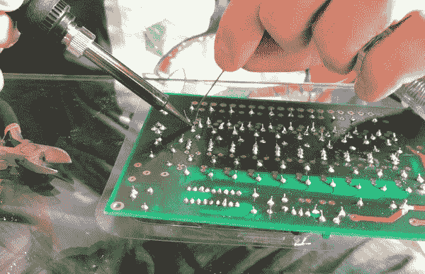

# 12 个月成为独立黑客

> 原文：<https://medium.com/hackernoon/12-months-to-become-an-indie-hacker-ad0c916c1f5f>

Musician in Manhattan Beach, Los Angeles. Photo: Adrien Joly.

## 一年前，我停止了自由职业，以自己的项目为生。这并不像预期的那么容易。这是我的回顾展。

> ℹ️️:这篇文章是《发展与进步:我的过去》( 🇫🇷).)的快速翻译对不起，语法错误，直译，谢谢你的理解！

**2017 年 9 月中旬**。我只有足够的钱在没有薪水的情况下生存 3 个月。现在是时候恢复金融稳定了。*

在过去的 12 个月里，我一直在每周交易 1-2 天来赚取教学工资。除此之外，我可以自由做我想做的事！

那段时间我做了什么？我的结果是什么？**这是我的故事。**

**如果你对会计感兴趣的话:从去年夏天开始，我每月靠 2500€生活。包括 1000€/月的抵押贷款和 600€的税款。我的教学工作收入是 1300€/月，并且用掉了以前工作的积蓄。*

# 1.六个月赚点收入

2016 年 3 月，我遇到了一群年轻的自由职业者和数字游牧民，他们叫红树。他们激励我花更多的时间开发自己的项目。

 [## 从眼前的利润到快乐，优先权的转移

### 1 年零 4 个月的自由是如何让我更加自我意识和自信的:一次 5 维 n 图之旅。

medium.com](/@adrienjoly/from-immediate-profitability-to-pleasure-a-shift-of-priorities-3f767253084e) 

我还听说过一个网站，几个开发者在上面分享他们通过开发自己的产品谋生的故事:独立黑客。我很兴奋！

 [## 向盈利在线企业背后的企业家学习

### 数百次对成功创始人的采访，他们分享了业务背后的收入数字，并解释了如何…

indiehackers.com](https://indiehackers.com) 

我已经可以看到自己整天按照自己的想法编码，成为自己的老板，赚足够的钱过上愉快的生活。我等不及要开始了！😋

2016 年夏天。我决定告别我的客户，开我自己的船:**发展并依靠我自己的想法生活**！

所以我在网上公布了我的一长串想法，根据兴趣反馈看哪一个最有可能成功。然后[我致力于在春季之前实现每月收入 100€的目标](/@adrienjoly/getting-paid-directly-by-users-to-craft-software-for-them-1a8ef5e1a73)，并且[采用了严格的生产力程序](https://byrslf.co/work-on-12-projects-without-burning-out-f5bec50dafdb)。我对自己的想法感到兴奋，对自己的技能充满信心，并决心取得成功！💪

2016 年 10 月。我推出了我的第一个产品 : **特雷罗的下一步**。一个浏览器扩展，可以在我的 Trello 板上更有效地跟踪进度。这是一个很好的开始:我在两个月内说服了 3300 个用户，没有太多的努力！

我从用户那里得到了很多积极的反馈，所以我问他们什么样的**改进**会让我的产品变得真正重要。基于他们的回答，我发起了两次众筹活动:

*   为 Trello v2.0 的**下一步开发提供资金的 Kickstarter 活动，具有最受欢迎的功能；**
*   还有一个 Patreon 活动，针对那些对捐赠**以换取与我的工艺开发过程相关的独家奖励更感兴趣的用户和朋友。**

为了增加捐款，我在 Twitch 和 Youtube 上进行了几次直播，在此期间我开发了一些功能并回答了一些问题。

尽管用户给了我充满希望的反馈，但那两次众筹活动都以失败告终。🏜

# 2.生产力研讨会的机会

由于对第一次失败感到失望，我决定尝试不同的方向。看到我工作效率很高，而且[写了很多关于生产力的文章](http://tinyletter.com/productivity-tips)，几个朋友对我的一些生产力建议很感兴趣。所以我决定提议在举办一个**生产力研讨会。**

 [## 阿德里安·乔利的《阿德里安的生产力秘诀》

### 每周，我都会免费发给你一些小贴士，告诉你如何改善你的时间管理、工作和沟通技巧…

tinyletter.com](http://tinyletter.com/productivity-tips) 

在计划了 2017 年 1 月我的研讨会“*提高你的生产力:学会如何少拖延*”后，我们最终**取消了它**，因为报名人数很少。

幸运的是，我能够说服一个注册的参与者把她的票转换成两个小时的个人辅导。

=> **第一笔收入**:2017 年 2 月赚的 100€，终于！🙌

话虽如此，我很快意识到，我对教授或辅导这个话题并没有那么大的兴趣。所以我决定转向另一个项目。

此外，在她在巴黎的演讲中，[poor nima Vijayashanker](https://medium.com/u/ebd37a9be319?source=post_page-----ad0c916c1f5f--------------------------------)[让我意识到](/@adrienjoly/current-experiments-turning-what-i-️-doing-into-8b8c1b34b66f)像许多开发者一样，我在要求人们为我的软件付费时有一些**的困难。**

在那一点上，我也很清楚我还有很多关于营销的东西要学。尤其是在我们生活的这个信息过载的时代。

# 3.教育技术和合作项目

在认识到 Trello 的下一步不会是财务上的成功，以及我没有足够的动力去教授生产力之后，我决定探索其他的可能性:

*   将我已经开发了 1.5 年的**学生评估软件**货币化，以帮助我应对给学生的代码评分；
*   和一些有才华的朋友合作开发下一个产品。

所以我制作并发布了几个视频来推广我的教育工具，同时开始了两个合作项目:

*   “**新的一天**”，整合到谷歌 Chrome 中的任务管理工具；
*   以及" **Clear** "，一个允许对客户表单进行讨论的应用程序。

在那段时间里，我和我的队友还在做其他项目，所以我们决定每周在每个项目上花一天时间。我们还设定了两个月的期限。

两个月后，我们让用户测试我们的产品，对他们的结果感到失望。所以我们决定退出这两个项目。

我的分析是，我们缺乏适当的领导和角色分配，尤其是在关键的产品决策方面。我还认为每周只花一天时间不足以弥补沟通开销。

与此同时，由于[贾斯廷·杰克逊](https://medium.com/u/a02dd1574d08?source=post_page-----ad0c916c1f5f--------------------------------)、[肖恩·麦凯布](https://medium.com/u/2e5037d50682?source=post_page-----ad0c916c1f5f--------------------------------)和[克利福德·奥拉维奇](https://medium.com/u/55e9fd9a459?source=post_page-----ad0c916c1f5f--------------------------------)，我在我的教育技术项目中发现了**营销和客户预期**的艺术。我设定了一个目标，从我写下的 100 条线索中，说服 3 位老师在他们的教室里试用我的软件。最后，在联系了 67 个销售线索后，我确实达到了那个目标。但是还没有进行审判。等着瞧！

# 4.后退一步

2017 年 4 月，我明白了为什么我们说创业者**感到孤独**。创业会把大量的时间和精力变成失败和自我怀疑。但最糟糕的是被家人朋友视为异类。他们中的大多数人不理解我在做什么，也不敢和我谈论这件事。而且，由于我把大部分时间都花在了建立自己的公司上，我们没有太多的其他话题可谈…

 [## 继续，从附带项目到真正的产品

### 失败的尝试很有趣。现在让我们找到适合的神圣市场！

hackernoon.com](https://hackernoon.com/moving-on-from-side-projects-to-real-products-f6cc24f556ff) 

我也明白我在同一时间把精力分散到了太多的项目上。我不得不更加专注。为了摆脱其中的一些。所以我对每个项目做了一个 [SWOT 分析](https://en.wikipedia.org/wiki/SWOT_analysis)(***s*******w****eaks、****o****opportunities、****【t****hreats*)，帮助我做出明智的决定。*

*最后但同样重要的是，[我意识到](/@adrienjoly/im-not-the-10x-developer-i-thought-i-was-acad63d059a4)我错误地认为自己是一个“10 倍开发者”然而，事实上，我表现得很像，只是为了掩饰我的不安全感。我缺乏自信和对他人的信任。*

* [## 我不是我想象中的 10 倍开发者。

### 这是我一直告诉自己的故事，也是我为什么要编造那个谎言的原因。

medium.com](/@adrienjoly/im-not-the-10x-developer-i-thought-i-was-acad63d059a4) 

摘录:

> “如果我想制造和运输伟大的产品，我需要战胜我的不安全感，成为一个更好的沟通者，一个更好的队友，一个更好的人。”([2017 年 5 月](/@adrienjoly/im-not-the-10x-developer-i-thought-i-was-acad63d059a4))
> 
> “我需要知道我想要什么，不想要什么。而且，这些天来，我很难搞清楚这一点……”([2017 年 6 月](/@adrienjoly/broken-cars-and-life-choices-3e702f9df77c))* 

# *5.放手和结束*

*2017 年 6 月，我知道我的积蓄几乎用完了，我获得收入的机会降到了最低。我知道我即将到达**这趟冒险的终点**。*

*所以我决定遵循 3 条指令:*

*   *让我的项目保持功能性和整洁的状态；*
*   *发布高质量的内容，展示我在这 12 个月里做了什么；*
*   *把时间投入到**最令人兴奋的项目**，而不是那些我认为更有可能赚钱的项目。*

*我最终出版了:*

*   *一份关于我当老师的头两年所学的非正式报告；*
*   *演示我的学生评估软件的简明视频，*
*   *为有兴趣尝试的教师提供一个登录页面和邮件列表；*
*   *我发起了一个众筹活动来维持 Openwhyd。最不可行但最酷的项目。*

* [## 🕵稳步前进，好惊喜！

medium.com](/@adrienjoly/steady-progress-and-good-surprises-a65efe4e02fc) 

尽管困难重重，Openwhyd 的众筹活动还是成功了！我们筹集了足够支付 4 个月托管费用的资金，这激励了志愿者们为这个项目做贡献！

2017 年 7 月，我决定参加 Atlassian Codegeist 竞赛，提交了一份 Trello 的通电:“AJ 的**评论编辑。”我没有赢得比赛，但特雷罗整合了我的力量。所以我认为这是对我作为扩展开发人员素质的肯定。“特雷罗的下一步”也是一个扩展，但它没有被集成到特雷罗。感觉**完成了**！**

 [## 🚀新闻:在去 Trello 和 WIP 社区的路上通电！

### 在过去的 10 天里，我本应该在法国南部和家人一起放松一下。我做到了。还有，我没有！🙃

hackernoon.com](https://hackernoon.com/power-up-on-its-way-to-trello-and-wip-community-5af44320badc) 

另外，我开设了一个名为“ [Work In Progress](https://spectrum.chat/wip) ”的产品开发人员社区，以帮助和表扬像我一样正在开发自己想法的开发人员。

在去美国之前，我重新发现了焊接的乐趣！

Soldering a Velleman kit. So satisfying! 😌

# 结论

我希望这篇文章能帮助我的家人和朋友更好地了解我自去年夏天以来都在做些什么。我的意图也是为了减轻像我一样作为独立黑客没有成功的其他开发者的感受。**没事**！

我可能会写第二篇**文章**来分享一些可行的技巧给那些也想成为独立黑客的人。如果你感兴趣，请告诉我。**【编辑】下面我链接了:**

 [## 作为一名独立开发者，我在两年的工作中学到了什么

### 关于营销、生产力和自我意识，我希望在辞职前知道的 7 条原则。

hackernoon.com](https://hackernoon.com/what-i-learned-while-working-as-an-indie-developer-for-2-years-53619fafa81f) 

# 迫不及待地想看你的反应和问题，如果有的话！*