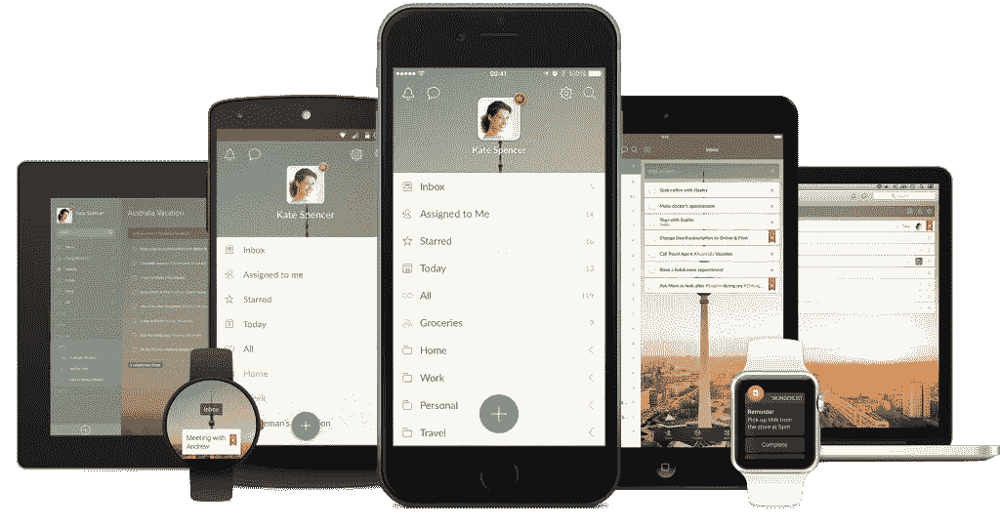
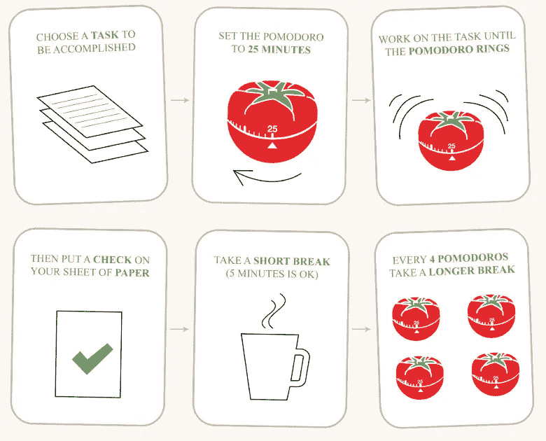
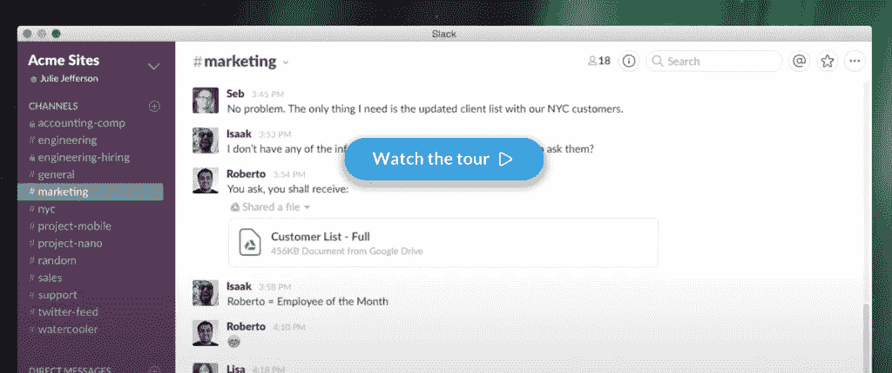

# 每个创始人都应该知道的 4 个生产力技巧

> 原文：<https://medium.com/hackernoon/12-productivity-tools-every-entrepreneur-should-be-using-60b19c8df256>

作为一名企业家，我一直在寻找最适合我的生产力应用。无论我使用的是 iPhone、Android、Mac 还是 PC，获得更多宝贵的时间来完成工作总是一个挑战。

你是否有时会觉得即使工作了 12 个小时，你为公司做的还不够？

*你还记得你今天完成了什么吗？*

老实说，我经常感觉到这一点…所以我开始投入更多的时间来寻找合适的生产力应用程序，以便在工作中更有条理。这些帮助我:

*   **做更多的事情，**
*   **不要内疚，知道我的极限，**
*   **获得更多放松的自由时间！**

我们现在开始好吗？

# #1 写下它们

每天睡觉前，我都会写下第二天最重要的任务。这让我头脑清醒，并确定了第二天顺利开始的要点。除了不朽的笔和纸，我还使用**这些待办应用:**

*   [**Wunderlist**](https://www.wunderlist.com/) —我和同事甚至妻子分享的一个简单的待办事项清单(购物清单)。适用于各种平台，包括 Android 和 iOS。
*   [**Trello**](https://trello.com/) —我用过的最神奇的项目管理工具之一！给你的项目命名，添加三个神奇的栏目——“待办事项”、“进行中”和“完成”——并与你的员工分享。它比其他工具使用起来更容易也更快，比如 [**Asana 软件**](https://asana.com/) (可能需要一些时间来正确设置，我发现它适合更大的项目)。
*   [**【思维导图】**](http://www.xmind.net/) —思维导图是快速捕捉你的想法并以视觉上吸引人的方式呈现出来的最佳方式。*你知道吗，使用思维导图可以让你的* [***记忆力提高 32%***](http://b701d59276e9340c5b4d-ba88e5c92710a8d62fc2e3a3b5f53bbb.r7.cf2.rackcdn.com/docs/Mind%20Mapping%20Evidence%20Report.pdf) *？*

# #2 专注于生产力应用

专注应该是你一天中最重要的方面！为了提高你的注意力，试着:

*   [**番茄工作法**](http://pomodorotechnique.com/) —对于那些喜欢敏捷方法的人来说，这是一项伟大的技术。这个想法是把你的任务分成间隔/冲刺(称为 pomodoros)，通常每个 25 分钟，中间休息 5 分钟。在这段时间里，当计时器在计时时，你只能专注于一项任务。( [**在线番茄**](http://tomato-timer.com/)**|**[**iPhone App**](https://itunes.apple.com/us/app/flat-tomato-time-management/id719462746?mt=8)**|**[**Android App**](https://play.google.com/store/apps/details?id=personal.andreabasso.clearfocus&hl=en))，
*   [**Toggl**](https://toggl.com/)——*你知道你在工作任务上花了多少时间吗？*开始用 app 追踪吧。这将使你的一天更有条理，并帮助你重新思考如何优先考虑你的任务。
*   **—基于[**【GTD】**](https://en.wikipedia.org/wiki/Getting_Things_Done)的任务管理系统——最受创业者欢迎的时间管理方法。这一切都是为了通过在外部记录它们，然后将它们分成小块，来摆脱你头脑中的任务。**

****

# ****#3 清理干净！****

**你的工作空间、桌面或者 chrome 浏览器应该是“干净”的。干净的空间就是干净的心灵！试试这个:**

*   **[**一个标签**](https://www.one-tab.com/)——你是不是也患上了“打开一百万个标签”综合症？好吧，这个 Chrome 扩展是解决办法。它可以让你把所有的标签页转换成一个列表，这样你就可以以后再回来查看它们，避免浏览器混乱。**
*   **[**口袋**](https://getpocket.com/)——保存东西(链接、视频、博客、帖子等)。)是你以后想“消费”的。你可以在任何设备上阅读，也可以离线阅读。**

****

# **#4 代表**

**一个人不可能做完所有的事情。成为委派任务的大师。有时候，你甚至不需要任何员工。使用这些资源:**

*   **[**Upwork**](https://www.upwork.com/)——最大的自由职业者平台，可以完成你能想象到的所有在线任务。找到其他企业家，他们可以用这个生产力应用程序帮助你。**
*   **混合了**松弛**和 [**收敛**](https://www.convergely.com/)——有了这些信息应用，你可以忘记你的电子邮件。使用 Slack 与你的团队和自由职业者交流。同时，Convergely 将帮助您委派和自动化流程(参见 how: [**松弛技巧和集成的最终列表**](http://blog.hubstaff.com/slack-tricks/) )**

****

# **控制生产力应用**

***准备好提高生产力了吗？***

**伟大的生产力应用程序和时间管理技术的结合是每个想要提高工作表现的企业家的必备之物。上面的列表是有意缩短的。我不想让你浪费时间去挖掘另一个无止境的列表，而不是满足于任何一个建议，所以我把自己限制在 12 个最好的生产力工具。**

****记住**完成更多工作并不总是与生产力应用程序有关。你也需要很多自律和自我激励。**

****

**从今天开始提高你的生产力，现在就让自己熟悉以上至少一项。尝试并享受这些应用程序，找出最适合您的生产力工具设置！**

**祝你一周工作顺利！🙂**

****更多** [**博文在此**](https://brainhub.eu/blog/)**

****

# **与最好的 JavaScript 开发人员和连续创业者合作，共同打造下一个独角兽。我们热爱创业，我们是 JavaScript ( [Node.js](https://brainhub.eu/nodejs-development) 、 [React](https://brainhub.eu/reactjs-development) 、电子等方面的专家。js“东西:)。让我们谈一谈吧！**

***原载于 2016 年 1 月 20 日*[*brainhub . eu*](https://brainhub.eu/blog/2016/01/20/12-productivity-tools-every-entrepreneur-should-be-using/)*。***

************

> **[黑客中午](http://bit.ly/Hackernoon)是黑客如何开始他们的下午。我们是 [@AMI](http://bit.ly/atAMIatAMI) 家庭的一员。我们现在[接受投稿](http://bit.ly/hackernoonsubmission)，并乐意[讨论广告&赞助](mailto:partners@amipublications.com)机会。**
> 
> **如果你喜欢这个故事，我们推荐你阅读我们的[最新科技故事](http://bit.ly/hackernoonlatestt)和[趋势科技故事](https://hackernoon.com/trending)。直到下一次，不要把世界的现实想当然！**

****