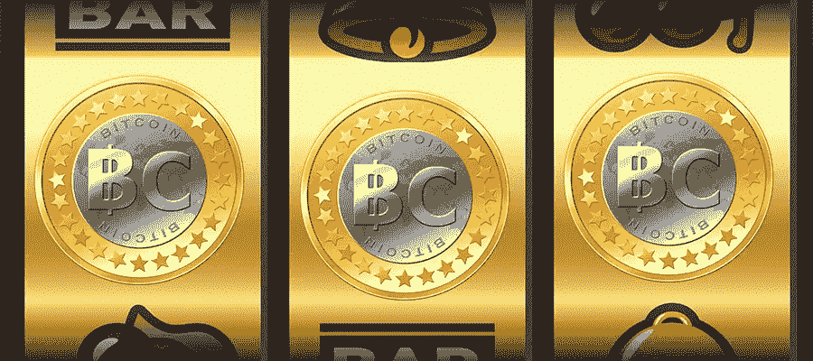

# 投资 ICO 前要问自己的 12 个问题

> 原文：<https://medium.com/hackernoon/12-questions-to-ask-yourself-before-investing-in-an-ico-ffbb2169a893>

Casino Cheers bitc slots

今年夏天，首次公开募股(ico)风靡一时，募集了大量资金，让企业家、顾问和名人代言人赚了很多钱。问题是，对于每一个巨大的机会，都有十几个虚假的骗局试图拿走你的钱，好的和坏的都在列出即将推出的 ico 的热门网站上做广告。然而，这并不意味着没有钱可赚。由于美国证券交易委员会对这种模式转变的反应仍然缓慢，没有明确的指导和规则，因此通过投资“投机”ico 获得巨额收益的机会很小。以下是我认为每个投资者在投资 ICO 前都应该问的基本问题:

**基本项目问题:**

1.  **它是做什么的？**

ICO 的目的是为分散式应用程序(DAPP)的开发提供资金。你需要做的第一件事是找出这个 DAPP 到底是做什么的，这也是你会看到的关于任何 ICO 的第一个描述。您可以根据项目的目标以及您是否相信它所提议的内容有市场，来快速轻松地筛选项目。

2.**它是如何工作的？**

接下来你要做的就是阅读白皮书，试着理解它是如何工作的。如果你不熟悉计算机科学，这可能需要你查找一些你不理解的术语。如果白皮书或创作者提供的其他文档没有解释项目如何工作以及合同如何实现，那么您最好避开 ICO。

3.这个真的需要放在区块链上吗？

一旦你理解了创建者想要做什么，以及他们打算如何实现你的解决方案，问问你自己你是否认为区块链是最好的解决方案。许多(大多数)事物在现实世界中保持现状会更好。大规模实施现代区块链通常速度慢、成本高且效率低。区块链不是万灵药，也不应被视为某种商业灵丹妙药。

4.**令牌有必要吗？**

很多时候，DAPP 不需要自己的 ERC20 令牌就可以成功。如果这个项目可以很容易地使用以太坊，而不是需要一个全新的令牌，这已经是一个基本的问题了。

5.**团队能执行吗？**

这有点难以判断，但是你应该试着评估这个团队，看看你是否认为他们有能力完成这个项目。创始人是否拥有开发和维护 DAPP 所需的技术智慧？你认为这个团队在筹集到必要的资金后会留下来继续开发这个项目吗？顾问们有丰富的行业经验吗？

6.这笔钱被用来做什么？

确保对这笔钱的确切用途有一个清晰的轮廓。通常有很大一部分是法律费用，但是一定要注意花在营销上的钱，以及花在贿赂创始人、有影响力的人和顾问上的钱。

**代币销售问题:**

7.**代币是如何分配的**

最重要的事情是查看令牌是如何分配的。每个代币的售价是多少？将会有多少代币存在？公司保留了多少代币？给顾问多少代币？创始人持有多少代币？开发者获得多少代币？赏金用了多少？缴费限额有多大？你希望看到的是大部分代币被出售，一小部分给核心团队，一部分由公司保留给开发者。另一件重要的事情是寻找一个锁定，防止创始人和顾问倾销他们的代币。他们应该在几年后慢慢获得出售莱茵代币的能力。你还希望看到贡献限制，以防止鲸鱼获得操纵市场的权力，并确保那些想要超过限制的人有未满足的需求，这将推高价格。

8.**有预售吗？**

预售一般来说是一件坏事。预售意味着公司以一定的折扣(通常是很大的折扣)出售代币给第一个投币的人。这对后来的投资者来说意味着他们可能会被榨干他们的钱，因为该公司的大部分已经以低得多的价格出售了。对于预售投资者来说，这意味着他们的资金可能会被锁定很长一段时间，该公司没有信心能够在公开 ICO 中筹集到所有必要的资金(这就是他们进行预售的原因)。预售奖金越多，ICO 越差。

9.**有赏金计划吗？**

赏金计划是非常非常非常坏的消息。不惜一切代价避免奖金，因为这意味着向那些在社交媒体上发布有关该项目的帖子或撰写有关该项目的 Steem 和 Medium 帖子的人发放了大量代币。这是你的线索——因为这实际上只是一个金字塔计划，公司通过人为炒作间接付钱给赏金猎人来推动投资。

10.****广告多吗？****

**许多 ico 选择大力宣传销售。这些广告可以在流行的加密网站上，在列出许多即将推出的 ico 的网站上，甚至在通过[谷歌](https://hackernoon.com/tagged/google)或其他广告合作伙伴的普通网站上。避免任何大量做广告的项目，因为这些项目几乎总是抢钱。负责任的团队不会在广告上花费太多，而是让项目自己说话。**

**11.**定价模式是什么，公司的价值是多少？****

**许多 ico 都有一个硬性的上限，规定了他们希望筹集的美元金额和他们提供的代币数量。N 币每 ETH，BTC，NXT 等的实际贡献率。在 ICO 开始时根据基础硬币的当前美元价格确定。这种模式自动赋予项目一个创始人选择的市值，而不是投资人。这并不总是最好的模型，因为它并不等同于供给和需求。这可能导致价格过高或过低。在这种情况下，确保你同意项目的报价，并评估你是否认为它实际上值得它的隐含市值。其他格式，如雷电网络 ICO 使用的格式，具有更复杂的拍卖形式，如荷兰式拍卖，价格随时间推移而下降(其他格式的价格随时间推移而上升)。当价格下降时，贡献者可以以他们认为合理的任何价格进入，而不需要担心他们是否应该等待，因为每个人都收到了最便宜的价格。我认为这是一种更好的拍卖形式，因为它为投资者找到了一个低价格，而且价格可能会上涨，因为早期的贡献者对令牌的估价高于其销售价格(意味着他们对令牌的估价高于其销售价格)。**

**12.**你愿意损失多少？****

**你可以问自己的最重要的问题是你愿意损失多少钱。在一天结束的时候，每次你投资一个 ICO，你真的只是在赌博，这种行为应该被认为是在掷骰子和购买场外股票之间。为了对冲巨大的损失，寻找一个项目，立即分发代币，并尽快进行交易，这样你的投资仍然是流动的。理想情况下，这将意味着像 bittrex 或 finance 这样的东西，但如果它在预售期间达到 etherdelta，这是一个好迹象。不管怎样，永远不要投资超过你愿意损失的部分，记住华尔街之狼是卖解雇通知书的人，而不是买解雇通知书的人。**