# 设计师必备的 15 个 UX 工具

> 原文：<https://medium.com/hackernoon/13-must-have-ux-tools-for-designers-83ce1b646758>

你用来创建**流程图**的 **UX 设计工具**是什么？线框图、[原型](https://hackernoon.com/tagged/prototyping)、用户测试、交互设计或团队协作的最佳工具是什么？

有大量的 UX 工具，找到最好的可能是令人难以置信的。如果你正在寻找 UX [设计](https://hackernoon.com/tagged/design)工具和 UX 线框工具来让你的生活更轻松，这篇文章是专门为你写的。为了帮助你高效地创建应用/网站，我们探索了 15 个令人惊叹的 UX 工具和 2019 年你应该拥有的最佳原型工具。

# 1.UX 思维导图工具:[思维管理器](https://www.mindjet.com/mindmanager/)

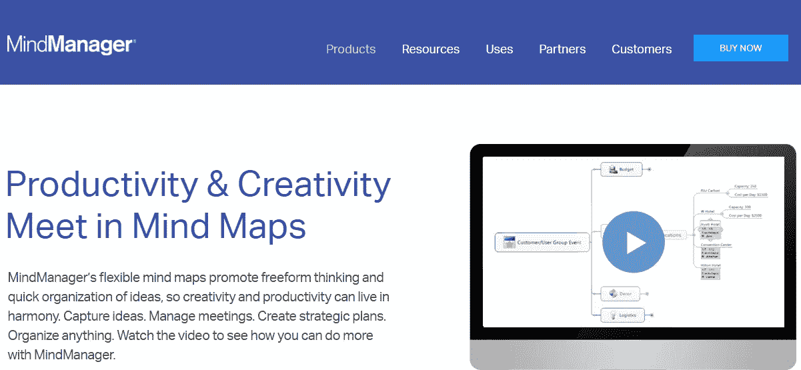

思维导图是用来直观地组织信息的图表。这是集思广益、制定计划或将想法转化为现实所需步骤的好方法。MindManager 是 Mindjet 开发的最好的思维导图软件应用程序之一。数字思维导图可以用作“虚拟白板”,用于头脑风暴、管理和规划项目、编辑研究、组织大量信息以及进行战略规划。

定价:局域网起价 129 美元

# 2.用于流程图和图表的 UX 工具: [SmartDraw](https://www.smartdraw.com/)

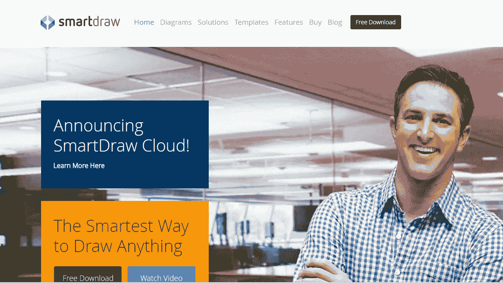

SmartDraw 允许您使用任何现代 web 浏览器创建和编辑流程图和图表。如果您需要在防火墙后工作，您仍然可以使用 SmartDraw for Windows。它包括数百个专业模板，你可以快速编辑，使你自己的。使用 SmartDraw，即使是最初级的用户也可以立即变得高效。

**定价:**一次性购买 197 美元起(无月费或年费)

# 3.用于快速原型设计的 UX 工具: [Mockplus](http://www.mockplus.com)

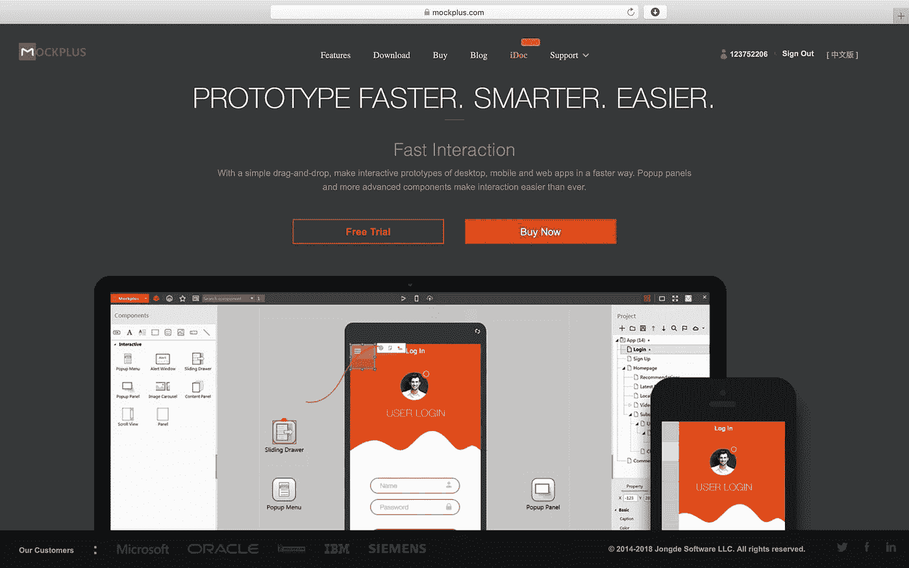

Mockplus 是一款优秀的设计原型应用。这是最好的快速开发移动应用、桌面应用和网络应用的原型工具。与 Photoshop 或 Illustrator 等通用图形编辑器相比，使用 Mockplus 构建设计原型要容易得多。直观的拖放式用户界面使得立即开始使用该工具成为可能。即使是第一次使用的用户也可以掌握它，而不必查看教程和培训手册。如果你正在寻找一个便宜的 UX 工具，并允许在最短的时间内创建交互式原型，Mockplus 是一个理想的解决方案，你不应该错过。在 Mockplus 3.2 中，有一些有用的新功能，包括 UI 流设计模式、中继器、演示项目和模板以及草图导入。像思维导图设计模式等其他功能将在 Mockplus 3.2 之后的版本中呈现。

**定价:**基本计划和专业计划免费，每月 29 美元起(按年计费)

# **4。团队协作和移交的 UX 工具:** [**iDoc**](https://idoc.mockplus.com/?hmsr=tangerine-m)

Mockplus iDoc 是一个方便的设计协作和移交工具，供设计师、开发人员和产品经理上传、制作原型、评论、测试、共享和移交带有自动资产、规格和代码片段的设计。

为了优化 web/应用程序设计的 UX，用户可以轻松地将他们的设计与 PS/XD/Sketch 中的资产和规格细节同步，创建 UI 流和交互式原型，评论设计并收集反馈，轻松地在线测试、迭代、共享和交付设计。

一切都可以在网上实时完成，让你的团队一起工作，节省至少 50%的时间和精力。

**定价** : **每个人免费获得 5 个项目和 5 个会员**；9 美元/月

# 5.用于流程图和图表的 UX 工具: [Visio](https://products.office.com/en-us/visio/flowchart-software)

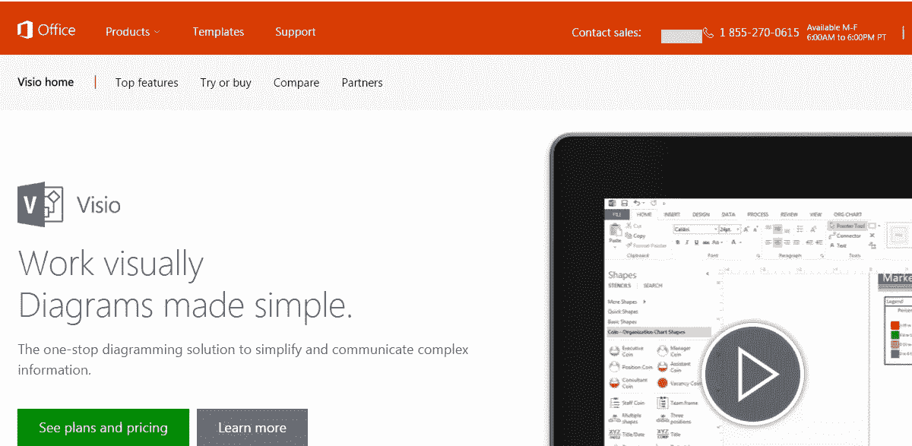

使用 Visio，只需几次单击，您就可以用数据链接图表交流复杂的信息。利用 Visio 形状来提高您的工作效率。Visio 形状可以链接到多个数据源，包括 Microsoft Excel、Microsoft Excel Services、Active Directory、Microsoft SharePoint 列表等。您还可以通过 Office 365 或 SharePoint 浏览器分享您的创作。

**定价:**计划起价为每月 279.99/403.56 美元。

# 6.高保真线框和原型的 UX 工具: [Axure](http://www.axure.com/)

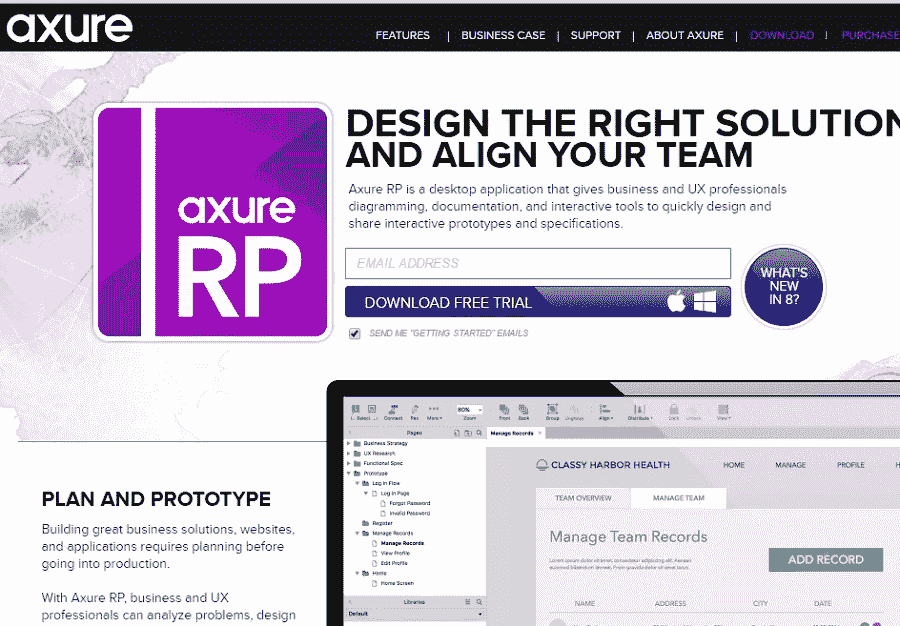

Axure RP 是一个桌面应用程序，为商业和 UX 专业人士提供图表、文档和交互式工具，以设计和共享交互式原型和规范。毫无疑问，它是最全面的(就功能而言)原型工具之一。Axure 可以创建静态的低保真度原型和更复杂的交互式原型。因为 Axure 是一个非常专业的 UX 工具，它需要一个陡峭的学习曲线。

定价:每位用户 495 美元

# 7.在 iPad 上开发原型的 UX 工具: [AppCooker](http://www.appcooker.com/)

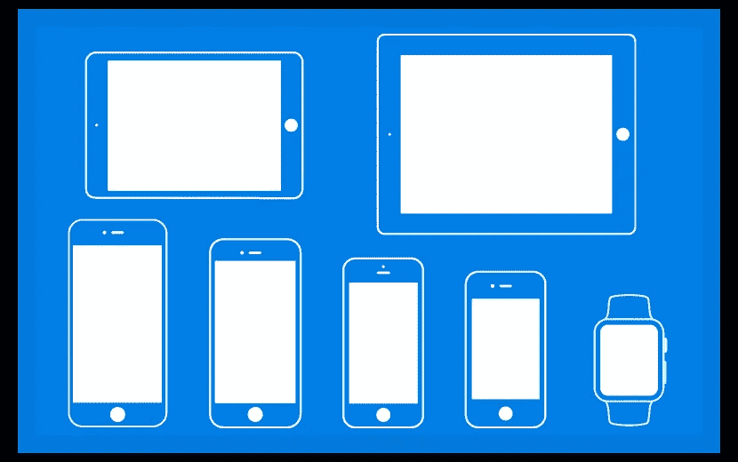

App Cooker 是一个运行在 iPad 上的原型工具。它支持链接、手势，你可以将众多组件添加到你的屏幕上。使用 AppCooker 你可以使用和定制所有的 iOS UI 元素。您还可以与同事共享可编辑的项目，或者与客户和朋友共享带有 AppTaster 文件的可点击模型。AppCooker 让你可以将你的作品导出到 Dropbox，box，通过电子邮件导出到照片库和 iTunes 文件夹。价格工具可以帮助你定义和追踪开发应用的成本。

**定价:** $29.99

# 8.在 Mac 上开发原型的 UX 工具: [Flinto](https://www.flinto.com/)

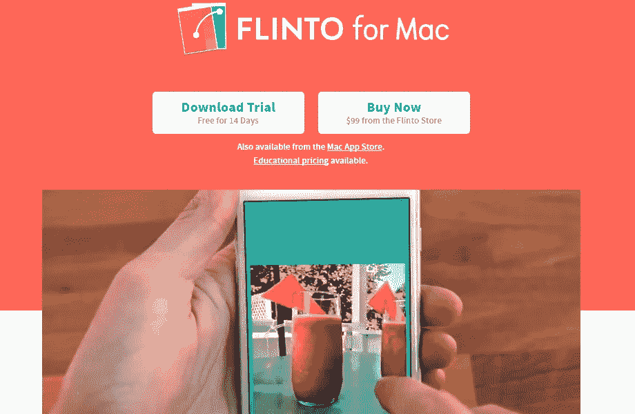

Flinto for Mac 是一个全面的原型制作工具，让设计师快速制作他们的移动、桌面或 web 应用程序的交互式线框/原型。它提供了快速创建基于过渡的动画的工具和处理大量应用程序屏幕的屏幕管理。当你想要 iOS 应用的线框时，这是正确的选择。

**定价:** $99

# 9.UX 界面设计工具:[草图](https://www.sketchapp.com/)

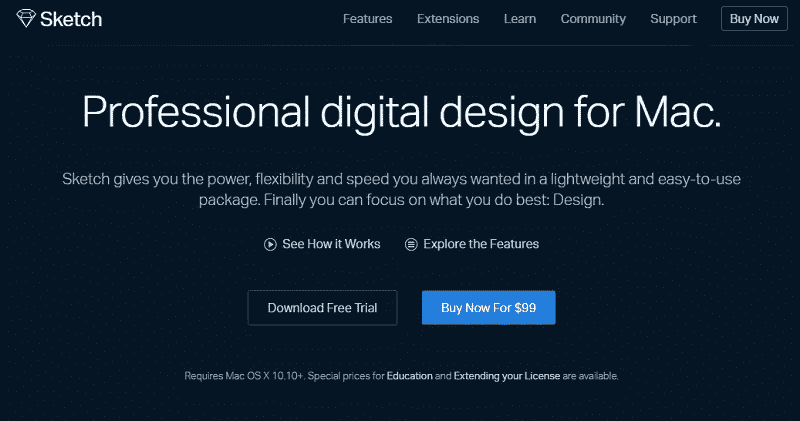

根据创始人 Pieter Omvlee 的说法，Sketch 是作为数字设计的图像编辑器而设计的。它专门为 Mac OS X 用户设计界面、网站和图标。素描作品很大程度上像 Photoshop 和 Illustrator，但它更灵活，当谈到 UX 设计。

Sketch 的矢量形状很容易适应不断变化的风格、大小和布局，让 UX 设计师避免了许多痛苦的手工调整。每一个新的对象都会被自动添加到一个新的图层上，这样可以进行创造性的组合和更容易的导航。你也可以很容易地将你的图层从草图中导出。

**定价:** $99

# 10.用于存储和组织图标的 UX 工具: [Iconjar](http://geticonjar.com/)

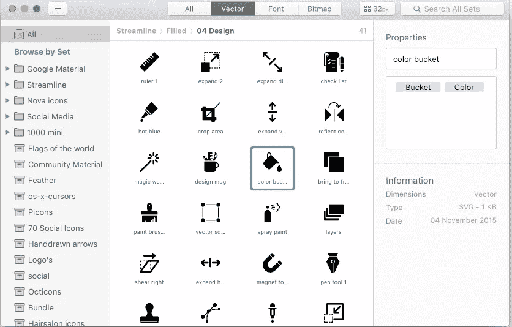

Iconjar 让你能够把所有的图标存储在一个地方，这样你就不用去寻找它们了。这个工具也让你非常容易地搜索我们所有的图标。使用 Iconjar，您可以将图标拖到 Affinity、Sketch、Photoshop 和 Illustrator 中。

**定价:免费**

# 11. **UX 流程图和数据可视化工具:** [Visme](https://www.visme.co/)

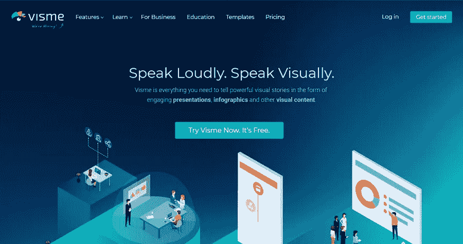

Visme 是面向 UX 设计师、营销人员和小型企业的一体化解决方案，可让您使用完全可定制的专业模板创建精美的流程图、交互式数据可视化、信息图表等。

您还可以访问 Visme 库中成千上万的内置图标、字体和图像，并使用拖放编辑器在几分钟内创建令人惊叹的视觉效果。对于数据可视化，直接从 Microsoft Excel 或 Google Sheets 导入数据。一旦你完成了你的视频，你可以下载多种格式，通过链接在线分享，或者嵌入到你的网站上。

**定价**:免费基础计划。个人付费计划每月 14 美元，企业每月 25 美元。

# 12.用于交互设计和实时协作的 UX 工具:[vision](https://www.invisionapp.com/)

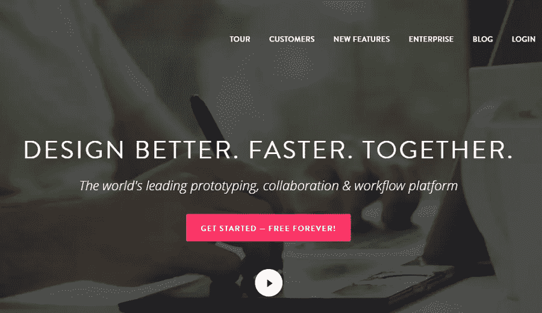

InVision 是一个基于网络的原型制作工具，可以让您的设计快速实现。借助 InVision，设计师可以上传他们的设计文件，添加动画、手势和过渡，将静态屏幕转变为可点击的交互式原型。它支持 PNG，JPG，GIF，AI 和 PSD 格式的文件。客户可以对您的设计以评论的形式提供反馈，您可以通过可操作的待办事项列表让他们实时了解项目的最新进展。

**定价:**计划起价 15 美元/月

# 13.UX 用户测试工具:[用户测试](https://www.usertesting.com/)

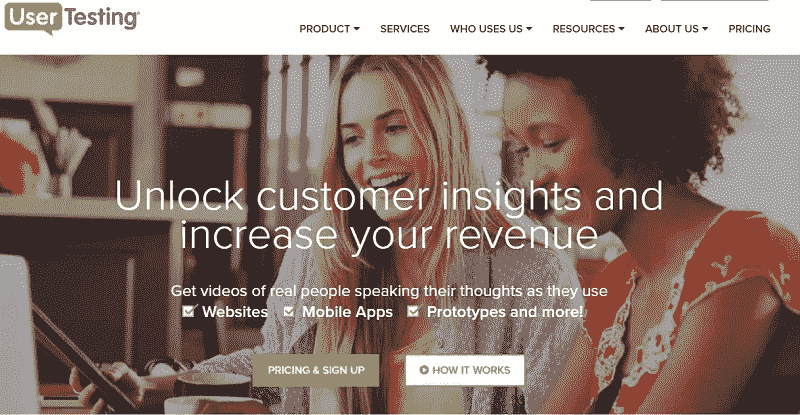

可用性测试是一种在以用户为中心的交互设计中使用的技术，通过在用户身上测试来评估产品。这对改善用户体验来说是一件大事。

UserTesting 是一个在线可用性测试工具，可以获得真人在使用网站、移动应用和原型时表达想法的视频。这项服务适用于登陆页面、电子邮件、广告、原型、实时网站和应用程序。你可以选择让有经验的内部研究团队来设计你的测试，或者让项目经理来监督你完成你的目标。

**定价:**前 10 个视频的起价为 49 美元

# 14.用于 A/B 测试的 UX 工具:[优化](http://www.optimizely.com/)

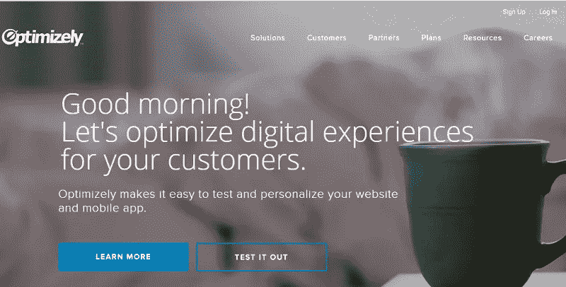

优化，像用户测试，使测试和个性化您的网站和移动应用程序变得容易。然而，Optimizely 专注于一种特定类型的测试，A/B 测试，以便设计师可以看到调整界面将如何影响转换。

**定价:**入门计划免费，企业计划(具有全部功能)按需定价。

# 15.UX 在线协作和项目管理工具:[特雷罗](https://trello.com/)

Trello 是一个基于网络的项目管理应用程序，最初由 Fog Creek Software 于 2011 年开发。Trello 的板、列表和卡片使你能够以一种有趣、灵活和有益的方式组织和优先化你的项目。使用 Trello，您可以创建板来组织您正在处理的任何事情。它允许您邀请同事和客户进行协作。您可以为自己和同事分配任务，并与朋友一起评论项目。

**定价:**套餐起价 8.33 美元

然而，对于设计师来说，时间管理在我们高速、持续的文化中是必不可少的。以下工具可能会帮到你:

# 时间跟踪和生产力监控软件:[时间医生](https://www.timedoctor.com/)

[时间医生](http://www.timedoctor.com/)是一款远程时间跟踪应用，专门用于跟踪远程员工的工作效率。它可以让您收集公司工作习惯的时间跟踪数据，然后提供分析来显示可以改进的关键领域。

# [FotoJet](https://www.fotojet.com/)

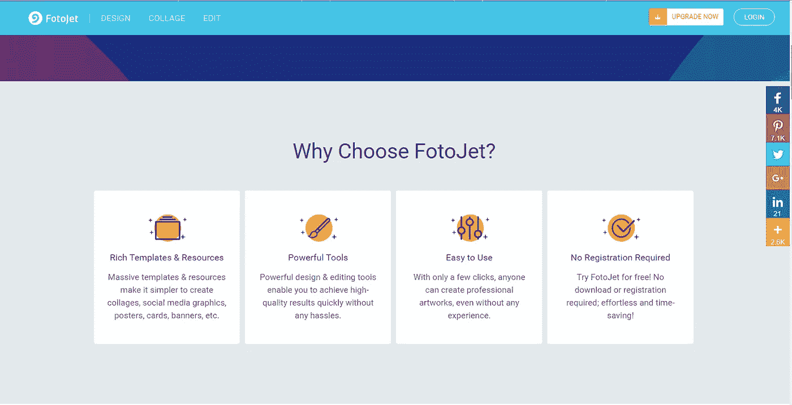

FotoJet 是一个基于 HTML5 技术的优秀的在线图形设计师、拼贴制作师和图片编辑器。它能让你创作出令人惊叹的海报、拼贴画、照片卡、假杂志封面、传单、标志、横幅、社交媒体图片，如 YouTube 频道艺术、脸书封面、Twitter 标题、Google+封面等。此外，它允许您轻松编辑照片，提供 900+专业设计，600+创意拼贴模板，80+经典照片网格模板和众多强大的编辑工具。现在 FotoJet Designer 可以很容易地在你的 Windows 桌面以及 Mac 电脑桌面上获得。

定价:计划起价为 4.99 美元/月。

# 结论

以上是专门为你设计的最好的 UX 设计工具和原型制作工具。欢迎回复这篇文章，告诉我们你最喜欢的 UX 设计工具。