# 14 个面向极客的热铬扩展🔥

> 原文：<https://medium.com/hackernoon/14-hot-chrome-extensions-for-geeks-c815a3883f9e>

## 作为一个极客，我要求我的浏览器有更强的功能

你好。我的名字是[亚历山大·伊索拉](https://isora.me)。我是一名网页设计师、程序员和[企业家](https://hackernoon.com/tagged/entrepreneur)。我在[电报频道](https://t.me/serene_startup)写我的[创业](https://hackernoon.com/tagged/startup)历程。

我的浏览器是我的主要武器。我每天用它完成 90%的任务。如果没有我将要与你分享的这些令人敬畏的扩展，我的生活不会如此顺利。

## 相似网站

这是我做梦都想不到的扩展。类似的网站使用黑魔法来显示网站的流量、流量来源、地理位置等一些非常有用的信息。

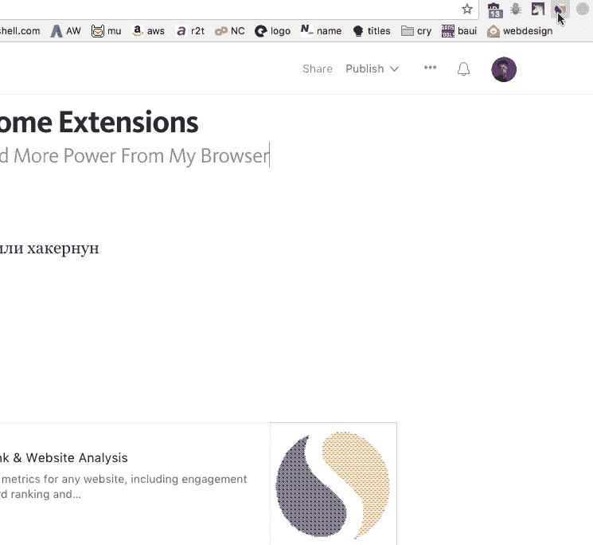

*搞定:*

 [## 相似网站-流量排名和网站分析

### 查看任何网站的网站流量和关键指标，包括参与率、流量排名、关键词排名和…

chrome.google.com](https://chrome.google.com/webstore/detail/similarweb-traffic-rank-w/hoklmmgfnpapgjgcpechhaamimifchmp?hl=en-GB) 

## **Vimium:**

Vimium 是这个列表中的佼佼者。Vimium 通过添加大量棘手的热键，使浏览器的使用速度超快。

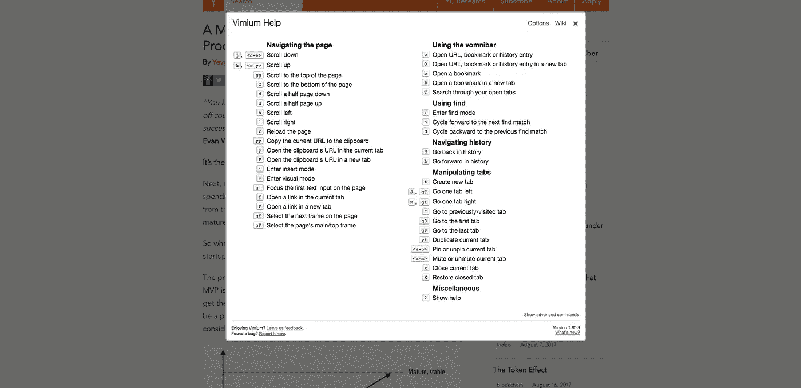

Vimium 的关键特征是它的模式。例如，如果您按“f ”,您将进入链接模式。页面上的每个链接现在都有了自己的短 ID。输入这个 ID 将触发链接。见下面截图。如果我按“D ”,我将在新选项卡中打开“关于”页面。

太快了🚀

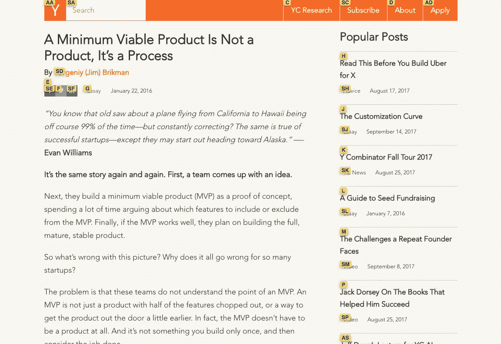

然而，Vimium 并不完美。一些 AJAXy 网站不能使用这个扩展。所以现在扔掉你的鼠标还为时过早😅

*参见文档:*

 [## philc/vimium

### vim ium——黑客的浏览器。

github.com](https://github.com/philc/vimium/blob/master/README.md) 

*明白了:*

 [## Vimium

### 黑客的浏览器。Vimium 以 Vim 的精神为导航和控制提供了键盘快捷键。

chrome.google.com](https://chrome.google.com/webstore/detail/vimium/dbepggeogbaibhgnhhndojpepiihcmeb/reviews?hl=en) 

## 语法上

Grammarly 将确保你的信息、文档和社交媒体帖子清晰、无错且有影响力。它有整洁的用户界面和 UX。

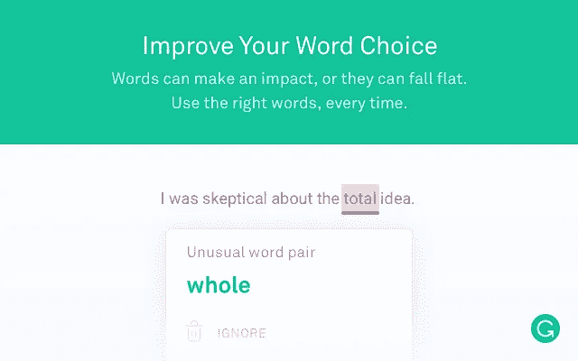

我也喜欢语法上鼓励人们购买专业版的方式。你必须付费来修复*高级*问题。整洁！

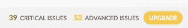

*明白了:*

 [## 铬的语法

### 在你打字的任何地方增强你的书面交流！

chrome.google.com](https://chrome.google.com/webstore/detail/grammarly-for-chrome/kbfnbcaeplbcioakkpcpgfkobkghlhen?hl=en-GB) 

## 图像大小信息

这个小小的扩展只做一件事:显示图像的尺寸。

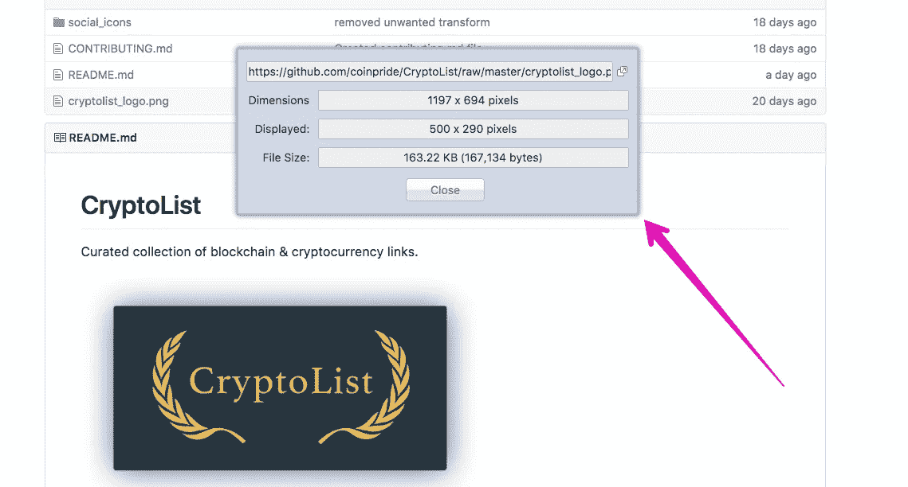

由于 Chrome 不像 FireFox 那样面向极客，我们需要这样微小的扩展。

*明白了:*

 [## 图像大小信息

### 在浏览器的图像上下文菜单中插入选项，以查看图像的宽度、高度和文件大小。

chrome.google.com](https://chrome.google.com/webstore/detail/image-size-info/oihdhfbfoagfkpcncinlbhfdgpegcigf?hl=en-GB) 

## 谷歌分析调试器

将有用的信息输出到 JavaScript 控制台。当我需要调试自定义谷歌分析事件时，我会使用这个工具。

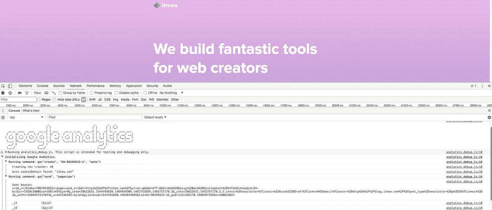

*搞定:*

 [## 谷歌分析调试器

### 通过启用 Google Analytics Javascript 的调试版本，将有用的信息打印到 JavaScript 控制台。

chrome.google.com](https://chrome.google.com/webstore/detail/google-analytics-debugger/jnkmfdileelhofjcijamephohjechhna?hl=en-GB) 

## 制表符停止

Tabstop 防止在你启动 Chrome 时加载标签。点击被阻止的标签，它会自动重新加载。

这个简单的扩展可以大大减少 Chrome 的启动时间。

*获取:*

 [## 制表符停止

### 停止标签在启动时加载

chrome.google.com](https://chrome.google.com/webstore/detail/tabstop/inofipdhajcakcbdomlljndombfeikjb?hl=en-GB) 

## 会话伙伴

会话伙伴是一个必须有任何人不能简单地关闭所有这些标签*。*该扩展允许保存会话、命名会话和搜索会话。一个必须有⚡️

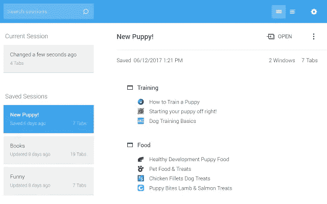

*明白了:*

 [## 会话伙伴

### 轻松管理浏览器标签和书签

chrome.google.com](https://chrome.google.com/webstore/detail/session-buddy/edacconmaakjimmfgnblocblbcdcpbko?hl=en-GB) 

## **八叉树**

这个扩展显示了 GitHub 和 GitLab 的代码树。在回购中导航要简单得多🐙树。

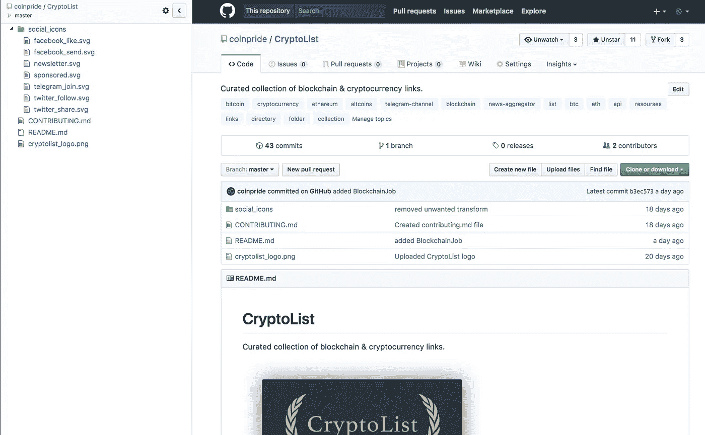

*搞定:*

 [## 八叉树

### GitHub 的代码树

chrome.google.com](https://chrome.google.com/webstore/detail/octotree/bkhaagjahfmjljalopjnoealnfndnagc?hl=en-GB) 

## YouTube 的分级预览

另一个问题是“为什么他们自己不这样做呢?”？!'扩展。它在每个缩略图下显示一个小的评价栏。所以你提前知道一个视频好看不好看。

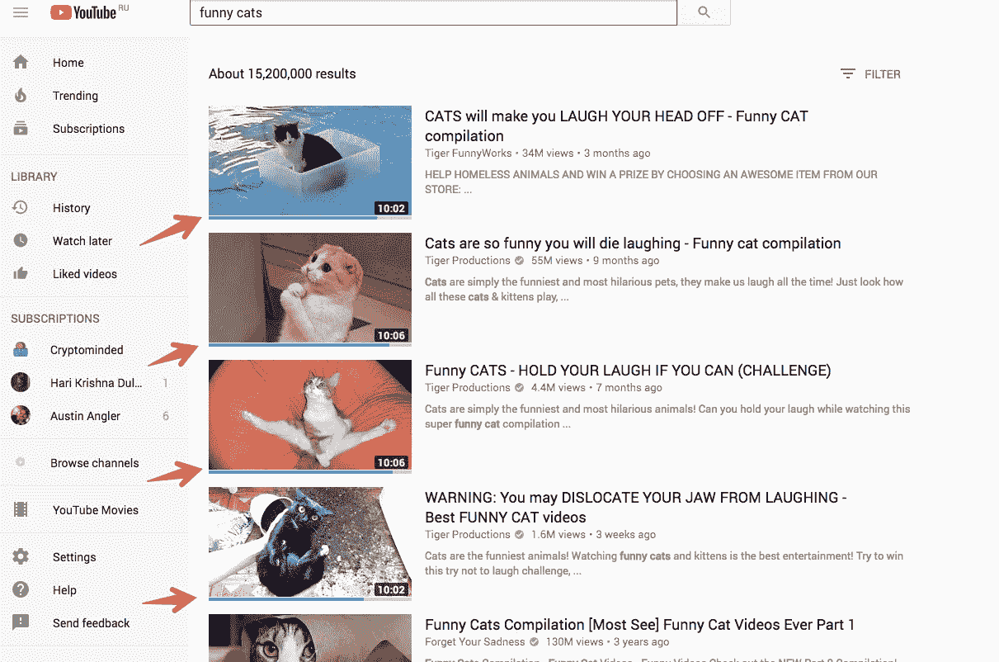

*搞定:*

 [## YouTube 的预览

### 在 YouTube 的每个视频缩略图上显示喜欢和不喜欢栏，这样你就可以在观看之前知道它的评级…

chrome.google.com](https://chrome.google.com/webstore/detail/ratings-preview-for-youtu/cgbhdenfmgbagncdmgbholejjpmmiank?hl=en-GB) 

## 伟大的吊杆

这个扩展挂起未使用的标签并释放系统资源。整洁！

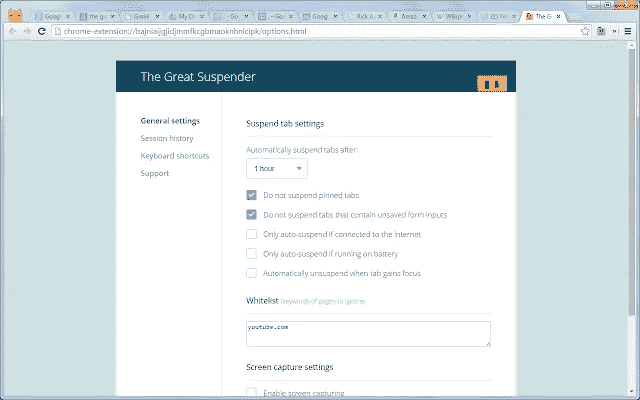

*明白了:*

 [## 伟大的吊杆

### 自动挂起未使用的选项卡以释放系统资源

chrome.google.com](https://chrome.google.com/webstore/detail/the-great-suspender/klbibkeccnjlkjkiokjodocebajanakg/related) 

## 纸

我需要很多地方来放下我的想法。用于结构化数据的 Evernote，用于途中快速 todos 的 Telegram，用于协作的概念，贴纸，白板。这是我用的另一个:纸。这是一个简单的文本编辑器，当你打开一个新标签时，它会自动显示出来。

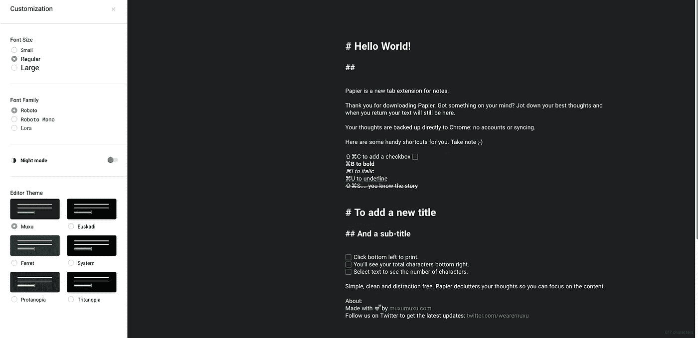

*明白了:*

 [## 纸

### 打开一个新标签，收集你最好的想法。

chrome.google.com](https://chrome.google.com/webstore/detail/papier/hhjeaokafplhjoogdemakihhdhffacia?hl=en) 

## 方脸忍者

有没有问过自己“这个网站用的是什么字体？”。那你一定会喜欢方脸忍者。

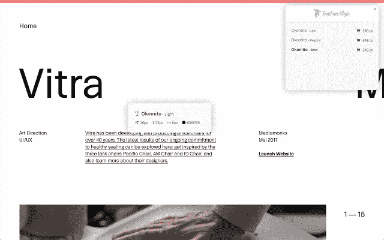

*明白了:*

 [## 方脸忍者

### 探索网站内的字体，尝试，书签和购买它们！

chrome.google.com](https://chrome.google.com/webstore/detail/fontface-ninja/eljapbgkmlngdpckoiiibecpemleclhh/related) 

## 小猿

Marmoset 其实不是一个扩展，而是一个 app。不管怎样，这真是太棒了。Marmoset 允许快速创建漂亮的代码截图:

非常适合经常写科技文章的人。

*明白了:*

 [## 小猿

### 创建华丽的代码快照。

chrome.google.com](https://chrome.google.com/webstore/detail/marmoset/npkfpddkpefnmkflhhligbkofhnafieb/related) 

## 灯塔

最后但同样重要的是， [Lighthouse](https://developers.google.com/web/tools/lighthouse/) 是一个开源的自动化工具，用于提高你的 web 应用程序的性能、质量和正确性。

由保罗·爱尔兰人、保罗·刘易斯和 100 多名出色的贡献者制作的 Lighthouse 是当今追踪表现的头号软件。

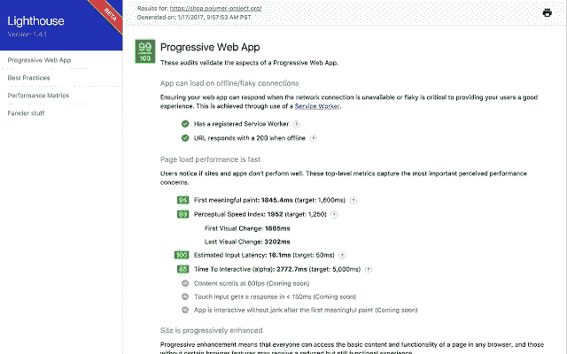

*获取:*

 [## 灯塔

### 灯塔

Lighthousechrome.google.com](https://chrome.google.com/webstore/detail/lighthouse/blipmdconlkpinefehnmjammfjpmpbjk?hl=en-GB) 

# 结论🔥

希望你们喜欢这个列表。如果是，那就拍手——这是最好的感恩。我渴望新的了不起的扩展。有这里没有列出的东西吗？在评论或[推特](https://twitter.com/alexanderisora)上分享。

顺便说一下，如果你想了解更多关于**在产品搜索**上发布产品的信息，可以看看我博客里的这篇文章:[https://isora . me/what-ive-learn-from-publishing-10-Product-Hunt-projects/](https://isora.me/what-ive-learned-from-publishing-10-product-hunt-projects/)